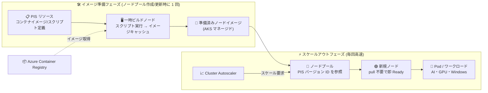

# Azure Kubernetes Service (AKS): Prepared Image Specification (PIS) のパブリックプレビュー

**リリース日**: 2026-07-28

**サービス**: Azure Kubernetes Service (AKS)

**機能**: Prepared Image Specification (PIS)

**ステータス**: In preview (Public Preview)

[このアップデートのインフォグラフィックを見る](https://takech9203.github.io/azure-news-summary/20260728-aks-prepared-image-specification.html)

## 概要

AKS で大規模ワークロード、AI/GPU ワークロード、Windows コンテナなどのパフォーマンス要求が高いワークロードを運用している組織では、ノードの起動時間の長さが課題になっていた。新しくプロビジョニングされたノードは、ワークロードを実行できる状態になる前に、コンテナイメージのダウンロード、依存関係のインストール、各種初期化処理を完了させる必要がある。この「ノードごとのセットアップ作業」はスケールイベントごとに毎回繰り返され、ノード起動時間の増大に直結していた。

今回パブリックプレビューとなった **Prepared Image Specification (PIS)** は、必要なコンテナイメージとノードのカスタマイズを事前に適用した「準備済みノードイメージ」を定義できる AKS の機能である。PIS は Azure リソースとして作成し、キャッシュしたいコンテナイメージ、カスタム初期化スクリプト、OS カスタマイズ、ランタイム依存関係やセキュリティポリシーを宣言的に指定する。AKS は一時的なビルドノードを起動してこれらのカスタマイズを適用し、その状態をスナップショットして準備済みイメージを作成する。以降のノードプロビジョニングおよびスケールアウトは、この準備済みイメージからブートする。

重要な設計思想として、PIS は非サポートの BYOI (Bring Your Own Image) とは異なり、**利用者は「望ましい状態」を宣言するだけで、基となるイメージの作成と維持は AKS 側が担う**。そのため、標準のマネージド AKS 運用体験を維持したまま起動時間の最適化が可能になる。また、AKS は既存のサポート対象ノードイメージを引き続き使用し、PIS はその上に構築される (PIS はノードイメージを置き換えるものではない)。

**アップデート前の課題**

- ノードを追加するたびに、そのノードでコンテナイメージの pull と初期化処理を毎回繰り返す必要があり、スケールアウトが遅かった
- AI/ML モデルを含む大きなコンテナイメージや、サイズの大きい Windows コンテナイメージでは pull 時間が支配的になり、ノードが Ready になるまでの時間が長引いた
- GPU ドライバーや CUDA ライブラリなどの依存関係のインストールがノード起動時のオーバーヘッドになっていた
- ノード起動時間が実行ごとにばらつき (Variable)、オートスケール時の挙動が予測しづらかった
- 起動時スクリプトによる構成をノードごとに実行するため、ノードプール間で構成ドリフトが発生しやすかった

**アップデート後の改善**

- コンテナイメージとカスタマイズが準備済みイメージに事前に焼き込まれるため、後続のノード作成ではその作業を完全にスキップできる
- 大きなイメージを使うワークロードでもノードの起動が速くなり、ノード起動の一貫性が「Variable」から「Predictable」になる
- Cluster Autoscaler によるバーストスケールアウト時、ノードが早く Ready に到達し、ワークロードのキュー待ち時間が短縮される
- 一貫した構成をイメージに焼き込むことで、ノードプール間の構成ドリフトを削減し、環境の標準化を簡素化できる
- PIS はバージョニングをサポートし、Kubernetes バージョンアップグレード時には AKS が参照中の PIS バージョンの準備済み VHD を自動的に再ビルドする

## アーキテクチャ図



PIS 定義から一時ビルドノードを介して準備済みノードイメージを 1 回だけ作成し (左)、以降のスケールアウトではその準備済みイメージからノードがブートするため、イメージ pull と初期化を省略して短時間で Ready に到達する (右)。

## サービスアップデートの詳細

### 主要機能

1. **コンテナイメージの事前キャッシュ**
   - PIS で指定したコンテナイメージをノードイメージに焼き込み、ノードプロビジョニング時のイメージ pull をスキップする
   - `--container-images` パラメーターで複数のイメージを指定できる

2. **カスタムスクリプトによる初期化処理の事前実行**
   - イメージ準備時に実行する初期化スクリプトを含められる。サポートされるスクリプト種別は **Bash** と **PowerShell**
   - 用途例: ソフトウェアパッケージのインストール、OS 設定の構成、セキュリティポリシーの適用、ランタイム依存関係のダウンロード
   - `--customization-scripts` パラメーターで指定する

3. **OS カスタマイズの焼き込み**
   - sysctl 設定、パッケージインストール、ランタイム構成、セキュリティハードニングなどを準備済みイメージに含められる

4. **バージョニング**
   - PIS には「PIS リソース」と「PIS バージョン」という 2 つのリソース概念がある
   - タグなどのメタデータ更新は PIS リソースを更新するもので、参照中バージョンのイメージ/スクリプトは変更されない
   - コンテナイメージやスクリプトを変更する場合は **新しい PIS バージョンを作成し、ノードプールの参照先をそのバージョン ID に更新する**

5. **クラスター/ノードプールからの参照**
   - `az aks create` および `az aks nodepool add` / `update` の `--prepared-image-specification-id` パラメーターで PIS バージョンのリソース ID を指定する
   - 空文字列を指定することでノードプールから PIS を外せる

6. **Kubernetes バージョンアップグレード時の自動再ビルド**
   - Kubernetes バージョンをアップグレードすると、AKS は参照中の PIS バージョンの準備済み VHD を自動的に再ビルドする。Kubernetes バージョンアップグレードのために新しい PIS バージョンを作る必要はない
   - 新しい PIS バージョンを作成すべきなのは、コンテナイメージやスクリプトといった PIS の内容が変わる場合

7. **Cluster Autoscaler との併用**
   - PIS を構成したノードプールは Cluster Autoscaler と併用できる

### スクリプトとイメージキャッシュの実行順序

PIS にカスタムスクリプトとキャッシュ対象コンテナイメージの両方を含めた場合、**AKS は先にカスタムスクリプトを実行し、スクリプトが正常完了した後にコンテナイメージをキャッシュする**。

この順序のため、スクリプトの変更がイメージキャッシュに使われる環境 (コンテナランタイム構成を含む) に影響し得る。特にスクリプトが containerd、レジストリ構成、資格情報、証明書、ネットワークなど、イメージ pull やキャッシュ動作に影響する設定を変更する場合は、この順序を前提に設計・テストする必要がある。

### プロビジョニングモデルの比較

| 操作 | 標準 AKS | Prepared Image Specification |
|------|----------|------------------------------|
| ノードプールの作成/更新 | 高速 | 低速 (イメージ準備が必要) |
| 後続のスケールアウト | 標準のプロビジョニング | 高速なプロビジョニング |
| コンテナイメージのダウンロード | 実行時 | 事前キャッシュ済み |
| カスタムスクリプト | 実行時に実行 | イメージに事前焼き込み |
| 起動の一貫性 | ばらつきあり (Variable) | 予測可能 (Predictable) |
| 大きなイメージのワークロード | 起動が遅い | 起動が速い |

**重要**: PIS はイメージ準備後にノードプールが複数回スケールする場合に最も価値を発揮する。ノードがほとんどスケールしない場合、1 回限りのイメージ準備コストがメリットを上回る可能性がある。

## 技術仕様

| 項目 | 詳細 |
|------|------|
| ステータス | Public Preview (プレビュー可用性: 2026 年 6 月) |
| サポート OS | Ubuntu、Azure Linux、Windows のノードプール |
| サポートスクリプト種別 | Bash、PowerShell |
| 必要な Azure CLI バージョン | 2.85.0 以降 |
| 必要な CLI 拡張 | `aks-preview` 拡張 21.0.0b5 以降 |
| 必要なフィーチャーフラグ | `Microsoft.ContainerService/AKSPreparedImageSpecificationPreview` |
| ノードプール指定パラメーター | `--prepared-image-specification-id` (PIS バージョンのリソース ID) |
| リソース概念 | PIS リソース + PIS バージョン (バージョニング対応) |
| イメージの所有形態 | サービスマネージド (AKS が管理)。BYOI / マネージドイメージ / ギャラリーイメージとしては公開されない |
| Cluster Autoscaler 併用 | サポート |
| 提供リージョン | パブリックな Azure リージョン (ソブリンクラウド・エアギャップ環境は除く) |
| 追加料金 | なし (標準の AKS のコンピューティングおよびストレージ料金が適用) |

## 設定方法

### 前提条件

1. サポートされる Kubernetes バージョンで動作する既存の AKS クラスター
2. Azure CLI 2.85.0 以降
3. `aks-preview` CLI 拡張 21.0.0b5 以降
4. サブスクリプションで `AKSPreparedImageSpecificationPreview` フィーチャーフラグが登録済みであること
5. リソースグループ内で AKS リソースを作成・管理できる適切な Azure RBAC 権限
6. コンテナイメージが AKS クラスターからアクセス可能であること (Azure Container Registry を使う場合は AKS クラスターとの統合が必要)

### Azure CLI

```bash
# aks-preview 拡張のインストール (既にある場合は update)
az extension add --name aks-preview
az extension update --name aks-preview

# フィーチャーフラグの登録
az feature register \
  --namespace Microsoft.ContainerService \
  --name AKSPreparedImageSpecificationPreview

# 登録状態の確認
az feature show \
  --namespace Microsoft.ContainerService \
  --name AKSPreparedImageSpecificationPreview

# リソースプロバイダーの再登録
az provider register --namespace Microsoft.ContainerService
```

```bash
# 環境変数の設定
RESOURCE_GROUP=<your-resource-group>
CLUSTER_NAME=<your-aks-cluster-name>
PIS_NAME=<your-pis-name>
LOCATION=<location>
PIS_VERSION=v1

# コンテナイメージを事前キャッシュする PIS の作成
az aks prepared-image-specification create \
    --resource-group $RESOURCE_GROUP \
    --name $PIS_NAME \
    --version $PIS_VERSION \
    --container-images \
        myacr.azurecr.io/model-server:v1 \
        myacr.azurecr.io/inference:v1

# カスタマイズスクリプトを使う PIS の作成
az aks prepared-image-specification create \
    --resource-group $RESOURCE_GROUP \
    --name $PIS_NAME \
    --version $PIS_VERSION \
    --customization-scripts @scripts.json
```

```bash
# PIS バージョンのリソース ID を取得
PIS_VERSION_ID=$(az aks prepared-image-specification version show \
    --resource-group $RESOURCE_GROUP \
    --pis-name $PIS_NAME \
    --name $PIS_VERSION \
    --query id -o tsv)

# PIS を参照するノードプールを追加
az aks nodepool add \
    --resource-group $RESOURCE_GROUP \
    --cluster-name $CLUSTER_NAME \
    --name userpool \
    --prepared-image-specification-id $PIS_VERSION_ID

# ノードプールが PIS を使用していることを確認
az aks nodepool show \
    --resource-group $RESOURCE_GROUP \
    --cluster-name $CLUSTER_NAME \
    --name userpool \
    --query "{state:provisioningState, pisId:preparedImageSpecificationId}"
```

```bash
# 新規クラスター作成時に PIS を指定
az aks create \
    --resource-group $RESOURCE_GROUP \
    --name $CLUSTER_NAME \
    --prepared-image-specification-id $PIS_VERSION_ID \
    --generate-ssh-keys

# ノードプールから PIS を外す (空文字列を指定)
az aks nodepool update \
  --resource-group $RESOURCE_GROUP \
  --cluster-name $CLUSTER_NAME \
  --name userpool \
  --prepared-image-specification-id ""
```

### PIS バージョンのアップグレードワークフロー

ベースイメージ、依存関係、カスタマイズが変わった場合は、新しいバージョンを作成してノードプールの参照先を更新する。推奨されるワークフローは次のとおり。

1. 更新したコンテナイメージまたはスクリプトで新しいバージョンを作成する
2. 非本番のノードプールで新しいバージョンを検証する
3. 本番ノードプールの参照先を新しいバージョンに更新する
4. 未使用のイメージをクリーンアップしてコストを最適化する

```bash
# ノードプールの参照先を新しい PIS バージョンに更新
az aks nodepool update \
    --resource-group $RESOURCE_GROUP \
    --cluster-name $CLUSTER_NAME \
    --name userpool \
    --prepared-image-specification-id $NEW_PIS_VERSION_ID
```

## メリット

### ビジネス面

- 成長期やバーストトラフィック時にスケーリングが高速かつ予測可能になり、需要増に対する応答性が向上する
- アプリケーションの起動レイテンシーが低下し、エンドユーザー体験とサービス品質が改善する
- ノード構成の標準化により構成ドリフトが減り、運用効率が向上する
- 追加料金なし (標準の AKS コンピューティング/ストレージ料金のみ) で起動時間の最適化を導入できる

### 技術面

- コンテナイメージの pull と初期化処理をスケールアウトのクリティカルパスから除去できる
- GPU ドライバーや CUDA ライブラリなどの依存関係を事前インストールでき、GPU ノードの Ready 到達を高速化できる
- BYOI のようにイメージのライフサイクルを自分で運用する必要がなく、AKS のマネージド体験を維持できる
- Kubernetes バージョンアップグレード時は AKS が準備済み VHD を自動再ビルドするため、運用負荷が小さい
- Artifact Streaming、Custom Node Configuration、Node Pool Snapshot と併用でき、既存の最適化手法と組み合わせられる

## デメリット・制約事項

**プレビュー全般の注意**

- AKS のプレビュー機能はセルフサービスのオプトイン方式で提供され、「as is」「as available」で提供される。SLA および限定保証の対象外であり、本番利用は想定されていない。サポートはベストエフォートでの部分的なカバレッジとなる

**プレビュー期間中の制限事項**

- パブリックな Azure リージョンで利用可能。ソブリンクラウドおよびエアギャップ環境は対象外
- サポート OS は Ubuntu、Azure Linux、Windows
- カスタムスクリプトはイメージビルドやスケールアップの失敗を引き起こす可能性がある
- 既存の仕様を変更する際、仕様を再作成する必要がある場合がある
- 準備済みイメージは「参照」されるものであり、顧客管理ではない。ノードプールにサポート対象の PIS バージョン ID を構成する形をとり、基となる準備済みイメージ成果物は AKS のサービスマネージドのままで、顧客所有の BYOI・マネージドイメージ・ギャラリーイメージとしては公開されない
- 準備済みイメージ成果物をノードプール間で直接共有・再利用することはできない。同じ内容を別のノードプールで使うには、そのノードプールに該当の PIS バージョン ID を構成する必要がある。イメージ成果物のコピー、エクスポート、変更、アクセス付与、顧客管理イメージとしてのアタッチはいずれも不可

**設計上のトレードオフ**

- 初回のノードプール作成/更新は、先にイメージをビルドするため時間がかかる
- ノードがほとんどスケールしない場合、1 回限りのイメージ準備コストがメリットを上回る可能性がある
- 頻繁に更新されるイメージでは準備済みイメージの再ビルドが頻発し、PIS の価値が下がる
- LLM の重み、モデルファイル、トレーニングデータセット、DB シードなど大きな成果物を含めると、準備済みイメージのサイズと再ビルド時間が増大するため、バージョン管理とテストを慎重に行う必要がある
- ノードプールから参照されている PIS バージョンを削除してはならない。削除すると AKS が準備済みイメージの再ビルドやロールを正常に実行できなくなる可能性がある

## ユースケース

### ユースケース 1: AI/GPU 推論のバーストスケール

**シナリオ**: 大きな AI/ML モデルイメージを使う推論サービスを GPU ノードプールで運用しており、リクエストのバーストに合わせて Cluster Autoscaler で GPU ノードをスケールアウトする。モデルイメージの pull に時間がかかり、ノードが Ready になるまで推論容量が増えない。

**実装例**:

```bash
# モデルサーバーと推論イメージを事前キャッシュした PIS を作成
az aks prepared-image-specification create \
    --resource-group $RESOURCE_GROUP \
    --name gpu-inference-pis \
    --version v1 \
    --container-images \
        myacr.azurecr.io/model-server:v1 \
        myacr.azurecr.io/inference:v1

# GPU ノードプールに適用
az aks nodepool add \
    --resource-group $RESOURCE_GROUP \
    --cluster-name $CLUSTER_NAME \
    --name gpupool \
    --prepared-image-specification-id $PIS_VERSION_ID
```

**効果**: 大きな AI/ML モデルイメージが事前キャッシュされるため GPU ノードがより速く Ready 状態に到達し、ワークロードの起動時間が短縮されスケーリングの応答性が向上する。GPU ドライバーや CUDA ライブラリをカスタムスクリプトで事前インストールしておけば、プロビジョニングのオーバーヘッドをさらに削減できる。

### ユースケース 2: Windows コンテナのノードプール

**シナリオ**: Windows コンテナでアプリケーションを実行しているが、Windows コンテナイメージはサイズが大きくなりがちで、ノード追加時のイメージダウンロードに時間がかかる。デプロイ時間もノードごとにばらつく。

**実装例**:

```bash
# PowerShell スクリプトとイメージを含む PIS を Windows ノードプールに適用
az aks nodepool add \
    --resource-group $RESOURCE_GROUP \
    --cluster-name $CLUSTER_NAME \
    --name winpool \
    --os-type Windows \
    --prepared-image-specification-id $PIS_VERSION_ID
```

**効果**: Windows コンテナイメージのダウンロード時間が削減され、Windows ノードプールのデプロイの一貫性が向上する。

### ユースケース 3: 環境標準化と構成ドリフトの削減

**シナリオ**: 複数のノードプールで sysctl 設定、パッケージ、セキュリティハードニングを揃えたいが、ノード起動時のスクリプト実行に依存しているため構成ドリフトが起きやすい。

**実装例**:

```bash
# セキュリティハードニング等のスクリプトを含む PIS を作成
az aks prepared-image-specification create \
    --resource-group $RESOURCE_GROUP \
    --name hardened-baseline-pis \
    --version v1 \
    --customization-scripts @scripts.json
```

**効果**: 一貫した構成を準備済みイメージに焼き込むことで、ノードプール間の構成ドリフトが減り、運用が簡素化される。なお、カスタムスクリプトを制限・禁止したい組織は、Azure Policy を使って許可される PIS 構成 (スクリプト利用のブロック、スクリプトソースの承認済みロケーションへの限定など) を強制することを検討できる。

## 監視すべきメトリクス

PIS の効果を評価するために、以下の領域を監視することが推奨されている。

| 領域 | メトリクス |
|------|-----------|
| プロビジョニング | ノードプロビジョニング所要時間、Ready までの時間、ワークロードのスケジューリングレイテンシー |
| スケーリング | スケールアウト完了時間、オートスケーラーイベント、ノード起動所要時間 |
| ワークロード | Pod 起動時間、コンテナイメージ pull 所要時間、GPU ワークロード起動時間 |

加えて、コスト/バージョニングの観点でノードプールイメージを管理し、PIS バージョン数、イメージサイズ、再ビルド頻度を追跡することが推奨されている。

## ベストプラクティス

- **大きく安定したイメージをキャッシュする**: サイズが大きく、変更頻度が低く、多くのワークロードで共有されるイメージに PIS を使う。頻繁に更新されるイメージは再ビルドが増え PIS の価値が下がる
- **一貫してバージョニングする**: アプリケーションリリース、セキュリティパッチ、AKS ノードイメージ変更のたびに新しい PIS バージョンを作成し、準備済みイメージを最新に保つ
- **本番投入前に検証する**: ノード起動、ワークロードデプロイ、レジストリアクセス、アプリケーション機能を非本番環境でテストする。Node Pool Snapshot を使って既知のノードイメージバージョンに紐づけたテストを行うことが推奨されている
- **イメージ更新を自動化する**: 依存関係の更新、セキュリティパッチ、最新の AKS ノードイメージを取り込むため、定期的に準備済みイメージを再ビルドする
- **スクリプトをバージョン管理された構成として扱う**: スクリプトのソースをソース管理に格納し、各 PIS バージョンが使うスクリプト内容や URI を固定する。PIS バージョン作成後にスクリプトをその場で書き換えない。スクリプトは冪等で複数回実行しても安全なものにする

## 料金

追加料金は発生しない。標準の AKS のコンピューティングおよびストレージ料金が適用される。

なお、イメージ準備には一時的なビルドノードが使われ、準備済みイメージはストレージを消費するため、PIS バージョン数やイメージサイズの管理はコスト最適化の観点でも推奨されている。テスト目的で作成した PIS バージョン、PIS リソース、テスト用ノードプール、テスト用 AKS クラスターは、不要になったら削除して継続的な課金を避ける。

| 項目 | 料金 |
|------|------|
| Prepared Image Specification 機能 | 追加料金なし |
| コンピューティング / ストレージ | 標準の AKS 料金が適用 |

## 利用可能リージョン

プレビュー期間中は、パブリックな Azure リージョンで利用可能。ソブリンクラウドおよびエアギャップ環境は対象外。

## 関連サービス・機能

- **Artifact Streaming**: PIS と併用してノード起動レイテンシーを削減できる。PIS はコンテナイメージと依存関係を事前キャッシュし、Artifact Streaming はプロビジョニング中に大きな成果物をノードにストリーミングする。大きなデータセットやモデルファイルを必要とするワークロードで特に有効。イメージ pull のタイミングは PIS が「AgentPool 更新/ノードイメージビルド時」、Artifact Streaming が「VM プロビジョニング時」という違いがある
- **Custom Node Configuration**: PIS はノードイメージのカスタマイズとコンテナイメージのキャッシュを担い、Custom Node Configuration はプロビジョニング後のノードにランタイム構成を適用する。ランタイム/ノード構成のシナリオでは併用する
- **Node Pool Snapshot**: PIS がイメージ準備とパフォーマンス最適化を担い、Node Pool Snapshot はノードプール構成の取得・復元 (バックアップ/複製) を担う。準備済みイメージを本番昇格する前のテストに Node Pool Snapshot を使うことが推奨されている
- **Cluster Autoscaler**: PIS を構成したノードプールで利用可能。スケールアウト時にノードが早く Ready に到達するため、スケール挙動が予測しやすくなる
- **Azure Container Registry (ACR)**: 事前キャッシュ対象のコンテナイメージの取得元。AKS クラスターと統合し、pull アクセス権を付与しておく必要がある
- **Azure Policy**: カスタムスクリプトの利用制限や、承認済みロケーションへのスクリプトソース限定など、許可される PIS 構成を強制するために利用できる

## トラブルシューティングのポイント

- **イメージ作成の失敗**: 不正なカスタマイズスクリプト、コンテナレジストリの認証失敗 (AKS クラスターの pull アクセス権を確認)、リソースグループ/レジストリに対する Azure RBAC 権限不足、対象 OS でサポートされないカスタマイズ種別を確認する。カスタマイズスクリプトがイメージビルド中に失敗した場合、AKS はデバッグできるようビルド VM を削除せず割り当て解除する
- **ノードプール作成の失敗**: PIS バージョン ID が有効で同一リージョンに存在するか、対象 VM SKU のクォータが十分か、その VM SKU が準備済みイメージでサポートされているか、リージョンがプレビュー期間中の PIS をサポートしているかを確認する
- **スケール操作が速くならない**: 高速化したいコンテナイメージが PIS バージョンに含まれているか、ノードプールが正しいバージョンを参照しているか、新規ノードがベースの AKS ノードイメージではなく準備済みイメージからブートしているか、ボトルネックが本当にイメージ pull 時間なのか (ワークロード起動やその他の初期化ではないか) を確認する

## 参考リンク

- [インフォグラフィック](https://takech9203.github.io/azure-news-summary/20260728-aks-prepared-image-specification.html)
- [公式アップデート情報: Public Preview: Prepared Image Specification](https://azure.microsoft.com/updates?id=567949)
- [Microsoft Learn: Prepared Image Specification (PIS) in AKS (Preview) 概要](https://learn.microsoft.com/en-us/azure/aks/prepared-image-specification-overview)
- [Microsoft Learn: Create and manage a Prepared Image Specification (PIS) in AKS (Preview)](https://learn.microsoft.com/en-us/azure/aks/prepared-image-specification)
- [aka.ms ショートリンク](https://aka.ms/preparedimagespecification)
- [Microsoft Learn: Reduce image pull time with Artifact Streaming on AKS](https://learn.microsoft.com/en-us/azure/aks/artifact-streaming)
- [Microsoft Learn: Customize node configuration for AKS node pools](https://learn.microsoft.com/en-us/azure/aks/custom-node-configuration)
- [Microsoft Learn: AKS node pool snapshot](https://learn.microsoft.com/en-us/azure/aks/node-pool-snapshot)
- [Microsoft Learn: AKS support policies](https://learn.microsoft.com/en-us/azure/aks/support-policies)
- [料金ページ: Azure Kubernetes Service](https://azure.microsoft.com/pricing/details/kubernetes-service/)

## まとめ

Prepared Image Specification (PIS) は、AKS のノード起動時間という長年の課題に対して、「ノードごとに毎回繰り返していたイメージ pull と初期化処理を、ノードプール作成/更新時の 1 回に前倒しする」というアプローチで応える機能である。AI/GPU 推論のバーストスケール、サイズの大きい Windows コンテナ、大きなイメージを使うワークロードといった、スケールアウトの速さが直接ビジネス価値に結びつくシナリオで効果が大きい。追加料金がなく、BYOI のようにイメージのライフサイクルを自前で運用する必要もない点も導入しやすい。

一方で、初回のノードプール作成/更新は遅くなるというトレードオフがあり、ノードがほとんどスケールしない環境では 1 回限りのイメージ準備コストがメリットを上回る可能性がある。まずは自環境のボトルネックが本当にコンテナイメージの pull 時間なのかを、ノードプロビジョニング所要時間やコンテナイメージ pull 所要時間などのメトリクスで確認することが出発点になる。

パブリックプレビュー段階のため SLA 対象外であり、本番利用は想定されていない。まずは検証用サブスクリプションで `AKSPreparedImageSpecificationPreview` フィーチャーフラグを登録し、`aks-preview` 拡張 21.0.0b5 以降と Azure CLI 2.85.0 以降を用意して、GPU または Windows のノードプールでスケールアウト時間の改善幅を実測することを推奨する。カスタムスクリプトを使う場合は、スクリプト実行 → イメージキャッシュという順序と、スクリプト起因のビルド失敗リスクを踏まえ、ソース管理とバージョニングを前提とした運用を設計しておきたい。

---

**タグ**: Azure Kubernetes Service, AKS, Prepared Image Specification, PIS, Public Preview, Compute, Containers, ノード起動時間, スケールアウト, GPU, AI/ML, Windows コンテナ, Cluster Autoscaler, Artifact Streaming, ノードイメージ
