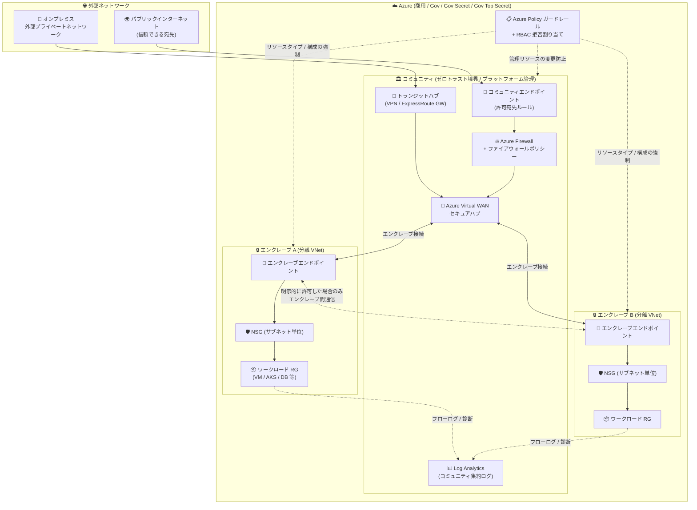

# Azure Enclave: パブリックプレビュー

**リリース日**: 2026-07-28

**サービス**: Azure Enclave

**機能**: 機密ワークロード向け分離クラウド環境の展開・管理を効率化するマネージドサービス

**ステータス**: In preview

[このアップデートのインフォグラフィックを見る](https://takech9203.github.io/azure-news-summary/20260728-azure-enclave-public-preview.html)

## 概要

Azure Enclave のパブリックプレビューが発表された。対象クラウドは Microsoft Azure (商用)、Azure Government、Azure Government Secret、Azure Government Top Secret の 4 つで、商用環境とエアギャップ環境の双方を想定して設計されている。Azure Enclave は、機密性の高いワークロード向けに、セキュアで分離された、コンプライアンス要件を満たすクラウド環境の展開と管理を効率化するマネージドサービスである。

Azure Enclave は仮想境界の保護に対して多層的かつ階層的なアプローチを採用する。中核となるのが **コミュニティ (Community)** と **エンクレーブ (Enclave)** という 2 階層のモデルである。コミュニティは、複数の分離ネットワークに対してネットワーク・ガバナンス・監視の中央ハブとして機能するプラットフォーム管理型の Virtual WAN 境界であり、Azure Firewall、ポリシーガードレール、RBAC 拒否割り当て (Deny Assignment) の組み合わせで保護される。エンクレーブは、コミュニティハブに接続された分離型ゼロトラストの Azure Virtual Network であり、Network Security Group (NSG)、ポリシーガードレール、RBAC 拒否割り当てによって保護される。さらに **ワークロード (Workload)** という論理グループが、顧客管理リソースを配置するワークロードリソースグループをエンクレーブに紐付け、エンクレーブのセキュリティ体制・ポリシー・権限を継承させる。

Microsoft の説明によれば、従来のセキュアな環境構築は計画・構成・テストに数週間から数か月を要し、それでも重要な分離制御やポリシー制御が漏れる可能性があった。Azure Enclave はプラットフォーム管理型インフラストラクチャと組み込みのセキュリティ制御により、この展開時間を数時間から数日に短縮することを目的としている。アーキテクチャは hub-and-spoke 型で、ネットワーク分離とポリシー強制が組み込まれた既知の構成 (known configuration) を提供することで、コンプライアンス承認プロセスの迅速化を支援する。

なお、Azure Enclave はプレビュー段階であり SLA は提供されない。ドキュメント上で「本番ワークロードには使用すべきでない」と明記されている点に注意が必要である。

**アップデート前の課題**

- 機密ワークロード向けのセキュアな分離環境を構築する際、ネットワーク境界・ポリシー・ログ・アクセス制御の基盤を毎回ゼロから設計・構築する必要があった
- 従来のセキュアな環境展開は計画・構成・テストに数週間から数か月を要し、それでも重要な分離制御やポリシー制御が欠落するリスクがあった
- 複数チームや組織 (ミッションパートナー) をまたぐ規制対応環境で、ワークロードが信頼できる宛先とどう通信するかを標準化する仕組みがなかった
- 分離環境の構築後も、プラットフォーム基盤リソースへの意図しない変更を防ぐ仕組みを個別に実装する必要があった
- コンプライアンス承認を得るために、環境が既知のセキュリティ体制にあることを証明する作業負荷が高かった

**アップデート後の改善**

- コミュニティ / エンクレーブ / ワークロードという階層モデルにより、分離環境の構築が Azure ネイティブなリソースタイプ (`Microsoft.Mission`) の作成操作に集約された
- Virtual WAN、Azure Firewall、Virtual Network、NSG、Log Analytics などの基盤リソースがプラットフォームによって自動展開・管理される
- Azure Policy ガードレールにより、コミュニティ・エンクレーブ・ワークロード内で許可されるリソースタイプと構成を制御できる
- RBAC 拒否割り当てにより、プラットフォーム管理リソースへの不正な変更をデフォルトで防止する
- エンクレーブエンドポイント、コミュニティエンドポイント、トランジットハブ、エンクレーブ接続により、明示的に定義されたトラフィックのみを許可する接続管理が可能になった
- ログと診断がコミュニティ内の全エンクレーブ・ワークロードに対してデフォルトで有効化され、集約または分離を構成単位で選択できる
- Community Owner / Enclave Owner などの専用組み込みロールにより、最小権限での責務分離が可能になった

## アーキテクチャ図



コミュニティが Virtual WAN と Azure Firewall で構成されるゼロトラストなハブ境界を提供し、その配下に分離された VNet であるエンクレーブが配置される。外部との通信はコミュニティエンドポイントとトランジットハブを経由し、エンクレーブ間の通信はエンクレーブエンドポイントとエンクレーブ接続で明示的に許可した場合のみ成立する。Azure Policy ガードレールと RBAC 拒否割り当てが全階層に横断的に適用される。

## サービスアップデートの詳細

### 主要機能

1. **コミュニティ (Community) - 中央ガバナンスハブ**
   - 分離型ゼロトラストのプラットフォーム管理 Virtual WAN 境界。Azure Firewall、ポリシーガードレール、RBAC 拒否割り当ての組み合わせで保護される
   - 1 つ以上のエンクレーブのハブとして機能し、ハブおよびファイアウォールのルーティング、Virtual Network フローログを Azure Enclave が管理する
   - コミュニティ外部への接続はコミュニティエンドポイントとトランジットハブリソースを経由して管理される
   - 配下の全エンクレーブとワークロードに対してログと診断がデフォルトで有効化される

2. **エンクレーブ (Enclave) - 分離ワークロード境界**
   - コミュニティハブに接続された分離型ゼロトラストの Azure Virtual Network。NSG、ポリシーガードレール、RBAC 拒否割り当てで保護される
   - エンクレーブの VNet と NSG は直接変更できず、エンクレーブエンドポイントとエンクレーブリソースを通じて管理する必要がある
   - 同一コミュニティ内の他のエンクレーブからは分離されており、エンドポイントと接続を明示的に作成しない限り通信できない
   - リージョンごとに、エンクレーブ作成時にセキュアハブ (Virtual WAN ハブ + Azure Firewall) が作成される

3. **ワークロード (Workload) - リソース配置の論理グループ**
   - ワークロードリソースグループをエンクレーブに紐付ける論理グループ
   - ワークロードリソースグループに顧客管理の Azure リソースを展開すると、そのリソースはエンクレーブのセキュリティ体制、ポリシー、権限を継承する

4. **接続管理 (エンドポイント / 接続 / トランジットハブ)**
   - **エンクレーブエンドポイント**: エンクレーブまたは個別ワークロードへの標準化された接続を可能にするネットワークルールの集合
   - **コミュニティエンドポイント**: パブリック Web サイト、既知のサービス、外部プライベートネットワークなど信頼できる宛先への外部接続を可能にするルールの集合
   - **トランジットハブ**: コミュニティエンドポイントルールに関連付けて、VPN Gateway または ExpressRoute 経由で外部プライベートネットワークへのサイト間接続を許可
   - **エンクレーブ接続**: コミュニティまたはエンクレーブのエンドポイントに関連付けられ、エンドポイント内で定義されたルールに基づいてトラフィックを許可

5. **多層ガバナンス・セキュリティ・監視**
   - **Azure Policy ガードレール**: コミュニティ、エンクレーブ、ワークロードで許可されるリソースタイプと構成を制御
   - **マネージドネットワーク境界**: 認可されたトラフィックをマネージドエンドポイント、接続、NSG、Azure Firewall 経由でルーティング
   - **ログと監視**: アクティビティと診断をコミュニティの Log Analytics ワークスペース、エンクレーブのワークスペース、またはその両方に送信 (構成による)
   - **アクセス制御**: Azure ロールと拒否割り当てにより、プラットフォーム管理リソースへの不正な変更を防止
   - **サービスカタログ**: 反復可能なワークロードリソース展開のための検証済みデプロイテンプレートを提供

6. **専用の組み込み RBAC ロール**
   - コミュニティレベル: Community Owner / Community Contributor / Community Reader
   - エンクレーブレベル: Enclave Owner / Enclave Contributor / Enclave Reader / Enclave Approver
   - ワークロード固有のロールは新設されず、標準 Azure RBAC ロール (Contributor、Reader、Owner) をワークロードリソースグループスコープで使用する
   - メンテナンスモードにより、明示的に定義したユーザー / グループに対して管理リソースグループの拒否割り当ての例外を付与し、特権操作を実行可能

7. **マルチサブスクリプション対応**
   - コミュニティとエンクレーブは、同一テナント内の 1 つのサブスクリプションまたは別々のサブスクリプションに配置可能
   - 別サブスクリプションに分けることで、各エンクレーブに関連するリソースのコストを異なる組織が負担する構成が可能

## 技術仕様

| 項目 | 詳細 |
|------|------|
| リソースプロバイダー | `Microsoft.Mission` (`Microsoft.Mission/communities` など) |
| アーキテクチャ | hub-and-spoke (ネットワーク分離とポリシー強制を組み込み) |
| 階層モデル | コミュニティ → エンクレーブ → ワークロード |
| 対象クラウド | Microsoft Azure (商用)、Azure Government、Azure Government Secret、Azure Government Top Secret |
| プレビューステータス | パブリックプレビュー (SLA なし、本番ワークロード非推奨) |
| コミュニティ管理リソース | Virtual WAN、Azure Firewall、ファイアウォールポリシー、マネージド ID、Log Analytics ワークスペース、(任意) データ収集ルール / エンドポイント |
| エンクレーブ管理リソース | Virtual Network、サブネットごとの NSG、マネージド ID (ポリシー強制用 / フローログ用)、フローログ用ストレージアカウント、フローログ暗号化用 Key Vault、(任意) Log Analytics、(任意) Azure Bastion |
| アドレス空間の割り当て | 対象コミュニティに割り当て済みのネットワークに基づき、次の最適なブロックを Azure Enclave が自動割り当て |
| デフォルト送信許可 | Basic 以外のファイアウォールを使用するコミュニティでは、KMS 向け TCP 1688 のデフォルト送信ルールが作成される |
| 展開手段 | Azure Portal、Bicep / ARM テンプレート、クイックスタートリファレンスアーキテクチャ |

### 主なクォータと上限

| リソース | 上限 |
|----------|------|
| コミュニティ (サブスクリプションあたり) | 978 |
| コミュニティ内のエンクレーブ数 | 200 (サブスクリプションあたりのプライベート DNS ゾーン 1,000 の制約に依存) |
| エンクレーブ内のワークロード数 | 800 |
| コミュニティ内のワークロード数 | 理論値 160,000 (実際はサブスクリプションあたりのリソースグループ数 980 に制約される) |
| コミュニティエンドポイント (コミュニティあたり) | 800 |
| コミュニティエンドポイントルール | 上限なし (メタデータのみを展開) |
| エンクレーブエンドポイント (エンクレーブあたり) | 800 |
| エンクレーブエンドポイントルール | 993 (NSG ルール上限 1,000 のうち、既定の受信 3 / 送信 4 ルールを除く) |
| トランジットハブ | 499 (Virtual WAN のハブあたり VNet 接続数 500 の制約) |
| エンクレーブ接続 | 993 (NSG ルール上限の制約) |

## 設定方法

### 前提条件

1. Azure テナントとサブスクリプションが必要
2. 既存の Azure サブスクリプションの **Owner** ロールを保持していること
3. 必要なリソースプロバイダー (`Microsoft.Mission` を含む 37 個) をサブスクリプションに登録
4. `NetworkWatcherRG` リソースグループが各サブスクリプションに存在し、`Mission Enclave` アプリに `Owner` ロールが割り当てられていること (Virtual Network フローログ作成の問題を回避するため)
5. エンクレーブ作成前に、コミュニティを先に作成しておくこと
6. オンプレミス DNS またはカスタム DNS を使用する場合、エンクレーブ内リソースが Azure Storage、Key Vault、Log Analytics のプライベートエンドポイントをどう解決するか計画しておくこと

### リソースプロバイダーの登録 (PowerShell)

Cloud Shell で以下を実行するのが最速の方法として案内されている。

```powershell
# Azure Enclave に必要なリソースプロバイダーを登録する (抜粋)
Set-AzContext -Subscription <subscription-id>

$resourceProviders = @(
   "Microsoft.Advisor", "Microsoft.AlertsManagement", "Microsoft.Authorization",
   "Microsoft.Automation", "Microsoft.Billing", "Microsoft.Capacity",
   "Microsoft.ChangeAnalysis", "Microsoft.ClassicSubscription", "Microsoft.CognitiveServices",
   "Microsoft.Compute", "Microsoft.Consumption", "Microsoft.CostManagement",
   "Microsoft.DesktopVirtualization", "Microsoft.Features", "Microsoft.GuestConfiguration",
   "Microsoft.Insights", "Microsoft.KeyVault", "Microsoft.Logic",
   "Microsoft.ManagedIdentity", "Microsoft.MarketplaceOrdering", "Microsoft.Network",
   "Microsoft.OperationalInsights", "Microsoft.OperationsManagement", "Microsoft.PolicyInsights",
   "Microsoft.Portal", "Microsoft.ResourceGraph", "Microsoft.ResourceHealth",
   "Microsoft.ResourceNotifications", "Microsoft.Resources", "Microsoft.Security",
   "Microsoft.SecurityInsights", "Microsoft.SerialConsole", "Microsoft.SqlVirtualMachine",
   "Microsoft.Storage", "Microsoft.Support", "Microsoft.Web",
   "Microsoft.Mission"
)

$resourceProviders | foreach { Register-AzResourceProvider -ProviderNamespace $_ -Verbose }
```

### Azure CLI

```bash
# (任意) ホストレベルの暗号化機能を有効化する
az feature register --namespace Microsoft.Compute --name EncryptionAtHost

# 登録状態を確認する (10-15 分かかる場合がある)
az feature show --namespace Microsoft.Compute --name EncryptionAtHost

# 登録完了後にプロバイダーを更新する
az provider register --namespace Microsoft.Compute

# コミュニティを作成可能な現在のリージョンを確認する
az provider show --namespace Microsoft.Mission \
  --query "resourceTypes[?resourceType=='communities'].locations"
```

### Azure Portal (エンクレーブの作成)

1. Azure Portal の検索で `Azure Enclave` を入力し、`Services` から `Azure Enclave` を選択
2. 左メニューで `Enclaves` を選択し、`Create` をクリック
3. **Basics** タブ: サブスクリプション、リソースグループ、エンクレーブ名、リージョン、対象コミュニティ、専用ハブ (Dedicated hub) を指定
4. **Network** タブ: ネットワークサイズ、エンクレーブサブネット間通信をデフォルトで許可するか、サブネットの作成、Azure Bastion の有効化を設定 (アドレス空間はコミュニティの既存割り当てに基づき自動割り当てされる)
5. **Maintenance mode** タブ: エンクレーブ作成時にメンテナンスモードを要求するかを選択 (管理リソースに対する特権変更を許可するモード)
6. **Approvals** タブ: エンクレーブに適用する承認設定を選択
7. **Policy management** タブ: ポリシー管理設定をカスタマイズ
8. **Monitoring** タブ: エンクレーブログの保存先 (コミュニティ / エンクレーブ / 両方) を選択
9. **Enclave administration** タブ: エンクレーブのマネージドリソースグループに特権アクセスを持つユーザー / グループを指定
10. **Workload permissions** タブ: ワークロードリソースグループへの特権アクセスを設定
    - `RBAC Inheritance`: 有効にすると標準 Azure RBAC 継承がワークロードリソースに適用される
    - `Reader Access`: 許可すると読み取り権限のみ標準 RBAC 継承が有効になる
    - `Workload Access Controls`: ワークロードリソースグループに対するロール割り当てと拒否割り当ての除外を定義
11. タグを設定し、`Review + create` → `Create` で作成

※ エンクレーブの展開には数分かかる。完了後、エンクレーブの `Status` が `Succeeded` であることを確認する。

### Bicep でのデプロイ高速化 (接続のバッチ化)

エンクレーブ接続はバッチでまとめて作成する方が 1 件ずつ作成するより高速である。`dependsOn` に対象のエンドポイントを列挙することで意図的にバッチ化できる。

```bicep
dependsOn: [
  myCommunityEndpoint1
  myEnclaveEndpoint1
  myEnclaveEndpoint2
]
```

## メリット

### ビジネス面

- セキュアな環境の展開時間が、従来の数週間〜数か月から数時間〜数日に短縮される (Microsoft 公式の説明)
- 既知の構成 (known configuration) でセキュアな基盤が作られるため、コンプライアンス承認をより早く進められる
- Azure Policy ガードレール、ログと診断、コンプライアンスレポートにより、既知のセキュリティ体制を維持しやすくなる
- 複数チームや複数組織 (ミッションパートナー) が統制された環境で協働できるため、規制対応が求められる共同プロジェクトを開始しやすくなる
- マルチサブスクリプション構成により、エンクレーブごとに異なる組織がコストを負担する運用が可能

### 技術面

- Virtual WAN、Azure Firewall、VNet、NSG、Log Analytics などの基盤リソースがプラットフォーム管理となり、設計・構築・維持の負担が軽減される
- 拒否割り当てにより、プラットフォーム管理リソースへの意図しない変更や誤設定をデフォルトで防止できる
- エンドポイントと接続による明示的許可モデルのため、ネットワーク到達性の把握と監査が容易
- ログをコミュニティに集約するか、エンクレーブ内に分離するか、両方に送るかを構成単位で選択できる
- Community/Enclave の Owner / Contributor / Reader / Approver ロールにより、プラットフォームチーム・ネットワークエンジニア・アプリ開発者・監査チームの責務を明確に分離できる
- Microsoft Sentinel、Azure Monitor、Microsoft Defender for Cloud、Azure Virtual Desktop との統合が簡素化されている
- Bicep / ARM テンプレートとクイックスタートリファレンスアーキテクチャにより、環境構成の Infrastructure as Code 管理が可能

## デメリット・制約事項

- **プレビュー段階であり SLA が提供されない。ドキュメント上で本番ワークロードに使用すべきでないと明記されている**
- 一部機能が未サポート、機能が制限されている、または一部の Azure リージョンで利用できない可能性がある
- サブスクリプションの **Owner** 権限が必要であり、37 個のリソースプロバイダー登録と `NetworkWatcherRG` への `Mission Enclave` アプリの Owner ロール割り当てという事前作業が必要
- エンクレーブの VNet と NSG を直接変更できない。ネットワーク接続はエンクレーブエンドポイントとエンクレーブリソース経由で管理する必要がある
- **エンクレーブリソース自体の移動 (move) はサポートされない**。エンクレーブマネージドリソースグループ内の一部リソース (Azure Bastion、IP Group、ユーザー割り当てマネージド ID など) も移動非対応
- ワークロードリソースグループで許可リスト外の Azure サービスをデプロイすると `Do not allow creation of resource types outside of the allowlist` エラーになる。ポリシー例外 (exemption) の作成が必要
- エンクレーブの VNet に対してコミュニティファイアウォールとは別のファイアウォールを追加するパターンは推奨されない
- コミュニティ内のエンクレーブ数は 200 が上限 (サブスクリプションあたりのプライベート DNS ゾーン 1,000 の制約に依存)
- エンクレーブエンドポイントルールやエンクレーブ接続は NSG ルール上限 (1,000) に依存し、それぞれ 993 が実質的な上限
- エンクレーブは 1 時間単位で課金され、**1 時間未満の利用は日割りされず 1 時間分が課金される**
- 既存のプレビュー利用者は、最新の Azure Enclave API とサービスアップデートを使うために `Microsoft.Mission` リソースプロバイダーの再登録 (Re-register) が必要

## ユースケース

### ユースケース 1: 機密性の高い研究開発環境

**シナリオ**: 医薬品開発や先端技術研究など、機密データを扱う R&D プロジェクトごとに分離環境を用意したい。プロジェクトごとにデータの持ち出しを厳格に制御しつつ、承認済みの内部 / 外部パートナーとの協働は許可する必要がある。

**実装例**: 1 つのコミュニティを研究部門のガバナンス境界として作成し、プロジェクトごとにエンクレーブを作成する。パートナーとのデータ交換が必要な経路のみ、コミュニティエンドポイントとトランジットハブ (ExpressRoute) で許可する。プロジェクト間の通信はエンクレーブ接続を作成しないことでデフォルト分離を維持する。

**効果**: プロジェクト単位でデータを保護しつつ、Azure Policy ガードレールで許可リソースタイプを統制し、承認済みパートナーとの協働経路のみを明示的に開放できる。

### ユースケース 2: 規制対応が必要な複数組織間コラボレーション

**シナリオ**: 政府機関と複数の請負業者が同一のミッションに関わり、それぞれが独自の予算とアクセス権限を持つ。組織ごとにワークロードを分離しながら、共通の統制された環境で協働する必要がある。

**実装例**: 共通のコミュニティを作成し、組織ごとにエンクレーブを別サブスクリプションに配置する (マルチサブスクリプション構成)。各組織のエンクレーブに Enclave Owner ロールを割り当て、コミュニティのガバナンスはプラットフォームチームが Community Owner として維持する。ログはコミュニティに集約して横断的な監査を可能にする。

**効果**: 組織ごとにコストとアクセス権を分離しながら、統一されたネットワーク境界とポリシー統制の下で協働できる。監査チームには Community Reader を付与することで、構成変更リスクなしに全体を可視化できる。

### ユースケース 3: コンプライアンス要求の厳しいワークロードの基盤標準化

**シナリオ**: 監査対応が求められるワークロードを複数展開する必要があり、そのたびにネットワーク分離、ポリシー強制、ログ収集、アクセス制御の基盤を設計・実装していた。

**実装例**: Azure Enclave のクイックスタートリファレンスアーキテクチャまたはサービスカタログの検証済みテンプレートを使い、標準化されたエンクレーブを Bicep で反復展開する。エンクレーブ接続は `dependsOn` でバッチ化して展開を高速化する。

**効果**: 基盤の再設計を排除し、既知のセキュリティ構成を持つ環境を短時間で複製できる。コンプライアンス承認プロセスでも同一構成であることを根拠に説明しやすくなる。

## 料金

Azure Enclave の課金は以下の 3 要素で構成される。

| 項目 | 料金 |
|------|------|
| エンクレーブ使用料 | エンクレーブ単位の時間課金 (1 時間未満は 1 時間分として課金) |
| Azure Enclave が管理する基盤リソース | Virtual WAN、Azure Firewall、Virtual Network、NSG、Log Analytics などの各サービスの通常料金 |
| ワークロードリソース | エンクレーブ内に展開した VM、AKS、App Service、ストレージ、データベースなど各サービスの通常料金 |

- エンクレーブのコストには、コミュニティ、コミュニティエンドポイント、エンクレーブエンドポイント、エンクレーブ接続、トランジットハブが含まれる
- Azure Enclave のリソースタイプが展開・使用する Azure インフラストラクチャリソースは、別途 Azure リソース料金が発生する
- 具体的な単価はドキュメント上に記載されておらず、Azure 料金ページまたは請求オーナーへの確認が案内されている
- 見積もりには [Azure Enclave 料金計算ツール](https://aka.ms/ae/calc) が提供されている
- 無料枠についての記載は公式ドキュメントで確認できなかった

なお、Azure Firewall と Virtual WAN はいずれも固定の時間課金が発生するサービスであるため、小規模な検証環境であっても基盤コストが一定額発生する点を考慮する必要がある。

## 利用可能リージョン

Azure Enclave は Microsoft Azure (商用)、Azure Government、Azure Government Secret、Azure Government Top Secret で提供される。個別リージョンの提供状況は [Products available by region](https://azure.microsoft.com/explore/global-infrastructure/products-by-region/table) を参照するか、以下の Azure CLI コマンドでコミュニティを作成可能なリージョンを確認できる。

```bash
az provider show --namespace Microsoft.Mission \
  --query "resourceTypes[?resourceType=='communities'].locations"
```

プレビュー段階のため、一部機能が全リージョンで利用できない可能性がある。

## 関連サービス・機能

- **Azure Virtual WAN**: コミュニティのハブネットワークとして自動展開される。リージョンごとにセキュアハブ (Virtual WAN ハブ + Azure Firewall) が作成される
- **Azure Firewall**: コミュニティ境界のトラフィック制御を担う。ファイアウォールポリシーとルールコレクションが管理される
- **Azure Virtual Network / NSG**: エンクレーブの分離境界を構成。直接変更はできず、エンドポイント経由で管理する
- **Azure Policy**: コミュニティ・エンクレーブ・ワークロードで許可されるリソースタイプと構成を強制するガードレール
- **Azure RBAC (拒否割り当て)**: プラットフォーム管理リソースへの不正変更を防止。専用の組み込みロールを提供
- **Azure Monitor / Log Analytics**: コミュニティまたはエンクレーブのワークスペースにアクティビティと診断を集約。Virtual Network フローログの分析にも利用
- **Microsoft Sentinel**: SIEM / SOAR 機能と組み合わせ、エンクレーブ環境全体の脅威検出・調査・対応を強化
- **Microsoft Defender for Cloud**: 包括的な脅威保護とセキュリティベースラインのインサイトでエンクレーブを強化
- **Azure Virtual Desktop**: エンクレーブと統合し、どこからでもセキュアなリモートデスクトップ環境を提供
- **Azure Bastion**: エンクレーブ作成時に任意で展開可能。専用サブネットとパブリック IP が併せて作成される
- **VPN Gateway / ExpressRoute Gateway**: トランジットハブ作成時に選択に応じて展開され、外部プライベートネットワークとのサイト間接続を提供
- **Azure Key Vault / Storage**: エンクレーブのネットワークフローログ保存と暗号化に使用される
- **Network Watcher**: Virtual Network フローログの作成に必要。`NetworkWatcherRG` への事前権限設定が前提条件

## 参考リンク

- [インフォグラフィック](https://takech9203.github.io/azure-news-summary/20260728-azure-enclave-public-preview.html)
- [公式アップデート情報](https://azure.microsoft.com/updates?id=568377)
- [Microsoft Learn - Azure Enclave ドキュメント](https://learn.microsoft.com/en-us/azure/enclave/)
- [Microsoft Learn - Azure Enclave とは](https://learn.microsoft.com/en-us/azure/enclave/what-azure-enclave)
- [Microsoft Learn - Azure Enclave を使う理由](https://learn.microsoft.com/en-us/azure/enclave/why-azure-enclave)
- [Microsoft Learn - Azure Enclave FAQ](https://learn.microsoft.com/en-us/azure/enclave/azure-enclave-faq)
- [Microsoft Learn - Azure Enclave の開始 (オンボーディング)](https://learn.microsoft.com/en-us/azure/enclave/onboard)
- [Microsoft Learn - Azure Portal でエンクレーブを作成する](https://learn.microsoft.com/en-us/azure/enclave/create-enclave-portal)
- [Microsoft Learn - ロールベースアクセス制御](https://learn.microsoft.com/en-us/azure/enclave/role-based-access-controls)
- [Microsoft Learn - クォータとリージョン提供状況](https://learn.microsoft.com/en-us/azure/enclave/quotas-region-availability)
- [Microsoft Learn - Azure Enclave の料金](https://learn.microsoft.com/en-us/azure/enclave/azure-enclave-pricing)
- [Azure Enclave 料金計算ツール](https://aka.ms/ae/calc)

## まとめ

Azure Enclave は、機密ワークロード向けの分離環境構築という従来「毎回ゼロから設計する」領域を、Azure ネイティブなマネージドサービスとして提供する野心的なアップデートである。コミュニティ / エンクレーブ / ワークロードの階層モデルにより、Virtual WAN と Azure Firewall によるゼロトラストハブ、VNet と NSG による分離スポーク、Azure Policy ガードレール、RBAC 拒否割り当て、集約可能なログという多層防御が「既知の構成」として提供される。商用 Azure に加えて Azure Government の Secret / Top Secret 環境まで対象に含まれる点は、規制の厳しい公共・防衛領域での適用を強く意識した設計であることを示している。

一方で、プレビュー段階であり SLA がなく本番ワークロードには使用すべきでないと明記されている点、エンクレーブリソースの移動がサポートされない点、サブスクリプション Owner 権限と多数のリソースプロバイダー登録が必要な点、Virtual WAN と Azure Firewall の固定コストが常に発生する点など、評価にあたって留意すべき制約は少なくない。

Solutions Architect への推奨アクション:
- 規制対応 (公共、防衛、金融、医療等) や機密性の高い R&D 環境の要件を持つ案件で、Azure Enclave が現行のランディングゾーン設計を代替 / 補完できるか評価を開始する
- 検証は必ず非本番サブスクリプションで行い、事前にリソースプロバイダー登録と `NetworkWatcherRG` の権限設定を完了させる
- 既存の Azure Landing Zone (Enterprise-Scale) 設計との棲み分けを整理する。Azure Enclave は分離とガバナンスに特化した境界を提供するため、既存の管理グループ / ポリシー設計との重複や競合を事前に検討する
- Virtual WAN と Azure Firewall の固定コストを含めた総保有コストを [Azure Enclave 料金計算ツール](https://aka.ms/ae/calc) で試算し、エンクレーブ数のスケール計画と併せて評価する
- ワークロードで必要な Azure サービスが許可リストに含まれるかを早期に検証し、必要なポリシー例外を洗い出す
- 既にプレビューを利用している場合は、`Microsoft.Mission` リソースプロバイダーの再登録を実施して最新 API に移行する

---

**タグ**: #Azure #Azure-Enclave #Security #Isolation #ZeroTrust #Public-Preview #Azure-Government #Virtual-WAN #Azure-Firewall #Azure-Policy #Governance #Compliance #Microsoft-Mission
