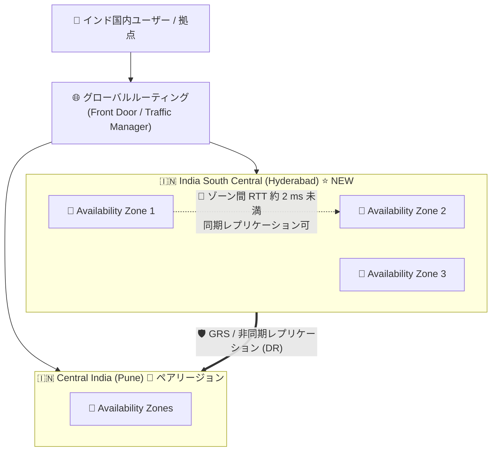

# Azure Regions & Datacenters: インド 4 番目のリージョン India South Central (ハイデラバード) が一般提供開始

**リリース日**: 2026-07-28

**サービス**: Azure Regions & Datacenters (Azure グローバルインフラストラクチャ)

**機能**: India South Central リージョン (プログラム名: `indiasouthcentral`)

**ステータス**: Launched (GA)

[このアップデートのインフォグラフィックを見る](https://takech9203.github.io/azure-news-summary/20260728-azure-india-south-central-region.html)

## 概要

Microsoft は、インドにおける 4 番目のデータセンターリージョンとして **India South Central** の提供開始を発表しました。リージョンのキャンパスはインド・テランガーナ州ハイデラバードに所在します。公式アナウンスでは、このリージョンが「AI レディネス (AI readiness) を主要な焦点として設計された、ローカルかつセキュアで最新のクラウドインフラストラクチャ」を顧客に提供するものと説明されています。

Microsoft は本リージョンの狙いとして、(1) クラウドおよび AI サービスに対する需要拡大への対応、(2) 顧客のデジタルトランスフォーメーション支援、(3) インド国内でのデータレジデンシー (ローカルデータ保管) の実現、(4) レイテンシの改善、(5) インド国内におけるレジリエントなクラウドキャパシティの確保、の 5 点を挙げています。

Solutions Architect にとって重要なのは、India South Central が **Availability Zones をサポートするリージョン** として Microsoft Learn の公式リージョン一覧に掲載されている点です。既存のインドリージョンのうち Availability Zones を持つのは Central India (プネー) のみであり、South India (チェンナイ) と West India (ムンバイ) はゾーン非対応です。つまり India South Central の登場により、インド国内で **ゾーン冗長 (zone-redundant) 構成を組めるリージョンが 2 つになった** ことになります。これは「データをインド国外に出せない」という規制要件を持つワークロードにとって、リージョン内高可用性とインド国内完結のマルチリージョン DR を同時に成立させる選択肢が広がることを意味します。

**アップデート前の課題**

- インド国内で Availability Zones を利用できるリージョンは Central India のみで、ゾーン冗長構成を前提としたアーキテクチャの配置先が実質 1 リージョンに限られていた
- South India / West India はゾーン非対応であるため、これらをプライマリに選ぶとリージョン内のゾーン障害に対する保護をプラットフォーム機能で得られなかった
- インド国内でのデータレジデンシー要件を満たしつつ「ゾーン冗長 + 国内クロスリージョン DR」を両立させる設計の自由度が低かった
- ハイデラバード周辺 (テランガーナ州・南部内陸圏) の利用者・システムから見て、最寄りの Azure リージョンまでの物理距離が相対的に遠かった

**アップデート後の改善**

- インド国内に Availability Zones 対応リージョンが 2 つ (Central India / India South Central) となり、ゾーン冗長を前提とした構成の配置先が増加
- India South Central のペアリージョンが Central India に設定され、両リージョンともゾーン対応という「ゾーン冗長 x 国内リージョンペア」の DR 構成が組める
- ハイデラバード近傍のユーザー・拠点に対してローカルなクラウドインフラが提供され、レイテンシ改善が期待できる
- AI レディネスを主眼に設計されたリージョンとして、インド国内でのデータレジデンシーを維持したまま AI ワークロードを展開する余地が生まれる

## アーキテクチャ図



India South Central 内で複数の Availability Zone にまたがるゾーン冗長構成を組み、さらにペアリージョンである Central India へ地理冗長レプリケーションを行うことで、インド国内で完結する 2 段構えのレジリエンシ設計が可能になります (ゾーン数の詳細および各サービスのゾーン対応状況は公式ドキュメント参照)。

## サービスアップデートの詳細

### 主要機能

1. **インド 4 番目のリージョンとしての一般提供開始**
   - リージョン表示名: India South Central、プログラム名: `indiasouthcentral`
   - 物理ロケーション: ハイデラバード (テランガーナ州)。ジオグラフィは India
   - ステータスは Launched (GA)、一般提供時期は 2026 年 7 月

2. **Availability Zones 対応リージョン**
   - Microsoft Learn の「List of Azure regions」および「Regions with availability zones」の双方で、India South Central は Availability Zone サポート対象として掲載されている
   - Availability Zone は電源・冷却・ネットワークが独立した、リージョン内で物理的に分離されたデータセンター群の論理グループ
   - ゾーン間は高性能ネットワークで接続され、Microsoft はラウンドトリップ約 2 ミリ秒未満を目標としている (同期レプリケーションが実用的なレイテンシ帯)
   - 同一リージョン内のゾーン間データ転送に対して Azure は課金しない (プライベート / パブリック IP のいずれでも)

3. **リージョンペアは Central India (非対称ペア)**
   - India South Central のペアリージョンは **Central India**
   - ただしこれは非対称 (asymmetrical) ペアであり、Central India 側のペアは South India。公式ドキュメントでも非対称ペアの例として明記されている
   - リージョンペアであることで得られる公式に定義された利点は、(a) ジオグラフィ全体障害時の復旧優先順位付け、(b) 計画メンテナンスのペア間ずらし適用 (sequential updating)、(c) 同一ジオグラフィ内配置によるデータレジデンシーの担保

4. **AI レディネスを主眼とした設計**
   - 公式アナウンスでは、AI readiness を主要な焦点として設計されたインフラであると説明されている
   - 具体的な GPU SKU や AI サービスの提供状況は本アナウンスでは列挙されていないため、Products available by region での確認が必要

## 技術仕様

| 項目 | 詳細 |
|------|------|
| リージョン表示名 | India South Central |
| プログラム名 (location) | `indiasouthcentral` |
| 物理ロケーション | ハイデラバード (テランガーナ州、インド) |
| ジオグラフィ | India |
| Availability Zones | サポート対象 (公式リージョン一覧で「Yes」) |
| ペアリージョン | Central India (非対称ペア: Central India → South India) |
| ステータス | Launched (GA) / 一般提供: 2026 年 7 月 |
| ゾーン間ネットワーク | Microsoft 目標値としてラウンドトリップ約 2 ms 未満、ゾーン間データ転送は無償 |
| ゾーン間の物理距離 | 一般に数キロメートル以上離隔、通常 100 km 以内 (Azure 共通仕様) |
| 提供サービス一覧 | 本アナウンスでは列挙されていない → Products available by region を参照 |

### インドの Azure リージョン比較 (公式リージョン一覧より)

| リージョン | プログラム名 | 物理ロケーション | Availability Zones | ペアリージョン |
|-----------|-------------|-----------------|-------------------|---------------|
| **India South Central** | `indiasouthcentral` | ハイデラバード | ✅ あり | Central India |
| Central India | `centralindia` | プネー | ✅ あり | South India |
| South India | `southindia` | チェンナイ | ❌ なし | Central India |
| West India | `westindia` | ムンバイ | ❌ なし | South India |

## 設定方法

### 前提条件

1. 対象 Azure サブスクリプションで India South Central リージョンが選択可能であること (リージョンの有効化状況はサブスクリプションのオファータイプにより異なる場合があるため、`az account list-locations` で確認する)
2. デプロイ対象の各 Azure サービスが India South Central で提供されていること (Products available by region で確認)
3. Availability Zones を使う場合、対象サービスが当該リージョンでゾーン対応していること (サービスごとの Reliability guide を確認)

### Azure CLI

```bash
# サブスクリプションから利用可能なリージョン一覧を取得し、India South Central を確認
az account list-locations \
  --query "[?name=='indiasouthcentral'].{name:name, displayName:displayName, geography:metadata.geographyGroup, pairedRegion:metadata.pairedRegion[0].name}" \
  -o table

# 論理ゾーンと物理ゾーンのマッピングを確認 (サブスクリプションごとに異なる)
az account list-locations \
  --query "[?name=='indiasouthcentral'].{displayName:displayName, availabilityZoneMappings:availabilityZoneMappings}" \
  -o json

# India South Central にリソースグループを作成
az group create --name rg-india-sc --location indiasouthcentral

# 特定サービス (例: Virtual Machines) の利用可能な SKU とゾーンを確認
az vm list-skus --location indiasouthcentral --output table
```

論理 Availability Zone 番号 (1/2/3) と物理ゾーンのマッピングはサブスクリプションごとに異なります。複数サブスクリプションにまたがってゾーンを揃えたい場合は Check Zone Peers API の利用を検討してください。

## メリット

### ビジネス面

- インド国内でのデータレジデンシー要件を満たしたまま、ゾーン冗長という高い可用性水準を達成できる選択肢が増える
- ハイデラバード / テランガーナ州および南部内陸圏の拠点・ユーザーに近い場所でワークロードを稼働でき、体感性能の改善が見込める
- インド国内のクラウドキャパシティ拡大により、既存インドリージョンでのキャパシティ制約リスクを分散できる
- AI レディネスを掲げたリージョンであるため、インド国内完結を求められる AI / 生成 AI 案件の実現余地が広がる

### 技術面

- リージョン内: 複数 Availability Zone を用いたゾーン冗長構成で、単一ゾーン障害に耐えるアーキテクチャを構築できる (ゾーン間 RTT 約 2 ms 未満目標のため同期レプリケーションも現実的)
- リージョン間: ペアリージョン Central India との組み合わせで、GRS など「リージョンペアを前提とする地理冗長機能」をインド国内で完結させられる
- Central India も Availability Zones 対応であるため、プライマリ / セカンダリの双方をゾーン冗長にした「マルチゾーン x マルチリージョン」構成が国内で成立する (ミッションクリティカルワークロードに対する Azure の推奨形)
- ゾーン間データ転送が無償であるため、ゾーン冗長化に伴うネットワークコスト増を気にせず設計できる

## デメリット・制約事項

- **提供サービスは新リージョンでは限定的な場合がある**: 本アナウンスに利用可能サービスの一覧は含まれていない。採用前に必ず Products available by region と各サービスの Reliability guide で対象リージョンの提供状況・ゾーン対応状況を確認する必要がある
- **ゾーン対応 = 全サービスがゾーン対応ではない**: 公式ドキュメントでも「リージョンが Availability Zones を提供していても、一部サービスがそのリージョンでゾーンをサポートしない可能性がある」と明記されている。SKU / 価格レベルによってゾーン対応要件が異なるサービスもある
- **非対称ペアに注意**: India South Central → Central India のペアは片方向。Central India のペアは South India であるため、「Central India をプライマリにした GRS のセカンダリが India South Central になる」わけではない。ペア前提の機能を使う場合は方向性を必ず確認する
- **リージョンペアは自動 DR ではない**: ペアリージョンへのデプロイだけでは高可用性・DR・フェールオーバーは自動的に得られない。GRS の Microsoft 管理フェールオーバーも壊滅的状況でのみ実施されるため、独自の HA / DR 計画が必須
- **Availability Zones はリージョン全体障害を保護しない**: リージョン規模障害に備えるにはクロスリージョン設計またはバックアップ / リストア手順と現実的な復旧目標の設定が必要
- **料金はリージョンごとに異なる**: 既存インドリージョンと同一単価とは限らないため、移行・新規配置の判断前に料金計算ツールでリージョン指定の見積りを行う必要がある
- **ゾーン番号は論理値**: 論理ゾーン 1/2/3 の物理ゾーンへのマッピングはサブスクリプション単位で異なるため、複数サブスクリプション間でゾーンを揃える前提の設計は Check Zone Peers API での確認が必要

## ユースケース

### ユースケース 1: データレジデンシー要件下でのゾーン冗長 Web アプリケーション

**シナリオ**: インド国内の規制により顧客データをインド国外に出せない金融 / 公共系ワークロード。従来は Central India 一択でゾーン冗長を組んでいたが、キャパシティ確保とレイテンシの観点で南部内陸圏に近い配置先が欲しい。

**実装例**:

```bash
# India South Central にリソースグループを作成
az group create --name rg-webapp-india-sc --location indiasouthcentral

# 利用可能なゾーンを持つ VM SKU を確認してからゾーン分散デプロイを設計する
az vm list-skus --location indiasouthcentral \
  --query "[?resourceType=='virtualMachines' && length(locationInfo[0].zones) > \`0\`].{name:name, zones:locationInfo[0].zones}" \
  -o table
```

**効果**: インド国内にデータを留めたまま、単一ゾーン障害に耐える構成を実現。ゾーン間データ転送は無償のため冗長化のネットワークコスト増を回避できる。

### ユースケース 2: インド国内完結のクロスリージョン DR

**シナリオ**: プライマリを India South Central、セカンダリをペアリージョンの Central India に配置し、リージョン規模障害にも備えたい。双方がゾーン対応リージョンであるため、各リージョン内でもゾーン冗長を確保する。

**実装例**:

```bash
# プライマリ / セカンダリ双方のリソースグループを作成
az group create --name rg-primary-india-sc --location indiasouthcentral
az group create --name rg-secondary-central-india --location centralindia

# ペアリージョン設定を確認 (India South Central のペアが Central India であることを検証)
az account list-locations \
  --query "[?name=='indiasouthcentral'].metadata.pairedRegion[].name" -o tsv
```

**効果**: 「マルチゾーン x マルチリージョン」というミッションクリティカル向けの推奨構成を、インドのジオグラフィ内で完結して実現。ペアリージョンであるため復旧優先順位付けと計画メンテナンスのずらし適用の恩恵も受けられる。

### ユースケース 3: 南部内陸圏向けの低レイテンシ配置とキャパシティ分散

**シナリオ**: ハイデラバードに開発拠点・データ生成拠点を持つ企業が、既存の Central India / South India 配置のワークロードのうち、レイテンシ影響の大きいコンポーネントを近接リージョンに移す。

**効果**: 拠点に近いリージョンでの稼働により体感性能が改善。同時に複数リージョンへワークロードを分散することで、単一リージョンのキャパシティ制約リスクも低減できる。

## 料金

Azure の料金はリージョンごとに異なるため、India South Central の単価が既存インドリージョン (Central India / South India / West India) と同一である保証はありません。本アナウンスにはリージョン別の料金情報が含まれていないため、以下の公式ツールでリージョンを `India South Central` に指定した見積りを行ってください。

| 確認項目 | 参照先 |
|---------|--------|
| リージョン指定の月額見積り | [Azure 料金計算ツール](https://azure.microsoft.com/pricing/calculator/) |
| サービス別のリージョン単価 | 各サービスの料金詳細ページ (リージョン選択プルダウン) |
| リージョン間データ転送料金 | [帯域幅の料金](https://azure.microsoft.com/pricing/details/bandwidth/) |
| ゾーン間データ転送 | 同一リージョン内の Availability Zone 間データ転送は Azure では課金されない (公式ドキュメント記載) |

コスト設計上の注意として、リージョンペア (India South Central ↔ Central India) を使った地理冗長構成ではリージョン間のデータ転送料金とセカンダリ側リソースの費用が追加で発生します。一方でリージョン内のゾーン冗長化はゾーン間転送が無償であるため、まずゾーン冗長で可用性を確保し、必要に応じてクロスリージョンを追加するという段階的アプローチがコスト効率の面で有効です。

## 利用可能リージョン

- **新規リージョン**: India South Central (`indiasouthcentral`) / ハイデラバード、テランガーナ州、インド
- **Availability Zones**: サポート対象 (公式リージョン一覧・ゾーン対応リージョン一覧の双方に掲載)
- **ペアリージョン**: Central India (非対称ペア)
- **提供サービス一覧**: 本アナウンスでは列挙されていないため、[Products available by region](https://azure.microsoft.com/explore/global-infrastructure/products-by-region/) および各サービスの [Reliability guide](https://learn.microsoft.com/azure/reliability/overview-reliability-guidance) で公式に確認すること

## 関連サービス・機能

- **Availability Zones**: India South Central 内でゾーン冗長 (zone-redundant) / ゾーン配置 (zonal) リソースを構成し、単一ゾーン障害への耐性を得るための基盤機能
- **Azure リージョンペア (Central India)**: GRS などリージョンペアを前提とする地理冗長機能のセカンダリ先。復旧優先順位付けと計画更新のずらし適用の対象
- **Azure Storage 冗長性 (ZRS / GRS / GZRS)**: ゾーン冗長ストレージでリージョン内耐障害性を、地理冗長ストレージでペアリージョンへの複製を実現 (各冗長オプションのリージョン対応は要確認)
- **Azure Site Recovery / Azure Backup**: インド国内でのクロスリージョン DR、およびリージョン全体障害時のリストア手段
- **Azure Front Door / Traffic Manager**: 複数インドリージョンへのトラフィック分散とフェールオーバールーティング
- **Azure Well-Architected Framework (信頼性)**: リージョンと Availability Zones の使い分けに関する設計推奨事項

## 参考リンク

- [インフォグラフィック](https://takech9203.github.io/azure-news-summary/20260728-azure-india-south-central-region.html)
- [公式アップデート情報: Generally Available: Microsoft Azure now available from new cloud region in India (India South Central)](https://azure.microsoft.com/updates?id=568013)
- [List of Azure regions (Microsoft Learn)](https://learn.microsoft.com/azure/reliability/regions-list)
- [Azure region pairs and nonpaired regions (Microsoft Learn)](https://learn.microsoft.com/azure/reliability/regions-paired)
- [What are Azure Availability Zones? (Microsoft Learn)](https://learn.microsoft.com/azure/reliability/availability-zones-overview)
- [Azure reliability guides by service (Microsoft Learn)](https://learn.microsoft.com/azure/reliability/overview-reliability-guidance)
- [Recommendations for using availability zones and regions (Well-Architected Framework)](https://learn.microsoft.com/azure/well-architected/resiliency/regions-availability-zones)
- [Products available by region](https://azure.microsoft.com/explore/global-infrastructure/products-by-region/)
- [Azure 料金計算ツール](https://azure.microsoft.com/pricing/calculator/)

## まとめ

India South Central は、インドにおける Azure の 4 番目のリージョンとして 2026 年 7 月に一般提供が開始されました。ハイデラバード (テランガーナ州) に所在し、**Availability Zones をサポートし、ペアリージョンは Central India** です。これによりインド国内で Availability Zones を利用できるリージョンは Central India と合わせて 2 つになり、「リージョン内はゾーン冗長、リージョン間はインド国内のペアリージョンで DR」という Azure 推奨のミッションクリティカル構成をデータレジデンシー要件下でも構築できるようになりました。

Solutions Architect が取るべき次のアクションは 3 点です。第一に、Products available by region と各サービスの Reliability guide で、対象ワークロードの構成サービスが India South Central で提供されているか、かつゾーン対応しているかを確認すること。第二に、リージョンペアが **India South Central → Central India の非対称ペア** であることを踏まえ、GRS などペア前提機能の複製方向を設計時に検証すること (Central India をプライマリにした場合のペアは South India です)。第三に、料金計算ツールでリージョンを指定した見積りを行い、既存インドリージョンとの単価差およびクロスリージョン転送コストを織り込んだうえで配置先を判断することです。

なお、リージョンペアへのデプロイやゾーン対応リージョンの選択それ自体が自動的な HA / DR を提供するものではない点は公式ドキュメントでも強調されています。新リージョンの登場は選択肢の拡大であり、独自の可用性・災害復旧計画の設計は引き続き必須です。

---

**タグ**: Azure, Regions & Datacenters, India South Central, インド, ハイデラバード, Availability Zones, リージョンペア, Central India, データレジデンシー, 災害復旧, DR, 高可用性, GA
