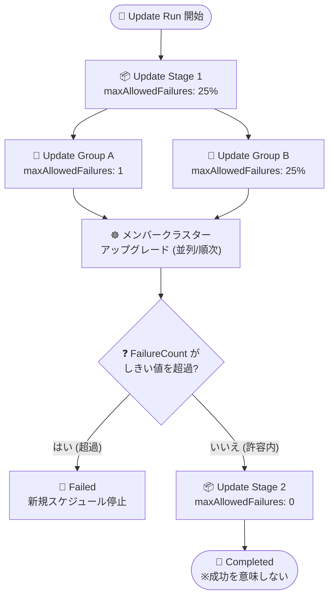

# Azure Kubernetes Fleet Manager: update run の Maximum allowed failures (許容失敗数) がパブリックプレビュー

**リリース日**: 2026-07-28

**サービス**: Azure Kubernetes Fleet Manager

**機能**: Maximum allowed failures for update runs (update run の許容失敗数)

**ステータス**: In preview (Public Preview)

[このアップデートのインフォグラフィックを見る](https://takech9203.github.io/azure-news-summary/20260728-fleet-manager-max-allowed-failures.html)

## 概要

Azure Kubernetes Fleet Manager の update run に、メンバークラスターのアップグレード失敗をどこまで許容するかを制御する **Maximum allowed failures (`maxAllowedFailures`)** がパブリックプレビューとして追加されました。update strategy のオプション設定として、**update stage 単位**と **update group 単位**の 2 レベルで構成できます。

Fleet Manager の update run は、複数の AKS メンバークラスターに対して Kubernetes バージョンやノードイメージのアップグレードを、stage (順次実行) と group (stage 内で並列実行) の階層でオーケストレーションする仕組みです。これまで update run は **fail-fast モデル**で動作し、1 つのメンバークラスターのアップグレードが失敗すると update run 全体が `Failed` となって停止していました。大規模なフリートでは、一部のクラスターで発生した一時的な失敗によってロールアウト全体が止まってしまうという課題がありました。

`maxAllowedFailures` を設定すると、update run は **failure-tolerant (失敗許容型)** の動作に切り替わり、設定したしきい値に達するまでは他のクラスターのアップグレードを継続します。値は固定の整数 (例: `"3"`) またはパーセンテージ (例: `"25%"`) で指定できます。未指定または `"0"` の場合は従来どおり fail-fast となるため、既存の update strategy / update run の挙動は変わらず、移行作業は不要です。

なお、本機能は同じく preview の **Maximum concurrency** (並列アップグレード数の制御) と組み合わせて使う設計になっており、「どれだけ速く回すか (concurrency)」と「どれだけ失敗を許すか (allowed failures)」の 2 軸でロールアウトの安全性と速度をチューニングできます。

**アップデート前の課題**

- update run は fail-fast モデルのみで、メンバークラスター 1 台のアップグレード失敗が group / stage / update run のすべてを `Failed` にしてロールアウト全体を停止させていた
- 数百クラスター規模のフリートでは、一時的・環境依存の失敗 (例: メンテナンスウィンドウやノードイメージ関連の失敗) が 1 件でも発生するとロールアウトの進捗が止まり、失敗したクラスターの調査・修復と update run の再実行 (最後の未処理クラスターから再開) が完了するまで残りのクラスターがアップグレードされない
- 「テスト環境の stage は多少の失敗を許容して先へ進めたい、本番 stage は 1 件でも止めたい」といった、環境ごとに失敗許容度を変える運用ができなかった

**アップデート後の改善**

- update stage / update group 単位で `maxAllowedFailures` を設定でき、しきい値を超えるまでロールアウトを継続できるようになった
- 値を固定整数とパーセンテージのどちらでも指定でき、パーセンテージはグループ規模に応じてスケールする (公式ドキュメントは多くのケースでパーセンテージ指定を推奨)
- stage ごとに異なるしきい値を設定できるため、「初期 stage (テスト系) は `25%` を許容、本番 stage は `0` で fail-fast」といった段階的な安全設計が可能になった
- `UpdateRun.FailureCount` / `Stage.FailureCount` / `Group.FailureCount` により、失敗メンバー数をレベル別に把握できる

## アーキテクチャ図



update run は stage を順次、stage 内の group を並列に処理します。メンバークラスターのアップグレードが失敗するたびに group / stage の `FailureCount` がしきい値を超えたかを判定し、超えた場合はその区間を `Failed` として新規スケジュールを停止、許容内なら次のメンバー・次の stage へ進みます。

## サービスアップデートの詳細

### 主要機能

1. **failure-tolerant な update run**
   - デフォルトの fail-fast モデル (1 件の失敗で update run 全体が停止) に対し、`maxAllowedFailures` を設定すると設定値に達するまでロールアウトを継続する
   - しきい値を超えた場合、該当の group / stage が要約エラーメッセージ付きで `Failed` となり、update run は進行を停止する

2. **stage レベルと group レベルの 2 段階設定**
   - **stage レベル**: stage 内の全 group を通じて許容するメンバー失敗数。stage 全体の上限 (ceiling) として機能する
   - **group レベル**: 特定の group 内で許容するメンバー失敗数
   - 両者は独立して評価され、どちらかのしきい値を超えた時点でその区間の新規スケジュールが停止する
   - group が自身のしきい値を超えた場合、stage レベルの設定に関係なくその group は `Failed` になる

3. **固定値とパーセンテージの両方に対応**
   - 固定整数: `"3"` → 3 件のメンバー失敗まで許容
   - パーセンテージ: `"25%"` → 対象クラスター数の 25% まで許容。stage レベルは stage 内の全クラスター数、group レベルは当該 group のクラスター数を母数とする
   - パーセンテージは **update run 作成時**に解決され、**切り上げ (ceiling)** で丸められる (例: 5 クラスターの 25% → 2)

4. **FailureCount による可観測性**
   - `UpdateRun.FailureCount`: run 全体の失敗メンバー数
   - `Stage.FailureCount`: stage 内の失敗メンバー数
   - `Group.FailureCount`: group 内の失敗メンバー数
   - これらは「レポート用のメトリック」であり、設定したしきい値そのものではない

5. **既存リソースへの後方互換性**
   - 未指定または空の場合、解決値は `0` となり fail-fast 動作が維持される
   - 既存の update strategy / update run は明示的に設定しない限り従来動作のままで、移行は不要
   - fail-fast に戻したい場合は明示的に `0` を設定する

## 技術仕様

| 項目 | 詳細 |
|------|------|
| 設定フィールド名 | `maxAllowedFailures` (update strategy / update run の stages JSON 内) |
| 設定可能レベル | update stage、update group |
| 値の形式 | 固定整数 (例: `"2"`) またはパーセンテージ (例: `"25%"`) の文字列 |
| デフォルト値 | `0` (未指定・空の場合。fail-fast 動作) |
| パーセンテージの解決タイミング | update run 作成時 |
| パーセンテージの丸め | 切り上げ (ceiling) |
| 評価対象 | 失敗したメンバー更新の**件数のみ**。成功率や最低成功数は評価しない |
| しきい値超過時 | 該当 group / stage を `Failed` にし、要約エラーメッセージを付与して新規スケジュールを停止 |
| メンバークラスターのステータス | しきい値の影響を受けない。アップグレードが失敗したメンバーは常に `Failed` |
| 構成インターフェイス (preview 時) | Azure CLI `fleet` 拡張機能、REST API のみ (Azure Portal 非対応) |
| 関連する preview 機能 | Maximum concurrency (`maxConcurrency`) |
| stage 内 update group の上限 | 50 |

### `Completed` ステータスの解釈 (重要)

`maxAllowedFailures` を使用する場合、`Completed` は「Fleet Manager がスケジューリング判断を行った時点でしきい値を超えていなかった」ことを意味するだけで、**ロールアウトが健全・成功したことを保証しません**。

公式ドキュメントは以下の例を挙げています。メンバー 4 台の group に `group.maxAllowedFailures = "4"` を設定した場合、4 台すべてのアップグレードが失敗しても「4 件 = 許容値でしきい値を超過していない」ため group は `Completed` になり得ます。これは仕様通りの意図的な挙動です。

そのため、update run 完了後は必ず `FailureCount`、メンバーごとのステータス、失敗メッセージを確認する必要があります。

### FailureCount がしきい値を超えるケース

`maxAllowedFailures` は「新しい作業をスケジュールし続けるかどうか」の判断を制御するもので、最終的に報告される失敗件数のハードリミットではありません。`maxConcurrency` で並列アップグレードを許可している場合、Fleet Manager がしきい値超過を観測して停止判断を下す前に複数メンバーがほぼ同時に失敗し得るため、`FailureCount` が設定値を上回ることは想定される動作です。

## 設定方法

### 前提条件

1. 1 つ以上のメンバークラスターが参加した Fleet リソース
2. Azure CLI (update run の利用には 2.58.0 以降が必要)
3. `fleet` Azure CLI 拡張機能

```bash
az extension add --name fleet
# または最新版へ更新
az extension update --name fleet
```

### Azure CLI

update strategy または update run の stages JSON に `maxAllowedFailures` を記述します。

```json
{
    "stages": [
        {
            "name": "stage-1",
            "maxConcurrency": "7",
            "maxAllowedFailures": "2",
            "groups": [
                {
                    "name": "group-1",
                    "maxConcurrency": "3",
                    "maxAllowedFailures": "1"
                },
                {
                    "name": "group-2",
                    "maxConcurrency": "50%",
                    "maxAllowedFailures": "25%"
                }
            ],
            "afterStageWaitInSeconds": 300
        },
        {
            "name": "stage-2",
            "maxConcurrency": "100%",
            "maxAllowedFailures": "0",
            "groups": [
                {
                    "name": "group-3",
                    "maxConcurrency": "2",
                    "maxAllowedFailures": "0"
                }
            ]
        }
    ]
}
```

再利用可能な update strategy として登録する場合。

```bash
# 環境変数
export GROUP=<resource-group>
export FLEET=<fleet-name>
export STRATEGY=<strategy-name>

# update strategy を作成
az fleet updatestrategy create \
  --resource-group $GROUP \
  --fleet-name $FLEET \
  --name $STRATEGY \
  --stages example-stages.json
```

update run に直接 stages JSON を指定する場合。

```bash
# update run を作成
az fleet updaterun create \
  --resource-group $GROUP \
  --fleet-name $FLEET \
  --name run-1 \
  --upgrade-type Full \
  --kubernetes-version 1.26.0 \
  --node-image-selection Latest \
  --stages example-stages.json

# update run を開始
az fleet updaterun start \
  --resource-group $GROUP \
  --fleet-name $FLEET \
  --name run-1
```

### Azure Portal

プレビュー期間中、Azure Portal では `maxAllowedFailures` を構成できません。CLI または REST API で設定したフィールドは、その後同じ update strategy / update run を Portal で編集しても削除されません。

## メリット

### ビジネス面

- 大規模フリートのアップグレードが 1 件の失敗で止まらなくなり、セキュリティパッチやノードイメージ更新の適用完了までのリードタイムを短縮できる
- 失敗クラスターの調査と、残りのクラスターのアップグレード進行を並行して進められるため、運用チームの手戻りが減る
- stage ごとに許容度を変えられるため、「テスト環境は前進優先、本番は厳格」というガバナンスをコードとして表現できる

### 技術面

- update strategy に保存できるため、複数の update run / auto-upgrade profile で同じ失敗許容ポリシーを再利用できる
- パーセンテージ指定によりフリート規模の変化に追従するしきい値を定義できる
- `maxConcurrency` と組み合わせて、並列度 (速度) と失敗許容度 (安全性) を独立に調整できる
- 未設定時は `0` (fail-fast) なので、既存構成に影響を与えずに段階的に導入できる

## デメリット・制約事項

- **パブリックプレビュー**: Azure Kubernetes Fleet Manager のプレビュー機能はセルフサービスのオプトイン方式で提供され、"as is" / "as available" として提供されます。SLA および限定保証の対象外で、カスタマーサポートはベストエフォートの部分的サポートとなります。**本番用途を想定した機能ではありません**
- プレビュー期間中は Azure CLI `fleet` 拡張機能または REST API 経由でのみ設定可能で、Azure Portal からは構成できない
- `Completed` はロールアウトの成功を意味しない。しきい値を超えなかっただけであり、極端な場合はメンバー 100% が失敗しても `Completed` になり得るため、`FailureCount` / メンバーステータス / 失敗メッセージの確認が必須
- `maxConcurrency` で並列実行している場合、`FailureCount` が設定した `maxAllowedFailures` を超えることがある (停止判断前に複数の失敗が観測されるため)
- 絶対値のしきい値は小規模 group で直感に反する結果を生む (例: 2 メンバーの group に `"2"` を設定すると、両方失敗しても `Completed`)。公式ドキュメントはパーセンテージ指定を推奨
- しきい値はフリートの成長に合わせて再評価が必要 (5 クラスター向けの値は 500 クラスターでは厳しすぎる/緩すぎる可能性がある)
- メンバークラスター個々のステータスはしきい値の影響を受けず、失敗したメンバーは `Failed` のまま残る

## ユースケース

### ユースケース 1: 大規模フリートで一時的な失敗を許容しつつロールアウトを完走させる

**シナリオ**: 数百のメンバークラスターを持つフリートで週次のノードイメージ更新を実施している。一定割合で一時的な失敗が発生するが、fail-fast のため毎回ロールアウトが途中で止まり、再実行の運用負荷が高い。

**実装例**:

```json
{
    "stages": [
        {
            "name": "canary",
            "maxConcurrency": "25%",
            "maxAllowedFailures": "25%",
            "groups": [
                { "name": "group-canary", "maxAllowedFailures": "25%" }
            ],
            "afterStageWaitInSeconds": 3600
        },
        {
            "name": "production",
            "maxConcurrency": "10%",
            "maxAllowedFailures": "5%",
            "groups": [
                { "name": "group-prod-a", "maxAllowedFailures": "5%" },
                { "name": "group-prod-b", "maxAllowedFailures": "5%" }
            ]
        }
    ]
}
```

**効果**: canary stage では 25% までの失敗を許容してロールアウトを継続し、production stage では 5% で停止させる。ロールアウト完走率が上がり、失敗クラスターの修復は非同期に実施できる。

### ユースケース 2: 本番 stage では従来どおり fail-fast を維持する

**シナリオ**: セーフティクリティカルなワークロードを載せた本番クラスター群では、最初の失敗時点で必ず停止して調査したい。

**実装例**:

```json
{
    "stages": [
        {
            "name": "stage-prod",
            "maxAllowedFailures": "0",
            "groups": [
                { "name": "group-prod", "maxAllowedFailures": "0" }
            ]
        }
    ]
}
```

**効果**: `0` を明示することで fail-fast 動作となり、1 件の失敗で update run が停止する。CLI/REST で誤って許容値を設定した場合のリセット手段としても使える。

## 料金

Azure Kubernetes Fleet Manager 自体は無料で利用できます。課金対象は、hub cluster を使用する構成の場合の単一ノード AKS クラスター (Uptime SLA) と、その関連インフラストラクチャです。

| 項目 | 料金 |
|------|------|
| Fleet Manager リソース | 無料 |
| hub cluster (単一ノード AKS + Uptime SLA)、VM (Standard_DS3_v2)、ロードバランサーなど | AKS / インフラストラクチャの通常料金 |

`maxAllowedFailures` の利用に伴う追加課金についての記載は確認できませんでした。最新の料金は下記の料金ページを参照してください。

## 関連サービス・機能

- **Azure Kubernetes Service (AKS)**: update run のアップグレード対象となるメンバークラスター。AKS の計画メンテナンスウィンドウ (`AKSManagedAutoUpgradeSchedule` / `AKSManagedNodeOSAutoUpgradeSchedule`) は update run から尊重される
- **Update strategy / update stage / update group**: `maxAllowedFailures` を設定する対象。stage は順次、stage 内の group は並列、group 内のメンバーは順次 (既定) に処理される
- **Maximum concurrency (preview)**: 並列アップグレード数を stage / group レベルで制御する機能。`maxAllowedFailures` と同じ stages JSON で併用し、並列度が高いと `FailureCount` がしきい値を超えやすくなる関係にある
- **Gates (Approval gates / Scheduled start gates、いずれも preview)**: stage / group の前後で update run を一時停止させるフロー制御。失敗許容と組み合わせて承認ベースの段階的ロールアウトを構成できる
- **Auto-upgrade profile**: Kubernetes / ノードイメージの新バージョン公開時に update run を自動作成・実行する機能。update strategy を参照するため、`maxAllowedFailures` の設定を自動アップグレードにも適用できる

## 参考リンク

- [インフォグラフィック](https://takech9203.github.io/azure-news-summary/20260728-fleet-manager-max-allowed-failures.html)
- [公式アップデート情報](https://azure.microsoft.com/updates?id=567939)
- [Microsoft Learn: Safely update Kubernetes and node images across multiple clusters (Maximum allowed failures)](https://learn.microsoft.com/azure/kubernetes-fleet/concepts-update-orchestration#maximum-allowed-failures-preview)
- [Microsoft Learn: Update Kubernetes and node images across multiple clusters using Azure Kubernetes Fleet Manager](https://learn.microsoft.com/azure/kubernetes-fleet/update-orchestration)
- [Microsoft Learn: Define reusable update strategies for multi-cluster updates](https://learn.microsoft.com/azure/kubernetes-fleet/update-create-update-strategy)
- [料金ページ: Azure Kubernetes Fleet Manager](https://azure.microsoft.com/pricing/details/kubernetes-fleet-manager/)

## まとめ

`maxAllowedFailures` のプレビュー提供により、Azure Kubernetes Fleet Manager の update run は「1 件の失敗で全停止」という fail-fast 一択から、stage / group 単位で失敗許容度を設計できるモデルへ拡張されました。数十〜数百クラスター規模のフリートを運用しており、一時的な失敗によるロールアウト停止が運用負荷になっているチームにとって、実運用上のインパクトが大きいアップデートです。

一方で、`Completed` がロールアウトの成功を意味しなくなるという重要なセマンティクスの変更を伴います。しきい値を設定する場合は、監視・通知の側で `FailureCount` とメンバーごとのステータスを必ず確認するプロセスを組み込む必要があります。しきい値はグループ規模の変化に追従できるパーセンテージ指定を基本とし、本番 stage は `0` を明示するなど、stage ごとに意図を持って設定することが推奨されます。

プレビューであり SLA 対象外・Portal 非対応・本番非推奨のため、まずは非本番のフリートで update strategy に組み込み、`FailureCount` の挙動と `Completed` の解釈を検証したうえで、GA 後の本番適用に備えるのが現実的な進め方です。

---

**タグ**: Azure Kubernetes Fleet Manager, AKS, Containers, Kubernetes, Update Run, Update Strategy, maxAllowedFailures, Multi-cluster, Public Preview, Fail-fast
