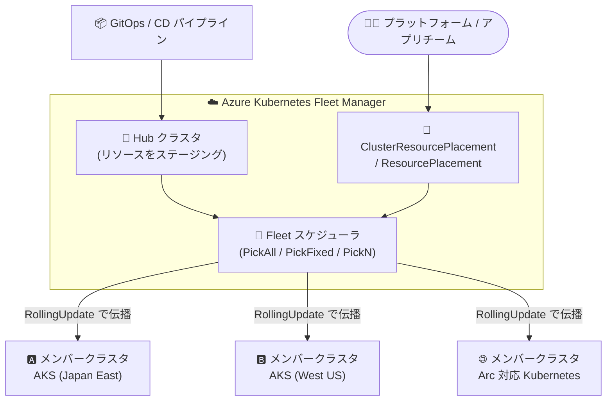

# Azure Kubernetes Fleet Manager: リソース配置 (Resource placement) が一般提供開始

**リリース日**: 2026-07-28

**サービス**: Azure Kubernetes Fleet Manager

**機能**: Resource placement (ClusterResourcePlacement / ResourcePlacement によるマルチクラスタへのリソース伝播)

**ステータス**: Launched (GA)

[このアップデートのインフォグラフィックを見る](https://takech9203.github.io/azure-news-summary/20260728-fleet-manager-resource-placement-ga.html)

## 概要

Azure Kubernetes Fleet Manager の **リソース配置 (Resource placement)** が一般提供 (GA) となった。この機能により、プラットフォームチームおよびアプリケーションチームは、複数の AKS クラスタおよび Arc 対応 Kubernetes クラスタに対して Kubernetes リソースを一貫した方法で配布できる。

今回の GA では、**Resource Placement Kubernetes API が v1 に昇格** し、あわせて **Azure portal 上でプレースメントを作成・参照・管理する新しい体験** が導入された。ラベルやクラスタプロパティに基づいてターゲットとなるメンバークラスタを選択するプレースメントポリシーを使うことで、クラスタごとに個別にリソースを適用・更新・追跡する運用の手間とリスクを削減できる。

Fleet Manager のリソース配置は CNCF の [KubeFleet プロジェクト](https://kubefleet.dev/) をベースに実装されている。運用モデルは「Fleet Manager の hub クラスタにリソースをステージング → プレースメントマニフェストを適用 → Fleet Manager がスケジュールしメンバークラスタへ配布 → プレースメントのステータスでロールアウトを観測」という流れになる。

**アップデート前の課題**

- 複数クラスタにまたがる Kubernetes リソース (RBAC の Role/RoleBinding、Prometheus や Flux などの基盤アプリ、アプリケーションの Namespace 一式) を、クラスタごとに手動で作成・更新・追跡する必要があり、手間がかかり誤りも起きやすかった
- 更新の適用漏れやクラスタ間の構成ドリフトが発生しやすく、一貫性の維持が難しかった
- リソース配置の Kubernetes API はプレビュー API バージョン (v1beta1 など) で提供されており、本番利用における API 安定性の懸念があった
- プレースメントの作成・状態確認は主に hub クラスタへの `kubectl` 操作が前提で、Azure portal 上での一貫した管理体験がなかった

**アップデート後の改善**

- `ClusterResourcePlacement` (CRP) / `ResourcePlacement` (RP) を hub クラスタに適用するだけで、選択したメンバークラスタへリソースが自動的に伝播・同期される
- Resource Placement Kubernetes API が **v1** (`placement.kubernetes-fleet.io/v1`) として GA され、本番利用可能な安定 API となった
- Azure portal に **Resource placements** の作成・一覧・ロールアウト詳細表示の体験が追加され、dry run 検証 (Validate) も可能になった
- ラベル・クラスタプロパティによる動的なクラスタ選択、`RollingUpdate` による段階的ロールアウトにより、更新適用のリスクを低減できる
- AKS クラスタだけでなく **Arc 対応 Kubernetes クラスタ** に対しても Workload placement が GA としてサポートされる

## アーキテクチャ図



hub クラスタにステージングした Namespace やリソースを、プレースメントポリシーに従って Fleet スケジューラが選定したメンバークラスタへ `RollingUpdate` で伝播する。ロールアウト状況は hub クラスタ上のプレースメントリソース、または Azure portal から確認できる。

## サービスアップデートの詳細

### 主要機能

1. **Resource Placement Kubernetes API の v1 GA**
   - `placement.kubernetes-fleet.io/v1` で `ClusterResourcePlacement` (CRP) / `ResourcePlacement` (RP) を利用可能
   - 一部の機能 (`ClusterResourcePlacementStatus`、`StatusReportingScope`、VM SKU 系クラスタプロパティ) は `v1beta1` のプレビュー扱いのまま

2. **ClusterResourcePlacement (クラスタスコープ)**
   - クラスタスコープのリソース、または Namespace とその配下のリソース一式をメンバークラスタへ配布
   - `selectionScope: NamespaceOnly` を指定すると、Namespace 自体のみを配布し中身は配らない (RP との組み合わせ運用向け)
   - 主な利用者はプラットフォーム運用者 (Namespace、RBAC、クラスタ全体ポリシーなど)

3. **ResourcePlacement (Namespace スコープ)**
   - 特定 Namespace 内の ConfigMap / Secret / Service などを、種類・名前・ラベルで選択して個別に配布
   - RP 自身も対象リソースと同じ Namespace に存在する Namespace スコープのオブジェクト
   - 対象 Namespace が存在するクラスタにのみ配置可能 (Namespace の作成は CRP で行う)

4. **3 種類のプレースメントポリシー**
   - `PickFixed`: `clusterNames` でクラスタ名を明示指定
   - `PickAll`: 全メンバークラスタ、または条件に合致する全クラスタへ配布 (監視エージェントなどの基盤ワークロード向け)
   - `PickN`: `numberOfClusters` で指定した数のクラスタへ、アフィニティおよびトポロジ分散制約に基づいて配布

5. **ラベル / クラスタプロパティによる動的なクラスタ選択**
   - `fleet.azure.com/location`、`fleet.azure.com/resource-group` など Fleet が自動付与するラベルと、ユーザー定義ラベルを利用可能
   - `kubernetes-fleet.io/node-count`、`resources.kubernetes-fleet.io/available-cpu`、`kubernetes.azure.com/per-cpu-core-cost` などのプロパティを `Gt`/`Ge`/`Lt`/`Le`/`Eq`/`Ne` 演算子で評価
   - `preferredDuringSchedulingIgnoredDuringExecution` で昇順/降順のランキング (property sorter) が可能

6. **トポロジ分散制約 (PickN)**
   - `topologySpreadConstraints` で `maxSkew` / `topologyKey` / `whenUnsatisfiable` (`DoNotSchedule` または `ScheduleAnyway`) を指定し、リージョンなどの境界をまたいで分散配置

7. **ロールアウト戦略とテイント / トレランス**
   - 既定は `RollingUpdate` (`maxUnavailable` / `maxSurge` / `unavailablePeriodSeconds` を設定可能)
   - メンバークラスタに taint を付与し、プレースメント側の `tolerations` で受け入れ可否を制御

8. **Envelope リソース**
   - hub クラスタ上で副作用を起こしうるリソース (Webhook 構成、RBAC、ResourceQuota など) を `ClusterResourceEnvelope` / `ResourceEnvelope` で包み、メンバークラスタ到達時にのみ展開

9. **Azure portal での管理体験 (今回追加)**
   - **Fleet Resources** > **Resource placements** から作成・一覧・ロールアウト詳細を参照
   - GVK とリソース名、プレースメントタイプ、ロールアウト戦略を UI で指定し、生成される YAML をレビュー
   - **Validate (dry run)** による事前検証が可能

## 技術仕様

| 項目 | 詳細 |
|------|------|
| API グループ / バージョン | `placement.kubernetes-fleet.io/v1` (GA)、`v1beta1` (一部プレビュー機能) |
| 主要リソース | `ClusterResourcePlacement` (クラスタスコープ)、`ResourcePlacement` (Namespace スコープ) |
| プレースメントポリシー | `PickFixed` / `PickAll` / `PickN` |
| ポリシーフィールド対応 | `affinity`: PickAll・PickN のみ / `clusterNames`: PickFixed のみ / `numberOfClusters`・`topologySpreadConstraints`: PickN のみ |
| 既定のロールアウト戦略 | `RollingUpdate` (明示指定がない場合も暗黙的に適用) |
| Fleet 自動付与ラベル | `fleet.azure.com/location`、`/resource-group`、`/subscription-id`、`/cluster-name`、`/member-name` |
| クラスタプロパティ | ノード数、CPU / メモリ (total・allocatable・available)、per-CPU コア単価、per-GiB メモリ単価 など |
| 対応メンバークラスタ | AKS クラスタ (GA)、Arc 対応 Kubernetes クラスタ (GA) |
| 前提構成 | **hub クラスタ付き** Fleet Manager が必須 (hub なし構成では Workload placement 非対応) |
| メンバークラスタの配置 | Fleet Manager と同一 Microsoft Entra テナントであれば、異なるリージョン / リソースグループ / サブスクリプションでも可 |
| 実装ベース | CNCF KubeFleet プロジェクト |

## 設定方法

### 前提条件

1. hub クラスタ付きの Azure Kubernetes Fleet Manager リソース (hub なしの場合は hub クラスタ型へのアップグレードが必要)
2. メンバークラスタ (AKS または Arc 対応 Kubernetes) が Fleet に参加済み
3. hub クラスタの Kubernetes API へのアクセス権
4. Azure CLI (`az fleet` コマンド) と `kubectl`

### Azure CLI

```bash
# 変数を設定
export SUBSCRIPTION_ID=<subscription-id>
export GROUP=<resource-group-name>
export FLEET=<fleet-name>

az account set --subscription ${SUBSCRIPTION_ID}

# hub クラスタの kubeconfig を取得 (current context が "hub" になる)
az fleet get-credentials \
    --resource-group ${GROUP} \
    --name ${FLEET}

# hub クラスタ上に配布元の Namespace を作成し、ワークロードをステージング
kubectl create namespace test-app
kubectl apply -f test-workload.yaml
```

配布対象を選択する `ClusterResourcePlacement` を作成する。

```yaml
apiVersion: placement.kubernetes-fleet.io/v1
kind: ClusterResourcePlacement
metadata:
  name: distribute-test-app
spec:
  resourceSelectors:
    - group: ""
      kind: Namespace
      version: v1
      name: test-app
  policy:
    placementType: PickAll
```

```bash
# プレースメントを hub クラスタに適用 (適用と同時にロールアウト開始)
kubectl apply -f crp-distribute-workload.yaml

# ロールアウト状況を確認
kubectl get clusterresourceplacement distribute-test-app
kubectl describe clusterresourceplacement distribute-test-app

# プレースメントを削除すると、配布済みリソースもメンバークラスタから削除される
kubectl delete clusterresourceplacement distribute-test-app
```

`hubless` を示す `InvalidHubOperation` エラーが返る場合は、Fleet Manager に hub クラスタを追加する必要がある。

### Azure Portal

1. Fleet Manager リソースを開く
2. サービスメニューの **Fleet Resources** > **Namespaces** > **+ Create** で hub クラスタ上に Namespace を作成し、**+ Create** > **Apply a YAML** で Deployment / Service をステージング
3. **Fleet Resources** > **Resource placements** > **+ Create** を選択
4. **Basics** タブでプレースメント名、**Scope** (Cluster-scoped)、配布対象の GVK と名前、**Placement type** (例: All clusters)、**Rollout** (Rolling update) を指定
5. **Next** で生成された `ClusterResourcePlacement` マニフェストを確認し、必要に応じて **Validate (dry run)** で検証
6. **Review + create** > **Create** で配布を開始し、一覧からプレースメント名を選択してクラスタ別のロールアウト状況を確認

**Fleet Resources** が表示されない場合、その Fleet Manager には hub クラスタが存在しない。

## メリット

### ビジネス面

- クラスタごとの手作業を削減でき、マルチクラスタ運用にかかる工数と人的ミスのリスクを低減できる
- 構成ドリフトを抑制し、複数リージョン / 複数クラスタでの一貫性・コンプライアンスを維持しやすくなる
- GA (v1 API) となったことで、本番環境への採用判断がしやすくなった
- Azure portal 体験により、`kubectl` に不慣れなメンバーでもロールアウト状況を把握できる

### 技術面

- 単一のソース (hub クラスタ) を真とする宣言的なマルチクラスタ配布が可能
- ラベル・クラスタプロパティによる動的選択で、クラスタの増減に追従した配置が自動化される (`PickAll` なら新規参加クラスタにも自動配布)
- `RollingUpdate` とトポロジ分散制約により、段階的かつ可用性を意識したロールアウトが可能
- CRP (プラットフォームチーム) と RP (アプリケーションチーム) を役割分担でき、セルフサービス運用を実現しやすい
- Envelope リソースにより、hub クラスタへの意図しない副作用 (Webhook、RBAC、ResourceQuota の適用) を回避できる

## デメリット・制約事項

- **hub クラスタが必須**。hub なしの Fleet Manager では Workload placement を利用できず、hub クラスタ付きに作成/アップグレードする必要がある
- hub クラスタ付き Fleet Manager は、hub なし構成へダウングレードできない
- hub クラスタは Fleet 管理下 (`FL_` プレフィックスのリソースグループ) に作成され、ユーザーによる変更操作 (コントロールプレーン操作) は拒否される
- hub クラスタのネットワークアクセスモード (public / private) は作成後に変更できない
- ロールアウトの成功判定は「リソースがクラスタに正しく適用されたか」であり、配布した Deployment が生成する Pod が Ready になったかまでは確認しない
- `ResourcePlacement` は、対象の Namespace が既に存在するクラスタにしか配置できない (Namespace 作成は CRP が必要)
- `ClusterResourcePlacementStatus` / `statusReportingScope: NamespaceAccessible` は `v1beta1` のプレビュー機能で、v1 API では利用できない。有効化時は Namespace セレクタを 1 つしか指定できず、作成後の変更も不可
- クラスタプロパティのうち VM SKU 系 (`kubernetes.azure.com/vm-sizes/{sku}/count`、`/capacity`) は `v1beta1` のプレビュー
- Arc 対応 Kubernetes クラスタをメンバーにする場合、メモリ 210 MB 以上・CPU コアの 2% 以上・3 Pod 分の余裕が必要で、`fleet-system` Namespace が作成される。TLS 終端プロキシは非対応、Private Fleet や passthrough プロキシ利用時は Azure Arc Gateway が必須。Arc メンバークラスタは Azure パブリッククラウドリージョンのみ対応
- プレースメントを削除すると、配布済みリソースがメンバークラスタから削除される (意図しない削除に注意)

## ユースケース

### ユースケース 1: 全クラスタへの基盤エージェント / RBAC の一括配布

**シナリオ**: Prometheus や Flux などの基盤アプリ、および共通の Role / RoleBinding を、フリート内の全 AKS クラスタへ確実に展開したい。

**実装例**:

```yaml
apiVersion: placement.kubernetes-fleet.io/v1
kind: ClusterResourcePlacement
metadata:
  name: crp-pickall-prod
spec:
  resourceSelectors:
    - group: ""
      kind: Namespace
      name: prod-deployment
      version: v1
  policy:
    placementType: PickAll
    affinity:
      clusterAffinity:
        requiredDuringSchedulingIgnoredDuringExecution:
          clusterSelectorTerms:
          - labelSelector:
              matchLabels:
                environment: production
```

**効果**: `environment: production` ラベルを持つ全クラスタへ自動配布され、新たに参加した本番クラスタにも自動的に適用される。

### ユースケース 2: 複数リージョンへの可用性を意識した分散配置

**シナリオ**: 地域障害時にもサービスを継続するため、アプリケーションを異なる Azure リージョンのクラスタに分散配置したい。

**実装例**:

```yaml
apiVersion: placement.kubernetes-fleet.io/v1
kind: ClusterResourcePlacement
metadata:
  name: crp-pickn-locations
spec:
  resourceSelectors:
    - group: ""
      kind: Namespace
      name: prod-deployment
      version: v1
  policy:
    placementType: PickN
    numberOfClusters: 3
    topologySpreadConstraints:
    - maxSkew: 2
      topologyKey: fleet.azure.com/location
      whenUnsatisfiable: DoNotSchedule
```

**効果**: 3 クラスタへ配置しつつ、リージョン間の偏りが `maxSkew: 2` を超える場合は配置を失敗させることで、意図した地理的分散を担保できる。

### ユースケース 3: プラットフォームチームとアプリチームの責務分離

**シナリオ**: Namespace の払い出しはプラットフォームチームが行い、その中の ConfigMap / Secret はアプリケーションチームが自律的にクラスタ別に配布したい。

**実装例**:

```yaml
# プラットフォームチーム: Namespace のみを全クラスタへ配布
apiVersion: placement.kubernetes-fleet.io/v1
kind: ClusterResourcePlacement
metadata:
  name: app-namespace-crp
spec:
  resourceSelectors:
    - group: ""
      kind: Namespace
      name: my-app
      version: v1
      selectionScope: NamespaceOnly
  policy:
    placementType: PickAll
---
# アプリチーム: Namespace 内の ConfigMap を指定クラスタへ配布
apiVersion: placement.kubernetes-fleet.io/v1
kind: ResourcePlacement
metadata:
  name: app-configs-rp
  namespace: my-app
spec:
  resourceSelectors:
    - group: ""
      kind: ConfigMap
      version: v1
      labelSelector:
        matchLabels:
          app: my-application
  policy:
    placementType: PickFixed
    clusterNames:
    - cluster1
    - cluster2
```

**効果**: プラットフォーム側の介入なしにアプリチームが自チームのリソース配布を管理でき、デプロイサイクルを独立させられる。

## 料金

Azure Kubernetes Fleet Manager リソース自体は無償で、課金対象は hub クラスタとして稼働する AKS クラスタとその関連インフラである。

| 項目 | 料金 |
|------|------|
| Fleet Manager リソース | 無償 |
| Fleet Manager (hub クラスタなし) | コストなし |
| Fleet Manager (hub クラスタあり) | シングルノードの Standard tier AKS クラスタ相当 (VM は Standard_DS3_v2 SKU) + ロードバランサーが自身のサブスクリプションで課金される |

リソース配置は hub クラスタ付き構成でのみ利用できるため、この機能を使う場合は hub クラスタ分のコストが発生する。具体的な金額は VM とリージョンに依存するため、[AKS の料金ページ](https://azure.microsoft.com/pricing/details/kubernetes-service/) および Azure 料金計算ツールで確認する。

## 利用可能リージョン

公式アップデートおよびドキュメントでリージョン一覧の記載は確認できなかった。メンバークラスタは Fleet Manager と同一の Microsoft Entra テナントであれば、異なる Azure リージョン / リソースグループ / サブスクリプションに存在してもよい。なお AKS メンバークラスタは非パブリック Azure リージョンでも GA としてサポートされるが、Arc 対応 Kubernetes メンバークラスタは Azure Arc Gateway への依存により Azure パブリッククラウドリージョンのみ対応。

## 関連サービス・機能

- **Azure Kubernetes Service (AKS)**: メンバークラスタおよび hub クラスタの実体。hub クラスタは Fleet 管理下の AKS クラスタとして自動作成される
- **Azure Arc 対応 Kubernetes**: Azure 外の Kubernetes クラスタをメンバーとして参加させ、Workload placement の対象にできる (GA)
- **KubeFleet (CNCF プロジェクト)**: リソース配置機能の実装ベース。トポロジ分散制約やプロパティベーススケジューリングの詳細仕様は KubeFleet ドキュメントに準拠
- **Managed Fleet Namespaces**: hub クラスタ付き Fleet Manager で利用できるマルチテナンシー機能。Namespace 単位の払い出しとリソース配置を組み合わせて運用できる
- **GitOps (Flux) / CD パイプライン**: hub クラスタへのリソースのステージングに利用する標準的な手段
- **Fleet Manager の update runs / auto-upgrade**: Kubernetes とノードイメージの更新オーケストレーション。hub クラスタなしでも利用可能な機能で、リソース配置とは独立している

## 参考リンク

- [インフォグラフィック](https://takech9203.github.io/azure-news-summary/20260728-fleet-manager-resource-placement-ga.html)
- [公式アップデート情報](https://azure.microsoft.com/updates?id=567931)
- [Learn more (aka.ms/kubernetes-fleet/placement)](https://aka.ms/kubernetes-fleet/placement)
- [Microsoft Learn: Fleet Manager intelligent resource placement (概念)](https://learn.microsoft.com/azure/kubernetes-fleet/concepts-resource-placement)
- [Microsoft Learn: クラスタリソース配置のクイックスタート](https://learn.microsoft.com/azure/kubernetes-fleet/quickstart-resource-propagation)
- [Microsoft Learn: Fleet Manager のオプション選択 (hub あり / なし)](https://learn.microsoft.com/azure/kubernetes-fleet/concepts-choosing-fleet)
- [Microsoft Learn: メンバークラスタの種類と対応機能](https://learn.microsoft.com/azure/kubernetes-fleet/concepts-member-cluster-types)
- [KubeFleet プロジェクト](https://kubefleet.dev/)
- [料金ページ (Azure Kubernetes Fleet Manager)](https://azure.microsoft.com/pricing/details/kubernetes-fleet-manager/)

## まとめ

Azure Kubernetes Fleet Manager のリソース配置が GA となり、Resource Placement Kubernetes API が v1 に昇格、あわせて Azure portal での作成・管理体験が追加された。`ClusterResourcePlacement` / `ResourcePlacement` により、ラベルやクラスタプロパティに基づく宣言的なマルチクラスタ配布と `RollingUpdate` による段階的ロールアウトが本番前提で利用できるようになった点が最大の意義である。

複数クラスタ / 複数リージョンで AKS を運用している組織は、まず hub クラスタ付き Fleet Manager を用意し、監視エージェントや共通 RBAC といった影響範囲の小さい基盤リソースを `PickAll` で配布するところから評価するとよい。その後、`PickN` とトポロジ分散制約によるアプリケーションの地理分散、CRP (プラットフォームチーム) と RP (アプリチーム) の責務分離へ段階的に広げる進め方が現実的である。導入時は hub クラスタ分の AKS コスト、hub なし構成へ戻せない点、`ClusterResourcePlacementStatus` などが依然プレビューである点を事前に確認しておきたい。

---

**タグ**: Azure Kubernetes Fleet Manager, AKS, Kubernetes, ClusterResourcePlacement, ResourcePlacement, KubeFleet, Multi-cluster, Azure Arc, GA, Containers
