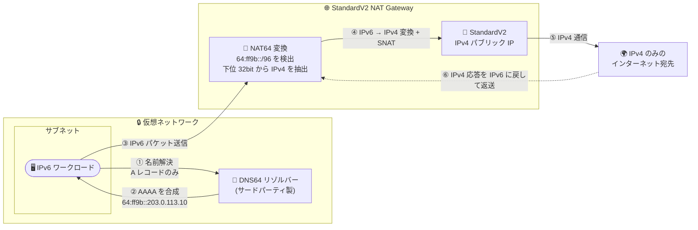

# Azure NAT Gateway: StandardV2 NAT Gateway で NAT64 が一般提供開始

**リリース日**: 2026-07-28

**サービス**: Azure NAT Gateway

**機能**: StandardV2 NAT Gateway における NAT64 (IPv6 から IPv4 へのアドレス・プロトコル変換)

**ステータス**: Launched (GA)

[このアップデートのインフォグラフィックを見る](https://takech9203.github.io/azure-news-summary/20260728-nat-gateway-v2-nat64.html)

## 概要

Azure StandardV2 NAT Gateway が NAT64 をサポートし、一般提供が開始された。NAT64 は、IPv6 ワークロードが IPv4 のみのインターネット宛先と通信できるようにする変換機能である。具体的には、Well-Known Prefix `64:ff9b::/96` (RFC 6052 で定義) 宛のアウトバウンド IPv6 トラフィックを NAT Gateway が検出し、埋め込まれた IPv4 アドレスを抽出して IPv4 トラフィックへ変換する。

NAT64 は StandardV2 SKU 専用の機能であり、従来の Standard NAT Gateway では利用できない。また、NAT64 単体では完結せず、**DNS64 対応のリゾルバーが別途必要**である。DNS64 は A (IPv4) レコードのみを持つドメインに対して AAAA (IPv6) レコードを合成する役割を担い、この合成アドレスが `64:ff9b::/96` プレフィックスを持つことで NAT Gateway による変換が発動する。Microsoft Learn のドキュメントでは、DNS64 についてはサードパーティ製ソリューションのデプロイが必要である旨が明記されている。

この機能により、IPv6 のみで構成されたワークロードが、デュアルスタック構成やカスタムの変換アプライアンスを用意せずに IPv4 のみのインターネット宛先に到達できるようになる。NAT64 を有効化するには、Azure Portal の StandardV2 NAT Gateway リソースの **Configuration** で **NAT64** を **Enabled** に設定するか、ARM / REST API でリソースの `nat64` プロパティを `Enabled` に設定する。変換後のアウトバウンド通信に使用するため、NAT Gateway には少なくとも 1 つの StandardV2 IPv4 パブリック IP アドレスがアタッチされている必要がある。

**アップデート前の課題**

- IPv6 のみのワークロードから IPv4 のみのインターネット宛先 (IPv6 未対応の外部 API、SaaS エンドポイント、パッケージリポジトリなど) に到達できなかった
- IPv4 宛先への到達性を確保するには、ワークロードをデュアルスタック構成にする必要があり、IPv4 アドレス空間の設計・管理コストが残り続けた
- デュアルスタックを避ける場合は、独自の NAT64 変換アプライアンスを仮想マシン上に構築・運用する必要があり、可用性・スケーラビリティ・保守の負担が発生していた
- Standard NAT Gateway は IPv6 パブリック IP をサポートしておらず、IPv6 アウトバウンドの選択肢自体が限られていた

**アップデート後の改善**

- StandardV2 NAT Gateway のマネージド機能として NAT64 変換が提供され、独自の変換アプライアンスが不要になった
- IPv6 のみのワークロードのまま IPv4 のみの宛先と通信できるため、デュアルスタック構成を必須としなくなった
- 有効化は Portal のトグル操作または `nat64` プロパティの設定のみで完了し、ルートテーブルの構成変更は不要
- StandardV2 NAT Gateway のゾーン冗長性・最大 100 Gbps のスループットといった基盤特性を、そのまま NAT64 変換にも適用できる

## アーキテクチャ図



この図は、IPv6 ワークロードが DNS64 リゾルバーで合成された `64:ff9b::/96` 宛の AAAA レコードを取得し、そのアドレスへ IPv6 パケットを送信すると、StandardV2 NAT Gateway が NAT64 変換と SNAT を行って IPv4 宛先に到達する流れを示している。IPv4 の応答パケットは NAT Gateway で IPv6 に再変換されてワークロードに返される。

## サービスアップデートの詳細

### 主要機能

1. **Well-Known Prefix `64:ff9b::/96` による IPv6 から IPv4 への変換**
   - RFC 6052 で定義された Well-Known Prefix 宛のアウトバウンド IPv6 トラフィックを NAT Gateway が識別する
   - アドレスの下位 32 ビットに埋め込まれた IPv4 アドレスを抽出し、IPv4 パケットへ変換する
   - 変換時には NAT Gateway に構成された StandardV2 IPv4 パブリック IP による SNAT が適用される
   - IPv4 の応答パケットは IPv6 に再変換され、元のクライアントに返される

2. **StandardV2 SKU 限定のマネージド機能**
   - NAT64 は StandardV2 NAT Gateway でのみ利用可能な変換機能で、Standard SKU では非サポート
   - デュアルスタック構成やカスタムの変換アプライアンスを用意する必要がない
   - StandardV2 のゾーン冗長性、最大 100 Gbps のスループット、フローログといった機能と併用できる

3. **簡潔な有効化オペレーション**
   - Azure Portal: StandardV2 NAT Gateway リソースの **Configuration** で **NAT64** を **Enabled** に設定して保存
   - ARM / REST API: NAT Gateway リソースの `nat64` プロパティを `Enabled` に設定
   - サブネットのルートテーブルへの追加設定は不要

4. **DNS64 との組み合わせによる動作**
   - NAT64 は DNS64 が合成した AAAA レコードを前提とする
   - DNS64 は A レコードのみを持つドメインに対して、IPv4 アドレスを `64:ff9b::/96` に埋め込んだ AAAA レコードを合成する
   - DNS64 が存在しない場合、IPv6 クライアントは IPv4 のみの宛先を NAT64 Well-Known Prefix に解決できず、NAT64 は機能しない

## 技術仕様

| 項目 | 詳細 |
|------|------|
| 対象 SKU | StandardV2 NAT Gateway のみ (Standard は非サポート) |
| 変換方式 | アウトバウンド IPv6 から IPv4 への変換 (NAT64) |
| 使用プレフィックス | Well-Known Prefix `64:ff9b::/96` (RFC 6052) |
| IPv4 アドレスの埋め込み位置 | IPv6 アドレスの下位 32 ビット |
| 有効化方法 | Portal の **Configuration** > **NAT64** = **Enabled**、または ARM / REST の `nat64` プロパティ = `Enabled` |
| 必須要件 | StandardV2 IPv4 パブリック IP を 1 つ以上アタッチ |
| DNS64 | 必須。サードパーティ製 DNS64 ソリューションのデプロイが必要 |
| ルーティング構成 | 追加のルートテーブル設定は不要 |
| インバウンド通信 | 非サポート (アウトバウンド起点の応答のみ変換して返送) |

### StandardV2 / Standard SKU 比較 (NAT64 関連の主な差分)

| 項目 | Standard | StandardV2 |
|------|----------|------------|
| NAT64 | 非サポート | サポート |
| パブリック IP のバージョン | IPv4 のみ | IPv4 / IPv6 |
| パブリック IP アドレス数 | IPv4 16 個 | IPv4 16 個、IPv6 16 個 |
| パブリック IP プレフィックス | IPv4 /28 | IPv4 /28、IPv6 /124 |
| 対応プロトコル | TCP、UDP | TCP、UDP、ICMP Echo Request / Reply |
| 可用性ゾーン | 非サポート (ゾーンリソース) | サポート (ゾーン冗長) |
| 帯域幅 | NAT Gateway あたり 50 Gbps | NAT Gateway あたり 100 Gbps、接続あたり 1 Gbps |
| パケット処理性能 | 500 万 pps | 1,000 万 pps、接続あたり 10 万 pps |
| 宛先ごと / IP ごとの接続数 | 50,000 | 50,000 |
| 合計接続数 | 200 万 | 200 万 |

## 設定方法

### 前提条件

1. StandardV2 SKU の NAT Gateway が作成済みであること (Standard SKU からのアップグレードは不可)
2. StandardV2 SKU の IPv4 パブリック IP アドレス (またはプレフィックス) が 1 つ以上 NAT Gateway にアタッチされていること
3. NAT Gateway をデプロイするリージョンが StandardV2 SKU をサポートしていること
4. IPv6 のみの宛先解決を IPv4 宛先へ橋渡しするための DNS64 対応リゾルバー (サードパーティ製ソリューション) がデプロイされ、ワークロードから利用可能であること

### Azure Portal

1. Azure Portal で対象の StandardV2 NAT Gateway リソースを開く
2. **Configuration** を選択する
3. **NAT64** を **Enabled** に設定する
4. **Save** を選択して保存する

### Azure CLI (StandardV2 NAT Gateway の作成)

NAT64 の有効化そのものは Portal または ARM / REST API から行う。前段の StandardV2 NAT Gateway とパブリック IP の作成は Azure CLI で実施できる。

```bash
# StandardV2 SKU の IPv4 パブリック IP を作成 (ゾーン冗長)
az network public-ip create \
    --resource-group test-rg \
    --name public-ip-nat \
    --location eastus \
    --sku StandardV2 \
    --allocation-method Static \
    --version IPv4 \
    --zone 1 2 3

# StandardV2 NAT Gateway を作成
az network nat gateway create \
    --resource-group test-rg \
    --name nat-gateway \
    --location eastus \
    --public-ip-addresses public-ip-nat \
    --idle-timeout 4 \
    --sku StandardV2

# サブネットに NAT Gateway を関連付け (既定のアウトバウンドアクセスは無効化)
az network vnet subnet update \
    --resource-group test-rg \
    --vnet-name vnet-1 \
    --name subnet-1 \
    --nat-gateway nat-gateway \
    --default-outbound false
```

> `az network nat gateway create` / `update` には NAT64 を設定するパラメーターは用意されていない (`--sku`、`--public-ip-addresses`、`--pip-addresses-v6`、`--pip-prefixes-v6`、`--idle-timeout`、`--zone` などが提供される)。NAT64 の有効化は Portal または ARM / REST API の `nat64` プロパティで行う。

## メリット

### ビジネス面

- IPv6 のみのワークロードのまま IPv4 宛先へ到達できるため、IPv6 移行プロジェクトを IPv4 依存の外部サービスに引きずられずに進められる
- 独自の NAT64 変換アプライアンスの構築・運用が不要になり、インフラ運用コストと保守負担を削減できる
- デュアルスタック構成の回避により、IPv4 アドレス空間の確保・設計・管理にかかるコストを抑制できる
- マネージドサービスとして提供されるため、変換レイヤーの可用性設計を Azure 側に委ねられる

### 技術面

- Well-Known Prefix `64:ff9b::/96` という標準 (RFC 6052) に準拠した変換方式のため、DNS64 実装との相互運用性が確保しやすい
- サブネットのルートテーブルへの追加構成が不要で、NAT Gateway を関連付けるだけで変換が適用される
- StandardV2 のゾーン冗長性により、単一ゾーン障害時も NAT64 変換を含むアウトバウンド接続が維持される
- 最大 100 Gbps のスループットと 1,000 万 pps のパケット処理性能を NAT64 変換にも活用できる
- パブリック IP ごとに 64,512 の SNAT ポートが提供され、変換後の IPv4 側でも SNAT ポート枯渇のリスクが低い
- StandardV2 のフローログと組み合わせることで、変換後のアウトバウンドトラフィックを可視化できる

## デメリット・制約事項

- **DNS64 が別途必要**: NAT64 単体では機能せず、AAAA レコードを合成するサードパーティ製 DNS64 ソリューションのデプロイが必要。この設計・運用コストは利用者側の負担となる
- **Azure CLI で NAT64 を設定できない**: `az network nat gateway create` / `update` に NAT64 用のパラメーターがなく、Portal または ARM / REST API の `nat64` プロパティで有効化する必要がある
- **StandardV2 SKU 限定**: Standard NAT Gateway では NAT64 を利用できない。Standard から StandardV2 への直接アップグレードは不可で、StandardV2 NAT Gateway を新規作成してサブネット上の Standard NAT Gateway を置き換える必要がある
- **StandardV2 パブリック IP が必須**: Standard / Basic のパブリック IP は StandardV2 NAT Gateway と併用できず、StandardV2 パブリック IP への再 IP が必要
- **カスタム IP プレフィックス (BYOIP) 非サポート**: StandardV2 SKU では Azure が提供する StandardV2 パブリック IP のみ利用可能
- **変換用の IPv4 パブリック IP が必須**: NAT64 の変換出力に使用するため、StandardV2 IPv4 パブリック IP を少なくとも 1 つアタッチする必要がある
- **未サポートリージョンがある**: Canada East、India South Central、Israel Northwest、Sweden South、West India では StandardV2 NAT Gateway 自体が利用できない
- **既知の問題 (IPv6 とロードバランサーの併用)**: StandardV2 NAT Gateway をサブネットに関連付けると、ロードバランサーのアウトバウンドルールによる IPv6 アウトバウンド接続が中断される
- **既知の問題 (既存アウトバウンド経路の中断)**: ロードバランサー、Azure Firewall、VM のインスタンスレベルパブリック IP を利用したアウトバウンド接続が、StandardV2 NAT Gateway の追加時に中断される可能性がある (新規接続はすべて StandardV2 NAT Gateway を経由する)
- **インバウンド通信は非サポート**: NAT Gateway はアウトバウンド起点の接続に対する応答パケットのみを通過させる。IPv4 側から IPv6 ワークロードへの接続開始 (DNAT / NAT46 的な用途) はできない
- **IP フラグメンテーション非対応**: Azure NAT Gateway は IP フラグメンテーションをサポートしない
- **パブリック IP の構成制約**: ルーティング設定が **Internet** のパブリック IP、および DDoS Protection が有効なパブリック IP は NAT Gateway で利用できない

## ユースケース

### ユースケース 1: IPv6 のみのワークロードから IPv4 のみの外部 API への接続

**シナリオ**: IPv6 シングルスタックで設計した新規サービスが、IPv6 未対応のパートナー API や SaaS エンドポイントを呼び出す必要がある。デュアルスタック化による IPv4 アドレス管理は避けたい。

**実装例**:

```bash
# StandardV2 NAT Gateway に IPv4 / IPv6 の StandardV2 パブリック IP を構成
az network public-ip create \
    --resource-group ipv6-workload-rg \
    --name nat-pip-v4 \
    --location eastus \
    --sku StandardV2 \
    --allocation-method Static \
    --version IPv4 \
    --zone 1 2 3

az network public-ip create \
    --resource-group ipv6-workload-rg \
    --name nat-pip-v6 \
    --location eastus \
    --sku StandardV2 \
    --allocation-method Static \
    --version IPv6 \
    --zone 1 2 3

az network nat gateway create \
    --resource-group ipv6-workload-rg \
    --name ipv6-nat-gateway \
    --location eastus \
    --public-ip-addresses nat-pip-v4 \
    --pip-addresses-v6 nat-pip-v6 \
    --idle-timeout 4 \
    --sku StandardV2

# この後、Portal の Configuration または ARM / REST の nat64 プロパティで NAT64 を Enabled にする
```

**効果**: DNS64 リゾルバーが IPv4 のみの API ホスト名に対して `64:ff9b::/96` の AAAA レコードを合成し、ワークロードは IPv6 通信のまま API を呼び出せる。NAT Gateway が IPv4 へ変換するため、アプリケーション側の IPv6 シングルスタック設計を維持できる。

### ユースケース 2: IPv6 移行の段階的な推進

**シナリオ**: IPv4 アドレスの枯渇と管理負荷を背景に IPv6 への移行を進めているが、依存する外部サービスの一部が IPv6 に未対応で、全面的な IPv6 化の障壁となっている。

**実装例**:

1. 新規ワークロードのサブネットに StandardV2 NAT Gateway を関連付ける
2. NAT Gateway に StandardV2 の IPv4 / IPv6 パブリック IP を構成する
3. Portal の **Configuration** で **NAT64** を **Enabled** にする
4. DNS64 リゾルバーをデプロイし、ワークロードの DNS 参照先に設定する
5. IPv6 対応済みの宛先は素の IPv6 で、未対応の宛先は NAT64 経由で到達させる

**効果**: 外部サービスの IPv6 対応状況にかかわらず新規ワークロードを IPv6 シングルスタックで構築でき、IPv6 移行を外部依存から切り離して進められる。宛先が IPv6 対応した際は DNS64 が本来の AAAA レコードを返すため、NAT64 を経由しない経路へ自然に移行する。

### ユースケース 3: 独自 NAT64 アプライアンスの置き換え

**シナリオ**: 仮想マシン上に構築した NAT64 変換アプライアンスを運用しているが、可用性確保のための冗長構成、スケールアウト、OS / ソフトウェアの保守が負担になっている。

**実装例**:

```bash
# 既存サブネットに StandardV2 NAT Gateway を関連付ける
az network vnet subnet update \
    --resource-group migration-rg \
    --vnet-name migration-vnet \
    --name app-subnet \
    --nat-gateway standardv2-nat-gateway

# Portal の Configuration で NAT64 を Enabled にした後、
# 独自アプライアンスへの UDR を削除して NAT Gateway 経由に切り替える
az network route-table route delete \
    --resource-group migration-rg \
    --route-table-name app-subnet-rt \
    --name to-nat64-appliance
```

**効果**: 変換レイヤーがマネージドサービスに置き換わり、ゾーン冗長性と最大 100 Gbps のスループットを追加の設計なしで得られる。アプライアンスの冗長化・パッチ適用・キャパシティ管理といった運用作業が不要になる。

## 料金

NAT64 の利用による追加料金は Microsoft Learn および料金ページ上で示されていない。また、Standard SKU と StandardV2 SKU の NAT Gateway は同一料金であることが公式に明記されている。

| 項目 | 料金 |
|------|------|
| NAT Gateway リソース時間 | リソースがデプロイされている時間に基づく課金。リソース作成時点から課金が開始され、サブネットやパブリック IP が未アタッチでも課金される。1 時間未満は 1 時間として課金 |
| データ処理 | NAT Gateway を経由して処理されたデータ量 (アウトバウンドおよび応答トラフィック) に基づく課金 |
| StandardV2 フローログ | `NatGatewayFlowlogsV1` ログカテゴリに対する月額固定料金 (診断設定が有効な時間で按分) |

NAT64 で変換されたトラフィックも通常のデータ処理として課金されるものと考えられる。なお、NAT Gateway のデータ処理料金とは別に、Azure の帯域幅 (データ転送) 料金が発生する。

StandardV2 パブリック IP アドレスの料金は別途発生する。NAT Gateway 自体に無料枠は設定されていない。

具体的な単価はリージョン・通貨により異なるため、[Azure NAT Gateway の料金ページ](https://azure.microsoft.com/pricing/details/azure-nat-gateway/) および Azure 料金計算ツールで確認されたい。

## 利用可能リージョン

NAT64 は StandardV2 NAT Gateway の機能であるため、StandardV2 SKU が利用可能なリージョンで提供される。以下のリージョンでは StandardV2 NAT Gateway 自体が未サポートのため、NAT64 も利用できない:

- Canada East
- India South Central
- Israel Northwest
- Sweden South
- West India

## 関連サービス・機能

- **Azure NAT Gateway (Standard SKU)**: 従来の SKU。NAT64 および IPv6 パブリック IP は非サポート。NAT64 を利用するには StandardV2 NAT Gateway への移行 (新規作成と置き換え) が必要
- **Azure Virtual Network**: NAT Gateway を関連付けるサブネットの基盤サービス。2026 年 3 月 31 日以降、新規仮想ネットワークは既定でプライベートサブネットとなり、既定のアウトバウンドアクセスが提供されないため、NAT Gateway のような明示的なアウトバウンド手段が必要
- **Azure Public IP (StandardV2 SKU)**: StandardV2 NAT Gateway が要求するパブリック IP SKU。NAT64 の変換出力には StandardV2 の IPv4 パブリック IP が必須
- **Azure Load Balancer**: アウトバウンドルールによる IPv6 アウトバウンドは StandardV2 NAT Gateway と併用すると中断される既知の問題がある。IPv4 / IPv6 双方のアウトバウンドが必要な場合は構成の選択に注意が必要
- **Azure Monitor / StandardV2 フローログ**: StandardV2 NAT Gateway のフローログにより、NAT64 変換を含むアウトバウンドトラフィックを可視化・分析できる
- **Azure Kubernetes Service (AKS)**: StandardV2 NAT Gateway をユーザー割り当て NAT Gateway として利用可能 (マネージド NAT Gateway としての利用はプレビュー)。IPv6 クラスターのアウトバウンド設計で NAT64 との組み合わせが検討対象になる
- **Azure Firewall**: サブネットに StandardV2 NAT Gateway を追加すると、Azure Firewall 経由の既存アウトバウンド接続が中断される可能性があるため、経路設計の確認が必要

## 参考リンク

- [インフォグラフィック](https://takech9203.github.io/azure-news-summary/20260728-nat-gateway-v2-nat64.html)
- [公式アップデート情報](https://azure.microsoft.com/updates?id=568409)
- [Microsoft Learn - Azure NAT Gateway とは](https://learn.microsoft.com/azure/nat-gateway/nat-overview)
- [Microsoft Learn - NAT Gateway リソース (NAT64 の動作と有効化)](https://learn.microsoft.com/azure/nat-gateway/nat-gateway-resource)
- [Microsoft Learn - Azure NAT Gateway の SKU](https://learn.microsoft.com/azure/nat-gateway/nat-sku)
- [Microsoft Learn - StandardV2 NAT Gateway の作成](https://learn.microsoft.com/azure/nat-gateway/quickstart-create-nat-gateway-v2)
- [Microsoft Learn - az network nat gateway コマンドリファレンス](https://learn.microsoft.com/cli/azure/network/nat/gateway)
- [RFC 6052 - IPv4/IPv6 トランスレーター用の IPv6 アドレス表記](https://www.rfc-editor.org/info/rfc6052/)
- [Azure NAT Gateway 料金ページ](https://azure.microsoft.com/pricing/details/azure-nat-gateway/)

## まとめ

StandardV2 NAT Gateway における NAT64 の一般提供は、IPv6 移行を進める組織にとって実務上のボトルネックを解消するアップデートである。従来、IPv6 のみのワークロードが IPv4 のみの宛先に到達するにはデュアルスタック化か独自の変換アプライアンスが必要だったが、本機能により Azure のマネージドサービスとして変換レイヤーを利用でき、ゾーン冗長性や最大 100 Gbps のスループットといった StandardV2 の基盤特性もそのまま享受できる。

一方で、NAT64 は DNS64 との組み合わせを前提とした機能であり、DNS64 についてはサードパーティ製ソリューションのデプロイが必要である点が最大の設計上の考慮事項となる。NAT64 を有効にしただけでは IPv4 宛先への到達性は得られないため、DNS64 の可用性・スコープ (どのワークロードにどのリゾルバーを参照させるか)・運用主体をあわせて設計する必要がある。

Solutions Architect への推奨アクションとして、まず IPv6 シングルスタックを志向する新規ワークロードにおいて、DNS64 ソリューションの選定と PoC を先行させることを推奨する。既に StandardV2 NAT Gateway を運用している環境では、Portal の **Configuration** から NAT64 を有効化するだけで検証を開始できる。Standard NAT Gateway を利用中の環境では、直接アップグレードができず StandardV2 パブリック IP への再 IP も伴うため、移行計画の策定が前提となる。加えて、ロードバランサーのアウトバウンドルールによる IPv6 通信の中断や、既存の Azure Firewall / インスタンスレベルパブリック IP 経由のアウトバウンド接続への影響が既知の問題として挙げられているため、サブネット単位の既存アウトバウンド経路を棚卸ししてから導入することを推奨する。

---

**タグ**: #Azure #NATGateway #StandardV2 #NAT64 #DNS64 #IPv6 #Networking #GA
