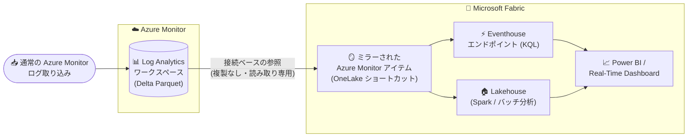

# Azure Monitor: Azure Monitor Logs の Microsoft Fabric ミラーリング (Public Preview)

**リリース日**: 2026-07-29

**サービス**: Azure Monitor / Microsoft Fabric

**機能**: Azure Monitor Logs mirroring into Microsoft Fabric

**ステータス**: In preview

[このアップデートのインフォグラフィックを見る](https://takech9203.github.io/azure-news-summary/20260729-azure-monitor-logs-fabric-mirroring.html)

## 概要

Azure Monitor の Log Analytics ワークスペースに蓄積されたテレメトリ (ログ) データを、Microsoft Fabric にミラーリングする機能がパブリックプレビューになりました。これにより、可観測性 (Observability) データがオープンフォーマットである Delta Parquet 形式で OneLake から利用可能になります。データの複製は行われず、ほぼリアルタイムで Fabric 側から参照できます。

この「Mirror Azure Monitor」機能は、SQL や Snowflake などの他の Fabric ミラーリング (レプリケーション型) とは異なり、**接続 (Connection) ベース** のミラーリングです。データは Log Analytics のストレージに留まったまま、Fabric のミラーアイテムが Azure Monitor と同じ Delta Lake ストレージを OneLake ショートカット経由で参照します。同期パイプラインは実行されず、データの重複もありません。

Fabric 上では、運用テレメトリを ERP/CRM などのビジネスデータと組み合わせて、クロスドメイン分析、Power BI レポート、リアルタイムインテリジェンス、データエンジニアリング、エージェント (AI) シナリオに活用できます。

**アップデート前の課題**

- Log Analytics のデータを Azure Monitor の外部で利用するには、エクスポートパイプラインの構築、宛先ストアの用意、重複ストレージのコスト負担が必要だった
- 運用テレメトリとビジネスデータがサイロ化しており、インシデントのビジネス影響 (収益への影響など) をリアルタイムに関連付けて分析することが困難だった

**アップデート後の改善**

- レプリケーション・取り込みパイプライン・重複ストレージが不要になり、データは Azure Monitor に留まったまま Fabric から参照できる
- Fabric でのデータ可用性のレイテンシは Azure Monitor のレイテンシと同等で、更新は数分以内に Fabric に反映される
- テレメトリが OneLake 上でビジネスデータの隣に配置され、結合・集計がすぐに実行できる
- 既存の Azure Monitor の保持期間・ライフサイクルポリシーがそのままデータに適用され続ける

## アーキテクチャ図



Log Analytics ワークスペースのテーブルは内部的に Delta Parquet として書き込まれ、Fabric のミラーアイテムが OneLake ショートカットでそのストレージを直接参照します。データのコピーは発生せず、Eventhouse (リアルタイム分析) と Lakehouse (バッチ分析) の両方の経路から同一データにアクセスできます。

## サービスアップデートの詳細

### 主要機能

1. **複製なしのデータ共有 (接続ベースのミラーリング)**
   - Log Analytics ワークスペースの全テーブルが内部的に Delta Parquet ファイルとして書き込まれ、Fabric はエクスポートなしにこのデータへアクセスできる
   - ミラーアイテムはショートカットのメタデータのみを保持し、ストレージ自体は Azure Monitor 側に残る
   - Fabric からは読み取り専用。新しいデータは通常の Azure Monitor 取り込み経由で到着し続ける

2. **Eventhouse エンドポイント (リアルタイム分析)**
   - ミラーアイテムの作成時に Fabric Eventhouse エンドポイントが自動作成され、選択した Log Analytics テーブルが Delta Lake テーブルとして接続される
   - KQL クエリ、Real-Time Dashboard、異常検知、Activator アラートルールが利用可能
   - 既存の Eventhouse に OneLake ショートカットを追加し、ビジネスデータと結合するクロスドメイン分析も可能 (クエリアクセラレーションによる高速化に対応)

3. **Lakehouse への OneLake ショートカット (バッチ分析)**
   - Lakehouse からのショートカットにより、Spark ノートブック実行、Power BI セマンティックモデル構築、テレメトリを変換するパイプラインのスケジュールが可能

4. **テーブル単位の選択とマルチアイテム構成**
   - ミラーアイテム作成時にミラー対象テーブルを選択 (例: `AppRequests`、`AppDependencies`、`AppExceptions`、`Heartbeat`、カスタムログテーブル)
   - 後から「Edit data selection」でテーブルの追加・削除が可能 (基盤データの再ロードは不要)

5. **AI コーディングエージェント向けの Skills for Fabric 対応**
   - [Mirror Azure Monitor skill](https://github.com/microsoft/skills-for-fabric/blob/main/skills/azmon-mirroredcatalogs-operations-cli/SKILL.md) を使用して、AI エージェントによるエンドツーエンドのオンボーディングが可能

## 技術仕様

| 項目 | 詳細 |
|------|------|
| ミラーリング方式 | 接続 (Connection) ベース。レプリケーション・同期パイプラインなし |
| データ形式 | Delta Parquet (オープンフォーマット、Delta Lake テーブルとして公開) |
| アクセス経路 | Eventhouse エンドポイント / Eventhouse への DB ショートカット / Lakehouse への OneLake ショートカット |
| データの向き | Fabric からは読み取り専用 (書き戻し不可) |
| レイテンシ | Azure Monitor のレイテンシと同等 (数分以内に反映)。初期セットアップ時はテーブル表示まで約 15 分 |
| テーブル数上限 | 1 ミラーアイテムあたり約 500 テーブル (プレビュー中のソフトリミット)。超える場合は複数アイテムに分割 |
| 履歴データ | プレビュー中はバックフィルなし (ミラー開始後の新規データのみ) |
| 認証モード | ワークスペース ID (同一テナント・本番推奨) / サービスプリンシパル (クロステナント) / 組織アカウント OAuth (対話的利用向け) |
| 接続作成に必要な権限 | ソース Log Analytics ワークスペースに対する `Microsoft.Authorization/roleAssignments/write` アクション (Owner、User Access Administrator、RBAC Administrator ロールに含まれる) |
| 利用不可の列 | `_ResourceId`、`_SubscriptionId`、`Type` システム列はプレビュー中は含まれない |

## 設定方法

### 前提条件

1. 公開するテーブルを持つ既存の Log Analytics ワークスペース
2. Log Analytics ワークスペースに対する `Microsoft.Authorization/roleAssignments/write` アクション (接続作成時のみ。既存接続の再利用なら Fabric ワークスペースへのアクセスのみで可)
3. 既存の Fabric 容量 (Capacity) と Fabric ワークスペース (*My workspace* は不可)
4. テナント設定で **Mirrored catalog item** が有効化されていること (Fabric 管理ポータル > テナント設定でテナント管理者が有効化)
5. クロステナントの場合: Log Analytics テナント側のサービスプリンシパル (テナント ID / クライアント ID / クライアントシークレット)

### Fabric ポータルでの手順

1. Microsoft Fabric にサインインし、対象ワークスペースを開く
2. **+ New item** から **Mirrored Azure Monitor** カードを選択
3. 新規接続を作成 (認証種別: OAuth 2.0 / Workspace identity / Service principal) し、Log Analytics の **ワークスペース ID** (Azure ポータルの Overview ページで確認できる GUID) を入力
4. ミラーするテーブルを選択 (プレビュー中は最近ストリーミングデータを受信したテーブルのみ一覧に表示。不足分は後から追加可能)
5. 内容を確認して **Create** を選択。アイテム自体は 1 分以内に作成され、テーブルがクエリ可能になるまで約 15 分かかる

### Eventhouse での KQL クエリ例

```kusto
AppRequests
| where TimeGenerated > ago(1h)
| summarize count() by ResultCode, bin(TimeGenerated, 5m)
| render timechart
```

## メリット

### ビジネス面

- IT シグナルを孤立したアラートではなく、ビジネスコンテキスト付きで評価できる (誰が・何が影響を受け、どれだけのコストが発生しているか)
- 1 つのインシデントから、同一ワークフロー内で複数チーム向けの複数のアクションを駆動できる
- エクスポートパイプラインの構築・運用コストと重複ストレージコストを削減できる

### 技術面

- ストレージが重複しないため、追加のストレージ課金がどちら側にも発生しない
- Eventhouse / Lakehouse ショートカット経由のクエリは Fabric 容量を消費するため、大量分析での Azure Monitor クエリコストを削減できる可能性がある
- Delta Parquet というオープンフォーマットにより、Spark、Power BI (Direct Lake を含む Fabric エクスペリエンス)、KQL など多様なツールから同一データを利用できる
- Azure Monitor 側の保持・ライフサイクルポリシーがそのまま適用され、二重管理が不要

## デメリット・制約事項 (パブリックプレビュー中)

- **履歴データのバックフィルなし**: ミラー設定前にワークスペースへ到着したデータは Fabric に表示されない
- **テーブル数の上限**: 1 アイテムあたり約 500 テーブル (ソフトリミット)
- **セキュリティモデルの分離**: Azure RBAC と Fabric のアクセス許可は独立しており、相関しない。Log Analytics のテーブルレベル保護や行/列レベルのセキュリティはミラーアイテムに引き継がれない。Azure 側でテーブルへのアクセスを拒否されたユーザーでも、Fabric ワークスペースの権限があればミラーアイテム経由で読み取れるため、公開前にアクセスレビューが必要
- **プレビュー中は接続ワークスペースの全テーブルが利用可能**: Azure Monitor のテーブルレベル保護設定に関わらずアクセスできる点に注意
- **認証ライフサイクル**: 組織アカウント (OAuth) で作成したアイテムは、作成ユーザーがテナントを離れたりアクセスを失うと動作しなくなる。本番ではワークスペース ID またはサービスプリンシパルを推奨
- **データ削除 (パージ) は 2 段階**: Azure Monitor 側の data purge API と OneLake 側の Lake Data Purge API の両方の操作が必要 (片方のパージではもう片方は消えない)
- **一部システム列が利用不可**: `_ResourceId`、`_SubscriptionId`、`Type` はミラーテーブルに含まれない
- **クロスリージョンの読み取り**: 動作するがネットワーク下り (egress) コストが発生する可能性がある
- **Share アクションに既知の問題**: プレビュー中は Share ではなく OneLake セキュリティで細かなアクセス制御を行う

## ユースケース

### ユースケース 1: ユーザー体験と収益の相関分析

**シナリオ**: Application Insights の `AppRequests` を注文テーブルと結合し、リクエストのレイテンシや失敗を注文完了率と関連付ける。エラーの急増を「孤立した IT メトリック」ではなく「完了注文数の低下」として可視化する。

**実装例**:

```kusto
let orders = externaldata(OrderId:string, OrderTimestamp:datetime, OrderValue:real)
  [@'<shortcut to business orders table>'];
AppRequests
| where TimeGenerated > ago(24h)
| project TimeGenerated, RequestId = OperationId, DurationMs = DurationMs
| join kind=inner (orders) on $left.RequestId == $right.OrderId
| summarize AvgDuration = avg(DurationMs), TotalValue = sum(OrderValue)
  by bin(TimeGenerated, 1h)
```

**効果**: インシデントのビジネス影響が拡大する前に、適切な対応をトリガーできる。

### ユースケース 2: 利用量とコストの関連付け

**シナリオ**: コンピュートの利用テレメトリを課金・コストデータと結合し、実際の消費に対する支出を分析する。

**効果**: テレメトリを別の分析ストアに移動することなく、運用シグナルとビジネスレコードをリアルタイムに横断分析できる。

### ユースケース 3: リアルタイムダッシュボードとアラート

**シナリオ**: Eventhouse 上の KQL クエリ結果を Real-Time Dashboard のタイルとして保存し、Activator アラートルール (例: 5 分間の失敗リクエスト数がしきい値超過) でメールや Teams に通知する。

**効果**: 可観測性データに対する Fabric ネイティブのリアルタイム監視・通知フローを構築できる。

## 料金

ミラーリング自体による追加のストレージコストやパイプラインコストは発生しません。コストモデルは 2 つのサービスの自然な境界で分かれます。

| 項目 | 課金 |
|------|------|
| ログの取り込み・保持 | 従来どおり Azure Monitor 側で課金 |
| Azure Monitor 内のクエリ (Log Analytics UI、API 経由の KQL、アラートルール) | 従来どおり Azure Monitor のクエリコンピュートを使用 |
| Fabric 内のクエリ・処理 (Eventhouse クエリ、Spark ノートブック、Power BI セマンティックモデル更新など) | Fabric 容量 (Capacity) を消費 |
| ストレージ | 重複しないため、どちら側にも追加ストレージ課金なし |

なお、プレビュー中のため課金は GA までに変更される可能性があります。詳細は以下を参照してください。

- [Microsoft Fabric の料金](https://azure.microsoft.com/pricing/details/microsoft-fabric/)
- [Azure Monitor の料金](https://azure.microsoft.com/pricing/details/monitor/)

## 利用可能リージョン

サポートされるすべての Microsoft Fabric リージョン (Azure リージョンのサブセット) で利用可能です。最新のリストは [Microsoft Fabric region availability](https://learn.microsoft.com/fabric/admin/region-availability) を参照してください。クロスリージョンの読み取りは動作しますが、ネットワーク下りコストが発生する可能性があります。

## 関連サービス・機能

- **Azure Monitor / Log Analytics ワークスペース**: ミラーリングのソース。データの保存・取り込み・保持ポリシーは引き続き Azure Monitor 側で管理される
- **Microsoft Fabric OneLake**: ミラーテーブルへの参照 (ショートカット) を保持する統合データレイク。Delta Parquet 形式でデータを公開
- **Fabric Eventhouse / Real-Time Intelligence**: ミラーデータに対する KQL クエリ、Real-Time Dashboard、Activator アラートの実行基盤
- **Fabric Lakehouse**: Spark ノートブック、Power BI セマンティックモデル、バッチパイプラインによるミラーデータの活用
- **Microsoft Sentinel**: Log Analytics ワークスペースを利用するサービスの一例。ワークスペース内のデータが分析対象になり得る
- **Fabric Mirroring (Database / Metadata / Open mirroring)**: Fabric の他のミラーリング方式。Azure Monitor ミラーリングはメタデータ (カタログ) ミラーリングと同様に、複製ではなくショートカット参照ベース

## 参考リンク

- [インフォグラフィック](https://takech9203.github.io/azure-news-summary/20260729-azure-monitor-logs-fabric-mirroring.html)
- [公式アップデート情報](https://azure.microsoft.com/updates?id=568322)
- [Mirror Azure Monitor Data in Microsoft Fabric (Preview) - Microsoft Learn](https://learn.microsoft.com/fabric/mirroring/catalog-mirroring/azure-monitor)
- [Tutorial: Configure the Mirror Azure Monitor Solution in Fabric (Preview) - Microsoft Learn](https://learn.microsoft.com/fabric/mirroring/catalog-mirroring/azure-monitor-tutorial)
- [Mirroring - Microsoft Fabric - Microsoft Learn](https://learn.microsoft.com/fabric/mirroring/overview)
- [Log Analytics workspace overview - Microsoft Learn](https://learn.microsoft.com/azure/azure-monitor/logs/log-analytics-workspace-overview)
- [Microsoft Fabric の料金](https://azure.microsoft.com/pricing/details/microsoft-fabric/)
- [Azure Monitor の料金](https://azure.microsoft.com/pricing/details/monitor/)

## まとめ

Azure Monitor Logs の Microsoft Fabric ミラーリングは、可観測性データの活用における「エクスポートパイプライン + 重複ストレージ」という従来の課題を、接続ベースの参照モデルで解消するアップデートです。テレメトリが OneLake 上で Delta Parquet としてビジネスデータの隣に置かれることで、IT シグナルと収益・注文などのビジネス指標をリアルタイムに関連付ける分析が現実的になります。

Solutions Architect としては、(1) Azure RBAC と Fabric 権限が独立しておりテーブルレベル保護が引き継がれない点のセキュリティレビュー、(2) 履歴データのバックフィルがないため早期にミラーを開始する判断、(3) 本番ではワークスペース ID またはサービスプリンシパル認証を選択する点、の 3 点を押さえた上で PoC を始めることを推奨します。パブリックプレビューのため、機能・権限・課金は GA までに変更される可能性があります。

---

**タグ**: Azure Monitor, Log Analytics, Microsoft Fabric, OneLake, Delta Parquet, Eventhouse, Mirroring, Observability, In preview, DevOps, Management and governance
