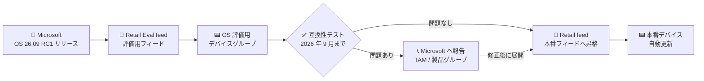

# Azure Sphere: OS version 26.09 が評価用に提供開始 (GA)

**リリース日**: 2026-07-29

**サービス**: Azure Sphere

**機能**: Azure Sphere OS version 26.09 (Retail Eval feed での評価提供)

**ステータス**: Launched (GA)

[このアップデートのインフォグラフィックを見る](https://takech9203.github.io/azure-news-summary/20260729-azure-sphere-os-26-09.html)

## 概要

Azure Sphere OS version 26.09 RC1 が Retail Eval feed で評価用に利用可能になりました。本リリースには顧客向けの機能変更 (customer-facing changes) は含まれていませんが、長期的なサポートとセキュリティへの取り組みの一環として、Azure Sphere の基盤となる Linux カーネルのメジャーバージョンアップが含まれています。

Microsoft は 6 か月以上にわたる統合テスト・回帰テストを実施済みで、契約対象のインターフェース (ABI) に影響がないよう対策済みとしていますが、カーネルの大幅な更新であることから、通常より延長された評価期間 (2026 年 9 月まで) が設定されています。評価期間終了後、26.09 は昇格され、Retail feed のデバイスへ広く展開される予定です。

**アップデート前の課題**

- Azure Sphere OS の基盤となる Linux カーネルが旧バージョンのままであり、長期的なサポート・セキュリティ維持の観点で更新が必要だった

**アップデート後の改善**

- Linux カーネルのメジャーバージョンアップにより、長期的なサポートとセキュリティ維持の基盤が強化された
- 通常より長い評価期間 (2026 年 9 月まで) が確保され、市場投入済みアプリケーションの互換性を十分にテストできる

## アーキテクチャ図



Retail Eval feed で先行評価を行い、問題がなければ Retail feed へ昇格して全デバイスに展開される流れです。今回は Linux カーネルのメジャー更新のため、評価期間が通常 (2 週間) より延長されています。

## サービスアップデートの詳細

### 主要なポイント

1. **Linux カーネルのメジャーバージョンアップ**
   - Azure Sphere OS の基盤となる Linux カーネルバージョンの大幅な更新 (具体的なバージョン番号は公式アナウンスに記載なし)
   - 長期的なサポートとセキュリティ維持への取り組みの一環

2. **顧客向け機能変更なし**
   - 本リリースに customer-facing changes は含まれない
   - Microsoft は 6 か月以上の統合・回帰テストを実施済みで、契約対象のインターフェースに影響がないよう対策済み

3. **延長された評価期間**
   - 評価期間は 2026 年 9 月まで (通常の Retail Eval は Retail 展開の 2 週間前)
   - 評価期間終了後、Retail feed のデバイスへ広く展開予定

### 推奨アクション

- 市場投入済みのアプリケーションを Retail Eval feed 上の 26.09 で評価すること
- 互換性の問題を発見した場合は、Retail feed への展開前に Azure Sphere 製品グループ (または Microsoft Technical Account Manager) へ早期に報告すること

## 設定方法 (Retail Eval feed での評価)

既存のデバイスグループが受信する OS フィードを Retail Eval に変更するには、Azure CLI (azure-sphere 拡張) を使用します。

```bash
# デバイスグループの OS フィードを RetailEval に変更
az sphere device-group update --product <product-name> --device-group <device-group-name> --os-feed RetailEval

# デバイスを評価用デバイスグループに割り当て
az sphere device assign --resource-group MyResourceGroup --catalog MyCatalog --target-product MyProduct --target-device-group MyEvalDeviceGroup --device <DeviceIdValue>

# インストールされている OS バージョンの確認
az sphere device show-os-version
```

## 関連サービス・機能

- **Azure Sphere Security Service (AS3)**: OS アップデートはクラウドからインターネット接続済みデバイスへ自動配信される
- **Azure IoT Hub**: Azure Sphere デバイスの主要な接続先。OS 更新後もアプリケーションの接続に影響がないか評価対象となる

## 参考リンク

- [インフォグラフィック](https://takech9203.github.io/azure-news-summary/20260729-azure-sphere-os-26-09.html)
- [公式アップデート情報](https://azure.microsoft.com/updates?id=568466)
- [Set up a device group for OS evaluation (Microsoft Learn)](https://learn.microsoft.com/en-us/azure-sphere/deployment/set-up-evaluation-device-group)
- [What's new - Azure Sphere (Microsoft Learn)](https://learn.microsoft.com/en-us/azure-sphere/product-overview/whats-new)

## まとめ

Azure Sphere OS 26.09 RC1 は、顧客向け機能変更を含まないものの、基盤となる Linux カーネルのメジャーバージョンアップという重要な更新です。Retail feed への展開は評価期間 (2026 年 9 月まで) の後に行われるため、Azure Sphere デバイスを本番運用しているチームは、この延長された評価期間を活用し、Retail Eval feed 上で市場投入済みアプリケーションの互換性テストを実施することを強く推奨します。問題を発見した場合は、Retail 展開前に Microsoft へ報告してください。

---

**タグ**: Azure Sphere, Internet of Things, Operating System, Launched
