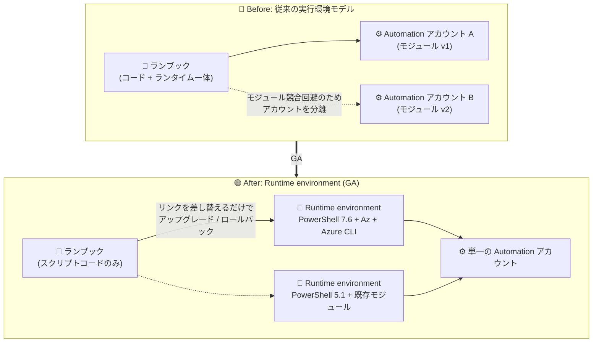

# Azure Automation: PowerShell 7.6 ランブックと Runtime environment の一般提供開始 (GA)

**リリース日**: 2026-07-30

**サービス**: Azure Automation

**機能**: PowerShell 7.6 ランブックのサポートと Runtime environment の GA

**ステータス**: Launched (GA)

[このアップデートのインフォグラフィックを見る](https://takech9203.github.io/azure-news-summary/20260730-automation-powershell-7-6-runtime-environment.html)

## 概要

Azure Automation において、以下の 3 点が一般提供 (GA) となりました。

1. **PowerShell 7.6 ランブックの GA**: サポート対象 (in-support) の PowerShell 7.6 でランブックを実行できるようになりました
2. **Runtime environment の GA**: ジョブ実行環境 (言語・ランタイムバージョン・パッケージ) をランブックのコードから分離して管理する新しい実行環境モデルが GA となり、古いスクリプトをサポート対象のランタイムバージョンへシームレスにアップグレードできるようになりました
3. **PowerShell 7.6 ランブックでの Azure CLI コマンドサポートの GA**: PowerShell ランブック内で Azure CLI コマンドを利用できます

Azure Automation は PowerShell / Python の親製品のサポートライフサイクルに準拠しており、PowerShell 7.1 / 7.2 や Python 2.7 / 3.8 といった既にサポート終了となったバージョンで動作するランブックは、機能追加・セキュリティ更新・性能最適化の対象外となる縮小サポート状態で動作します。今回の GA により、最新のサポート対象バージョンへの移行パスが正式に提供されました。

**アップデート前の課題**

- ランブックのランタイムバージョンやモジュールはコードと一体で管理されており、実行環境だけを差し替えて新しい言語バージョンへ移行することが難しかった
- モジュールバージョンの競合を避けるために、複数の Automation アカウントを作成してバージョンごとに分離する必要があった
- PowerShell 7.1 / 7.2 など親製品でサポート終了となったバージョンのランブックが、サポート対象バージョンへ容易にアップグレードできなかった

**アップデート後の改善**

- **最新化 (Stay current)**: 新しい言語バージョン (PowerShell 7.6) を利用でき、セキュリティと性能が向上
- **迅速なランブックアップグレード**: Runtime environment を差し替えるだけで、PowerShell / Python のリリースに追随してランブックを異なるバージョンへ容易に移行可能
- **きめ細かな制御**: モジュールバージョンの競合を気にせず、スクリプト実行環境 (言語・バージョン・パッケージ) を完全に制御可能
- **効率的なコード整理**: モジュールバージョンの分離のために複数の Automation アカウントを作成する必要がなくなった

## アーキテクチャ図

従来はランブックとランタイム・モジュールが密結合でしたが、Runtime environment の GA により、コードと実行環境を独立して管理し、リンクの差し替えだけでランタイムバージョンをアップグレード・ロールバックできるようになりました。

## サービスアップデートの詳細

### 主要機能

1. **PowerShell 7.6 ランブック (GA)**
   - 親製品 PowerShell でサポート対象 (in-support) の 7.6 バージョンでランブックを実行可能
   - サポート終了済みの PowerShell 7.1 / 7.2 ランブックからの移行先として利用できる

2. **Runtime environment (GA)**
   - ジョブ実行環境を定義・管理する単一の情報源 (single source of truth)
   - ランブックは「スクリプトコード」と「Runtime environment」の 2 コンポーネントで構成され、互いに影響を与えずに独立して変更可能
   - Runtime environment は以下を定義する:
     - **Language**: 実行対象のスクリプト言語 (PowerShell、Python)
     - **Runtime version**: 言語のバージョン
     - **Packages**: 実行に必要なパッケージ (既定パッケージ: Az PowerShell、Azure CLI など / ユーザー提供パッケージ: PSGallery・PyPI・自作)
   - 1 つのランブックは 1 つの Runtime environment に関連付け、1 つの Runtime environment は複数のランブックにリンク可能
   - 本番公開前にテスト可能で、問題があれば以前の Runtime environment へ容易にロールバック可能

3. **PowerShell ランブックでの Azure CLI コマンドサポート (GA)**
   - Azure CLI が Runtime environment の既定パッケージとして提供され、PowerShell ランブック内で Azure CLI コマンドを実行可能
   - Azure Automation は Azure CLI の新バージョンのリリースサイクルに追随し、サポート終了となった Azure CLI バージョンはサポート対象外となる

4. **システム生成 Runtime environment**
   - 既存の Automation アカウントの言語・バージョン・モジュール構成に基づき、6 種類のシステム生成 Runtime environment (PowerShell-5.1 / 7.1 / 7.2、Python-2.7 / 3.8 / 3.10) が自動作成される
   - システム生成環境は編集不可だが、アカウントのモジュール / パッケージ変更は自動反映される

### ランタイムのサポート・リタイアメントポリシー

Azure Automation の言語ランタイムサポートは、以下のいずれか早い方の日付で終了します。

- 言語コミュニティのサポート終了日
- 基盤 OS のサポート終了日

リタイアメントは「通知フェーズ」(影響を受けるランブックの所有者へメール通知) と「リタイアフェーズ」(縮小サポート状態への移行) の 2 段階で実施されます。リタイア済みバージョンのランブックも作成・実行は可能ですが、新機能・セキュリティ更新・性能最適化の対象外となり、インスタンス数が 1 に制限される場合があります。

## 技術仕様

| 項目 | 詳細 |
|------|------|
| 対象サービス | Azure Automation (Process Automation) |
| 新規サポートランタイム | PowerShell 7.6 (GA) |
| Runtime environment の構成要素 | Language / Runtime version / Packages |
| 既定パッケージ | Az PowerShell モジュール、Azure CLI |
| ユーザー提供パッケージ | PSGallery、PyPI、自作パッケージ |
| ランブックとの関連付け | ランブック 1 つにつき Runtime environment 1 つ (環境側は複数ランブックにリンク可) |
| システム生成環境 | PowerShell-5.1 / 7.1 / 7.2、Python-2.7 / 3.8 / 3.10 (編集不可) |
| 管理インターフェース | Azure portal、REST API |

## 設定方法

### 前提条件

1. Azure Automation アカウント (サポート対象リージョン)
2. アップグレード対象の既存ランブック (例: PowerShell 7.1 ランブック)

### Azure Portal での手順 (ランブックのランタイムアップグレード)

**1. Runtime environment の作成**

1. Azure portal で Automation アカウントを開く
2. **Process Automation** > **Runtime Environments** を選択 (表示されない場合は **Overview** ページの **Try Runtime environment experience** で新インターフェースへ切り替え)
3. **Create** を選択
4. **Basics** タブで名前・言語 (PowerShell)・Runtime version・説明を入力
5. **Packages** タブで既定の **Az** / **Azure CLI** パッケージを確認し、必要に応じて **+Add from gallery** でギャラリーからパッケージを追加
6. **Review + create** で内容を確認して **Create**

**2. ランブックの Runtime environment 更新**

1. **Runbooks** ページで対象のランブックを選択
2. **Edit in portal** を選択
3. **Runtime environment** ドロップダウンから互換性のある環境一覧を表示し、作成した新しい Runtime environment を選択
4. 新しい PowerShell バージョンとの互換性を確保するようコードを修正
5. **Test pane** で公開前にテスト
6. 結果を確認後、**Publish** で本番公開

## メリット

### ビジネス面

- サポート対象ランタイムへの移行が容易になり、サポート切れバージョン利用によるセキュリティ・信頼性リスクを低減できる
- モジュールバージョン分離のために複数の Automation アカウントを維持する必要がなくなり、管理コストを削減できる

### 技術面

- 実行環境 (言語・バージョン・パッケージ) をコードから独立して構成でき、モジュールバージョンの競合を回避できる
- モジュール更新時の互換性を事前にテストでき、本番シナリオへの予期しない影響を防止できる
- 問題発生時は以前の Runtime environment へ容易にロールバックできる
- PowerShell ランブック内で Azure CLI コマンドを利用でき、スクリプト資産の選択肢が広がる

## デメリット・制約事項

Microsoft Learn の Runtime environment ドキュメントに記載されている制約事項 (2026-06 時点の記載):

- Brazil Southeast および Gov クラウドを除くすべてのパブリックリージョンでサポート
- PowerShell Workflow、Graphical PowerShell、Graphical PowerShell Workflow ランブックはシステム生成の PowerShell-5.1 Runtime environment でのみ動作 (PowerShell 7.x は Workflow 非サポートのため、これらのランブックはアップグレード不可)
- Runtime environment に RBAC アクセス許可を割り当てることはできない
- Visual Studio Code 用 Azure Automation 拡張機能からは Runtime environment を構成できない
- 削除した Runtime environment は復元できない
- 構成は Azure portal および REST API 経由でサポート (カスタムパッケージのアップロードは Packages REST API を使用)
- Azure Automation State Configuration のモジュール管理は Runtime environment エクスペリエンスでは非サポート (従来のエクスペリエンスを継続利用)
- PowerShell 7.x は署名付きランブックをサポートしない
- ソース管理統合は PowerShell 7.x ランタイムをサポートしない

なお、Runtime environment エクスペリエンスと従来のエクスペリエンスはいつでも切り替え可能で、ランブックへの変更は両エクスペリエンス間で保持されます。

## ユースケース

### ユースケース 1: サポート終了ランタイムで動作する既存ランブックの一括アップグレード

**シナリオ**: PowerShell 7.1 / 7.2 で作成された多数の運用ランブック (VM の起動停止、リソースのクリーンアップなど) がサポート終了状態で稼働している。セキュリティ更新の対象外となるリスクを解消したい。

**実装例**:

1. PowerShell 7.6 の Runtime environment を作成し、必要な Az モジュール・カスタムモジュールを登録
2. 各ランブックの Runtime environment を新環境へ差し替え、Test pane で動作確認
3. 問題なければ Publish、問題があれば元の Runtime environment へロールバック

**効果**: Automation アカウントを分割せずに、テスト・ロールバック可能な安全な手順で全ランブックをサポート対象バージョンへ移行できる。

### ユースケース 2: Azure CLI ベースの運用スクリプト資産の活用

**シナリオ**: 運用チームが Azure CLI で書かれたスクリプト資産を多く保有しており、これを Azure Automation のスケジュール実行・Webhook 起動に組み込みたい。

**実装例**: Azure CLI パッケージを含む PowerShell Runtime environment を作成し、PowerShell ランブック内で `az` コマンドを実行する。

**効果**: Azure CLI スクリプトを PowerShell へ書き換えることなく、Azure Automation のジョブ管理・スケジュール・監視の仕組みに統合できる。

## 料金

このアップデートに伴う料金変更は公式情報で確認できませんでした。Azure Automation の料金 (ジョブ実行時間に基づく従量課金など) は以下を参照してください。

- [Azure Automation の料金](https://azure.microsoft.com/pricing/details/automation/)

## 利用可能リージョン

Microsoft Learn のドキュメント (2026-06 時点) では、Runtime environment は Brazil Southeast と Gov クラウドを除くすべてのパブリックリージョンでサポートと記載されています。PowerShell 7.6 の最新のリージョン対応状況は公式ドキュメントを参照してください。

- [Runtime environment の概要 (制限事項)](https://learn.microsoft.com/azure/automation/runtime-environment-overview)

## 関連サービス・機能

- **Az PowerShell モジュール**: Runtime environment の既定パッケージとして提供され、ランブックから Azure リソースを管理する
- **Azure CLI**: Runtime environment の既定パッケージとして PowerShell ランブック内で利用可能
- **Hybrid Runbook Worker**: クラウドジョブに加え、オンプレミス / 他クラウド上のマシンでランブックを実行する仕組み。PowerShell ランブックは Cloud / Hybrid 両ジョブに対応
- **Azure Automation State Configuration**: モジュール管理は Runtime environment エクスペリエンス非対応のため、従来のエクスペリエンスで管理する

## 参考リンク

- [インフォグラフィック](https://takech9203.github.io/azure-news-summary/20260730-automation-powershell-7-6-runtime-environment.html)
- [公式アップデート情報](https://azure.microsoft.com/updates?id=568102)
- [Azure Automation ランブックの種類 | Microsoft Learn](https://learn.microsoft.com/azure/automation/automation-runbook-types)
- [Runtime environment の概要 | Microsoft Learn](https://learn.microsoft.com/azure/automation/runtime-environment-overview)
- [ランブックを最新の言語バージョンにアップグレードする | Microsoft Learn](https://learn.microsoft.com/azure/automation/quickstart-update-runbook-in-runtime-environment)
- [Azure CLI コマンドを使用する PowerShell ランブックの作成 | Microsoft Learn](https://learn.microsoft.com/azure/automation/quickstart-cli-support-powershell-runbook-runtime-environment)
- [言語ランタイムのサポートとリタイアメントポリシー | Microsoft Learn](https://learn.microsoft.com/azure/automation/automation-runtime-retirement-policy)
- [料金ページ](https://azure.microsoft.com/pricing/details/automation/)

## まとめ

Azure Automation における PowerShell 7.6 ランブック、Runtime environment、PowerShell ランブックでの Azure CLI サポートの 3 つが GA となりました。特に Runtime environment の GA は、ランブックのコードと実行環境を分離するアーキテクチャ上の大きな転換であり、サポート終了ランタイム (PowerShell 7.1 / 7.2、Python 2.7 / 3.8) で稼働中のランブックを安全にアップグレードする正式な手段が整ったことを意味します。サポート切れランタイムのランブックは縮小サポート状態 (セキュリティ更新なし・スケール制限の可能性) となるため、既存の Automation 資産を棚卸しし、Runtime environment を使った PowerShell 7.6 / Python 3.10 への計画的な移行を推奨します。PowerShell Workflow 系ランブックは PowerShell 7.x へアップグレードできない点に注意し、必要に応じて通常の PowerShell ランブックへの書き換えを検討してください。

---

**タグ**: Azure Automation, PowerShell 7.6, Runtime environment, Azure CLI, Runbook, GA, Management and governance
