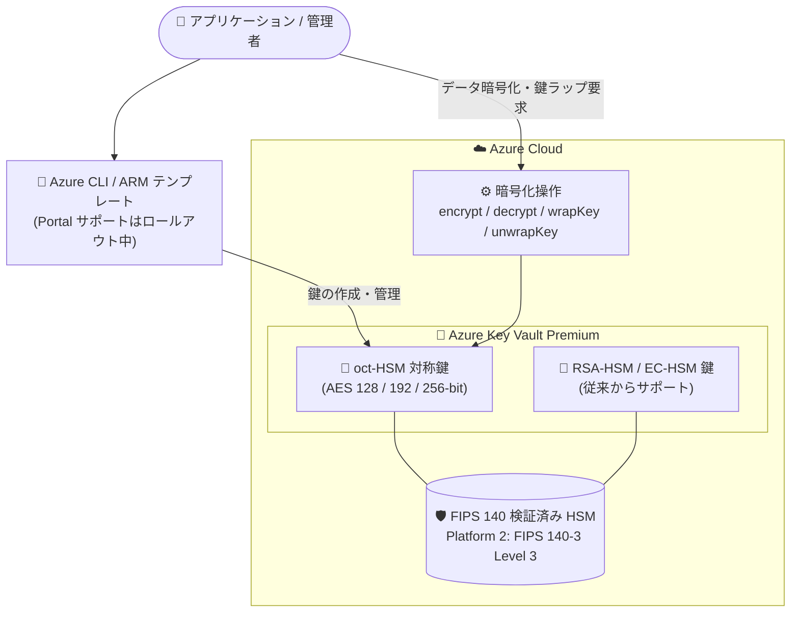

# Azure Key Vault: Key Vault Premium での対称鍵 (oct-HSM) サポート (Public Preview)

**リリース日**: 2026-07-30

**サービス**: Azure Key Vault

**機能**: Symmetric keys on Azure Key Vault Premium

**ステータス**: In preview

[このアップデートのインフォグラフィックを見る](https://takech9203.github.io/azure-news-summary/20260730-key-vault-premium-symmetric-keys.html)

## 概要

Azure Key Vault Premium で対称鍵 (oct-HSM キータイプ) のサポートがパブリックプレビューとして発表された。これにより、顧客およびパートナーは Azure Key Vault 内で直接、oct-HSM キータイプと AES (Advanced Encryption Standard) アルゴリズムを使用した対称暗号化機能を評価できるようになる。AES アルゴリズムを使用してデータの暗号化 (encrypt)、復号 (decrypt)、鍵のラップ (wrapKey)、アンラップ (unwrapKey) を実行しながら、Azure マネージドのセキュリティ・コンプライアンス・運用管理の恩恵を引き続き受けられる。

256 ビット鍵を使用する AES アルゴリズムは CNSA 2.0 (Commercial National Security Algorithm Suite 2.0) の要件に整合しており、ポスト量子暗号 (PQC) 対応への準備シナリオに役立つ。Microsoft Learn のドキュメントでも、Key Vault Premium (プレビュー) および Managed HSM が提供する AES アルゴリズムと 256 ビット対称鍵 (oct-HSM) の組み合わせは耐量子性 (quantum-resistant) を持つと明記されている。

なお、Azure Portal での対称鍵管理のサポートは現在ロールアウト中であり、ロールアウト期間中は Azure CLI や ARM テンプレートを使用して oct-HSM 対称鍵の作成・管理およびプレビュー機能全体を利用できる。

**アップデート前の課題**

- Key Vault (Vaults) がサポートするキータイプは RSA と EC (楕円曲線) のみで、HSM 保護された対称鍵 (oct-HSM) を利用するには単一テナントの Managed HSM を別途デプロイする必要があった
- AES ベースの暗号化・鍵ラップ操作を Azure マネージドサービスで行いたい場合、マルチテナントで低コストな Vaults では実現できなかった

**アップデート後の改善**

- Key Vault Premium (マルチテナントの Vaults) で HSM 保護された oct-HSM 対称鍵を作成・管理し、AES による encrypt / decrypt / wrapKey / unwrapKey 操作が可能になった
- 既存の Azure セキュリティワークフローとの統合が簡素化され、Azure サービス全体で一貫したセキュリティ・運用管理を維持できる
- AES-256 により CNSA 2.0 要件への整合とポスト量子暗号への準備が可能になった

## アーキテクチャ図



Key Vault Premium 内で oct-HSM 対称鍵が FIPS 140 検証済み HSM により保護され、アプリケーションは AES による暗号化・復号・鍵ラップ操作を Key Vault のデータプレーン経由で実行できる。

## サービスアップデートの詳細

### 主要機能

1. **oct-HSM 対称鍵のサポート**
   - Key Vault Premium で HSM 保護された対称 (AES) 鍵を作成・管理できる。Vaults における対称鍵は HSM バックのみで、Premium SKU の Vault が必須

2. **AES ベースの暗号化・復号操作**
   - encrypt / decrypt / wrapKey / unwrapKey の 4 操作をサポート

3. **一元的な鍵管理**
   - Azure Key Vault Premium による一元的な鍵管理と、Azure マネージドのセキュリティ・コンプライアンス・運用管理を利用可能

4. **既存 Azure セキュリティワークフローとの統合**
   - 既存の Azure セキュリティワークフローとの統合が簡素化され、Azure サービス全体で一貫したセキュリティ・運用管理を実現

5. **ポスト量子暗号 (PQC) への準備**
   - AES-256 は CNSA 2.0 要件に整合し、耐量子暗号への準備シナリオに対応

## 技術仕様

| 項目 | 詳細 |
|------|------|
| キータイプ | oct-HSM (対称 / AES 鍵、HSM 保護のみ) |
| 対応鍵長 | 128-bit、192-bit、256-bit |
| 対応操作 | encrypt、decrypt、wrapKey、unwrapKey |
| 対応アルゴリズム (暗号化・ラップ) | AES-KW、AES-GCM、AES-CBC |
| 対応アルゴリズム (HMAC 署名/検証) | HS256、HS384、HS512 |
| 必要 SKU | Key Vault Premium (Standard では利用不可) |
| HSM 保護 | FIPS 140 検証済み HSM (HSM Platform 2 は FIPS 140-3 Level 3、新規鍵はすべて Platform 2 で保護) |
| 鍵オブジェクト形式 | JSON Web Key (JWK) |
| データプレーンエンドポイント | `https://<vault-name>.vault.azure.net` |
| 管理手段 | Azure CLI、ARM テンプレート (Azure Portal サポートはロールアウト中) |

## 設定方法

### 前提条件

1. Azure Key Vault Premium SKU の Vault (対称鍵は HSM バックのみのため Premium が必須)
2. Azure Portal サポートはロールアウト中のため、Azure CLI または ARM テンプレートを使用する

### Azure CLI

```bash
# AES 256-bit の oct-HSM 対称鍵を作成
az keyvault key create \
    --vault-name <vault-name> \
    --name sample-aes-key \
    --kty oct-HSM \
    --size 256 \
    --ops encrypt decrypt wrapKey unwrapKey

# AES-GCM でデータを暗号化
az keyvault key encrypt \
    --vault-name <vault-name> \
    --name sample-aes-key \
    --algorithm A256GCM \
    --value aGVsbG8gd29ybGQ=
```

**注意**: AES-GCM 操作では、暗号化レスポンスの `iv`、`result`、`tag` の 3 つの値をすべて保存する必要がある。復号にはこの 3 つすべてが必要となる。1 回の呼び出しで取得するには CLI の `--query` オプション (`--query "{iv:iv, result:result, tag:tag}"`) を使用する。

## メリット

### ビジネス面

- 単一テナントの Managed HSM をデプロイしなくても、マルチテナントで低コスト・デプロイが容易な Vaults (Premium) で HSM 保護の対称鍵を利用できる
- AES-256 が CNSA 2.0 要件に整合しており、ポスト量子暗号対応の準備を進める組織のコンプライアンス戦略に寄与する

### 技術面

- Key Vault Premium による一元的な鍵管理で、AES による暗号化・復号・鍵ラップ・アンラップを直接実行できる
- 既存の Azure セキュリティワークフローとの統合が簡素化され、Azure サービス全体で一貫したセキュリティ・運用管理を維持できる
- 鍵は FIPS 140 検証済み HSM (新規鍵は FIPS 140-3 Level 3 の HSM Platform 2) で保護される

## デメリット・制約事項

- パブリックプレビューのため SLA はなく、本番ワークロードでの使用は推奨されない ([Microsoft Azure プレビューの追加利用規約](https://azure.microsoft.com/support/legal/preview-supplemental-terms/) が適用される)
- Key Vault Premium SKU が必須 (Standard では利用不可)。Vaults における対称鍵は HSM バックのみ
- Azure Portal での対称鍵管理サポートはロールアウト中であり、期間中は Azure CLI / ARM テンプレートでの管理が必要
- AES-GCM の復号には暗号化時の `iv`、`result`、`tag` の 3 値がすべて必要

## ユースケース

### ユースケース 1: ポスト量子暗号 (PQC) 対応の準備

**シナリオ**: CNSA 2.0 要件への整合が求められる組織が、耐量子性を持つ暗号方式への移行準備として、AES-256 対称鍵による暗号化を Azure マネージドサービスで評価する。

**実装例**:

```bash
# CNSA 2.0 に整合する AES 256-bit 鍵を作成
az keyvault key create \
    --vault-name my-premium-vault \
    --name pqc-ready-aes-key \
    --kty oct-HSM \
    --size 256 \
    --ops encrypt decrypt wrapKey unwrapKey
```

**効果**: 256 ビット対称鍵と AES アルゴリズムの組み合わせは耐量子性を持つとされており、量子コンピューターによる暗号解読リスクに備えた準備を Azure マネージド環境で進められる。

### ユースケース 2: AES による鍵ラップ (Key Wrapping)

**シナリオ**: アプリケーションのデータ暗号化鍵 (DEK) を、Key Vault Premium 内の HSM 保護された AES 鍵 (KEK) でラップ・アンラップし、鍵の階層管理を実現する。

**効果**: 鍵ラップ用の HSM 保護対称鍵を Managed HSM なしで利用でき、Azure マネージドのセキュリティ・運用管理の下で一元的に鍵を管理できる。

## 料金

Key Vault の料金ページでは、HSM 保護キーは Premium 専用であり、鍵ごとの月額とトランザクション (10,000 件単位) ごとの操作料金が課金される体系となっている。高度なキータイプは鍵数に応じた段階制の月額 (最初の 250 キー / 251〜1,500 / 1,501〜4,000 / 4,001 以上) が適用され、課金対象は過去 30 日間に使用された鍵のみ (HSM 保護キーの各バージョンは個別の鍵としてカウント) である。

なお、料金ページには本アップデート時点で oct-HSM (対称鍵) に関する料金の個別記載は確認できなかった。最新の具体的な金額は [Key Vault 料金ページ](https://azure.microsoft.com/pricing/details/key-vault/) を参照のこと。

## 関連サービス・機能

- **Azure Key Vault Managed HSM**: 単一テナントの HSM サービスで、従来から oct-HSM 対称鍵 (AES) をサポート。最も厳格なセキュリティ・コンプライアンス・規制要件や高価値の鍵を扱うシナリオに適する。今回のアップデートにより、マルチテナントの Vaults (Premium) でも同種の対称鍵機能を評価できるようになった
- **カスタマーマネージドキー (CMK) によるサーバー側暗号化**: Key Vault の鍵を使用した Azure リソースプロバイダーのサーバー側暗号化は、Key Vault の代表的な利用シナリオ
- **クライアント側暗号化**: Azure Storage などでのクライアント側暗号化に Key Vault の鍵を利用可能

## 参考リンク

- [インフォグラフィック](https://takech9203.github.io/azure-news-summary/20260730-key-vault-premium-symmetric-keys.html)
- [公式アップデート情報](https://azure.microsoft.com/updates?id=566746)
- [About keys - Azure Key Vault (Microsoft Learn)](https://learn.microsoft.com/azure/key-vault/keys/about-keys)
- [Key types, algorithms, and operations (Microsoft Learn)](https://learn.microsoft.com/azure/key-vault/keys/about-keys-details)
- [料金ページ](https://azure.microsoft.com/pricing/details/key-vault/)

## まとめ

Azure Key Vault Premium での対称鍵 (oct-HSM) サポートのパブリックプレビューにより、これまで Managed HSM でしか利用できなかった HSM 保護の AES 対称鍵を、マルチテナントで低コストな Vaults (Premium) で利用できるようになった。AES-KW / AES-GCM / AES-CBC による暗号化・鍵ラップ操作に対応し、AES-256 は CNSA 2.0 要件に整合するため、ポスト量子暗号への準備を進める組織にとって重要な選択肢となる。プレビュー段階のため本番利用は推奨されないが、Managed HSM のコストが課題だった組織や PQC 対応を検討中の組織は、Azure CLI / ARM テンプレートを使用した評価を開始することを推奨する。

---

**タグ**: Azure Key Vault, Security, oct-HSM, AES, Symmetric Keys, HSM, Public Preview, Post-Quantum Cryptography, CNSA 2.0
