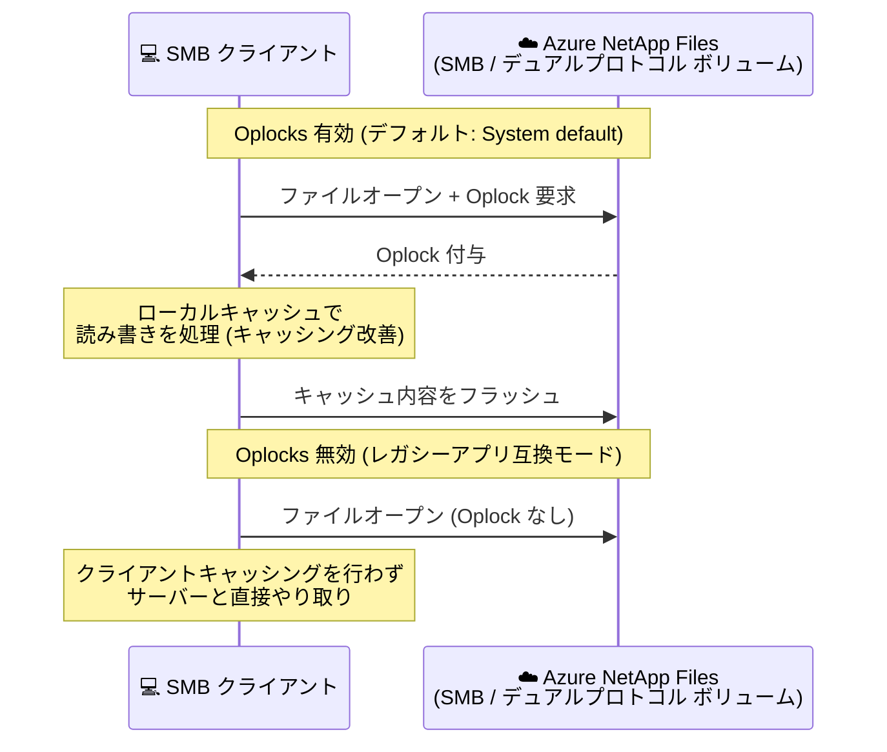

# Azure NetApp Files: SMB Opportunistic Locking (Oplocks) 構成のサポート (Public Preview)

**リリース日**: 2026-07-30

**サービス**: Azure NetApp Files

**機能**: SMB Opportunistic Locking (Oplocks) 構成のサポート

**ステータス**: In preview

[このアップデートのインフォグラフィックを見る](https://takech9203.github.io/azure-news-summary/20260730-netapp-files-smb-oplocks.html)

## 概要

Azure NetApp Files が、SMB ボリュームおよびデュアルプロトコルボリュームに対する SMB Opportunistic Locking (Oplocks、日和見ロック) の構成をサポートしました (Public Preview)。

Oplocks は SMB クライアントのキャッシングを改善するための仕組みで、Azure NetApp Files ではデフォルトで有効になっています。今回のアップデートにより、新規ボリューム作成時の設定に加え、既存ボリュームでも Oplocks の設定を変更できるようになりました。これにより、Oplocks の無効化を必要とするレガシーアプリケーションとの互換性が向上します。

また、クロスリージョンレプリケーションのレプリケーション先 (宛先) ボリュームについて、ソースボリュームとは独立した Oplocks 設定を構成できる点も特徴です。

**アップデート前の課題**

- Oplocks の無効化を必要とするレガシーアプリケーションへの対応 (互換性確保) の手段が提供されていなかった

**アップデート後の改善**

- SMB ボリュームおよびデュアルプロトコルボリュームで Oplocks の有効/無効を構成可能になった
- 新規ボリューム・既存ボリュームの両方で設定をサポート
- クロスリージョンレプリケーションの宛先ボリュームをソースボリュームとは独立して構成可能

## アーキテクチャ図

Oplocks が有効な場合、SMB クライアントはファイルをローカルにキャッシュして効率的に処理できます。Oplocks の無効化を必要とするレガシーアプリケーション向けには、ボリューム単位で無効に構成できます。

## サービスアップデートの詳細

### 主要機能

1. **Oplocks のボリューム単位での構成**
   - SMB ボリュームおよびデュアルプロトコルボリュームで Oplocks の設定を構成可能
   - デフォルトでは「System default」が選択されており、この場合ボリューム上の Oplocks は有効

2. **新規・既存ボリュームの両方に対応**
   - 新規ボリューム作成時に設定できるほか、既存ボリュームでも設定を変更可能

3. **レプリケーション先ボリュームの独立した構成**
   - クロスリージョンレプリケーションの宛先ボリュームに、ソースボリュームとは独立した Oplocks 設定を構成可能

## 技術仕様

| 項目 | 詳細 |
|------|------|
| 対象ボリューム | SMB ボリューム、デュアルプロトコルボリューム |
| デフォルト設定 | System default (Oplocks 有効) |
| 設定タイミング | 新規ボリューム作成時、既存ボリュームの更新時 |
| レプリケーション | クロスリージョンレプリケーションの宛先ボリュームをソースと独立して構成可能 |
| ステータス | Public Preview (2026 年 7 月) |

## 設定方法

### 前提条件

1. 容量プール (Capacity Pool) が作成済みであること
2. サブネットが Azure NetApp Files に委任済みであること
3. SMB ボリュームの場合、Active Directory 接続が構成済みであること

### Azure Portal

Microsoft Learn の「Create an SMB volume for Azure NetApp Files」に記載されている手順:

1. 容量プールの **Volumes** ブレードから **+ Add volume** を選択 (既存ボリュームの場合は対象ボリュームの設定を更新)
2. **Protocol** タブでプロトコルとして **SMB** を選択
3. Oplocks を有効にするには、ドロップダウンメニューから **Enabled** を選択
   - デフォルトでは **System default** が選択されており、Oplocks は有効

## メリット

### ビジネス面

- Oplocks の無効化を必要とするレガシーアプリケーションを Azure NetApp Files 上で利用しやすくなり、移行の選択肢が広がる

### 技術面

- Oplocks によって SMB クライアントのキャッシングが改善される (デフォルトで有効)
- ボリューム単位で有効/無効を制御でき、アプリケーション要件に応じた柔軟な構成が可能
- レプリケーション先ボリュームをソースと独立して構成できるため、DR 構成でも要件に合わせた設定が可能

## デメリット・制約事項

- Public Preview 段階の機能であり、GA 日は未定 (2026 年 7 月 30 日時点)

## ユースケース

### ユースケース 1: Oplocks 無効化が必要なレガシーアプリケーションの移行

**シナリオ**: クライアントキャッシング動作 (Oplocks) を無効化することを要件とするレガシーアプリケーションを、オンプレミスのファイルサーバーから Azure NetApp Files に移行する。

**実装**: 対象の SMB ボリュームまたはデュアルプロトコルボリュームで、Oplocks 設定をアプリケーション要件に合わせて構成する。

**効果**: レガシーアプリケーションとの互換性を確保しつつ、Azure NetApp Files のエンタープライズグレードのファイルストレージを利用できる。

## 料金

このアップデートに固有の料金情報は公式アナウンスでは確認できませんでした。Azure NetApp Files の料金は以下を参照してください。

- [Azure NetApp Files の料金](https://azure.microsoft.com/pricing/details/netapp/)

## 利用可能リージョン

公式アナウンスにリージョン情報の記載は確認できませんでした。最新のリージョン対応状況は以下を参照してください。

- [Products available by region](https://azure.microsoft.com/explore/global-infrastructure/products-by-region/)

## 関連サービス・機能

- **クロスリージョンレプリケーション (Azure NetApp Files)**: レプリケーション先ボリュームの Oplocks 設定を、ソースボリュームとは独立して構成可能
- **デュアルプロトコルボリューム (NFS + SMB)**: SMB ボリュームと同様に Oplocks の構成対象

## 参考リンク

- [インフォグラフィック](https://takech9203.github.io/azure-news-summary/20260730-netapp-files-smb-oplocks.html)
- [公式アップデート情報](https://azure.microsoft.com/updates?id=568396)
- [Create an SMB volume for Azure NetApp Files (Microsoft Learn)](https://learn.microsoft.com/en-us/azure/azure-netapp-files/azure-netapp-files-create-volumes-smb)
- [Create a dual-protocol volume for Azure NetApp Files (Microsoft Learn)](https://learn.microsoft.com/en-us/azure/azure-netapp-files/create-volumes-dual-protocol)
- [What's new in Azure NetApp Files (Microsoft Learn)](https://learn.microsoft.com/en-us/azure/azure-netapp-files/whats-new)
- [料金ページ](https://azure.microsoft.com/pricing/details/netapp/)

## まとめ

Azure NetApp Files の SMB / デュアルプロトコルボリュームで Oplocks の構成が可能になり (Public Preview)、Oplocks の無効化を必要とするレガシーアプリケーションとの互換性が向上しました。新規・既存ボリュームの両方で設定でき、クロスリージョンレプリケーションの宛先ボリュームも独立して構成できます。レガシーアプリケーションのファイルサーバー移行を検討している場合や、既存の Azure NetApp Files ボリュームでクライアントキャッシング動作の制御が必要な場合は、本プレビュー機能の評価を推奨します。

---

**タグ**: Azure NetApp Files, Storage, SMB, Oplocks, Dual-protocol, In preview
