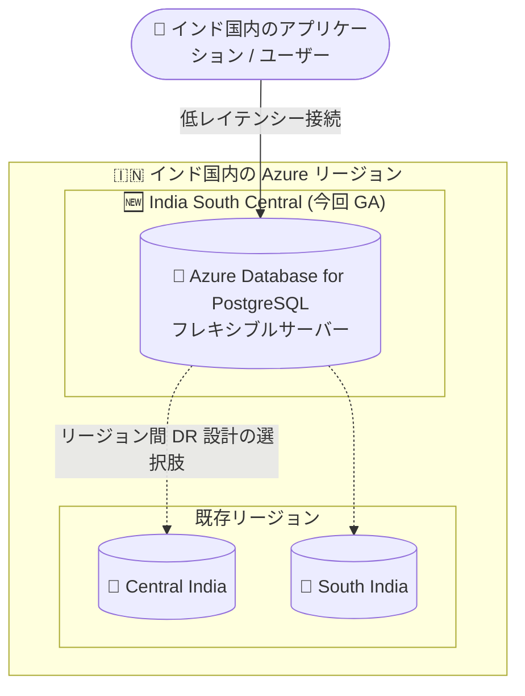

# Azure Database for PostgreSQL: フレキシブルサーバーが India South Central リージョンで一般提供開始

**リリース日**: 2026-07-30

**サービス**: Azure Database for PostgreSQL

**機能**: フレキシブルサーバーの India South Central リージョン対応 (GA)

**ステータス**: Launched (GA)

[このアップデートのインフォグラフィックを見る](https://takech9203.github.io/azure-news-summary/20260730-postgresql-flexible-server-india-south-central.html)

## 概要

Azure Database for PostgreSQL フレキシブルサーバーが、インドの India South Central Azure リージョンにデプロイ可能になりました。プレビュー期間を経ずに一般提供 (GA) として提供が開始されています。

Azure Database for PostgreSQL フレキシブルサーバーは、コミュニティ版 PostgreSQL をベースとしたフルマネージドのデータベースサービスです。コンピュートとストレージを分離したアーキテクチャを採用し、サーバー構成の柔軟なカスタマイズ、可用性ゾーン内/ゾーン間の高可用性、サーバーの停止/開始によるコスト最適化などを提供します。

今回のリージョン追加により、インド国内でデータを保持する必要があるワークロードや、インド南部のユーザーに近い場所でデータベースを稼働させたいシナリオにおいて、リージョン選択の幅が広がります。

**アップデート前の課題**

- India South Central リージョンでは Azure Database for PostgreSQL フレキシブルサーバーをデプロイできなかった
- インド国内では Central India、South India、Jio India Central、Jio India West などの既存リージョンを選択する必要があった

**アップデート後の改善**

- India South Central リージョンでフレキシブルサーバーを新規デプロイ可能になった
- インド国内のリージョン選択肢が増え、データレジデンシー要件や災害対策 (リージョン間 DR) の設計自由度が向上した

## アーキテクチャ図



India South Central が新たにフレキシブルサーバーのデプロイ先として追加され、インド国内の既存リージョンと組み合わせたデータ配置・DR 設計が可能になります。

## サービスアップデートの詳細

### 主要機能

1. **India South Central リージョンへのデプロイ対応**
   - Azure Database for PostgreSQL フレキシブルサーバーを India South Central リージョンで新規作成できるようになった
   - プレビューを経ずに GA として提供開始

2. **フレキシブルサーバーの主な特徴 (全リージョン共通)**
   - コンピュートとストレージを分離したアーキテクチャ。ストレージはデータベースファイルの同期コピーを 3 つ保持しデータ耐久性を確保
   - Burstable / General Purpose / Memory Optimized の 3 つのコンピュートティア
   - 自動バックアップ (既定 7 日間、最大 35 日間保持、AES 256 ビット暗号化)
   - サーバーの停止/開始によるコスト最適化 (停止中はコンピュート課金が停止)
   - システム管理または任意のスケジュールを指定できるマネージド メンテナンスウィンドウ
   - 組み込みの PgBouncer 接続プーラー (ポート 6432)
   - Azure Virtual Network 統合によるプライベートアクセス、TLS 1.2 以降の強制

## 設定方法

### Azure CLI

```bash
# India South Central リージョンにフレキシブルサーバーを作成する例
# (リージョン名は `az account list-locations -o table` で確認してください)
az postgres flexible-server create \
  --resource-group myResourceGroup \
  --name mypgserver \
  --location <india-south-central-のリージョン名> \
  --tier GeneralPurpose \
  --sku-name Standard_D2ds_v5
```

### Azure Portal

Azure Portal で「Azure Database for PostgreSQL flexible server」の作成時に、リージョンとして「India South Central」を選択します。

## メリット

### ビジネス面

- インド国内のデータレジデンシー要件 (データ主権) に対応したリージョン選択肢の拡大
- インド南部のユーザー/アプリケーションに近い場所でのデータベース稼働によるユーザー体験の向上

### 技術面

- インド国内の複数リージョンを組み合わせたリージョン間 DR・バックアップ戦略の設計自由度が向上
- アプリケーション層 (同リージョンの VM、AKS、App Service など) とデータベースを同一リージョンに配置することでレイテンシーを低減

## デメリット・制約事項

- India South Central リージョンで利用可能なコンピュート SKU、高可用性オプション (ゾーン冗長 HA / 同一ゾーン HA)、geo 冗長バックアップの対応状況は、公式ドキュメントのリージョン一覧で最新情報を確認する必要がある (執筆時点のドキュメントのリージョン表には India South Central の詳細行が未掲載)

## 料金

料金はリージョン、コンピュートティア、SKU、ストレージ容量によって異なります。India South Central リージョンの具体的な料金は公式料金ページで確認してください。

- [Azure Database for PostgreSQL 料金ページ](https://azure.microsoft.com/pricing/details/postgresql/flexible-server/)

## 利用可能リージョン

- **今回追加**: India South Central (GA)
- インド国内の既存リージョン: Central India、South India、Jio India Central、Jio India West
- 全リージョンの対応状況 (SKU、HA、geo 冗長バックアップ) は [Azure regions - Azure Database for PostgreSQL](https://learn.microsoft.com/azure/postgresql/flexible-server/overview#azure-regions) を参照

## 関連サービス・機能

- **Azure Virtual Network**: フレキシブルサーバーへのプライベートアクセスを提供。VNet 統合時はパブリックアクセスが拒否される
- **Azure Monitor**: 1 分間隔のメトリック (30 日間保持) とアラートによる組み込みのパフォーマンス監視
- **Azure Database Migration Service**: 既存 PostgreSQL からの最小ダウンタイム移行を支援

## 参考リンク

- [インフォグラフィック](https://takech9203.github.io/azure-news-summary/20260730-postgresql-flexible-server-india-south-central.html)
- [公式アップデート情報](https://azure.microsoft.com/updates?id=568334)
- [Microsoft Learn: Azure Database for PostgreSQL flexible server の概要](https://learn.microsoft.com/azure/postgresql/flexible-server/overview)
- [Microsoft Learn: Azure regions (対応リージョン一覧)](https://learn.microsoft.com/azure/postgresql/flexible-server/overview#azure-regions)
- [料金ページ](https://azure.microsoft.com/pricing/details/postgresql/flexible-server/)

## まとめ

Azure Database for PostgreSQL フレキシブルサーバーが India South Central リージョンで一般提供開始されました。インド国内でのデータレジデンシー要件への対応や、インド南部でのレイテンシー低減、リージョン間 DR 設計の選択肢拡大に有効です。インドリージョンでの展開を検討している場合は、公式ドキュメントのリージョン一覧で India South Central の SKU・高可用性オプションの対応状況を確認した上で、デプロイ計画に組み込むことを推奨します。

---

**タグ**: Azure Database for PostgreSQL, フレキシブルサーバー, リージョン拡大, India South Central, GA, Databases
