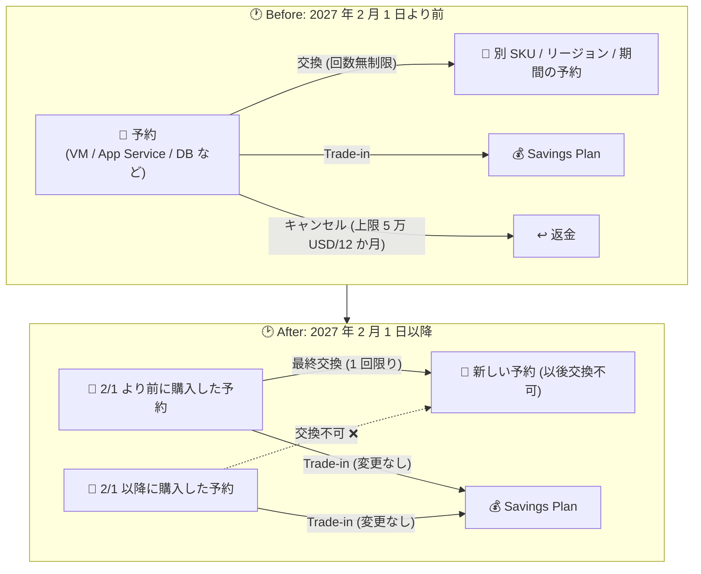

# Azure Reservations: Savings Plan 対象サービスの Reservation Exchange (予約交換) が 2027 年 2 月 1 日で利用不可に

**リリース日**: 2026-07-30

**サービス**: Azure Reservations (Microsoft Cost Management)

**機能**: Reservation Exchange (予約交換) の廃止アナウンス

**ステータス**: Announcement (廃止予告)

[このアップデートのインフォグラフィックを見る](https://takech9203.github.io/azure-news-summary/20260730-reservation-exchanges-retirement.html)

## 概要

2027 年 2 月 1 日以降、Savings Plan でカバーされるサービスの Azure Reservation (予約) について、Reservation Exchange (予約交換) が利用できなくなることがアナウンスされました。予約交換は、購入済みの予約を別の SKU・リージョン・期間の予約に交換できる仕組みで、これまでコンピュート予約 (Azure Reserved VM Instances、Azure Dedicated Host、Azure App Service) は「猶予期間 (grace period)」として無期限に交換可能とされてきましたが、この猶予期間に終了日が設定された形です。

アナウンス時点で影響を受けるのは、以下のサービスの予約です。

- **コンピュートサービス**: Azure Virtual Machines (非 Premium ストレージ ⇔ Premium ストレージ間の交換を含む)、Azure Dedicated Host、Azure App Service
- **データベースサービス**: Azure Database for PostgreSQL、Azure Database for MySQL、Azure DocumentDB、Azure Cosmos DB、Azure SQL Database、Azure SQL Managed Instance

2027 年 2 月 1 日より前に購入された影響対象サービスの有効な予約には、同日以降も **1 回限りの最終交換 (one final exchange) の権利**が保持されます。また、今後 Savings Plan の対象サービスが拡大した場合、そのサービスの予約も同様に本ポリシーに従い、交換がサポートされなくなります (既購入分は 1 回限りの最終交換が可能)。

**アップデート前 (現行)**

- コンピュート予約 (VM、Dedicated Host、App Service) は猶予期間として「追って通知があるまで」回数無制限で交換可能
- 交換により SKU ファミリー・シリーズ・リージョン・数量・期間を変更でき、ペナルティや年間上限なし

**アップデート後 (2027 年 2 月 1 日以降)**

- Savings Plan 対象サービスの予約は、2027 年 2 月 1 日以降に購入した分は交換不可
- 2027 年 2 月 1 日より前に購入した予約は、1 回限りの最終交換のみ可能 (交換後の新しい予約は交換不可)
- Savings Plan への Trade-in (下取り) と、上限 50,000 USD/12 か月のキャンセル (返金) ポリシーは変更なし

## アーキテクチャ図

Savings Plan 対象サービスの予約について、廃止前後で利用可能な選択肢を比較した図です。交換は段階的に制限される一方、Savings Plan への Trade-in とキャンセル (返金) ポリシーは変更されません。

## サービスアップデートの詳細

### 変更内容

1. **2027 年 2 月 1 日以降に購入した予約は交換不可**
   - Savings Plan でカバーされるサービス (Azure Virtual Machines、Azure App Service、Azure SQL Database など) の予約が対象。

2. **既存予約 (2027 年 2 月 1 日より前に購入) は 1 回限りの最終交換が可能**
   - 交換は「キャンセル + 返金 + 新規購入」として処理されるため、2027 年 2 月 1 日以降に交換して得た新しい予約は、同日以降の条件が適用され再交換できない。
   - 複数数量の予約は部分的に交換可能。例: 数量 10 の予約のうち 2 数量を 2027 年 2 月 1 日以降に交換した場合、残り 8 数量はそれぞれ 1 回ずつ交換の権利を保持する。

3. **今後 Savings Plan 対象になったサービスにも同ポリシーを適用**
   - 2027 年 2 月 1 日以降に Savings Plan の対象となったコンピュート/データベース製品の予約も交換不可となる (それ以前に購入済みの予約は 1 回限りの最終交換が可能)。

### 本ポリシー変更の対象外 (交換可能なまま残るもの)

- 非推奨 (deprecated) となり End of Life が近い製品・サービスの予約
- Savings Plan でカバーされないサービスの予約 (例: **Azure VMware Solution** の予約は本変更の影響を受けない)
- Savings Plan を現在サポートしていないクラウド環境

### 変更されないもの

- **VM の Instance Size Flexibility**: 本ポリシー変更の影響を受けない
- **キャンセル (返金) ポリシー**: 変更なし。課金プロファイルまたは単一エンロールメントあたり、12 か月ローリングウィンドウでキャンセル合計 50,000 USD が上限
- **Savings Plan への Trade-in ポリシー**: 変更なし。既存予約はいつでも Savings Plan に下取り可能

### 適用シナリオ (Microsoft Learn 記載の例)

| シナリオ | 購入時期 | 交換の可否 |
|---------|---------|-----------|
| シナリオ 1 | 2027/2/1 より前に購入 | 2027/2/1 までは回数無制限で交換可能。それ以降の交換は 1 回限りで、交換後の新予約は再交換不可。Savings Plan への Trade-in は常時可能 |
| シナリオ 2 | 2027/2/1 以降に購入 | 交換不可。Savings Plan への Trade-in は可能 |
| シナリオ 3 | 2027/2/1 より前に数量 10 で購入 | 2027/2/1 以降に 2 数量を交換した場合、残り 8 数量はそれぞれ 1 回ずつ交換可能 |

## 技術仕様

| 項目 | 詳細 |
|------|------|
| 廃止日 | 2027 年 2 月 1 日 |
| 対象 (コンピュート) | Azure Virtual Machines (非 Premium ⇔ Premium ストレージ間の交換を含む)、Azure Dedicated Host、Azure App Service |
| 対象 (データベース) | Azure Database for PostgreSQL、Azure Database for MySQL、Azure DocumentDB、Azure Cosmos DB、Azure SQL Database、Azure SQL Managed Instance |
| 既存予約の扱い | 2027/2/1 より前に購入した有効な予約は、同日以降 1 回限りの最終交換が可能 |
| 対象外 | EoL が近い非推奨製品、Savings Plan 非対応サービス (例: Azure VMware Solution)、Savings Plan 非対応のクラウド環境 |
| 交換の処理方式 | キャンセル + 日割り返金 + 新規購入 (新予約の期間は交換時点から新たに開始) |
| 返金上限 | キャンセルは 12 か月ローリングで合計 50,000 USD まで (交換に伴う返金はこの上限にカウントされない)。変更なし |
| Trade-in | 予約から Savings Plan への下取りはポリシー変更なし |

## Solutions Architect が取るべきアクション

### 期限: 2027 年 1 月 31 日まで (交換が無制限に行える最終期間)

1. **予約ポートフォリオの棚卸し**
   - Azure Portal の [Reservations](https://portal.azure.com/#blade/Microsoft_Azure_Reservations/ReservationsBrowseBlade) で、影響対象サービス (VM、Dedicated Host、App Service、PostgreSQL、MySQL、DocumentDB、Cosmos DB、SQL Database、SQL Managed Instance) の予約と有効期限を確認する。

2. **SKU・リージョン・期間の見直しと必要な交換の前倒し実行**
   - 現在の予約が実ワークロードと不一致 (SKU 世代の古さ、リージョン移行計画、使用率低下など) の場合、交換が無制限に行える 2027 年 2 月 1 日より前に交換を済ませる。
   - 2027 年 2 月 1 日以降の交換は 1 回限りとなり、交換後の予約は再交換できないため、最終交換の権利は慎重に温存・行使する。

3. **動的ワークロードは Savings Plan への移行を検討**
   - サービス・リージョンをまたぐ柔軟性が必要な進化中・動的なワークロードには、時間あたりの支出コミットメント (dollars-per-hour) で対象サービス全体に自動で割引が適用される Savings Plan が適する。既存予約の [Trade-in](https://learn.microsoft.com/azure/cost-management-billing/savings-plan/reservation-trade-in) はポリシー変更なくいつでも可能。
   - 予測可能で安定したワークロードには、引き続き予約が適切な選択肢であり、今後も購入可能。比較は [decide between a savings plan and a reservation](https://learn.microsoft.com/azure/cost-management-billing/savings-plan/decide-between-savings-plan-reservation) を参照。

4. **2027 年 2 月 1 日以降の新規予約購入プロセスの見直し**
   - 以降に購入する対象サービスの予約は交換不可となるため、購入前のサイジング精度がより重要になる。VM の Instance Size Flexibility は影響を受けないため、同一グループ内のサイズ調整余地は考慮に入れる。
   - 交換不可を前提に、Savings Plan とのハイブリッド構成 (ベースラインは予約、変動分は Savings Plan) を購買ガイドラインに反映する。

## 関連サービス・機能

- **Azure Savings Plan for Compute**: 時間あたりの支出コミットメントで対象コンピュート/データベースサービスに横断的に割引を適用。本変更後の柔軟性確保の主要な移行パス
- **Reservation Trade-in**: 既存予約を Savings Plan に下取りする仕組み。本変更の影響なし
- **Instance Size Flexibility**: VM 予約の同一グループ内サイズ適用の柔軟性。本変更の影響なし
- **Microsoft Cost Management**: 予約・Savings Plan の使用率、カバレッジの監視

## 参考リンク

- [インフォグラフィック](https://takech9203.github.io/azure-news-summary/20260730-reservation-exchanges-retirement.html)
- [公式アップデート情報](https://azure.microsoft.com/updates?id=568514)
- [Changes to the Azure reservation exchange policy (Microsoft Learn)](https://learn.microsoft.com/azure/cost-management-billing/reservations/reservation-exchange-policy-changes)
- [Self-service exchanges and refunds for Azure Reservations (Microsoft Learn)](https://learn.microsoft.com/azure/cost-management-billing/reservations/exchange-and-refund-azure-reservations)
- [Azure saving plan の予約の下取り (Microsoft Learn)](https://learn.microsoft.com/azure/cost-management-billing/savings-plan/reservation-trade-in)
- [Savings Plan と Reservation の使い分け (Microsoft Learn)](https://learn.microsoft.com/azure/cost-management-billing/savings-plan/decide-between-savings-plan-reservation)

## まとめ

長らく「追って通知があるまで」とされてきたコンピュート予約交換の猶予期間に、ついに終了日 (2027 年 2 月 1 日) が設定されました。対象は Savings Plan がカバーする VM、Dedicated Host、App Service と主要データベースサービスの予約で、既存予約には 1 回限りの最終交換の権利が残ります。Solutions Architect としては、(1) 2027 年 1 月末までに予約ポートフォリオを棚卸しして必要な交換を前倒しする、(2) 動的ワークロードは Trade-in で Savings Plan へ移行する、(3) 以降の新規予約は交換不可を前提にサイジングと購買ガイドラインを見直す、の 3 点を計画的に進めることを推奨します。キャンセル (上限 50,000 USD/12 か月)、Trade-in、Instance Size Flexibility の各ポリシーは変更されない点も押さえておきましょう。

---

**タグ**: Azure Reservations, Savings Plan, Cost Management, Retirement, Announcement, FinOps
