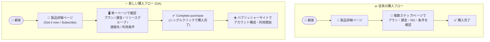

# Microsoft Marketplace: パブリック SaaS オファーのシングルクリック購入が一般提供開始

**リリース日**: 2026-07-31

**サービス**: Microsoft Marketplace (Azure Marketplace / SaaS)

**機能**: Single-click purchase for public SaaS offers (パブリック SaaS オファーの簡素化された購入体験)

**ステータス**: Launched (GA)

[このアップデートのインフォグラフィックを見る](https://takech9203.github.io/azure-news-summary/20260731-marketplace-single-click-saas-purchase.html)

## 概要

Microsoft Marketplace 上の対象 (eligible) SaaS 製品について、Azure portal での簡素化された購入体験が一般提供 (GA) となりました。顧客はプラン、請求 (課金)、リソースグループ、連絡先情報、利用条件 (Terms) を **単一ページ** で確認し、そのまま購入を完了できます。

Microsoft Learn ドキュメントによると、この新しい購入体験は 2026 年 8 月にかけて段階的にロールアウトされます。また、カスタム購入体験を使用する SaaS オファー (Azure Native Services、Models-as-a-Service、Secure Exchange 製品など) は現時点では対象外です。

**アップデート前の課題**

- SaaS オファーの購入時に、プラン選択・課金設定・リソースグループ・連絡先・利用条件の確認が複数のステップ/ページに分かれており、購入完了までに画面遷移が必要だった

**アップデート後の改善**

- プラン、請求、リソースグループ、連絡先、利用条件のすべての構成を単一ページでレビューし、そのまま購入を完了できるようになった
- 対象の Azure サブスクリプション、SaaS サブスクリプション名、プラン、リソースグループなどにデフォルト値があらかじめ選択され、必要に応じて変更するだけで購入できる

## アーキテクチャ図



従来は複数ステップに分かれていた SaaS 購入時の確認事項が、新体験では単一ページに集約され、1 回の「Complete purchase」操作で購入が完了します。

## サービスアップデートの詳細

### 主要機能

1. **単一ページでの購入確認**
   - プラン、契約期間、価格 (課金頻度ごと)、ユーザー数、小計、自動更新設定などの基本情報を 1 ページで確認・変更できる
   - 最初に選択可能な Azure サブスクリプションが自動で事前選択される (購入前後に変更可能)
   - SaaS サブスクリプション名はデフォルト名が提案され、購入前のみ変更可能

2. **詳細設定も同一体験内で構成**
   - リソースグループ (新規がデフォルトで事前選択、購入前後に変更可能) とリソースグループのロケーション
   - タグ (リソース/リソースグループあたり最大 50 個)
   - 販売者 (パブリッシャー) に共有される連絡先情報 (名前・メール、任意で電話番号)

3. **利用条件の一括レビュー**
   - パブリッシャーの法的条項とプライバシーステートメント、Microsoft 標準契約 (Standard Contract)、修正条項、Marketplace Terms を購入前にまとめて確認

4. **購入後のアクティベーション**
   - パブリッシャーが設定する「自動アクティベーション」が有効な場合、購入と同時にサブスクリプションが有効化され課金が開始
   - 無効な場合、パブリッシャーサイトでアカウント構成後に課金が開始 (30 日以内に構成しないと SaaS サブスクリプションは自動削除)

## 技術仕様

| 項目 | 詳細 |
|------|------|
| 対象 | Microsoft Marketplace 上の対象 (eligible) パブリック SaaS オファー |
| 対象外 | カスタム購入体験を使用する SaaS オファー (Azure Native Services、Models-as-a-Service、Secure Exchange 製品など) |
| 購入場所 | Azure portal (Microsoft Marketplace から開始した場合もリダイレクトで Azure portal に遷移) |
| ロールアウト | 2026 年 8 月にかけて段階的に展開 |
| 課金モデル | 月額プラン / 年間プラン / 複数年プラン (最大 5 年) / 従量課金 (メーター) プラン |
| プラン変更の制約 | 購入後は、同じ契約期間・課金頻度のプランにのみ変更可能 |
| 支払い方法の制約 | 有効な支払い方法がないサブスクリプション (MSDN など) は無料プランのみ購入可能。Student / Visual Studio Enterprise / 無料クレジットのサブスクリプションでは SaaS 製品を購入不可 |

## 設定方法

### 前提条件

1. 適切な Azure サブスクリプションにアクセスできる Azure ユーザーアカウント (課金と購入リソースの管理に使用)
2. Microsoft Marketplace からの購入権限。サブスクリプションスコープのカスタムロールでは、最低限以下のアクションが必要:

```json
"Actions": [
    "Microsoft.SaaS/register/action",
    "Microsoft.SaaS/resources/write",
    "Microsoft.SaaS/resources/read",
    "Microsoft.Resources/deployments/write",
    "Microsoft.Resources/deployments/validate/action",
    "Microsoft.Resources/deployments/read",
    "Microsoft.Resources/subscriptions/resourceGroups/read",
    "Microsoft.Resources/subscriptions/resourceGroups/write",
    "Microsoft.MarketplaceOrdering/offertypes/publishers/offers/plans/agreements/read",
    "Microsoft.MarketplaceOrdering/offertypes/publishers/offers/plans/agreements/write"
  ]
```

### Azure Portal

1. **オファーを探す**: Azure portal の「+ Create a resource」または「Marketplace」(ショートカット: G + N) から、Offer Type フィルターで「SaaS」を選択して検索
2. **購入を開始**: 製品詳細ページでプランを選択し、「Get it now」または「Subscribe」を選択
3. **基本情報の確認**: Azure サブスクリプション、SaaS 名、プラン、契約期間、価格、ユーザー数、小計、自動更新を確認・変更
4. **詳細情報の確認**: リソースグループ、リソースグループのロケーション、タグ、連絡先を確認・変更
5. **利用条件の確認**: パブリッシャーの法的条項、Microsoft 標準契約、Marketplace Terms を確認
6. **購入の完了**: 「Complete purchase」を選択 (必須項目の不足や検証エラーがある場合はページ上に表示され、解消するまで購入できない)
7. **購入後**: パブリッシャーサイトでアカウントを構成し、ソフトウェアの利用を開始。購入処理には最大 1 分程度かかるため、完了までブラウザーを閉じない

## メリット

### ビジネス面

- SaaS 製品の調達にかかる時間と操作ステップが削減され、購入プロセスが迅速化する
- 価格・契約期間・利用条件を 1 ページで俯瞰できるため、購入前の確認漏れを防ぎやすい

### 技術面

- Azure サブスクリプション・リソースグループ・タグを購入時点で構成でき、リソースの整理とガバナンスを購入フローの中で実施できる
- デフォルト値 (サブスクリプション、リソースグループ、SaaS 名) の事前選択により、最小限の入力で購入を完了できる

## デメリット・制約事項

- 新体験は 2026 年 8 月にかけての段階的ロールアウトのため、すべてのテナントで即時に利用できるとは限らない
- カスタム購入体験を使用する SaaS オファー (Azure Native Services、Models-as-a-Service、Secure Exchange 製品など) は対象外
- SaaS サブスクリプション名は購入後に変更できない
- 購入後のプラン変更は、同じ契約期間・課金頻度のプランに限定される
- プライベートオファーに紐づくサブスクリプション/プランの場合は、Private Offer Management へのリンクから取引を完了する必要がある

## 料金

このアップデート自体は購入体験の改善であり、追加料金は発生しません。購入する SaaS 製品の料金は、パブリッシャーが設定するプラン (フラットレートまたはユーザー単位) と契約期間に依存します。

| プラン種別 | 課金 |
|------|------|
| 月額プラン | 毎月前払い。期間終了時に自動更新 |
| 年間プラン | 月払いまたは年間前払い。期間終了時に自動更新 |
| 複数年プラン | 最大 5 年。年払いまたは (プライベートオファーの場合) 柔軟な課金スケジュール |
| メータープラン (従量課金) | 消費ユニット (API 呼び出し数、ストレージ量など) に応じて課金。基本料金を含む場合あり |

無料枠: 一部の SaaS プランには無料試用版 (Free Trial) が含まれます。試用期間や含まれる使用量はプランによって異なります。

## 関連サービス・機能

- **Azure portal (Marketplace)**: 本アップデートの購入体験が提供される場所。SaaS ページから購入後のサブスクリプション管理 (プラン変更、ユーザー数変更、自動更新、キャンセルなど) も実施
- **Azure サブスクリプション / リソースグループ**: SaaS 購入時の課金単位およびリソースの配置先として購入フロー内で選択
- **Private Marketplace / プライベートオファー**: テナント管理者による購入制御や、パブリッシャーとの個別契約による購入。プライベートオファーは Private Offer Management で取引を完了
- **Azure Cost Management + Billing**: Marketplace 購入の有効化設定 (EA サブスクリプションの Marketplace トグルなど) や支払い方法の管理

## 参考リンク

- [インフォグラフィック](https://takech9203.github.io/azure-news-summary/20260731-marketplace-single-click-saas-purchase.html)
- [公式アップデート情報](https://azure.microsoft.com/updates?id=568591)
- [Microsoft Learn: How to purchase a SaaS offer in the Azure portal](https://learn.microsoft.com/en-us/marketplace/purchase-saas-offer-in-azure-portal)
- [Microsoft Learn: SaaS subscription lifecycle management (プラン変更)](https://learn.microsoft.com/en-us/marketplace/saas-subscription-lifecycle-management#change-plans)

## まとめ

Microsoft Marketplace の対象パブリック SaaS オファーで、プラン・課金・リソースグループ・連絡先・利用条件を単一ページで確認して購入を完了できる簡素化された購入体験が GA となりました。2026 年 8 月にかけて段階的にロールアウトされるため、Solutions Architect としては、組織の Marketplace 購入ポリシー (Private Marketplace、EA の Marketplace 有効化設定、購入権限のカスタムロール) が新フローでも意図どおり機能するかを確認しておくことを推奨します。カスタム購入体験を持つオファー (Azure Native Services、Models-as-a-Service など) は対象外である点にも留意してください。

---

**タグ**: Microsoft Marketplace, Azure Marketplace, SaaS, 購入体験, Azure portal, GA
