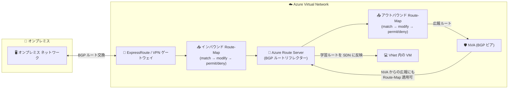

# Azure Route Server: Route-Maps (Public Preview)

**リリース日**: 2026-07-31

**サービス**: Azure Route Server

**機能**: Route-Maps for Azure Route Server

**ステータス**: In preview

[このアップデートのインフォグラフィックを見る](https://takech9203.github.io/azure-news-summary/20260731-route-server-route-maps.html)

## 概要

Azure Route Server の Route-Maps (ルートマップ) 機能がパブリックプレビューとして提供開始されました。Route-Maps は、ハイブリッド接続全体にわたるインバウンド / アウトバウンドのルーティングをきめ細かく制御できる機能です。Azure Route Server と Network Virtual Appliance (NVA) 間の BGP ピアリングに加え、同一 VNet 内の ExpressRoute ゲートウェイ接続や VPN ゲートウェイ接続に対しても、広報 (advertise) されるルートおよび受信するルートを管理できます。

ルートマップは、match 条件 (ルートプレフィックス、BGP Community、AS-Path) とアクション (Drop / Modify) から構成される順序付きのルールのシーケンスです。ルートの集約 (サマライズ)、フィルタリング、BGP 属性 (AS-PATH、Community) の変更が可能になり、Cisco などのネットワーク機器で一般的な route-map の考え方を Azure Route Server 上でマネージドに実現します。

**アップデート前の課題**

- Azure Route Server は NVA から学習したルートをそのまま Azure SDN に反映し、VNet プレフィックスをそのまま NVA に広報するため、ルート広報の内容を Route Server 側で制御する手段がなかった
- BGP ピアあたりの広報ルート数 (4,000 ルート、超過時は BGP セッション断) やオンプレミス + VNet プレフィックス合計 (10,000) などの制限があるなかで、Route Server 側でルートを集約して数を削減する手段がなかった
- AS-PATH や BGP Community の操作による経路選択の調整やルートのタグ付けを行うには、NVA 側でのみ設定する必要があった

**アップデート後の改善**

- BGP ピアリング、ExpressRoute ゲートウェイ接続、VPN ゲートウェイ接続ごとに、インバウンド / アウトバウンド方向のルートマップを適用してルートの制御が可能になった
- ルート集約により、広報ルート数の上限に対処できるようになった (例: 10.2.1.0/24、10.2.2.0/24、10.2.3.0/24 を 10.2.0.0/16 に集約)
- ルートフィルタリング (Drop)、AS-PATH の追加 / 置換、BGP Community の追加 / 置換 / 削除が Route Server 側で可能になった

## アーキテクチャ図

Route Server が学習するルートにはインバウンド ルートマップ、広報するルートにはアウトバウンド ルートマップが適用されます。各ルートマップは match 条件 (プレフィックス / AS-Path / Community) を評価し、属性変更を行ったうえでルートを許可または破棄します。

## サービスアップデートの詳細

### 主要機能

1. **ルート集約 (Route summarization)**
   - ExpressRoute や VPN 経由でオンプレミスと接続する際に、複数の詳細ルートを集約して広報ルート数を削減できる
   - 注意: 集約されたルートからは BGP Community と AS-PATH 属性が削除される (インバウンド / アウトバウンド両方向に適用)

2. **ルートフィルタリング (Route filtering)**
   - BGP ピアリング、ExpressRoute 接続、VPN 接続で広報 / 受信するルートから特定ルートを除外 (Drop) できる

3. **BGP 属性の変更 (AS-PATH / Community)**
   - AS-PATH への ASN の追加 (プリペンド) や置換により、複数経路がある場合の最適経路選択を制御できる
   - BGP Community の追加 / 置換 / 削除により、ルートのタグ付けと管理が容易になる

4. **柔軟な match 条件とルール制御**
   - ルートプレフィックス (Equals / Contains)、Community (Equals / Contains)、AS-Path (Equals / Contains) で照合可能
   - 複数の match 条件はすべて満たした場合のみマッチ (AND 条件)。ルールの「Next step」設定で後続ルールへの継続 / 終了 (Terminate) を制御
   - どのルールにもマッチしない場合のデフォルト動作は「許可」(deny ではない)

### 適用ポイントと方向

| 適用対象 | 説明 |
|----------|------|
| BGP ピアリング | Route Server と NVA 間の BGP ピアリング |
| ExpressRoute ゲートウェイ接続 | 同一 VNet 内の ExpressRoute ゲートウェイへの接続 |
| VPN ゲートウェイ接続 | 同一 VNet 内の VPN ゲートウェイへの接続 |

- **インバウンド**: Route Server が受信するルートに適用
- **アウトバウンド**: Route Server が送信 (広報) するルートに適用
- 各接続には方向ごとに 1 つのルートマップのみ適用可能
- アウトバウンド ルートマップは広報内容の変更のみで、Route Server の最適経路選択には影響しない (経路選択はアウトバウンド ルートマップ適用前に実施される)

## 技術仕様

| 項目 | 詳細 |
|------|------|
| match 条件 | Route-prefix / Community / AS-Path (それぞれ Equals または Contains) |
| アクション (Drop) | マッチしたルートを広報から除外 |
| アクション (Modify) | Route-prefix の置換 (集約)、AS-Path の Add / Replace、Community の Add / Replace / Remove |
| 適用単位 | 接続 (BGP ピアリング / ExpressRoute / VPN) × 方向 (インバウンド / アウトバウンド) ごとに 1 つ |
| ASN サポート | 2 バイト ASN のみ |
| デフォルト動作 | どのルールにもマッチしない場合は許可 |
| 設定方法 | Azure Portal |

## 設定方法

### 前提条件

1. Azure Route Server がデプロイされた仮想ネットワーク
2. パブリックプレビューのため、[Microsoft Azure プレビューの追加使用条件](https://azure.microsoft.com/support/legal/preview-supplemental-terms/) が適用される

### Azure Portal

Route-Maps は Azure Portal から構成できます。ルートマップの作成、match 条件とアクションを含むルールの定義、BGP ピアリングやゲートウェイ接続への適用 (方向指定) を行います。詳細な手順は公式ドキュメント [How to configure route maps](https://learn.microsoft.com/azure/route-server/route-maps-how-to) を参照してください。

**注意**: Azure Route Server で初めてルートマップを作成すると、Route Server のアップグレードが実行され、約 30 分かかります。

## メリット

### ビジネス面

- NVA 側の複雑なルーティング設定を Azure 側のマネージド機能で代替でき、運用負荷とベンダー依存を軽減できる
- ルート数上限に起因する接続障害 (BGP セッション断) のリスクを、ルート集約により低減できる

### 技術面

- ハイブリッド接続 (ExpressRoute / VPN) と NVA を組み合わせた環境で、Route Server を経由するルートを一元的に制御できる
- AS-PATH 操作による経路選択の制御で、複数経路環境 (ExpressRoute + VPN 併用など) のトラフィックエンジニアリングが可能
- BGP Community によるルートのタグ付けで、大規模環境でのルート管理が容易になる

## デメリット・制約事項

- パブリックプレビューのため、SLA の対象外であり本番環境での利用は非推奨
- ルート集約を行うと、集約後のルートから BGP Community と AS-PATH 属性が削除される
- AS プリペンドにプライベート ASN および Azure 予約 ASN (パブリック: 8074、8075、12076 / プライベート: 65515、65517、65518、65519、65520) は使用不可
- Azure の BGP Community (65517:12001 など) は削除してはならない
- 2 バイト ASN のみサポート
- デフォルトルート (0.0.0.0/0) の変更は、オンプレミスまたは NVA 由来の場合のみ可能
- プレフィックスの変更は route maps か NAT のいずれか一方のみ (併用不可)
- Route Server が広報する VNet アドレス空間の変更・フィルタリングには使用できない
- ルート集約 (サマライズ) のみサポート。より詳細な (specific) ルートの作成には使用不可
- ExpressRoute 接続の MSEE (Microsoft Enterprise Edge) 側には適用できない
- 初回のルートマップ作成時に約 30 分のアップグレードが発生する
- Route-Maps の利用には追加料金が発生する

## ユースケース

### ユースケース 1: ルート数上限への対処 (ルート集約)

**シナリオ**: オンプレミスから ExpressRoute 経由で多数の詳細ルートが広報され、Route Server や ExpressRoute のルート数上限に近づいている。

**実装例**: ExpressRoute ゲートウェイ接続のインバウンド ルートマップで、10.2.1.0/24、10.2.2.0/24、10.2.3.0/24 などの詳細ルートを 10.2.0.0/16 に集約 (Route-prefix / Replace) する。

**効果**: 広報ルート数が削減され、ルート数上限による BGP セッション断のリスクを低減できる。

### ユースケース 2: NVA への広報ルートのフィルタリング

**シナリオ**: 特定のプレフィックスを NVA に広報したくない (NVA 経由のトラフィックを制限したい)。

**実装例**: NVA との BGP ピアリングのアウトバウンド ルートマップで、対象プレフィックスを match 条件に指定し、Drop アクションを設定する。

**効果**: NVA が学習するルートを制御し、意図しないトラフィックフローを防止できる。

### ユースケース 3: AS-PATH プリペンドによる経路選択の制御

**シナリオ**: ExpressRoute と VPN の両方でオンプレミスと接続しており、特定経路を優先させたい。

**実装例**: 優先度を下げたい接続のルートマップで、AS-Path / Add により ASN をプリペンドし、経路の優先度を下げる。

**効果**: 複数経路環境で意図した経路にトラフィックを誘導できる。

## 料金

Route-Maps の利用には Azure Route Server 本体の料金に加えて追加料金が発生します。料金ページで確認できた課金項目は以下のとおりです (具体的な単価は料金ページで動的に表示されるため、公式料金ページを参照してください)。

| 項目 | 課金単位 |
|------|----------|
| Azure Route Server (基本) | 時間課金 ($/hour) |
| Routing Infrastructure Unit | ユニット / デプロイ時間 (VNet + ピアリング VNet の最初の 4,000 VM 以降、1,000 VM ごとに 1 ユニット追加) |
| Route-Maps 適用済み Route Server | ユニット / デプロイ時間 |
| Route-Maps 適用済み NVA 接続 | ユニット / デプロイ時間 |
| VPN S2S Connection Unit | ユニット / デプロイ時間 |
| ExpressRoute Connection Unit | ユニット / デプロイ時間 |

最新の単価は [Azure Route Server 料金ページ](https://azure.microsoft.com/pricing/details/route-server/) を参照してください。

## 関連サービス・機能

- **Network Virtual Appliance (NVA)**: Route Server と BGP ピアリングを構成する対象。Route-Maps により NVA との間で交換するルートを制御できる
- **ExpressRoute ゲートウェイ**: 同一 VNet 内の ExpressRoute ゲートウェイ接続に Route-Maps を適用可能 (MSEE 側には適用不可)
- **VPN ゲートウェイ**: 同一 VNet 内の VPN ゲートウェイ接続に Route-Maps を適用可能
- **Virtual WAN Route-map**: Virtual WAN ハブにも同様の Route-map 機能があり、Virtual WAN を利用する場合はそちらを使用する

## 参考リンク

- [インフォグラフィック](https://takech9203.github.io/azure-news-summary/20260731-route-server-route-maps.html)
- [公式アップデート情報](https://azure.microsoft.com/updates?id=568631)
- [About route maps for Azure Route Server (Microsoft Learn)](https://learn.microsoft.com/azure/route-server/route-maps-about)
- [How to configure route maps (Microsoft Learn)](https://learn.microsoft.com/azure/route-server/route-maps-how-to)
- [What is Azure Route Server? (Microsoft Learn)](https://learn.microsoft.com/azure/route-server/overview)
- [料金ページ](https://azure.microsoft.com/pricing/details/route-server/)

## まとめ

Route-Maps for Azure Route Server のパブリックプレビューにより、これまで NVA 側でしか行えなかったルートの集約・フィルタリング・BGP 属性操作を、Azure Route Server 側でマネージドに実行できるようになりました。特にルート数上限に悩む大規模ハイブリッド環境や、ExpressRoute と VPN を併用した経路制御が必要な環境で有用です。プレビュー段階のため本番環境での利用は避けつつ、検証環境で集約・フィルタリングの動作 (特に集約時の BGP 属性削除や初回作成時の約 30 分のアップグレード) を確認することを推奨します。

---

**タグ**: Azure Route Server, Route-Maps, BGP, Networking, NVA, ExpressRoute, VPN, Hybrid Connectivity, In preview
