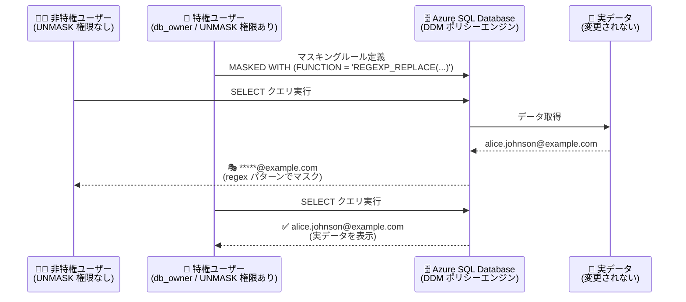

# Azure SQL Database: Regex ベースの動的データマスキング (DDM) パブリックプレビュー

**リリース日**: 2026-07-31

**サービス**: Azure SQL Database

**機能**: Regex-based Dynamic Data Masking (正規表現ベースの動的データマスキング)

**ステータス**: In preview

[このアップデートのインフォグラフィックを見る](https://takech9203.github.io/azure-news-summary/20260731-sql-late-july-updates.html)

## 概要

2026 年 7 月下旬の Azure SQL アップデートとして、**正規表現 (Regex) ベースの動的データマスキング (DDM)** がパブリックプレビューで発表されました。このアップデートは、既存の組み込み DDM 機能を拡張し、`REGEXP_REPLACE` を新しいマスキング関数として導入するものです。メールアドレス、電話番号、識別子 (ID 番号) などの機密データを、パターンベースのルールでデータベース層において一元的にマスキングできます。

動的データマスキング (DDM) は、クエリ結果内の機密データをアプリケーションに送信される前に動的に隠蔽するポリシーベースのセキュリティ機能です。データベース内の実データは変更されず、非特権ユーザーにはマスクされた値のみが表示されます。今回の Regex 対応により、組み込みマスクでは表現できなかった可変長データのマスキングや、特定セグメントのみを可視化するといった柔軟な制御が可能になります。

**アップデート前の課題**

- 組み込みマスキング関数 (`default()`, `email()`, `random()`, `partial()`, `datetime()`) は固定的なパターンしか適用できず、可変長データに対して柔軟性がなかった
- 例えば組み込みの `email()` マスクは常に `aXXX@xxxx.com` 形式で出力され、ユーザー名の先頭 1 文字のみ公開しドメイン名を隠蔽するため、業務ワークフローでドメイン名を保持したい場合に対応できなかった
- 電話番号の国番号のみ表示するなど、可変長パターンで「どの部分を見せてどの部分を隠すか」を細かく定義できなかった

**アップデート後の改善**

- `REGEXP_REPLACE` マスキング関数により、正規表現パターンで公開・隠蔽するサブストリングを正確に定義可能になった
- メールのドメイン名を保持したままユーザー名部分のみをマスクする、電話番号の国番号のみ公開するなど、業務要件に応じたカスタムマスクを作成できるようになった
- アプリケーションコードにマスキングロジックを追加することなく、データベース層で一元的にパターンベースのマスキングを適用できるようになった

## アーキテクチャ図



DDM はクエリ結果セットに対してマスキングを適用するため、ストレージ上の実データは変更されません。`UNMASK` 権限の有無により、同じクエリでもユーザーごとに表示内容が変わります。

## サービスアップデートの詳細

### 主要機能

1. **`REGEXP_REPLACE` マスキング関数の追加**
   - 正規表現パターン (`pattern_expression`) と置換文字列 (`string_replacement`) を指定して、パターンに一致した部分を置換するマスキングルールを定義できる
   - パターン式の最大長は 8,000 バイト
   - キャプチャグループ (`\1` など) を置換文字列で参照でき、「国番号のみ残す」「ドメインのみ残す」といった部分的な公開が可能

2. **可変長・構造化文字列データへの対応**
   - メールアドレス、電話番号、ID 番号などの構造化されたデータパターンに対して、可視化するセグメントと隠蔽するセグメントを正確に制御できる
   - 対応データ型: `char`, `nchar`, `varchar`, `nvarchar`、および LOB 型 (`varchar(max)`, `nvarchar(max)`) は 2 MB まで

3. **既存の権限モデルをそのまま利用**
   - 新しい権限は導入されず、既存の DDM と同じ権限モデル (`UNMASK` 権限、`db_owner` などの管理者ロール) が適用される
   - `UNMASK` 権限はデータベース / スキーマ / テーブル / 列レベルで付与・剥奪可能

4. **メタデータによるポリシー確認**
   - システムビュー `sys.masked_columns` で `REGEXP_REPLACE` マスク定義を含む構成済みマスクを確認できる

## 技術仕様

| 項目 | 詳細 |
|------|------|
| 対象サービス | Azure SQL Database (Regex ベース DDM のプレビュー対象) |
| マスキング関数 | `REGEXP_REPLACE("<pattern_expression>", "<string_replacement>")` |
| パターン式の最大長 | 8,000 バイト |
| 対応データ型 | `char`, `nchar`, `varchar`, `nvarchar`, LOB 型 (`varchar(max)`, `nvarchar(max)`) は 2 MB まで |
| 固定引数 | *start* = 1、*occurrence* = 0 (全一致を置換)、*flags* = `'c'` (大文字小文字を区別)。マスキング関数として使用する場合は変更不可 |
| 設定方法 | T-SQL のみ (本リリースでは Azure Portal での regex マスク構成は未対応) |
| 権限モデル | 既存 DDM と同一 (`UNMASK` 権限、新規権限の追加なし) |
| ポリシー確認 | `sys.masked_columns` システムビュー |

## 設定方法

### 前提条件

1. Azure SQL Database (パブリックプレビュー対象)
2. DDM の構成には SQL Security Manager / SQL DB Contributor / SQL Server Contributor などのロール、または T-SQL での相応の権限が必要
3. Regex マスクの構成は T-SQL で行う (Azure Portal は本リリースでは未対応)

### T-SQL

テーブル作成時に regex マスクを適用する例 (電話番号は国番号のみ、メールはドメインのみ公開):

```sql
CREATE TABLE Data.CustomerDetails (
    ID INT IDENTITY(1,1) PRIMARY KEY,
    Name varchar(30),
    Phone_Number varchar(30)
        MASKED WITH (FUNCTION = 'REGEXP_REPLACE(
            "(\+\d{1,3})(?:[ -.]?\d){7,14}",
            "(\1)-xxxx")'),
    Email varchar(255)
        MASKED WITH (FUNCTION = 'REGEXP_REPLACE(
            "([a-zA-Z0-9._%+-]+)(@+)([a-zA-Z0-9.-]+)(\.)(\w)",
            "*****\2\3\4\5")')
);
```

既存の列に regex マスクを追加する例:

```sql
ALTER TABLE Data.CustomerDetails
ALTER COLUMN Phone_Number
ADD MASKED WITH (FUNCTION = 'REGEXP_REPLACE(
    "(\+\d{1,3})(?:[ -.]?\d){7,14}",
    "(\1)-xxxx")');
```

`UNMASK` 権限の付与と確認:

```sql
-- UNMASK 権限のないテストユーザーを作成
CREATE USER SupportEngineer WITHOUT LOGIN;
GRANT SELECT ON Data.CustomerDetails TO SupportEngineer;

-- 非特権ユーザーとしてクエリ (マスクされた値が表示される)
EXECUTE AS USER = 'SupportEngineer';
SELECT * FROM Data.CustomerDetails;
REVERT;

-- UNMASK 権限を付与すると実データが表示される
GRANT UNMASK ON Data.CustomerDetails TO SupportEngineer;
```

マスキングポリシーの確認:

```sql
SELECT c.name,
       tbl.name AS table_name,
       c.is_masked,
       c.masking_function
FROM sys.masked_columns AS c
JOIN sys.tables AS tbl
    ON c.[object_id] = tbl.[object_id]
WHERE is_masked = 1;
```

## メリット

### ビジネス面

- コールセンターやサポート業務などで、業務に必要な部分 (ドメイン名、国番号など) のみを開示しつつ機密部分を隠蔽でき、コンプライアンス要件と業務効率を両立できる
- マスキングロジックをアプリケーションコードから排除し、データベース層で一元管理できるため、ガバナンスの統制が容易になる
- 開発者がトラブルシューティング目的で本番環境をクエリする際も、機密データの偶発的な露出を低減できる

### 技術面

- 組み込みマスクでは表現できない可変長パターンのマスキングが可能
- 正規表現のキャプチャグループを利用した柔軟な部分公開 (国番号のみ、ドメインのみなど) ができる
- 既存の権限モデル (`UNMASK`) をそのまま利用でき、新しい権限管理の学習コストが不要
- 実データはストレージ上で変更されないため、マスキングルールの追加・削除がデータに影響しない

## デメリット・制約事項

- **パブリックプレビュー**であり、SLA および限定保証の対象外。非本番環境でのみ使用が推奨される
- **regex マスクはパターン依存**: パターンに一致しない値はマスクされず、非特権ユーザーに生データが返されるため、機密情報が露出する可能性がある。本番適用前に代表的なデータでパターンを検証する必要がある
- NULL 値、空文字列、非典型的なフォーマットなどのエッジケースを含めた十分なテストが必要
- Regex マスクの構成は **T-SQL のみ**対応。本リリースでは Azure Portal から構成できない
- `REGEXP_REPLACE` をマスキング関数として使用する場合、*start*, *occurrence*, *flags* 引数は固定値 (start = 1, occurrence = 0, flags = 'c') で上書きできない
- 対応データ型は文字列型のみ (LOB 型は 2 MB まで)

## ユースケース

### ユースケース 1: サポート業務でのメールドメイン確認

**シナリオ**: サポートエンジニアが顧客の所属組織 (メールドメイン) を確認する必要があるが、個人を特定できるユーザー名部分は開示したくない。

**実装例**:

```sql
ALTER TABLE Data.CustomerDetails
ALTER COLUMN Email
ADD MASKED WITH (FUNCTION = 'REGEXP_REPLACE(
    "([a-zA-Z0-9._%+-]+)(@+)([a-zA-Z0-9.-]+)(\.)(\w)",
    "*****\2\3\4\5")');
```

**効果**: `alice.johnson@example.com` が `*****@example.com` と表示され、ドメイン名を業務に活用しつつユーザー名を保護できる。組み込みの `email()` マスク (`aXX@XXXX.com`) では実現できなかった要件に対応。

### ユースケース 2: 国際電話番号の国番号のみ公開

**シナリオ**: グローバル顧客データベースで、地域別の分析やルーティングのために国番号は表示したいが、電話番号本体は隠蔽したい。

**実装例**:

```sql
ALTER TABLE Data.CustomerDetails
ALTER COLUMN Phone_Number
ADD MASKED WITH (FUNCTION = 'REGEXP_REPLACE(
    "(\+\d{1,3})(?:[ -.]?\d){7,14}",
    "(\1)-xxxx")');
```

**効果**: `+81 90 1234 5678` が `(+81)-xxxx` と表示され、国番号 (+1, +44, +81 など) の文脈を保持したまま番号本体をマスクできる。

## 料金

このアップデートに固有の料金情報は公式情報として確認できませんでした。Azure SQL Database の料金の詳細は以下の料金ページを参照してください。

- [Azure SQL Database の料金](https://azure.microsoft.com/pricing/details/azure-sql-database/)

## 関連サービス・機能

- **既存の動的データマスキング (DDM)**: 本アップデートは組み込みマスキング関数 (`default()`, `email()`, `random()`, `partial()`, `datetime()`) を持つ既存 DDM 機能の拡張。既存 DDM は Azure SQL Database のほか、Azure SQL Managed Instance、Azure Synapse Analytics (専用 SQL プール)、Fabric の SQL Database でもサポートされる
- **Microsoft Entra ID**: `UNMASK` 権限を Entra ID のユーザー、グループ、アプリケーションに対して管理でき、Azure 環境内の ID 基盤と統合したアクセス制御が可能
- **T-SQL `REGEXP_REPLACE` 関数**: マスキング関数の基盤となるネイティブ T-SQL の正規表現置換関数

## 参考リンク

- [インフォグラフィック](https://takech9203.github.io/azure-news-summary/20260731-sql-late-july-updates.html)
- [公式アップデート情報](https://azure.microsoft.com/updates?id=568139)
- [Regex-based dynamic data masking (preview) - Microsoft Learn](https://learn.microsoft.com/en-us/azure/azure-sql/database/dynamic-data-masking-regex?view=azuresql)
- [Dynamic Data Masking の概要 - Microsoft Learn](https://learn.microsoft.com/azure/azure-sql/database/dynamic-data-masking-overview)
- [REGEXP_REPLACE (Transact-SQL) - Microsoft Learn](https://learn.microsoft.com/sql/t-sql/functions/regexp-replace-transact-sql)
- [料金ページ](https://azure.microsoft.com/pricing/details/azure-sql-database/)

## まとめ

Azure SQL Database の動的データマスキングに `REGEXP_REPLACE` ベースのパターンマスキングがパブリックプレビューとして追加されました。組み込みマスクの固定的なパターンでは対応できなかった「ドメイン名は残してユーザー名だけ隠す」「国番号だけ公開する」といった柔軟なマスキング要件に、アプリケーション改修なしでデータベース層から対応できます。パターンに一致しない値はマスクされずに返される点が最大の注意点であり、導入時は NULL・空文字列・非典型フォーマットを含む代表データでの検証が不可欠です。現時点ではプレビューのため、まずは非本番環境で既存の DDM ルールと組み合わせた評価を推奨します。

---

**タグ**: Azure SQL Database, Dynamic Data Masking, DDM, REGEXP_REPLACE, セキュリティ, データ保護, In preview, Databases
