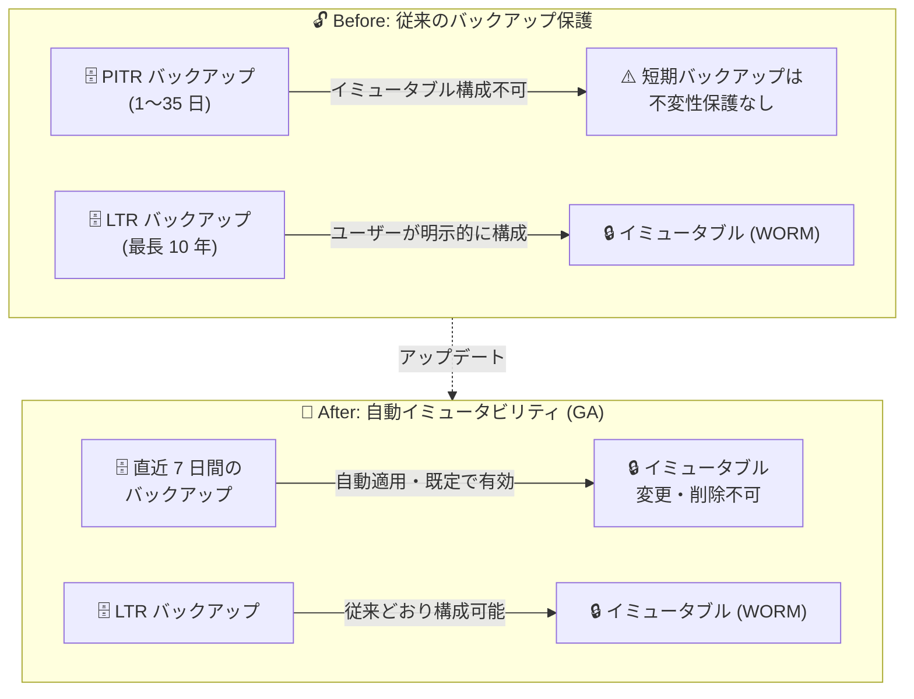

# Azure SQL Database / Azure SQL Managed Instance: 直近 7 日間のバックアップへの自動イミュータビリティ適用が一般提供開始 (GA)

**リリース日**: 2026-08-03

**サービス**: Azure SQL Database / Azure SQL Managed Instance

**機能**: 直近 7 日間のバックアップへのイミュータビリティ (不変性) の自動適用

**ステータス**: Launched (GA)

[このアップデートのインフォグラフィックを見る](https://takech9203.github.io/azure-news-summary/20260803-sql-backup-immutability.html)

## 概要

Azure SQL Database および Azure SQL Managed Instance において、直近 7 日間のバックアップにイミュータビリティ (不変性) が自動的に適用される機能が一般提供 (GA) されました。バックアップ保護の強化を目的とした機能で、プレビュー期間を経ずに直接 GA として提供されています。

この機能は**すべてのデータベースで既定で有効**になっており、ユーザー側の設定や操作は一切不要です。また、構成されているポイントインタイム リストア (PITR) の保持期間の設定値に関係なく、直近 7 日間のバックアップに適用されます。なお、Azure SQL Hyperscale のバックアップへの対応は今後のリリースで提供予定です。

イミュータビリティが適用されたバックアップは変更・削除ができない状態で保持されるため、偶発的または悪意のある削除・改変からバックアップを保護できます。従来からある長期保持 (LTR) バックアップのイミュータビリティ (ユーザーが明示的に構成する機能) を補完し、短期のリストアポイントに対する保護を既定で提供するものです。

**アップデート前の課題**

- Azure SQL のバックアップ イミュータビリティは長期保持 (LTR) バックアップに対してのみ構成可能であり、PITR (短期保持) バックアップはイミュータブル構成をサポートしていなかった (公式ドキュメントの復元機能比較表にも「PITR: Not supported」と記載)
- LTR のイミュータビリティはユーザーが時間ベースのポリシーやリーガルホールドを明示的に構成する必要があった

**アップデート後の改善**

- 直近 7 日間のバックアップにイミュータビリティが**自動的に**適用されるようになった
- すべてのデータベースで既定で有効となり、ユーザーによる設定・操作が不要
- 構成済みの PITR 保持期間の長短にかかわらず適用されるため、直近のリストアポイントが一律で保護される

## アーキテクチャ図

従来はイミュータビリティの構成が LTR バックアップに限られていましたが、本アップデートにより直近 7 日間のバックアップへ自動的に不変性が適用され、設定不要で保護されるようになりました。

## サービスアップデートの詳細

### 主要機能

1. **直近 7 日間のバックアップへの自動イミュータビリティ適用**
   - バックアップ保護を強化するため、直近 7 日間のバックアップが変更・削除不可の状態で保持される

2. **既定で有効・設定不要**
   - すべてのデータベースで既定で有効化され、ユーザー側の有効化操作や構成変更は不要

3. **PITR 保持期間の設定に非依存**
   - 構成されているポイントインタイム リストアの保持期間 (Azure SQL Database では 1〜35 日で構成可能) にかかわらず、直近 7 日間分に適用される

## 技術仕様

| 項目 | 詳細 |
|------|------|
| 対象サービス | Azure SQL Database、Azure SQL Managed Instance |
| 適用範囲 | 直近 7 日間のバックアップ |
| 有効化 | 既定で有効 (ユーザー操作不要) |
| PITR 保持期間との関係 | 構成された保持期間の設定値に関係なく適用 |
| Hyperscale 対応 | 未対応 (今後のリリースで対応予定) |
| 提供形態 | プレビューなしで直接 GA (2026 年 8 月) |

## 設定方法

本機能は既定で有効であり、有効化のための設定・操作は不要です。

なお、長期保持 (LTR) バックアップに対するイミュータビリティ (時間ベース / リーガルホールド) は、従来どおりユーザーによる構成が必要です。構成方法は [Backup immutability](https://learn.microsoft.com/azure/azure-sql/database/backup-immutability) を参照してください。

## メリット

### ビジネス面

- バックアップの偶発的または悪意のある削除・改変に対する保護が既定で提供され、データ保護態勢が強化される
- 設定不要のため、運用負荷や設定漏れのリスクなしに全データベースへ一律の保護を適用できる

### 技術面

- 短い PITR 保持期間 (例: 1 日) を設定している場合でも、直近 7 日間のバックアップが保護対象となる
- LTR イミュータビリティ (時間ベース / リーガルホールド) と組み合わせることで、短期・長期の両方でバックアップの不変性を確保できる

## デメリット・制約事項

- Azure SQL Hyperscale のバックアップは現時点で対象外 (今後のリリースで対応予定)
- 適用範囲は直近 7 日間に固定であり、この自動イミュータビリティの期間をユーザーが変更できるという情報は公式アナウンスに記載されていない

## 料金

本機能 (直近 7 日間の自動イミュータビリティ) に固有の料金情報は、公式アナウンスには記載されていません。参考として、LTR バックアップのイミュータビリティについては、公式ドキュメントで「イミュータビリティの有効化自体に追加コストはない」と記載されています。

バックアップ ストレージの料金は、購入モデル (DTU / vCore)、バックアップ ストレージ冗長性、リージョンによって異なります。詳細は料金ページを参照してください。

- [Azure SQL Database の料金](https://azure.microsoft.com/pricing/details/azure-sql-database/single/)
- [Azure SQL Managed Instance の料金](https://azure.microsoft.com/pricing/details/azure-sql-managed-instance/single/)

## 関連サービス・機能

- **ポイントインタイム リストア (PITR)**: 短期保持バックアップによる任意時点への復元機能。Azure SQL Database では既定 7 日間、1〜35 日で構成可能 (Basic は 1〜7 日)。本アップデートにより直近 7 日間のバックアップが不変性で保護される
- **長期保持 (LTR) バックアップ イミュータビリティ**: LTR バックアップを WORM (Write Once, Read Many) 状態で保持する機能。時間ベースのイミュータビリティは GA、リーガルホールドはプレビュー。SEC Rule 17a-4(f)、FINRA Rule 4511(c)、CFTC Rule 1.31(c)-(d) などの規制要件に対応
- **バックアップ ストレージ冗長性 (LRS / ZRS / GRS / GZRS)**: バックアップの保存先ストレージの冗長構成。geo 冗長構成では geo リストアによるリージョン間復元が可能

## 参考リンク

- [インフォグラフィック](https://takech9203.github.io/azure-news-summary/20260803-sql-backup-immutability.html)
- [公式アップデート情報](https://azure.microsoft.com/updates?id=568339)
- [Automated backups in Azure SQL Database (Microsoft Learn)](https://learn.microsoft.com/azure/azure-sql/database/automated-backups-overview)
- [Backup immutability (Microsoft Learn)](https://learn.microsoft.com/azure/azure-sql/database/backup-immutability)
- [Azure SQL Database の料金ページ](https://azure.microsoft.com/pricing/details/azure-sql-database/single/)

## まとめ

Azure SQL Database と Azure SQL Managed Instance の直近 7 日間のバックアップに、イミュータビリティが自動適用されるようになりました。すべてのデータベースで既定で有効・設定不要であり、ユーザー側のアクションなしでバックアップの削除・改変への耐性が強化されます。従来イミュータビリティは LTR バックアップに限られていたため、短期リストアポイントの保護が既定化された意義は大きいと言えます。Solutions Architect としては、本機能が既定で適用されることを把握した上で、規制要件がある場合は LTR の時間ベース イミュータビリティやリーガルホールドとの組み合わせを検討してください。Hyperscale を利用している場合は、対応が今後のリリース予定である点に注意が必要です。

---

**タグ**: Azure SQL Database, Azure SQL Managed Instance, Backup, Immutability, Security, Databases, GA
