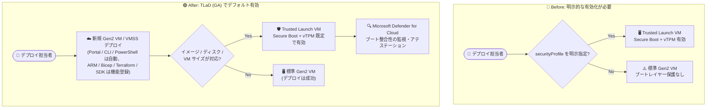

# Azure Virtual Machines: Trusted Launch as Default (TLaD) の一般提供開始

**リリース日**: 2026-08-03

**サービス**: Azure Virtual Machines / Virtual Machine Scale Sets

**機能**: Trusted Launch as Default (TLaD)

**ステータス**: Launched (GA)

[このアップデートのインフォグラフィックを見る](https://takech9203.github.io/azure-news-summary/20260803-trusted-launch-as-default.html)

## 概要

Trusted Launch as Default (TLaD) が、新規の Azure Gen2 仮想マシン (VM) および仮想マシンスケールセット (VMSS) 向けに一般提供 (GA) となった。TLaD は、対応するデプロイに対して Secure Boot と vTPM を自動的に有効化し、追加コストなしで新規 VM のセキュリティベースラインを強化する「Secure by Default」の取り組みである。GA は 2026 年 7 月に開始された。

Azure Portal、Azure CLI、Azure PowerShell 経由でデプロイされる新規 Gen2 VM は、機能登録の有無にかかわらず既定で Trusted Launch が有効になる。ARM テンプレート、Bicep、Terraform、Azure SDK 経由のデプロイでは、サブスクリプションに対する一度きりの機能登録 (`TrustedLaunchByDefaultPreview`) を行い、API バージョン 2025-11-01 以降を使用することで同じデフォルト動作が適用される。既存 VM は変更されず、デプロイコードで明示的に指定されたセキュリティ設定はそのまま尊重される。

**アップデート前の課題**

- Trusted Launch を有効にするには、デプロイコードに `securityProfile` 要素 (`securityType: TrustedLaunch`、`secureBootEnabled: true`、`vTpmEnabled: true`) を明示的に追加する必要があった
- `securityProfile` の記述がないデプロイでは Trusted Launch が無効のまま VM / VMSS が作成され、ブートキット・ルートキットなどの低レイヤー攻撃に対する保護が適用されなかった
- 組織全体で一貫したセキュリティベースラインを確立するには、テンプレートごとの修正やポリシーによる強制が必要だった

**アップデート後の改善**

- Azure Portal / CLI / PowerShell からの新規 Gen2 VM 作成では、既定で Secure Boot と vTPM が有効化される
- ARM テンプレート / Bicep / Terraform / SDK でも、サブスクリプションへの一度きりの機能登録で既存のデプロイスクリプトを変更せずに Trusted Launch がデフォルト適用される (ゼロタッチでのセキュリティ強化)
- イメージ・ディスク・VM サイズが Trusted Launch 未対応の場合は自動的にフォールバックし、Trusted Launch なしの Gen2 VM としてデプロイが成功する (デプロイ失敗を回避)

## アーキテクチャ図



従来は `securityProfile` の明示指定がなければ Trusted Launch なしで VM が作成されていたが、TLaD により対応条件を満たす新規 Gen2 デプロイでは Secure Boot と vTPM が既定で有効化される。

## サービスアップデートの詳細

### 主要機能

1. **Secure Boot のデフォルト有効化**
   - プラットフォームファームウェアで実装され、署名された OS ブートローダー・カーネル・ドライバーのみの起動を許可する
   - マルウェアベースのルートキット・ブートキットの実行を防ぎ、VM のソフトウェアスタックに対する「信頼の起点 (root of trust)」を確立する

2. **vTPM (仮想 Trusted Platform Module) のデフォルト有効化**
   - TPM 2.0 仕様に準拠した仮想 TPM を VM 専用に提供し、鍵・証明書・シークレットの安全な保管庫として機能する
   - VM のブートチェーン全体 (UEFI、OS、システム、ドライバー) を測定し、クラウド経由のリモートアテステーション (構成証明) を可能にする

3. **クライアントツール別のデフォルト適用**
   - Azure Portal / Azure CLI / Azure PowerShell: 機能登録なしで新規 Gen2 VM に Trusted Launch が既定で適用される
   - ARM テンプレート / Bicep / Terraform / Azure SDK: サブスクリプションで `TrustedLaunchByDefaultPreview` 機能を登録し、API バージョン 2025-11-01 以降を使用すると既定で適用される
   - デプロイコードで明示的に指定した設定 (`securityType: Standard` など) はオーバーライドされない

4. **安全なフォールバック動作**
   - ソースイメージ (Marketplace / Azure Compute Gallery)、ソースディスク、VM サイズのいずれかが Trusted Launch 未対応の場合、デフォルト適用は行われず、Trusted Launch なしの Gen2 VM / VMSS としてデプロイが正常に完了する

## 技術仕様

| 項目 | 詳細 |
|------|------|
| 対象リソース | 新規作成の Gen2 VM および VMSS (既存リソースは変更されない) |
| アーキテクチャ | x64 および Arm64 の対応 Gen2 VM サイズ |
| 有効化される機能 | Secure Boot、vTPM (TPM 2.0 準拠) |
| デフォルト適用 (登録不要) | Azure Portal、Azure CLI、Azure PowerShell |
| デフォルト適用 (機能登録が必要) | ARM テンプレート、Bicep、Terraform、Azure SDK (`TrustedLaunchByDefaultPreview` を `Microsoft.Compute` 名前空間で登録) |
| 必要な API バージョン | Microsoft.Compute API 2025-11-01 以降 |
| デフォルト適用の条件 | ソース OS イメージ・ソースディスク・VM サイズがすべて Trusted Launch 対応であること |
| オプトアウト | `securityType` に `Standard` を指定 (API 2025-11-01 以降)、または機能登録の解除 |
| 対応 VM サイズ (代表例) | B / D / F / Fx / E / Eb / L ファミリ、NC / ND / NV ファミリ、HBv3-v5 / HC / HX シリーズ、Arm64 は Dpsv6 / Dplsv6 / Epsv6 (Cobalt 100) など |
| 非対応 VM サイズ (代表例) | A / Dv2 / Dv3 ファミリ、M ファミリ (Mbdsv4 プレビューを除く)、DC / EC Confidential ファミリなど (Gen2 非対応サイズ含む) |
| 対応 OS (代表例) | Windows Server 2016-2025、Windows 10/11、Ubuntu 18.04-26.04 LTS、RHEL 8/9/10、SLES 15/16、Debian 11-13、Alma Linux、Azure Linux、Oracle Linux、Rocky Linux |
| Trusted Launch 非対応機能 | Managed Image (Azure Compute Gallery の利用を推奨)、Linux VM の休止状態 (Hibernation) |

## 設定方法

### 前提条件

1. Gen2 VM に対応した OS イメージ・ディスク・VM サイズを使用していること
2. ARM テンプレート / Bicep / Terraform / SDK でデフォルト適用する場合は、対象サブスクリプションで機能登録を行うこと

### Azure CLI

```bash
# ARM/Bicep/Terraform/SDK デプロイで TLaD を有効化するための機能登録 (一度きり)
az feature register --namespace Microsoft.Compute --name TrustedLaunchByDefaultPreview

# 登録状態の確認
az feature show --namespace Microsoft.Compute --name TrustedLaunchByDefaultPreview

# 新規 Gen2 VM の作成 (CLI は機能登録なしで Trusted Launch が既定で有効)
az vm create \
  --resource-group myResourceGroup \
  --name myVM \
  --image Ubuntu2404 \
  --size Standard_D4s_v5

# TLaD を無効化する場合 (機能登録の解除)
az feature unregister --namespace Microsoft.Compute --name TrustedLaunchByDefaultPreview
```

### Azure Portal

Azure Portal から新規 Gen2 VM を作成すると、機能登録の有無にかかわらず Trusted Launch (Secure Boot + vTPM) が既定で有効になる。個別の VM で Trusted Launch を使用しない場合は、デプロイ時にセキュリティの種類を Standard に変更する (Portal 以外のクライアントツールでは `securityType: Standard` を明示指定する)。

## メリット

### ビジネス面

- 追加コストなしで新規 VM / VMSS のセキュリティベースラインを組織全体で底上げできる
- 既存のデプロイスクリプトを変更せず、サブスクリプションの一度きりの登録だけで適用できる (ゼロタッチ)
- Secure by Default の実現により、セキュリティ設定の漏れによるコンプライアンス逸脱リスクを低減できる

### 技術面

- Secure Boot によりブートキット・ルートキット・低レイヤーマルウェアの実行を防止できる
- vTPM によるブートチェーン全体の測定とリモートアテステーションで、VM が正常に起動したことを暗号学的に証明できる
- Microsoft Defender for Cloud との統合により、ブート整合性監視やアテステーション失敗時のアラートを利用できる
- 未対応構成では自動的にフォールバックするため、デフォルト化によるデプロイ失敗が発生しない

## デメリット・制約事項

- Trusted Launch VM / VMSS は、Trusted Launch 未対応の VM サイズファミリ (M シリーズなど) へのリサイズができない。回避策として、`UseStandardSecurityType` 機能フラグを `Microsoft.Compute` 名前空間で登録し、リソースを割り当て解除のうえ API 2025-11-01 以降で `securityType` を `Standard` に変更する必要がある (この操作は Azure Portal では実行できない)
- Trusted Launch では Managed Image と Linux VM の休止状態 (Hibernation) が利用できない
- ARM テンプレート / Bicep / Terraform / SDK でのデフォルト適用にはサブスクリプションごとの機能登録と API バージョン 2025-11-01 以降が必要
- Linux VM への GRID ドライバーのインストールには Secure Boot の無効化が必要。Secure Boot 有効な Ubuntu VM への CUDA ドライバーのインストールには追加手順が必要
- Azure Portal / CLI / PowerShell では機能登録を解除しても新規 Gen2 VM は Trusted Launch がデフォルトのままとなる (個別に `Standard` を指定して回避)

## ユースケース

### ユースケース 1: IaC パイプライン全体のセキュリティベースライン強化

**シナリオ**: Terraform や Bicep で多数の VM / VMSS を管理している組織が、テンプレートを個別修正することなく全新規デプロイに Secure Boot と vTPM を適用したい。

**実装例**:

```bash
# サブスクリプションで一度だけ機能登録
az feature register --namespace Microsoft.Compute --name TrustedLaunchByDefaultPreview

# 以降、既存の Terraform / Bicep デプロイをそのまま実行すると
# 対応する新規 Gen2 VM / VMSS は Trusted Launch がデフォルトで有効になる
```

**効果**: テンプレート改修なしで新規デプロイのセキュリティベースラインを統一でき、`securityProfile` の記載漏れによる保護の抜けを防止できる。

### ユースケース 2: Defender for Cloud によるブート整合性監視

**シナリオ**: TLaD で作成された Trusted Launch VM に対し、ブートチェーンの改ざんを継続的に監視したい。

**実装例**: Secure Boot と vTPM が有効な VM に Guest Attestation 拡張機能をインストールすると、Microsoft Defender for Cloud がリモートアテステーションによるブート整合性監視を実施する。アテステーション失敗時には中重要度のアラートが発行される。

**効果**: 信頼済みベースラインからの逸脱 (未承認モジュールのロードなど) や vTPM 由来でないアテステーションを検知し、OS 侵害の早期発見につなげられる。

## 料金

Trusted Launch は既存の VM 料金に対する追加コストを発生させない。TLaD によるデフォルト有効化も追加料金なしで利用できる。

| 項目 | 料金 |
|------|------|
| Trusted Launch (Secure Boot / vTPM) | 追加料金なし (VM 本体の料金のみ) |

- [Virtual Machines の料金ページ](https://azure.microsoft.com/pricing/details/virtual-machines/)

## 利用可能リージョン

- すべての Azure パブリックリージョン
- すべての Azure Government リージョン
- すべての Azure China リージョン

## 関連サービス・機能

- **Microsoft Defender for Cloud**: Trusted Launch と統合され、Secure Boot / vTPM の有効化推奨、Guest Attestation 拡張機能のインストール推奨、ブート整合性監視、アテステーション失敗アラート、信頼されていない Linux カーネルモジュールのアラートを提供する
- **Azure Compute Gallery (ACG)**: Trusted Launch では Managed Image が非対応のため、カスタムイメージの管理には ACG の利用が推奨される。Trusted Launch 対応として検証済みの ACG イメージは TLaD のデフォルト適用対象となる
- **仮想化ベースのセキュリティ (VBS)**: Trusted Launch を基盤として、Windows VM でハイパーバイザーコード整合性 (HVCI) や Windows Defender Credential Guard を有効化できる
- **Gen1 → Gen2 アップグレード**: 既存の Gen1 VM は Gen2-Trusted Launch にアップグレードすることで Secure Boot と vTPM を有効化できる

## 参考リンク

- [インフォグラフィック](https://takech9203.github.io/azure-news-summary/20260803-trusted-launch-as-default.html)
- [公式アップデート情報](https://azure.microsoft.com/updates?id=568600)
- [Tech Community ブログ: Secure by default - Trusted Launch as Default is now Generally Available](https://techcommunity.microsoft.com/blog/microsoft-security-blog/secure-by-default-trusted-launch-as-default-is-now-generally-available/4541672)
- [Microsoft Learn: Trusted Launch for Azure VMs](https://learn.microsoft.com/azure/virtual-machines/trusted-launch)
- [Microsoft Learn: Trusted Launch FAQ](https://learn.microsoft.com/azure/virtual-machines/trusted-launch-faq)
- [Microsoft Learn: 既存 Gen2 VM での Trusted Launch 有効化](https://learn.microsoft.com/azure/virtual-machines/trusted-launch-existing-vm)
- [Virtual Machines の料金ページ](https://azure.microsoft.com/pricing/details/virtual-machines/)

## まとめ

Trusted Launch as Default (TLaD) の GA により、新規の Azure Gen2 VM / VMSS は追加コストなしで Secure Boot と vTPM が既定で有効化され、ブートレイヤーの攻撃に対する保護が「デフォルトで有効」になった。Portal / CLI / PowerShell 利用時は登録不要で自動適用され、IaC (ARM / Bicep / Terraform / SDK) 利用時もサブスクリプションへの一度きりの機能登録でゼロタッチ適用できる。Solutions Architect としては、(1) IaC 主体のサブスクリプションでの `TrustedLaunchByDefaultPreview` の登録、(2) M シリーズ等の非対応サイズへのリサイズ制約や Managed Image / Linux Hibernation 非対応の確認、(3) Defender for Cloud のブート整合性監視との組み合わせによる検知体制の整備、を推奨する。

---

**タグ**: Azure Virtual Machines, Virtual Machine Scale Sets, Trusted Launch, Secure Boot, vTPM, Security, GA
