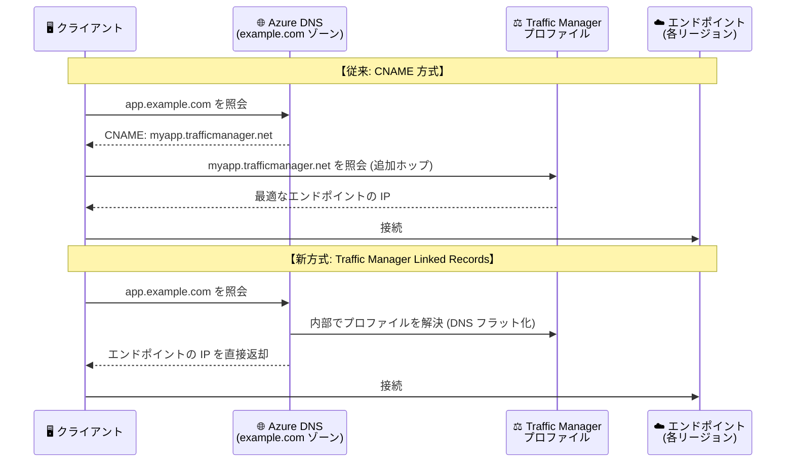

# Azure DNS: Traffic Manager 統合による DNS ベースのロードバランシング (Public Preview)

**リリース日**: 2026-08-04

**サービス**: Azure DNS / Azure Traffic Manager

**機能**: Traffic Manager Linked Records (Traffic Manager 統合による DNS ベースのロードバランシング)

**ステータス**: In preview

[このアップデートのインフォグラフィックを見る](https://takech9203.github.io/azure-news-summary/20260804-azure-dns-traffic-manager-integration.html)

## 概要

Azure DNS が Azure Traffic Manager とシームレスに統合し、DNS ベースのトラフィックルーティングを実現する新機能「Traffic Manager Linked Records」が Public Preview として発表された。Azure DNS のレコードセットを Traffic Manager プロファイルに直接関連付けることが可能になり、従来必要だった `trafficmanager.net` ドメインへの CNAME レコードの作成が不要になる。

この機能では、レコードセットの新しいプロパティ `trafficManagementProfile` でリンクを宣言すると、DNS クエリの解決時に Azure DNS が Traffic Manager プロファイルを内部的に解決し、エンドポイントの IP アドレス (A/AAAA レコード) または FQDN (CNAME レコード) をクライアントに直接返す。このプロセスは **DNS フラット化 (DNS flattening)** と呼ばれる。

CNAME ホップの排除により名前解決のレイテンシーが改善されるほか、署名されていない `trafficmanager.net` ドメインが CNAME ルックアップチェーンから除外されるため、ロードバランシングされたレコードで DNSSEC の互換性が確保される。

**アップデート前の課題**

- Traffic Manager を利用するには `trafficmanager.net` ドメインへの CNAME レコード (またはエイリアスレコード) が必要で、CNAME 型では追加の DNS ルックアップ (CNAME ホップ) が発生し、名前解決のレイテンシーが増加していた
- 署名されていない `trafficmanager.net` への中間ホップが DNSSEC の信頼チェーンを壊すため、DNSSEC 署名済みゾーンで Traffic Manager を利用できなかった
- 全 Azure 顧客のプロファイルをホストする共有ドメイン `trafficmanager.net` が DNS 応答に露出し、ファイアウォールで許可すると他の顧客の Traffic Manager プロファイルへのアクセスも意図せず許可されるリスクがあった
- 従来のエイリアスレコードでは、型の検証がレコード作成時のみで実施され、エンドポイントタイプの不整合による設定ミスが起こり得た

**アップデート後の改善**

- Azure DNS レコードセットを Traffic Manager プロファイルに直接関連付け、CNAME ホップなしでエンドポイントの IP アドレス/FQDN を直接返却 (レイテンシー改善)
- DNS 解決が Azure DNS インフラ内で完結するため、DNSSEC の信頼チェーンを維持でき、DNSSEC 署名済みゾーンで利用可能
- `trafficmanager.net` が DNS 応答に一切現れず、ファイアウォール要件やアタックサーフェスを削減
- Strictly Typed Profiles (STP) により Traffic Manager 側で型の一貫性を強制し、設定ミスを防止

## アーキテクチャ図

従来はクライアントが `trafficmanager.net` を再解決する追加ホップが必要だったのに対し、新方式では Azure DNS が Traffic Manager プロファイルを内部的に解決し、最終的な回答を 1 回の照会で直接返す。

## サービスアップデートの詳細

### 主要機能

1. **DNS フラット化 (統合解決モード)**
   - レコードセットの `trafficManagementProfile` プロパティで Traffic Manager プロファイルとのリンクを宣言
   - Azure DNS がプロファイルを内部解決し、A/AAAA レコードは IP アドレス、CNAME レコードは FQDN を直接返却
   - Traffic Manager Linked Records では統合モードが常に有効

2. **DNSSEC 互換性**
   - DNS 解決が Azure DNS インフラ内で完結し、署名されていない中間ホップが存在しないため、DNSSEC の信頼チェーンを維持
   - DNSSEC 署名済みゾーンでのロードバランシングが可能に

3. **ゾーン APEX (ネイキッドドメイン) 対応**
   - DNS プロトコル上 CNAME を配置できないゾーン APEX でも、IP アドレスを直接返すことで Traffic Manager を利用可能 (例: `www.contoso.com` だけでなく `contoso.com` 自体で利用可能)

4. **Strictly Typed Profiles (STP) による型強制**
   - リンクレコード作成時に Azure DNS が Traffic Manager プロファイルのエンドポイント構成と DNS レコードタイプの互換性を検証
   - プロファイルタイプ (IPv4 / IPv6) は作成時または既存プロファイルの構成設定で指定でき、一度設定すると変更不可
   - 宣言されたタイプと異なる IP バージョンのエンドポイント追加は拒否される

5. **ネスト構成・削除保護**
   - ネストされた Traffic Manager プロファイルをすべてのプロファイルタイプでサポート (エイリアスレコードでは非サポート)
   - リンクレコードが参照している間はプロファイルの削除がブロックされ、DNS レコードの意図しない破損を防止

## 技術仕様

| 項目 | 詳細 |
|------|------|
| リンク宣言プロパティ | レコードセットの `trafficManagementProfile` |
| 対応レコードタイプ | A (IPv4)、AAAA (IPv6)、CNAME (FQDN) |
| エンドポイント要件 | A: 全有効エンドポイントが IPv4 / AAAA: IPv6 / CNAME: FQDN ターゲット |
| TTL | 常に Traffic Manager プロファイルの DNS 構成から継承 (レコードセット側の TTL は無視) |
| プロファイルあたりのリンク数 | 最大 50 リンクレコード |
| ゾーン APEX | サポート (ネイキッドドメインで利用可能) |
| ネストされたプロファイル | 全プロファイルタイプでサポート |
| DNSSEC | 互換 (中間ホップなし) |
| STP の API バージョン | `2024-04-01-preview` (`ProfileProperties` の `recordType` プロパティ) |
| プロファイル削除 | リンクレコードが残っている間は削除不可 |

## エイリアスレコードとの比較

| 項目 | エイリアスレコード (`targetResource`) | Traffic Manager Linked Records (`trafficManagementProfile`) |
|------|------|------|
| 解決モード | CNAME 型は `trafficmanager.net` への CNAME ホップあり | 常に統合モード (IP を直接返却) |
| TTL のソース | DNS レコードセットの値 | 常に Traffic Manager プロファイル |
| 型の検証 | Azure DNS 側 (作成時のエンドポイント状態に依存) | Traffic Manager 側 (STP で強制) |
| ネストされたプロファイル | 非サポート | 全プロファイルタイプでサポート |
| `trafficmanager.net` の露出 | あり (CNAME 型) | なし |
| DNSSEC 互換性 | なし (署名されない中間ホップ) | あり |

**Traffic Manager Linked Records が推奨されるケース** (公式ドキュメントより):

- CNAME ホップのない最も直接的な DNS 解決を求める場合
- セキュリティやファイアウォールのコンプライアンス上、`trafficmanager.net` を通信経路から排除したい場合
- DNSSEC 署名済みゾーンで信頼チェーンを維持する必要がある場合
- STP による強い型強制を利用したい場合
- 新規に Traffic Manager 連携の DNS レコードを構成する場合

**エイリアスレコードが引き続き適するケース**:

- Traffic Manager 以外のリソース (Public IP、CDN、Front Door、ゾーン内レコードセット) を参照する場合
- 既存のエイリアス構成との後方互換性を維持したい場合

## メリット

### ビジネス面

- DNSSEC 対応が必須の政府・金融などコンプライアンス要件の厳しい環境でも、DNS ベースのグローバルロードバランシングを採用可能
- `trafficmanager.net` (全顧客共有ドメイン) をファイアウォールで許可する必要がなくなり、アタックサーフェスとセキュリティレビューの負担を削減
- ネイキッドドメイン (ゾーン APEX) で Traffic Manager を直接利用でき、ドメイン設計の自由度が向上

### 技術面

- CNAME ホップの排除により名前解決のレイテンシーが改善
- TTL がプロファイルの DNS 構成から常に継承されるため、DNS キャッシュがヘルス監視・フェールオーバーのタイミングを正確に反映
- STP による型強制とプロファイル削除保護で、運用上の設定ミス・事故を予防

## デメリット・制約事項

- Public Preview のため、[Azure プレビューの追加利用規約](https://azure.microsoft.com/support/legal/preview-supplemental-terms/) が適用される (本番利用は SLA 対象外)
- STP でプロファイルタイプ (IPv4/IPv6) は一度設定すると変更不可。変更が必要な場合は別タイプのプロファイルを新規作成する必要がある
- 同一プロファイルに A レコードと AAAA レコードを同時にリンクすることはできない (最初のリンクレコードがプロファイルタイプを確定)
- CNAME 型のリンクレコードには IP タイプの制限がない (FQDN ターゲットのエンドポイントはすべて許可)
- リンクレコードが残っている間は Traffic Manager プロファイルを削除できない (削除前にリンクレコードの削除が必要)
- レコードセット側で設定した TTL は無視される (常にプロファイル側の TTL を継承)
- Traffic Manager 以外のリソース参照には利用できない (従来どおりエイリアスレコードを使用)

## ユースケース

### ユースケース 1: DNSSEC 署名済みゾーンでのグローバルロードバランシング

**シナリオ**: DNSSEC が必須要件の組織が、独自ドメインでマルチリージョンのフェールオーバー/地理的ルーティングを実現したい。従来は `trafficmanager.net` への署名されていない CNAME ホップが DNSSEC 検証を壊すため、Traffic Manager を採用できなかった。

**効果**: Traffic Manager Linked Records では解決が Azure DNS 内で完結し信頼チェーンが維持されるため、DNSSEC 署名済みゾーンで Traffic Manager のルーティング機能 (優先度、地理、パフォーマンスなど) をそのまま利用できる。

### ユースケース 2: ゾーン APEX (ネイキッドドメイン) での Traffic Manager 利用

**シナリオ**: `www.contoso.com` ではなく `contoso.com` 自体で Traffic Manager によるトラフィック分散を行いたいが、DNS プロトコル上ゾーン APEX に CNAME レコードを配置できない。

**効果**: A/AAAA タイプのリンクレコードがエンドポイントの IP アドレスを直接返すため、ゾーン APEX でも Traffic Manager によるルーティングが可能になる。

### ユースケース 3: ファイアウォール要件の厳しい環境での名前解決

**シナリオ**: クライアント側の DNS/ファイアウォールポリシーで許可ドメインを厳格に管理しており、全 Azure 顧客が共有する `trafficmanager.net` を許可リストに追加したくない。

**効果**: DNS 応答に `trafficmanager.net` が一切現れないため、自社ドメインのみの許可で運用でき、他顧客のプロファイルへのアクセスを意図せず許可するリスクも排除できる。

## 料金

本アップデートに固有の料金情報は公式発表では確認できなかった。最新の料金は以下の公式料金ページを参照。

- [Azure DNS の料金](https://azure.microsoft.com/pricing/details/dns/)
- [Traffic Manager の料金](https://azure.microsoft.com/pricing/details/traffic-manager/)

## 利用可能リージョン

公式発表 (2026 年 8 月 Public Preview) では対象リージョンの明記は確認できなかった。詳細は [公式ドキュメント](https://learn.microsoft.com/azure/dns/dns-traffic-manager-linked-records) を参照。

## 関連サービス・機能

- **Azure Traffic Manager**: DNS ベースのグローバルトラフィックルーティングサービス。本機能により Azure DNS レコードセットから直接リンク可能になった
- **Azure DNS エイリアスレコード**: `targetResource` プロパティで Traffic Manager などの Azure リソースを参照する既存機能。Traffic Manager 参照については Linked Records への移行が推奨されている
- **Azure DNS の DNSSEC**: 本機能により、DNSSEC 署名済みゾーンでも Traffic Manager によるロードバランシングが利用可能になった
- **Azure Front Door**: L7 (HTTP/HTTPS) のグローバルロードバランシングを提供する代替・補完サービス。Front Door への参照は引き続きエイリアスレコードを使用する

## 参考リンク

- [インフォグラフィック](https://takech9203.github.io/azure-news-summary/20260804-azure-dns-traffic-manager-integration.html)
- [公式アップデート情報](https://azure.microsoft.com/updates?id=565214)
- [Traffic Manager Linked Records overview (Microsoft Learn)](https://learn.microsoft.com/azure/dns/dns-traffic-manager-linked-records)
- [Strictly Typed Profiles for Azure Traffic Manager (Microsoft Learn)](https://learn.microsoft.com/azure/traffic-manager/traffic-manager-strictly-typed-profiles)
- [Azure DNS alias records (Microsoft Learn)](https://learn.microsoft.com/azure/dns/dns-alias)
- [Azure DNS の料金](https://azure.microsoft.com/pricing/details/dns/)
- [Traffic Manager の料金](https://azure.microsoft.com/pricing/details/traffic-manager/)

## まとめ

Traffic Manager Linked Records は、Azure DNS と Traffic Manager の統合を「CNAME を介した間接参照」から「レコードセットへの直接リンク + DNS フラット化」へと進化させるアップデートである。CNAME ホップの排除によるレイテンシー改善に加え、これまで両立できなかった DNSSEC と DNS ベースロードバランシングの併用、ゾーン APEX での利用、`trafficmanager.net` 非露出によるセキュリティ強化を実現する。新規に Traffic Manager 連携の DNS レコードを構成する場合は本機能が推奨されており、DNSSEC 要件のある環境や既存のエイリアス構成を持つ環境では、Public Preview の段階で検証を開始し、GA 後の移行計画を検討する価値がある。

---

**タグ**: Azure DNS, Traffic Manager, Networking, Management and governance, DNS, Load Balancing, DNSSEC, Public Preview
