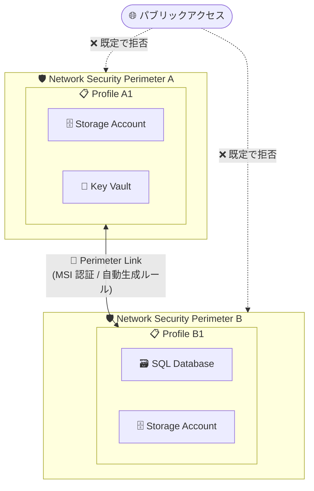

# Network Security Perimeter: Perimeter Link (クロスペリメーター接続) のパブリックプレビュー

**リリース日**: 2026-08-04

**サービス**: Azure Network Security Perimeter (Azure Private Link)

**機能**: Perimeter Link (クロスペリメーター接続)

**ステータス**: In preview

[このアップデートのインフォグラフィックを見る](https://takech9203.github.io/azure-news-summary/20260804-nsp-perimeter-link.html)

## 概要

Azure Network Security Perimeter (NSP) の新機能「Perimeter Link (クロスペリメーター接続)」がパブリックプレビューとして発表されました。Perimeter Link は、異なる 2 つの NSP 内にある信頼されたリソース同士が、Managed Identity (MSI) 認証を使って安全に通信できるようにする機能です。追加のアクセスルールやネットワーク構成の変更は不要です。

NSP は、仮想ネットワークの外部にデプロイされる PaaS リソース (Azure Storage、Key Vault など) の周囲に論理的なネットワーク境界を作成し、パブリックアクセスの制御とデータ流出の防止を実現するサービスです。今回の Perimeter Link により、2 つの独立した NSP 間に信頼関係 (トラストリレーションシップ) を確立し、リンクされたプロファイルに関連付けられたリソース同士がシームレスに通信できるようになります。リンク作成時に必要なインバウンド/アウトバウンドの許可ルールが両側の NSP に自動生成されるため、手動でのルール作成は不要です。

Microsoft は「ゼロトラスト境界を維持しながら、境界をまたぐ制御されたサービス間アクセスを実現する」機能と位置付けています。

**アップデート前の課題**

- 異なる NSP に属するリソース間で通信するには、両方の NSP に手動でインバウンド/アウトバウンドのアクセスルールを個別に作成・管理する必要があった
- NSP をまたぐサービス間通信の設定は運用が複雑で、ルールの管理負荷が高かった

**アップデート後の改善**

- Perimeter Link を作成するだけで、必要なインバウンド/アウトバウンドの許可ルールが両側の NSP プロファイルに自動生成される (Source/Destination type は「Network security perimeter」)
- Managed Identity (MSI) 認証によるサービス間通信で、ゼロトラスト原則を維持したままクロスペリメーター接続が可能
- 追加のアクセスルール作成やネットワーク構成の変更が不要になり、運用の複雑さが軽減

## アーキテクチャ図



Perimeter Link が NSP-A の Profile A1 と NSP-B の Profile B1 を接続し、双方のプロファイルに関連付けられた PaaS リソース同士が MSI 認証で安全に通信できます。パブリックアクセスは引き続き NSP により既定で拒否され、ゼロトラスト境界が維持されます。

## サービスアップデートの詳細

### 主要機能

1. **NSP 間の信頼関係の確立**
   - 1 本のリンクで 2 つの独立した NSP を接続し、信頼関係を確立
   - リンクは対称的 (symmetric) で、設定元の NSP が「ローカル」、接続先が「リモート」となる

2. **アクセスルールの自動生成**
   - リンク作成時に、選択したプロファイルへインバウンド/アウトバウンドの許可ルールが自動追加される
   - 生成されるルールの Source type は「Network security perimeter」
   - 手動での NSP アクセスルール作成は不要

3. **Managed Identity (MSI) 認証**
   - クロスペリメーター通信には MSI 認証が必須 (他の認証方式は非サポート)

4. **監視・診断ログ**
   - ソース NSP: `OutboundAttempt`、`CrossPerimeterOutboundAllowed` カテゴリでアウトバウンド接続を記録
   - 宛先 NSP: `CrossPerimeterInboundAllowed` カテゴリで許可されたインバウンド接続を記録

## 技術仕様

| 項目 | 詳細 |
|------|------|
| 対応 PaaS サービス (プレビュー時点) | Azure SQL Database、Azure Storage、Azure Cosmos DB、Azure Key Vault、Azure Monitoring、Azure Service Bus |
| 認証方式 | Managed Identity (MSI) のみ (必須) |
| NSP あたりの最大リンク数 | 10 |
| 操作インターフェース | Azure Portal、Azure CLI、PowerShell、API |
| 必要なプレビュー機能登録 | `Microsoft.Network` プロバイダーの `AllowNspLink` |
| 自動承認 | 同一サブスクリプション内の NSP のみ |
| クロスサブスクリプション接続 | リモートサブスクリプションへの Contributor 権限、または `Microsoft.Network/networkSecurityPerimeters/linkPerimeter/action` 権限が必要 |
| リンク削除 | どちらの NSP 管理者からでも実行可能 (リモート側の承認・同意は不要) |

## 設定方法

### 前提条件

1. アクティブなサブスクリプションを持つ Azure アカウント、および NSP の作成・管理権限
2. `Microsoft.Network` プロバイダーで `AllowNspLink` プレビュー機能を登録
3. 同一サブスクリプションの場合は NSP リソースへの Contributor または Owner 権限、クロスサブスクリプションの場合はリモートサブスクリプションへの Contributor 権限または `linkPerimeter/action` 権限
4. ローカル/リモートの 2 つの NSP を作成し、それぞれに 1 つ以上のプロファイルと 1 つ以上の PaaS リソースの関連付けを構成
5. トラブルシューティングと接続検証のため、NSP・プロファイル・関連リソースの診断ログを有効化
6. Azure CLI の場合はバージョン 2.38.0 以降 + `az extension add --name nsp` で NSP 拡張機能を追加

### Azure CLI

```bash
# AllowNspLink プレビュー機能を登録
az feature register \
  --namespace Microsoft.Network \
  --name AllowNspLink

# 登録状態を確認 ("Registered" になるまで待機)
az feature show \
  --name AllowNspLink \
  --namespace Microsoft.Network \
  --query properties.state \
  -o tsv

# プロバイダー登録を更新
az provider register --namespace Microsoft.Network

# リモート NSP のリソース ID を取得
remotePerimeterId=$(az network perimeter show \
    --name <remote-perimeter-name> \
    --resource-group <remote-resource-group-name> \
    --query id \
    --output tsv)

# ローカル NSP からリモート NSP への Perimeter Link を作成
az network perimeter link create \
    --name <perimeter-link-name> \
    --perimeter-name <local-perimeter-name> \
    --resource-group <local-resource-group-name> \
    --auto-remote-nsp-id "$remotePerimeterId" \
    --local-inbound-profile "['<local-profile-name>']" \
    --remote-inbound-profile "['<remote-profile-name>']"

# 自動生成されたアクセスルールを確認
az network perimeter profile access-rule list \
    --perimeter-name <local-perimeter-name> \
    --profile-name <local-profile-name> \
    --resource-group <local-resource-group-name>
```

### Azure Portal

1. Azure Portal で対象の **Network security perimeter** を開く
2. 左メニューから **Perimeter Link** > **Links** を選択し、**+ Create** を選択
3. リンク名、ローカルプロファイル、リモート NSP、リモートプロファイルを指定
4. 構成を確認して **Create** を選択
5. 作成後、プロファイルの **Inbound access rules** / **Outbound access rules** で自動生成されたルール (Source/Destination type: Network security perimeter) を確認

## メリット

### ビジネス面

- NSP をまたぐサービス間通信の設定・運用の複雑さが軽減され、運用コストを削減できる
- ゼロトラスト原則を維持したままクロスペリメーター接続を実現でき、セキュリティ体制を損なわない
- 部門やワークロードごとに NSP を分離した設計を保ちながら、必要なサービス間連携を実現できる

### 技術面

- 必要なインバウンド/アウトバウンドルールが両側に自動生成され、手動ルール管理が不要
- MSI 認証必須のため、キーやシークレットに依存しないサービス間認証を強制できる
- `CrossPerimeterInboundAllowed` / `CrossPerimeterOutboundAllowed` などの専用ログカテゴリで監査・監視が可能

## デメリット・制約事項

- パブリックプレビューのため SLA はなく、本番ワークロードでの利用は推奨されない
- 認証は Managed Identity (MSI) のみ。他の認証方式 (SAS トークンなど) は非サポート
- NSP あたりの Perimeter Link 数は最大 10
- 自動承認は同一サブスクリプション内の NSP 間のみ。クロスサブスクリプションではリモート側への Contributor 権限または `linkPerimeter/action` 権限が必要
- プレビュー時点の対応サービスは Azure SQL Database、Azure Storage、Azure Cosmos DB、Azure Key Vault、Azure Monitoring、Azure Service Bus の 6 種類に限定
- リンク削除はリモート NSP 管理者の承認なしにどちら側からでも実行でき、削除するとクロスペリメーター通信に依存していたデータプレーントラフィックは即座に拒否される

## ユースケース

### ユースケース 1: 別部門の NSP 内リソースへの安全なアクセス

**シナリオ**: 部門 A の NSP 内の Key Vault が、部門 B の NSP 内の Storage Account にアクセスする必要がある。従来は両方の NSP に手動でアクセスルールを作成する必要があった。

**実装例**:

```bash
# 部門 A (ローカル) の NSP から部門 B (リモート) の NSP へリンクを作成
az network perimeter link create \
    --name link-deptA-deptB \
    --perimeter-name nsp-dept-a \
    --resource-group rg-dept-a \
    --auto-remote-nsp-id "$remotePerimeterId" \
    --local-inbound-profile "['profile-a1']" \
    --remote-inbound-profile "['profile-b1']"
```

**効果**: リンク作成のみで双方向の許可ルールが自動生成され、Key Vault と Storage Account が MSI 認証で通信可能になる。手動ルールの作成・保守が不要。

### ユースケース 2: クロスペリメーター通信の監査

**シナリオ**: セキュリティ監査のため、NSP をまたぐすべての通信を記録・可視化したい。

**実装例**: 診断設定で以下のログカテゴリを Log Analytics ワークスペースに送信する。

- ソース NSP: `OutboundAttempt`、`CrossPerimeterOutboundAllowed`
- 宛先 NSP: `CrossPerimeterInboundAllowed`

**効果**: 境界をまたぐ通信の試行と許可がすべてログに記録され、監査・コンプライアンス要件に対応できる。

## 料金

Perimeter Link 固有の料金情報は公式アップデートおよびドキュメントでは確認できませんでした。詳細は以下を参照してください。

- [Azure Private Link 料金ページ](https://azure.microsoft.com/pricing/details/private-link/)

## 利用可能リージョン

Network Security Perimeter がサポートされるすべての Azure パブリッククラウドリージョンおよび Azure Government クラウドリージョンで利用可能です (プレビュー)。

## 関連サービス・機能

- **Azure Network Security Perimeter**: 本機能の基盤。PaaS リソースの論理的なネットワーク境界を提供し、パブリックアクセス制御とデータ流出防止を実現。全パブリックリージョンと Azure Government リージョンで GA
- **Managed Identity (Microsoft Entra ID)**: Perimeter Link での通信に必須の認証基盤。キーレスなサービス間認証を提供
- **Azure Private Link**: VNet から PaaS リソースへのプライベート接続を提供。NSP はプライベートエンドポイントのトラフィックを明示的なルールなしで許可する
- **Azure Monitor / Log Analytics**: NSP の診断ログ (クロスペリメーター接続ログを含む) の収集・分析に使用
- **対応 PaaS サービス**: Azure SQL Database、Azure Storage、Azure Cosmos DB、Azure Key Vault、Azure Monitoring、Azure Service Bus

## 参考リンク

- [インフォグラフィック](https://takech9203.github.io/azure-news-summary/20260804-nsp-perimeter-link.html)
- [公式アップデート情報](https://azure.microsoft.com/updates?id=568837)
- [Perimeter link feature in Network Security Perimeter (Preview) - Microsoft Learn](https://learn.microsoft.com/en-us/azure/private-link/perimeter-links-overview)
- [Configure a perimeter link between network security perimeters - Microsoft Learn](https://learn.microsoft.com/en-us/azure/private-link/configure-perimeter-link)
- [What is a network security perimeter? - Microsoft Learn](https://learn.microsoft.com/en-us/azure/private-link/network-security-perimeter-concepts)
- [Azure Private Link 料金ページ](https://azure.microsoft.com/pricing/details/private-link/)

## まとめ

Perimeter Link は、Network Security Perimeter で分離された PaaS リソース間の通信を、ゼロトラスト原則を維持したままシンプルに実現するパブリックプレビュー機能です。リンク作成だけで必要なアクセスルールが両側に自動生成され、MSI 認証が強制されるため、複数の NSP を運用する組織にとってルール管理の負荷を大きく軽減できます。NSP を部門・ワークロード単位で分離している環境では、`AllowNspLink` プレビュー機能を登録し、非本番環境での検証を開始することを推奨します。対応サービスが 6 種類に限定される点と、リンク削除が片側から承認なしで実行できる点には注意が必要です。

---

**タグ**: Networking, Security, Azure Private Link, Network Security Perimeter, Zero Trust, Managed Identity, Preview
