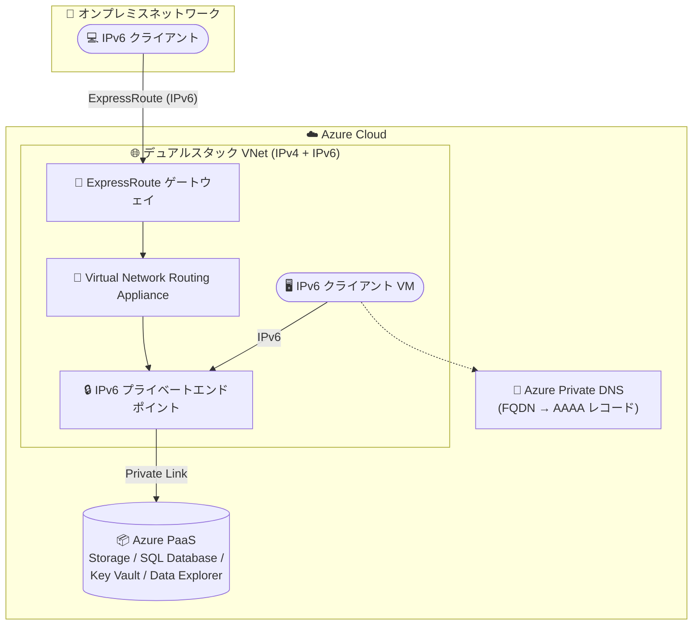

# Azure Private Link: IPv6 サポート (Public Preview)

**リリース日**: 2026-08-04

**サービス**: Azure Private Link

**機能**: Azure Private Link support over IPv6

**ステータス**: In preview

[このアップデートのインフォグラフィックを見る](https://takech9203.github.io/azure-news-summary/20260804-private-link-ipv6.html)

## 概要

Azure Private Link の IPv6 サポートがパブリックプレビューになりました。Azure Storage や Azure SQL Database などの Azure PaaS サービスに対して、IPv6 ベースの接続でプライベートアクセスできるようになります。

IPv6 プライベートエンドポイントを作成することで、Azure 仮想ネットワーク内の IPv6 クライアントから、または ExpressRoute 経由でオンプレミスネットワークの IPv6 クライアントから、PaaS サービスにプライベート接続できます。オンプレミス接続の場合、ExpressRoute がオンプレミスの IPv6 クライアントからのトラフィックを Virtual Network Routing Appliance に転送し、そこからターゲットの IPv6 プライベートエンドポイントへルーティングされます。

**アップデート前の課題**

- プライベートエンドポイントは IPv4 アドレスのみに対応しており、IPv6 クライアントから PaaS サービスへのプライベート接続ができなかった
- IPv6 への移行を進める組織 (アドレス枯渇対応、政府・通信系の IPv6 要件など) は、Private Link 利用時に IPv4 との併用を前提とせざるを得なかった

**アップデート後の改善**

- `ip-version-type` パラメーターを `IPv6` に設定してプライベートエンドポイントを作成でき、IPv6 クライアントから PaaS サービスへプライベート接続できるようになった
- Azure 内 (デュアルスタック VNet 内の IPv6 クライアント) と、ExpressRoute 経由のオンプレミス IPv6 クライアントの両方のシナリオに対応した

## アーキテクチャ図



デュアルスタック VNet 内の IPv6 クライアント VM は IPv6 プライベートエンドポイントに直接接続します。オンプレミスの IPv6 クライアントは ExpressRoute 経由で Virtual Network Routing Appliance に到達し、そこからプライベートエンドポイントにルーティングされます。

## サービスアップデートの詳細

### 主要機能

1. **IPv6 プライベートエンドポイント**
   - プライベートエンドポイント作成時に `--ip-version-type IPv6` を指定すると、IPv6 アドレスを持つプライベートエンドポイントが作成される
   - Azure Private DNS で PaaS サービスの FQDN をプライベートエンドポイントの IPv6 アドレス (AAAA レコード) に解決させる

2. **Azure ネイティブ接続**
   - デュアルスタック VNet 内の IPv6 クライアント VM から、IPv6 プライベートエンドポイント経由で Azure PaaS サービスに接続

3. **オンプレミス接続 (ExpressRoute 経由)**
   - オンプレミスの IPv6 クライアントが ExpressRoute → Virtual Network Routing Appliance → IPv6 プライベートエンドポイントの経路で PaaS サービスにアクセス
   - GatewaySubnet に関連付けたルートテーブルの UDR (次ホップ: 仮想アプライアンス) でルーティングを構成

## 技術仕様

| 項目 | 詳細 |
|------|------|
| 対応 PaaS サービス (プレビュー時点) | Azure Storage、Azure SQL Database、Azure Key Vault、Azure Data Explorer (Kusto) |
| VNet 要件 | デュアルスタック (IPv4 + IPv6) VNet、`privateEndpointVNetPolicies: Basic` |
| サブネット要件 | デュアルスタックサブネット、`privateEndpointNetworkPolicies: RouteTableEnabled` |
| 機能登録 | `Microsoft.Network/SupportIPv6PrivateEndpoint` のフィーチャー登録が必須 |
| リージョン制約 | プライベートエンドポイントと接続先 PaaS リソースは同一リージョンである必要あり (クロスリージョン非対応) |
| オンプレミス接続 | ExpressRoute + Virtual Network Routing Appliance のみ (VPN / Virtual WAN / NVA は非対応) |

## 設定方法

### 前提条件

1. サブスクリプションをプレビュー機能に登録する (必須)
2. デュアルスタック (IPv4 + IPv6) VNet と、デュアルスタックサブネットを用意する
3. デュアルスタック VNet 内に IPv6 アドレスを持つ VM を用意する (接続検証用)

### Azure CLI

```bash
# プレビュー機能の登録 (必須)
az feature register --namespace Microsoft.Network --name SupportIPv6PrivateEndpoint --subscription <subscription-id>
az provider register --namespace Microsoft.Network

# IPv6 プライベートエンドポイントの作成
az network private-endpoint create \
  --name <private-endpoint-name> \
  --resource-group <resource-group-name> \
  --vnet-name <vnet-name> \
  --subnet <subnet-name> \
  --private-connection-resource-id <resource-id-of-target-service> \
  --group-id <group-id> \
  --connection-name <connection-name> \
  --location <region> \
  --ip-version-type IPv6
```

DNS はサービスごとに Private DNS ゾーンを作成してプライベートエンドポイントにリンクし、PaaS の FQDN がプライベートエンドポイントの IPv6 アドレスに解決されることを確認します。

```bash
# 接続検証の例 (Azure Storage)
nslookup <storage-account>.blob.core.windows.net
# AAAA レコードでプライベートエンドポイントの IPv6 アドレスが返ることを確認

curl https://<storage-account>.blob.core.windows.net
```

## メリット

### ビジネス面

- IPv6 移行を進める組織 (IPv4 アドレス枯渇対応、IPv6 対応が求められる業界要件など) が、Private Link によるプライベート接続をあきらめずに移行を進められる
- パブリックインターネットを経由しないプライベート接続のセキュリティメリットを IPv6 環境でも享受できる

### 技術面

- IPv6 クライアントから Azure PaaS へのエンドツーエンドのプライベート接続が可能になる
- Azure 内 (VNet) とオンプレミス (ExpressRoute 経由) の両方の接続シナリオに対応
- 既存のプライベートエンドポイント作成フローに `--ip-version-type IPv6` を追加するだけで利用できる

## デメリット・制約事項

- プレビュー段階のため SLA はなく、本番ワークロードでの利用は推奨されない
- 利用可能リージョンが 5 リージョンに限定される
- 接続先 PaaS リソースはプライベートエンドポイントと同一リージョンである必要がある (クロスリージョン接続非対応)
- 対応 PaaS サービスは Storage、SQL Database、Key Vault、Data Explorer の 4 サービスに限定される
- オンプレミス接続は ExpressRoute ベースのシナリオのみ。VPN、Virtual WAN (vWAN)、Network Virtual Appliance (NVA) は現時点で非対応
- IPv6 プライベートエンドポイントに対する NSG および ASG は非対応
- 暗黙的な NAT 変換により、ダウンストリームサービスのログには元のクライアント IPv6 アドレスではなく VNet 側で変換されたソース IP アドレスが記録される

## ユースケース

### ユースケース 1: IPv6-only クライアントからの Azure Storage プライベートアクセス

**シナリオ**: IPv6 移行を進めている組織が、デュアルスタック VNet 内の IPv6 クライアントから Azure Storage にパブリックネットワークを経由せずアクセスする。

**実装例**:

```bash
# IPv6 プライベートエンドポイントを Storage (blob) 向けに作成
az network private-endpoint create \
  --name pe-storage-ipv6 \
  --resource-group rg-ipv6-demo \
  --vnet-name vnet-dualstack \
  --subnet snet-pe \
  --private-connection-resource-id $(az storage account show -n mystorageacct -g rg-ipv6-demo --query id -o tsv) \
  --group-id blob \
  --connection-name conn-storage-ipv6 \
  --location westcentralus \
  --ip-version-type IPv6
```

**効果**: IPv6 クライアントから Storage への通信が Azure バックボーン内のプライベート接続に閉じ、パブリックエンドポイントを公開する必要がなくなる。

### ユースケース 2: オンプレミス IPv6 ネットワークから ExpressRoute 経由での SQL Database アクセス

**シナリオ**: オンプレミスを IPv6 化した企業が、ExpressRoute 経由で Azure SQL Database にプライベート接続する。

**実装例**: ExpressRoute 回線と ExpressRoute ゲートウェイ VNet 内のデュアルスタック Virtual Network Routing Appliance を用意し、GatewaySubnet に関連付けたルートテーブルに UDR (宛先: プライベートエンドポイントの IPv6 プレフィックス、次ホップ: Virtual Network Routing Appliance の IPv6 アドレス) を追加する。

**効果**: オンプレミスの IPv6 クライアントからインターネットを経由せずに Azure SQL Database へ安全に接続できる。

## 料金

公式アップデートおよびドキュメントでは IPv6 サポートに固有の料金情報は確認できませんでした。Private Link の料金は以下のページを参照してください。

- [Azure Private Link 料金ページ](https://azure.microsoft.com/pricing/details/private-link/)

## 利用可能リージョン

プレビューは以下のリージョンでのみ利用可能です。

- West Central US
- East Asia
- UK South
- Central US
- North Europe

## 関連サービス・機能

- **Azure Virtual Network (デュアルスタック)**: IPv6 プライベートエンドポイントの配置には IPv4 + IPv6 のデュアルスタック VNet / サブネットが前提となる
- **Azure ExpressRoute**: オンプレミス IPv6 クライアントからの接続経路。Virtual Network Routing Appliance と組み合わせて使用する
- **Azure Private DNS**: PaaS サービスの FQDN をプライベートエンドポイントの IPv6 アドレス (AAAA レコード) に解決させるために使用する
- **Azure Storage / Azure SQL Database / Azure Key Vault / Azure Data Explorer**: プレビューで IPv6 プライベートエンドポイントに対応する PaaS サービス

## 参考リンク

- [インフォグラフィック](https://takech9203.github.io/azure-news-summary/20260804-private-link-ipv6.html)
- [公式アップデート情報](https://azure.microsoft.com/updates?id=568842)
- [Configure Azure Private Link over IPv6 (Preview) - Microsoft Learn](https://learn.microsoft.com/en-us/azure/private-link/private-link-ipv6)
- [What is a private endpoint? - Microsoft Learn](https://learn.microsoft.com/en-us/azure/private-link/private-endpoint-overview)
- [料金ページ](https://azure.microsoft.com/pricing/details/private-link/)

## まとめ

Azure Private Link がついに IPv6 に対応し、IPv6 クライアントから Azure PaaS サービスへのプライベート接続が可能になりました。IPv4 アドレス枯渇対応や IPv6 要件を持つ組織にとって、Private Link のセキュリティメリットを維持したまま IPv6 移行を進められる重要な一歩です。ただしプレビュー段階では対応サービス 4 種・5 リージョンに限定され、NSG/ASG 非対応、オンプレミス接続は ExpressRoute のみといった制約があるため、まずは非本番環境での検証から始めることを推奨します。利用にはサブスクリプションのフィーチャー登録 (`SupportIPv6PrivateEndpoint`) が必須である点に注意してください。

---

**タグ**: Networking, Azure Private Link, IPv6, Private Endpoint, Public Preview
