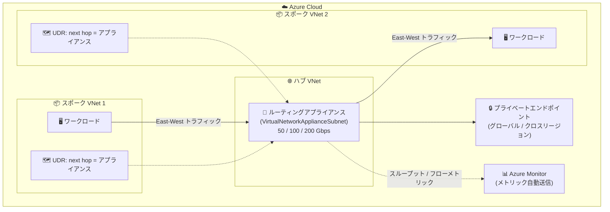

# Azure Virtual Network: ルーティングアプライアンスの一般提供開始 (GA)

**リリース日**: 2026-08-04

**サービス**: Azure Virtual Network

**機能**: Virtual Network routing appliance (ルーティングアプライアンス)

**ステータス**: Launched (GA)

[このアップデートのインフォグラフィックを見る](https://takech9203.github.io/azure-news-summary/20260804-virtual-network-routing-appliance.html)

## 概要

Azure Virtual Network の**ルーティングアプライアンス (routing appliance)** が一般提供 (GA) となりました。ルーティングアプライアンスは、仮想ネットワーク間のプライベート接続を提供するフルマネージドの高性能ルーティングソリューションです。専用のネットワークハードウェア上で動作し、仮想マシン (VM) ベースのソリューションよりも低レイテンシ・高スループットな転送レイヤーを実現します。

ルーティングアプライアンスは Azure のトップレベルリソースとして提供され、他のネットワークリソースと同様に Azure の管理モデル (デプロイ、構成、ガバナンス) に統合されます。仮想ネットワーク内の専用サブネット `VirtualNetworkApplianceSubnet` にデプロイし、ユーザー定義ルート (UDR) のネクストホップとして指定することで、ハブ & スポーク構成における East-West (スポーク間) トラフィックの高帯域転送レイヤーとして機能します。

**アップデート前の課題**

- 仮想ネットワーク間のルーティングを担う転送レイヤーとして、ユーザー自身が VM 上でネットワーク仮想アプライアンス (NVA) を構築・運用する必要があった
- VM ベースの転送レイヤーは、パッチ適用・スケーリング・高可用性構成 (ロードバランサー配置など) の運用負荷が発生し、トラフィック増加時にボトルネックとなるリスクがあった

**アップデート後の改善**

- 専用ハードウェアによる転送レイヤーをマネージドサービスとして利用でき、インスタンスあたり最大 200 Gbps のプロビジョニング帯域で East-West トラフィックを高速転送できる
- 高可用性と可用性ゾーン回復性が組み込み済みで、前段のロードバランサーも不要。運用オーバーヘッドなしで利用できる
- IPv4 / IPv6 / デュアルスタック仮想ネットワークに対応し、IPv6 のアクセス制御リスト (ACL) 適用もサポート
- 単一のアプライアンスでグローバル・クロスリージョンのプライベートエンドポイントアクセスに対応
- 診断設定なしで、スループット・パケット・フローのメトリックが Azure Monitor に既定で送信される

## アーキテクチャ図

ハブ VNet の専用サブネットにルーティングアプライアンスをデプロイし、スポーク側の UDR でネクストホップに指定することで、スポーク間 (East-West) トラフィックを専用ハードウェアで高速転送する構成です。

## サービスアップデートの詳細

### 主要機能

1. **高帯域 East-West ルーティング**
   - インスタンスあたり 50 / 100 / 200 Gbps のプロビジョニング帯域ティアを選択可能
   - 軽量・高性能な転送レイヤーにより、転送レイヤーがトラフィックのチョークポイントになるリスクを低減

2. **デュアルスタックと大規模 IPv6 対応**
   - IPv4、IPv6、デュアルスタック仮想ネットワークをサポート
   - IPv6 のアクセス制御リスト (ACL) 適用にも対応

3. **スケールアウト型プライベートアクセス**
   - 単一のアプライアンスを通じたグローバルおよびクロスリージョンのプライベートエンドポイント対応

4. **運用オーバーヘッドなしのフルマネージド**
   - 高可用性と可用性ゾーン回復性が組み込み済み
   - 前段にロードバランサーを配置する必要がない (配置してもトラフィックは転送されない)

5. **組み込みの監視機能**
   - 診断構成なしで、スループット・パケット・フローメトリックを Azure Monitor に既定で送信
   - ポータルのメトリックページ、ダッシュボード、Azure Monitor REST API、アラートで利用可能

6. **Azure ネイティブの管理モデル**
   - トップレベルの Azure リソースとして、他のネットワークリソースと同様に管理・ガバナンスが可能
   - ネットワークセキュリティグループ (NSG)、管理者規則、UDR、Azure NAT Gateway などの VNet 機能をネイティブサポート

### 代表的なルーティングパターン (ハブ & スポーク)

| パターン | 構成 | 適するケース |
|---------|------|-------------|
| 1. プライベートアドレス空間のみアプライアンスへ | スポークの UDR で RFC1918 などをアプライアンスへ、インターネット / オンプレミス宛は別のネクストホップへ | East-West のみアプライアンスに担わせ、既存のエグレス設計 (Azure Firewall、NAT Gateway など) を変えたくない場合 |
| 2. スポークをデフォルトルートでアプライアンスへ | スポークに 0.0.0.0/0 の UDR を設定し、ハブ側でオンプレミス / インターネット向けを振り分け | スポークのルートテーブルを画一化し、大規模運用を簡素化したい場合 |
| 3. RFC1918 はアプライアンス、デフォルトはエグレスへ | RFC1918 をアプライアンスへ、0.0.0.0/0 は任意のエグレスソリューションへ | East-West を予測可能にしつつ、ファイアウォール経由の非対称ルーティングリスクを減らしたい場合 |

## 技術仕様

| 項目 | 詳細 |
|------|------|
| リソース種別 | トップレベルの Azure リソース (フルマネージド) |
| デプロイ先 | 仮想ネットワーク内の専用サブネット `VirtualNetworkApplianceSubnet` |
| 帯域幅ティア | 50 / 100 / 200 Gbps (作成時に選択) |
| 最大接続数/秒 | 50 Gbps: 250,000、100 Gbps: 600,000、200 Gbps: 1,500,000 |
| 最大同時フロー数 | 50 Gbps: 2,000,000、100 Gbps: 4,000,000、200 Gbps: 8,000,000 |
| IP サポート | IPv4 / IPv6 / デュアルスタック (IPv6 ACL 適用を含む) |
| プライベートエンドポイント | グローバルおよびクロスリージョン対応 |
| 高可用性 | 組み込み (可用性ゾーン回復性あり)。ロードバランサー不要 |
| 監視メトリック | Bytes sent/received、Packets sent/received、Inbound/Outbound flows、Inbound/Outbound flow creation rate (Azure Monitor へ既定送信) |

## 設定方法

### 前提条件

1. アプライアンスをホストする仮想ネットワークに、`VirtualNetworkApplianceSubnet` という名前の専用サブネットを作成する
2. 帯域幅 (50 / 100 / 200 Gbps) を選択してルーティングアプライアンスをサブネットにデプロイする
3. ネクストホップの種類を「仮想アプライアンス (Virtual appliance)」とするユーザー定義ルート (UDR) を作成し、アプライアンスのプライベート IP アドレスへトラフィックを誘導する

**注意**: 既存アプライアンスの帯域幅は変更できません。変更する場合は削除して新しい帯域幅で再デプロイが必要です。Terraform を使用する場合は AzAPI プロバイダーを使用します (AzureRM プロバイダーは現時点で未対応)。

## メリット

### ビジネス面

- NVA 用 VM の構築・パッチ適用・スケーリング・冗長化といった運用負荷を削減できる
- 帯域需要の増加に合わせてルーティング容量を水平にスケールでき、ネットワークトポロジのボトルネックを解消できる

### 技術面

- 専用ネットワークハードウェアにより、VM ベースの NVA より低レイテンシ・高スループットを実現
- 高可用性・可用性ゾーン回復性が組み込みで、ロードバランサー構成が不要
- NSG、UDR、NAT Gateway など既存の VNet 機能とネイティブに連携
- 診断設定なしで Azure Monitor メトリックが利用でき、しきい値アラートも設定可能

## デメリット・制約事項

- サブスクリプションあたり、リージョンごとに最大 2 つのルーティングアプライアンスまで
- 構成可能な帯域幅は最大 200 Gbps。作成後の帯域幅変更は不可 (削除して再デプロイが必要)
- 内部ロードバランサーの背後への配置は未サポート
- Terraform は AzAPI プロバイダーのみ対応 (AzureRM プロバイダーは未対応)
- VNet フローログは未サポート
- アプライアンスを通過するトラフィックは仮想ネットワーク暗号化の対象外
- サービスエンドポイント / サービストンネリングを利用する場合、アプライアンスのサブネットに NSG が必要 (VirtualNetwork サービスタグからの受信、VirtualNetwork タグおよび宛先サービスタグへの送信を許可)
- IPv6 での Azure Private Link 利用時は、プライベートエンドポイントのプレフィックスをアプライアンスに送る UDR が必要 (ないと IPv6 プライベートエンドポイントトラフィックはアプライアンスを通過しない)

## ユースケース

### ユースケース 1: 大規模ハブ & スポークにおけるスポーク間トラフィックの高速化

**シナリオ**: 多数のスポーク VNet を持つハブ & スポーク環境で、スポーク間 (East-West) トラフィックが増大し、VM ベースの NVA が帯域のボトルネックになっている。

**構成**: ハブ VNet の `VirtualNetworkApplianceSubnet` にルーティングアプライアンス (例: 100 Gbps ティア) をデプロイし、各スポークの UDR で RFC1918 宛のネクストホップをアプライアンスのプライベート IP に設定する。インターネットエグレスは既存の Azure Firewall / NAT Gateway に維持する (パターン 1 / 3)。

**効果**: East-West トラフィックが専用ハードウェアで転送され、低レイテンシ・高スループットを実現。NVA VM の運用負荷 (スケーリング、冗長化、パッチ) を排除できる。

### ユースケース 2: IPv6 / デュアルスタック環境のプライベート接続

**シナリオ**: IPv6 対応が求められる環境で、デュアルスタック VNet 間のルーティングと IPv6 のアクセス制御を統一的に管理したい。

**構成**: デュアルスタック VNet にルーティングアプライアンスをデプロイし、IPv6 ACL の適用と合わせて East-West ルーティングを構成する。IPv6 でのプライベートエンドポイント利用時は、プライベートエンドポイントプレフィックス宛の UDR をアプライアンスに向ける。

**効果**: IPv4 / IPv6 混在環境でも単一の転送レイヤーでルーティングとアクセス制御を実現できる。

## 料金

Azure Virtual Network の料金ページによると、ルーティングアプライアンスは**選択した帯域幅容量に基づく時間単位の課金**です。具体的な単価はリージョンにより異なるため、料金ページまたは料金計算ツールで確認してください。

- [Azure Virtual Network 料金ページ](https://azure.microsoft.com/pricing/details/virtual-network/)

## 利用可能リージョン

以下のリージョンで一般提供されています (容量に応じて順次追加予定):

Australia East、Brazil South、Brazil Southeast、Central India、Central US、East Asia、East US、East US 2、Germany West Central、North Central US、North Europe、South Central US、South India、Southeast Asia、Spain Central、Sweden Central、UK South、West Central US、West Europe、West US、West US 2、West US 3

## 関連サービス・機能

- **ネットワーク仮想アプライアンス (NVA)**: 従来は VM 上で NVA を運用して VNet 間の転送レイヤーを構築していた。ルーティングアプライアンスはこの転送レイヤーをマネージド化・ハードウェア高速化する位置づけ
- **ユーザー定義ルート (UDR)**: ネクストホップの種類「仮想アプライアンス」でアプライアンスのプライベート IP を指定し、トラフィックを誘導する
- **Azure Firewall / NAT Gateway**: インターネットエグレスは既存のエグレスソリューションに維持し、East-West のみアプライアンスに担わせる構成が可能
- **Azure Private Link / プライベートエンドポイント**: グローバル・クロスリージョンのプライベートエンドポイントアクセスをアプライアンス経由でスケールアウトできる (IPv6 利用時は UDR 要件あり)
- **Azure Monitor**: スループット・パケット・フローメトリックが診断構成なしで送信され、アラート設定が可能
- **ネットワークセキュリティグループ (NSG)**: アプライアンスは NSG や管理者規則をネイティブサポート。サービスエンドポイント利用時はアプライアンスサブネットへの NSG 構成が必要

## 参考リンク

- [インフォグラフィック](https://takech9203.github.io/azure-news-summary/20260804-virtual-network-routing-appliance.html)
- [公式アップデート情報](https://azure.microsoft.com/updates?id=568605)
- [Microsoft Learn: Overview of Routing Appliances - Azure Virtual Network](https://learn.microsoft.com/en-us/azure/virtual-network/virtual-network-routing-appliance-overview)
- [Azure Virtual Network 料金ページ](https://azure.microsoft.com/pricing/details/virtual-network/)

## まとめ

Azure Virtual Network ルーティングアプライアンスの GA により、これまで VM ベースの NVA で構築していた VNet 間の転送レイヤーを、専用ハードウェアによるフルマネージドサービスに置き換えられるようになりました。最大 200 Gbps の帯域、組み込みの高可用性、IPv6 / デュアルスタック対応、Azure Monitor への自動メトリック送信により、大規模なハブ & スポーク環境の East-West トラフィック設計を大幅に簡素化できます。VM ベース NVA の帯域や運用負荷が課題になっている環境では、リージョンあたり 2 台・帯域幅変更不可などの制約と、Private Link / サービスエンドポイント利用時の UDR / NSG 要件を確認のうえ、採用を検討することを推奨します。

---

**タグ**: Azure Virtual Network, Networking, Routing Appliance, Hub-and-Spoke, IPv6, GA
