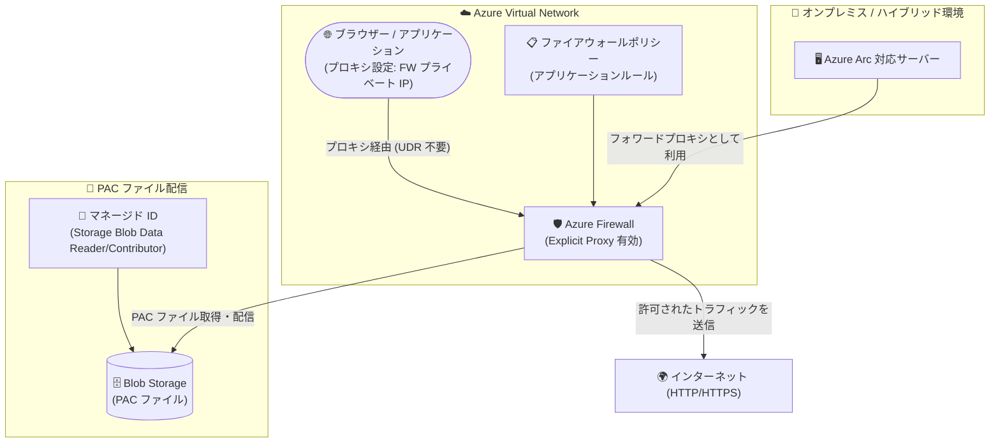

# Azure Firewall: Explicit Proxy (明示的プロキシ) の一般提供開始

**リリース日**: 2026-08-05

**サービス**: Azure Firewall

**機能**: Explicit Proxy (明示的プロキシ)

**ステータス**: Launched (GA)

[このアップデートのインフォグラフィックを見る](https://takech9203.github.io/azure-news-summary/20260805-azure-firewall-explicit-proxy.html)

## 概要

Azure Firewall の Explicit Proxy (明示的プロキシ) が一般提供 (GA) となりました。Explicit Proxy を有効にすると、アプリケーションやブラウザーのプロキシ設定で Azure Firewall のプライベート IP アドレスを指定し、HTTP / HTTPS トラフィックを直接ファイアウォールに送信できます。従来のユーザー定義ルート (UDR) によるルートベースのトラフィック制御に代わる選択肢となり、アウトバウンド Web トラフィックをアプリケーションレベルでより細かく制御できます。

Azure Firewall は既定では透過プロキシモードで動作し、UDR によってトラフィックをファイアウォールに誘導してインラインで検査・転送します。Explicit Proxy モードでは UDR に依存せず、送信元アプリケーション側のプロキシ設定 (手動設定または PAC ファイルによる自動構成) でトラフィックをファイアウォールに向けます。PAC ファイルはファイアウォール自身がホストして配信できます。

パブリックプレビュー期間中には 300 以上の Azure サブスクリプションで有効化され、約 40 社の S500 顧客に採用されました。プレビューで得られたフィードバックをもとに、単一プロキシエンドポイントでの HTTP / HTTPS 両対応、マネージド ID ベースの PAC ファイル取得、ポータルでの構成エクスペリエンス改善などが GA で提供されています。

**アップデート前の課題**

- トラフィックをファイアウォールに誘導するには UDR の構成が必要で、ルーティング設計・運用の負担があった
- プレビュー時点では HTTP と HTTPS で個別のポート指定が必要だった
- PAC ファイル取得のセキュアな認証手段が限られていた

**アップデート後の改善**

- UDR を構成せず、アプリケーション / ブラウザーのプロキシ設定だけでトラフィックを Azure Firewall に送信可能に
- 単一のプロキシエンドポイント (単一ポート) で HTTP / HTTPS 両方のトラフィックに対応
- ユーザー割り当てマネージド ID による PAC ファイル取得に対応し、Blob Storage 上の PAC ファイルをセキュアに参照可能に
- Azure Portal での構成エクスペリエンスが改善

## アーキテクチャ図



クライアントはプロキシ設定 (手動または PAC ファイル) で Azure Firewall のプライベート IP を指定し、UDR なしで HTTP / HTTPS トラフィックを直接ファイアウォールへ送信します。PAC ファイルは Blob Storage に配置し、マネージド ID 経由でファイアウォールが取得・配信します。

## サービスアップデートの詳細

### 主要機能

1. **プロキシ設定によるトラフィック誘導 (UDR 不要)**
   - ブラウザーやアプリケーションのプロキシ設定に Azure Firewall のプライベート IP を指定することで、UDR に依存せずトラフィックをファイアウォール経由で送信

2. **単一ポートでの HTTP / HTTPS 両対応 (GA での強化点)**
   - 単一の HTTP ポート設定で HTTP / HTTPS 両方の宛先に対応可能

3. **PAC ファイルによる自動構成**
   - PAC (Proxy Auto-Configuration) ファイルを Blob Storage にアップロードし、ファイアウォールがホストしてクライアントに配信
   - PAC ファイル配信用のポートを個別に指定可能

4. **マネージド ID ベースの PAC ファイル取得 (GA での強化点)**
   - ユーザー割り当てマネージド ID (Storage Blob Data Contributor / Storage Blob Data Reader ロール) を使用して、Blob Storage から PAC ファイルをセキュアに取得

5. **Azure Policy によるガバナンス**
   - 「ファイアウォールポリシーへの Explicit Proxy 構成の強制」「Explicit Proxy 使用時の PAC ファイル構成の監査」のポリシー定義が利用可能

## 技術仕様

| 項目 | 詳細 |
|------|------|
| 対応プロトコル | HTTP / HTTPS |
| 構成場所 | ファイアウォールポリシー (ファイアウォールリソース本体ではない) |
| トラフィック誘導方式 | クライアント側プロキシ設定 (手動または PAC ファイル)。UDR 不要 |
| ポート | 単一の HTTP ポートで HTTP / HTTPS 両対応。PAC ファイル配信用ポートは別途指定 |
| PAC ファイルの配置先 | Azure Storage アカウントの Blob コンテナー |
| PAC ファイル取得の認証 | ユーザー割り当てマネージド ID (プレフィックス "PacFileMSI-" が必要) |
| 必要なロール | Storage Blob Data Contributor、Storage Blob Data Reader (対象ストレージアカウント上) |
| トラフィック許可 | ファイアウォールポリシーのアプリケーションルールで定義 |

## 設定方法

### 前提条件

1. ファイアウォールポリシーが関連付けられた Azure Firewall (Explicit Proxy はポリシー側で構成)
2. PAC ファイルをホストする場合: PAC ファイルを格納する Blob コンテナーを持つ Azure Storage アカウント
3. PAC ファイルをホストする場合: 対象ストレージアカウントに対して Storage Blob Data Contributor / Storage Blob Data Reader ロールを持つユーザー割り当てマネージド ID (名前は "PacFileMSI-" プレフィックス必須)

### Azure CLI

```bash
# Explicit Proxy を有効にしたファイアウォールポリシーを作成
az network firewall policy create \
    --resource-group "testrg" \
    --name "testfwpolicy" \
    --sku Premium \
    --explicit-proxy enable-explicit-proxy=true http-port=9001 enable-pac-file=true pac-file-port=122 pac-file="https://<storage>.blob.core.windows.net/<container>/proxy.pac" \
    --identity "<Managed_Identity_ID>"

# 既存のファイアウォールポリシーを更新
az network firewall policy update \
    --resource-group "testrg" \
    --name "testfwpolicy" \
    --explicit-proxy enable-explicit-proxy=true http-port=9001 enable-pac-file=true pac-file-port=124 pac-file="https://<storage>.blob.core.windows.net/<container>/proxy.pac" \
    --identity "<Managed_Identity_ID>"
```

### PowerShell

```powershell
# Explicit Proxy 設定を作成
$exProxy = New-AzFirewallPolicyExplicitProxy `
    -EnableExplicitProxy `
    -HttpPort 100 `
    -EnablePacFile `
    -PacFilePort 130 `
    -PacFile "https://<storage>.blob.core.windows.net/<container>/proxy.pac"

# マネージド ID とともにファイアウォールポリシーを作成
New-AzFirewallPolicy `
    -Name "fp1" `
    -ResourceGroupName "TestRg" `
    -ExplicitProxy $exProxy `
    -UserAssignedIdentityId $identityId
```

### Azure Portal

1. ファイアウォールポリシーで **Enable explicit proxy** を有効化 (HTTP ポートは HTTP / HTTPS 共通で 1 つ指定可能)
2. トラフィックを許可する **アプリケーションルール** をポリシーに作成
3. PAC ファイルを使用する場合は **Enable proxy auto-configuration** を選択
4. Blob コンテナーに PAC ファイルをアップロードし、ファイル URL をコピー
5. マネージド ID を作成し、ストレージアカウントの IAM で Storage Blob Data Contributor / Storage Blob Data Reader ロールを割り当て
6. Explicit Proxy 構成に PAC ファイル URL とマネージド ID を設定

## メリット

### ビジネス面

- 既存のフォワードプロキシ製品からの移行シナリオに対応でき、Azure Firewall の既存セキュリティ機能を活かしながらネットワーク運用を簡素化できる
- ハイブリッド環境の Azure Arc オンボーディングにおいて、集中管理されたアウトバウンド制御を維持しつつ Microsoft サービスへのセキュアな接続を実現できる

### 技術面

- UDR の設計・管理が不要になり、ルーティング構成に手を加えずにファイアウォール経由の通信を実現できる
- アプリケーション単位・ブラウザー単位でプロキシ利用を選択でき、トラフィック制御の粒度が向上する
- PAC ファイルによりプロキシ設定の配布・条件分岐 (宛先ごとのプロキシ経由/直接接続の振り分け) を自動化できる
- Azure Policy でポリシー全体に Explicit Proxy 構成を強制・監査でき、ガバナンスを確保できる

## デメリット・制約事項

- 対応プロトコルは HTTP / HTTPS のみ (その他のプロトコルは従来どおりルートベースの制御が必要)
- クライアント側 (アプリケーション / ブラウザー) にプロキシ設定を行う必要がある
- PAC ファイルをホストする場合は Storage アカウントとユーザー割り当てマネージド ID の準備が必要で、マネージド ID 名には "PacFileMSI-" プレフィックスが必須
- Explicit Proxy はファイアウォールポリシーで構成するため、ポリシーを使用しないクラシックルール構成では利用できない

## ユースケース

### ユースケース 1: Azure Arc 対応サーバーのオンボーディング

**シナリオ**: ハイブリッド環境のオンプレミスサーバーを Azure Arc にオンボードする際、Azure Firewall をフォワードプロキシとして使用し、必要な Microsoft サービスへの接続を集中管理されたアウトバウンド制御のもとで許可する。

**効果**: Arc 対応サーバーからの通信経路を Azure Firewall に集約し、セキュリティ制御を維持したままセキュアな接続を実現できる。

### ユースケース 2: 既存フォワードプロキシからの移行

**シナリオ**: サードパーティのフォワードプロキシ製品を利用中の組織が、クライアントのプロキシ設定 (または PAC ファイル) の向き先を Azure Firewall に変更して移行する。

**効果**: ルーティング変更なしで移行でき、Azure Firewall の既存のセキュリティ機能 (アプリケーションルールなど) を活用しながらネットワーク運用を簡素化できる。

### ユースケース 3: UDR を使わないアプリケーションレベルのトラフィック制御

**シナリオ**: 特定のアプリケーションやブラウザーのみプロキシ設定でファイアウォール経由とし、その他のトラフィックはルーティングに影響を与えず制御する。

**効果**: サブネット単位の UDR では難しいアプリケーション単位のトラフィックステアリングを実現できる。

## 料金

Azure Firewall の料金は SKU (Basic / Standard / Premium) ごとに、デプロイ料金 (時間あたり) とデータ処理料金 (GB あたり) で構成されます。料金ページに Explicit Proxy に関する追加料金の記載はありません。具体的な料金はリージョン・通貨によって異なるため、料金ページを参照してください。

| 課金項目 | 内容 |
|------|------|
| デプロイ料金 | SKU ごとの固定時間料金 (スケールに関係なくデプロイ単位) |
| データ処理料金 | 処理データ量 (GB) に応じた課金 |
| Capacity Unit (オプション) | Standard / Premium のみ。事前容量予約用で、明示的に構成しない限り追加料金なし |

詳細: [Azure Firewall の料金](https://azure.microsoft.com/pricing/details/azure-firewall/)

## 関連サービス・機能

- **ファイアウォールポリシー (Azure Firewall Manager)**: Explicit Proxy の構成先。アプリケーションルールによるトラフィック許可もポリシーで定義
- **Azure Blob Storage**: PAC ファイルのホスティング先
- **マネージド ID (Microsoft Entra ID)**: PAC ファイルのセキュアな取得に使用するユーザー割り当てマネージド ID
- **Azure Policy**: Explicit Proxy 構成の強制・PAC ファイル構成の監査に利用可能
- **Azure Arc**: ハイブリッド環境のサーバーオンボーディングで Azure Firewall をフォワードプロキシとして活用

## 参考リンク

- [インフォグラフィック](https://takech9203.github.io/azure-news-summary/20260805-azure-firewall-explicit-proxy.html)
- [公式アップデート情報](https://azure.microsoft.com/updates?id=568825)
- [Microsoft Learn: Azure Firewall explicit proxy](https://learn.microsoft.com/azure/firewall/explicit-proxy)
- [Microsoft Learn: Azure Firewall policy rule sets](https://learn.microsoft.com/azure/firewall/policy-rule-sets)
- [料金ページ: Azure Firewall](https://azure.microsoft.com/pricing/details/azure-firewall/)

## まとめ

Azure Firewall の Explicit Proxy が GA となり、UDR に依存しないアウトバウンド Web トラフィック制御が本番環境で利用可能になりました。単一ポートでの HTTP / HTTPS 両対応、マネージド ID による PAC ファイル取得など、プレビューからの実用的な強化が含まれています。既存フォワードプロキシからの移行や Azure Arc オンボーディングを検討している組織は、ファイアウォールポリシーでの有効化と PAC ファイル配信構成の評価を推奨します。あわせて Azure Policy による構成の強制・監査でガバナンスを確保するとよいでしょう。

---

**タグ**: Azure Firewall, Networking, Security, Explicit Proxy, PAC, Managed Identity, GA
