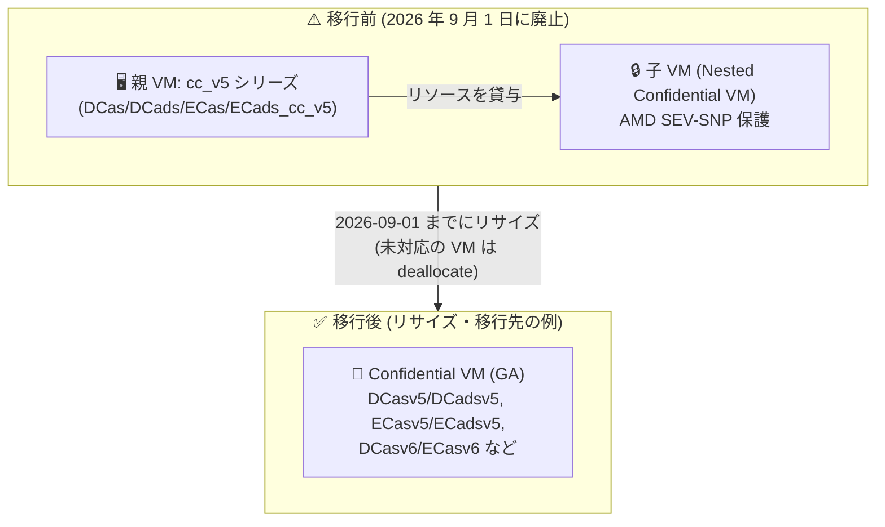

# Azure Virtual Machines: Nested Confidential VM (cc_v5) シリーズの廃止 (2026 年 9 月 1 日)

**リリース日**: 2026-08-05

**サービス**: Azure Virtual Machines (Confidential Computing)

**機能**: Nested Confidential VM (cc_v5) シリーズの廃止告知

**ステータス**: Retirement (廃止告知)

[このアップデートのインフォグラフィックを見る](https://takech9203.github.io/azure-news-summary/20260805-confidential-vms-ccv5-retirement.html)

## 概要

2026 年 9 月 1 日に、Nested Confidential VM である cc_v5 シリーズ (Confidential child capable VM) が廃止され、利用および購入ができなくなります。廃止日までにリサイズされていない対象 VM は、**割り当て解除 (deallocate) されます**。

廃止対象となる VM サイズは以下の 4 シリーズです。

- **DCas_cc_v5** シリーズ (汎用、ローカルディスクなし)
- **DCads_cc_v5** シリーズ (汎用、ローカルディスクあり)
- **ECas_cc_v5** シリーズ (メモリ最適化、ローカルディスクなし)
- **ECads_cc_v5** シリーズ (メモリ最適化、ローカルディスクあり)

cc_v5 シリーズは、デプロイした親 VM からリソースを借りて AMD SEV-SNP で保護された子 VM (nested confidential VM) を作成できる Preview 段階の VM シリーズで、Azure ホストおよび親 VM からのより高いレベルの分離を実現するための親子デプロイメントモデルを提供していました。Azure Confidential VM と同じハードウェア (AMD EPYC Milan) 上に構築されており、主に Azure Kubernetes Service (AKS) のエージェントノードサイズとして有効化されていました。

**影響を受けるユーザーが取るべきアクション**

- **期限: 2026 年 9 月 1 日まで**に、対象 VM を別の VM サイズにリサイズする
- 期限までにリサイズしなかった VM は割り当て解除 (deallocate) される

## アーキテクチャ図



親 VM のリソースを借りて SEV-SNP 保護の子 VM を動かす cc_v5 の親子モデルが廃止されます。移行先の例として、同じ AMD SEV-SNP による保護を VM 単位で提供する GA 済みの Confidential VM シリーズ (DCasv5/ECasv5、DCasv6/ECasv6 など) があります。

## サービスアップデートの詳細

### 廃止の内容

1. **廃止日**: 2026 年 9 月 1 日
   - この日以降、cc_v5 シリーズは利用・購入ができなくなる

2. **廃止対象の VM サイズ**
   - DCas_cc_v5、DCads_cc_v5、ECas_cc_v5、ECads_cc_v5 の各シリーズ

3. **未対応時の動作**
   - 廃止日までにリサイズされていない対象 VM は割り当て解除 (deallocate) される

### 廃止される cc_v5 シリーズの特徴 (参考)

- 親 VM からリソースを借りて AMD SEV-SNP 保護の子 VM を作成する「Confidential child capable VM」
- 親 VM は汎用 Azure VM (D シリーズ / E シリーズ相当) とほぼ同等の機能を持つ
- Azure Confidential VM と同じハードウェア基盤上に構築
- Preview のまま提供されており、GA には至らなかった
- 主に AKS のエージェントノードサイズとして有効化 (AKS 以外での利用は個別問い合わせが必要だった)

## 技術仕様

廃止対象シリーズの主な仕様 (Microsoft Learn ドキュメントより):

| 項目 | 詳細 |
|------|------|
| 対象シリーズ | DCas_cc_v5 / DCads_cc_v5 (汎用)、ECas_cc_v5 / ECads_cc_v5 (メモリ最適化) |
| プロセッサ | AMD EPYC (Milan) [x86-64] |
| vCPU / メモリ (DCas_cc_v5) | 4〜96 vCPU / 16〜384 GiB |
| vCPU / メモリ (ECas_cc_v5) | 4〜96 vCPU / 32〜672 GiB |
| セキュリティ機能 | AMD SEV-SNP 保護の子 VM (Nested Virtualization: サポート) |
| ステータス | Preview (GA 未到達のまま廃止) |
| 廃止日 | 2026 年 9 月 1 日 |
| 未対応時の動作 | 割り当て解除 (deallocate) |

## 移行方法

### 移行先の検討

今回の廃止告知では具体的な移行先シリーズは指定されていませんが、Microsoft Learn の Confidential VM ドキュメントでは、GA 済みの Confidential VM として以下のシリーズがサポート対象として記載されています。VM 単位で AMD SEV-SNP (または Intel TDX) によるハードウェアベースの分離が必要な場合の移行先候補となります。

| 用途 | ローカルディスクなし | ローカルディスクあり |
|------|---------------------|---------------------|
| 汎用 | DCasv5、DCasv6、DCesv6 | DCadsv5、DCadsv6、DCedsv6 |
| メモリ最適化 | ECasv5、ECasv6、ECesv6 | ECadsv5、ECadsv6、ECedsv6 |
| GPU (NVIDIA H100) | NCCadsH100v5 | - |

Confidential Computing の保護が不要なワークロードであれば、親 VM と機能面でほぼ同等とされる通常の D シリーズ / E シリーズへのリサイズも選択肢となります。

### Azure CLI でのリサイズ

```bash
# 対象サイズが移行先リージョンで利用可能か確認
az vm list-vm-resize-options --resource-group <リソースグループ名> --name <VM 名> --output table

# VM のリサイズ (例: DCasv5 シリーズへ変更)
az vm resize --resource-group <リソースグループ名> --name <VM 名> --size Standard_DC4as_v5
```

リサイズ時は VM の再起動が発生します。また、Confidential VM への移行では OS イメージのセキュリティ要件 (Confidential VM 対応イメージ) やセキュリティタイプの設定が異なるため、単純なリサイズではなく再デプロイが必要になる場合があります。事前に Microsoft Learn のドキュメントで移行先シリーズの要件を確認してください。

## デメリット・制約事項

- 2026 年 9 月 1 日以降、cc_v5 シリーズは利用・購入不可となる
- 期限までにリサイズしなかった VM は割り当て解除され、ワークロードが停止する
- cc_v5 特有の「親 VM のリソースを借りて子 VM を SEV-SNP 保護する」親子デプロイメントモデルは、GA 済み Confidential VM シリーズでは同一の形では提供されない
- Confidential VM (DCasv5/ECasv5 など) へ移行する場合、対応 OS イメージや機能サポート (Azure Backup、Site Recovery、Accelerated Networking などに制限あり) の確認が必要

## 関連サービス・機能

- **Azure Confidential VM (DCasv5/ECasv5、DCasv6/ECasv6 シリーズなど)**: AMD SEV-SNP / Intel TDX による VM 単位のハードウェアベース分離を提供する GA 済みシリーズ。cc_v5 と同様の機密コンピューティング要件に対する移行先候補
- **Azure Kubernetes Service (AKS)**: cc_v5 シリーズが主にエージェントノードサイズとして有効化されていたサービス。AKS で利用中の場合はノードプールの VM サイズ変更が必要
- **Azure Attestation**: Confidential VM のプラットフォーム健全性を起動時に検証するアテステーションサービス

## 参考リンク

- [インフォグラフィック](https://takech9203.github.io/azure-news-summary/20260805-confidential-vms-ccv5-retirement.html)
- [公式アップデート情報](https://azure.microsoft.com/updates?id=568661)
- [DCas_cc_v5 シリーズ (Microsoft Learn)](https://learn.microsoft.com/en-us/azure/virtual-machines/sizes/general-purpose/dcasccv5-series)
- [ECas_cc_v5 / ECads_cc_v5 シリーズ (Microsoft Learn)](https://learn.microsoft.com/en-us/azure/virtual-machines/ecasccv5-ecadsccv5-series)
- [Azure Confidential VM の概要 (Microsoft Learn)](https://learn.microsoft.com/en-us/azure/confidential-computing/confidential-vm-overview)
- [料金計算ツール](https://azure.microsoft.com/pricing/calculator/)

## まとめ

Preview として提供されてきた Nested Confidential VM (cc_v5) シリーズ 4 種 (DCas_cc_v5、DCads_cc_v5、ECas_cc_v5、ECads_cc_v5) が 2026 年 9 月 1 日に廃止されます。**期限までにリサイズしなかった VM は割り当て解除されるため、対象 VM を利用中の場合は早急な対応が必要です。** 機密コンピューティングの要件が継続する場合は GA 済みの Confidential VM シリーズ (DCasv5/ECasv5、DCasv6/ECasv6 など) を、不要な場合は通常の D/E シリーズを移行先として検討し、AKS ノードプールで利用している場合はノードサイズの変更計画を立ててください。

---

**タグ**: Azure Virtual Machines, Confidential Computing, Retirement, cc_v5, AMD SEV-SNP, AKS
