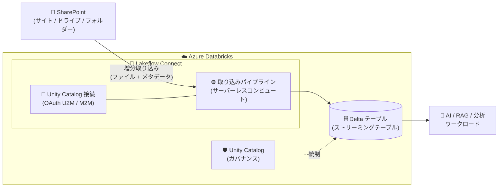

# Azure Databricks: SharePoint コネクタが一般提供 (GA) 開始

**リリース日**: 2026-08-05 (Databricks リリースノート上の GA 日: 2026-08-04)

**サービス**: Azure Databricks

**機能**: SharePoint Connector for Azure Databricks (Lakeflow Connect)

**ステータス**: Launched (GA)

[このアップデートのインフォグラフィックを見る](https://takech9203.github.io/azure-news-summary/20260805-databricks-sharepoint-connector.html)

## 概要

Azure Databricks の Lakeflow Connect における SharePoint コネクタが一般提供 (GA) となりました。組織は Lakeflow Connect のマネージドコネクタを使用して、SharePoint 上のファイルを Azure Databricks に取り込み、社内に蓄積されたエンタープライズコンテンツをデータ・AI ワークフローと統合できます。

このコネクタは、PDF や DOCX などの非構造化ファイルをバイナリデータとして取り込むほか、CSV / JSON / XML / Excel などの構造化フォーマットをパースして Delta テーブルに変換したり、ファイル本体をダウンロードせずにメタデータのみを取得したりすることが可能です。増分取り込み (インクリメンタルインジェスト)、Unity Catalog によるガバナンス、複数の認証方式をサポートし、エンタープライズ規模のデプロイに対応します。

取り込みパイプラインは Unity Catalog により統制され、サーバーレスコンピュートと Lakeflow パイプライン上で動作します。なお、同時期に Google Drive コネクタも GA となっており、ファイルソースコネクタ群の強化が進んでいます。

**アップデート前の課題**

- SharePoint のファイルを Databricks に取り込むには、`read_files`、`COPY INTO`、Auto Loader などを用いたカスタムパイプラインを自前で構築・運用する必要があり、パイプラインの管理・保守の負担が大きかった
- 社内ドキュメント (SharePoint) と Lakehouse 上のデータ・AI ワークフローが分断されており、RAG などの生成 AI ユースケースでエンタープライズコンテンツを活用しにくかった

**アップデート後の改善**

- フルマネージドなコネクタとして GA となり、本番ワークロードで低メンテナンスに SharePoint ファイルを Delta テーブルへ取り込み、ソースと同期し続けられるようになった
- 増分取り込みにより変更のあったファイルのみを効率的に処理し、Unity Catalog による一元的なガバナンス (権限管理・リネージ) のもとでエンタープライズコンテンツを AI ワークフローに接続できるようになった

## アーキテクチャ図

SharePoint のファイルは Lakeflow Connect のマネージドパイプライン (サーバーレスコンピュート) により増分取り込みされ、Unity Catalog で統制された Delta テーブルとして AI・分析ワークロードから利用できます。

## サービスアップデートの詳細

### 主要機能

1. **3 つの取り込みモード**
   - `FILE` + `BINARYFILE` 形式: PDF、Office ファイル、画像などの非構造化ファイルをバイナリとして取り込み (1 ファイル = 1 行、コンテンツ + SharePoint メタデータ付き)
   - `FILE` + 構造化形式: CSV / JSON / XML / EXCEL / PARQUET / AVRO / ORC をパースして行データとして Delta テーブル化
   - `FILE_METADATA`: ファイル本体をダウンロードせず、メタデータのみを取り込み

2. **増分取り込み (インクリメンタルインジェスト)**
   - 初回実行で選択したデータをすべて取り込み、以降は変更追跡に基づき変更分のみを処理。高速・スケーラブル・コスト効率の良い取り込みを実現

3. **Unity Catalog ガバナンス**
   - 接続情報は Unity Catalog のセキュリティ保護可能オブジェクトとして管理。取り込んだデータも Unity Catalog の権限管理下に置かれる

4. **複数の認証方式**
   - OAuth U2M (Databricks 管理・推奨): Azure アプリ登録不要で Databricks が OAuth 設定とトークン更新を管理
   - OAuth U2M (カスタム管理): 自組織の Azure アプリ登録を使用 (アプリ所有権や API レート制限の制御が必要な場合)
   - OAuth M2M: ユーザー操作なしで実行する完全自動化された本番パイプライン向け
   - OAuth 手動リフレッシュトークン: レガシー方式 (新規実装には非推奨)

5. **スキーマ進化とファイルフィルター**
   - `schema_evolution_mode` (デフォルト: `ADD_NEW_COLUMNS_WITH_TYPE_WIDENING`) で新規カラムの扱いを制御。`schema_hints` による型の上書きにも対応
   - `path_filter` (glob パターン)、`modified_before` / `modified_after` (タイムスタンプ) で取り込み対象ファイルを絞り込み可能

6. **オーケストレーションとデプロイ**
   - Databricks Workflows によるスケジュール実行に対応。Declarative Automation Bundles (DAB) による CI/CD デプロイもサポート

## 技術仕様

| 項目 | 詳細 |
|------|------|
| コネクタ種別 | Lakeflow Connect ファイルソースコネクタ (マネージド) |
| 取り込み対象 | SharePoint のサイト / サブサイト / ドライブ / フォルダー (URL 指定) |
| エンティティタイプ | `FILE` (コンテンツ + メタデータ)、`FILE_METADATA` (メタデータのみ) |
| 対応ファイル形式 | `BINARYFILE`, `CSV`, `JSON`, `XML`, `EXCEL`, `PARQUET`, `AVRO`, `ORC` |
| パイプライン作成 | API ベース / Declarative Automation Bundles (UI ベースの作成は非対応) |
| コンピュート | サーバーレスコンピュート (Lakeflow パイプライン) |
| 増分取り込み | 対応 |
| スキーマ進化 | 対応 (`schema_evolution_mode` で構成可能) |
| ストレージモード | `SCD_TYPE_1` (BINARYFILE のデフォルト)、`APPEND_ONLY` (構造化形式のデフォルト)。SCD Type 2 は非対応 |
| 認証 | OAuth U2M (Databricks 管理 / カスタム管理)、OAuth M2M、OAuth 手動リフレッシュトークン。Basic 認証は非対応 |
| ガバナンス | Unity Catalog |
| 取得メタデータ | site_id、drive_id、web_url、MIME タイプ、作成者/更新者、etag、権限情報など (`_sharepoint_metadata` 構造体) |

## 設定方法

### 前提条件

1. Unity Catalog が有効な Azure Databricks ワークスペース
2. SharePoint 認証の構成 (推奨: Databricks 管理の OAuth U2M。この方式では Azure アプリ登録は不要)
3. 管理者が Catalog Explorer で SharePoint への Unity Catalog 接続を作成 (非管理者ユーザーはこの接続を使ってパイプラインを作成)

### 設定の流れ

| ユーザー | 手順 |
|----------|------|
| 管理者 | 1. SharePoint 認証を構成 (OAuth U2M / M2M など) 2. Catalog Explorer で SharePoint への接続を作成 |
| 非管理者 | 既存の接続を使い、サポートされるインターフェイス (API / DAB) でパイプラインを作成 |

パイプライン定義では、各テーブルの `connector_options.sharepoint_options` ブロックに `entity_type`、`url`、`file_ingestion_options` (format、file_filters、schema_evolution_mode など) を指定します。API のみで認証するコネクタは、Databricks CLI の `databricks connections create` やノートブックからの Connections API 呼び出しで接続をプログラム的に作成することも可能です。

## メリット

### ビジネス面

- SharePoint に蓄積された社内ドキュメント (契約書、レポート、マニュアルなど) を Lakehouse に統合し、RAG などの生成 AI ユースケースで活用できる
- フルマネージドサービスのため、カスタムパイプラインの構築・保守コストを削減できる
- GA となり本番ワークロードでの利用に適したサポートレベルが提供される

### 技術面

- 増分取り込みにより、変更のあったファイルのみを処理してコストと処理時間を最適化
- Unity Catalog による接続情報・データの一元的なガバナンス (アクセス制御、監査)
- 障害時は指数バックオフで自動リトライし、カーソル位置を保存して次回実行時に再開する自動復旧機構を備える
- `system.billing.usage` テーブルやイベントログ、パイプラインヘルスメトリクスによるコスト・稼働監視が可能

## デメリット・制約事項

- UI ベースのパイプライン作成は非対応 (API または Declarative Automation Bundles を使用)
- SCD Type 2 は非対応 (BINARYFILE は SCD Type 1、構造化形式は APPEND_ONLY)
- API ベースのカラム選択・除外、行フィルタリングは非対応
- Basic 認証 (ユーザー名/パスワード、API キー、サービスアカウント JSON キー) は非対応
- マネージドコネクタは接続先の外部サービス (SharePoint) の可用性・互換性・安定性に依存する。外部サービス側の変更によりコネクタの提供が中止される可能性がある

## ユースケース

### ユースケース 1: SharePoint ドキュメントを活用した RAG 基盤の構築

**シナリオ**: SharePoint に保存された PDF や Office ドキュメントを Databricks に取り込み、ベクトル検索と組み合わせた RAG (Retrieval-Augmented Generation) アプリケーションを構築する。

**実装のポイント**: `entity_type: FILE`、`format: BINARYFILE` で取り込むと、1 ファイルが 1 行となり `content` (バイナリ)、`web_url`、MIME タイプ、作成者などのメタデータ付きで Delta テーブルに格納される。ダウンストリームでは公式ドキュメントの RAG ユースケース向け UDF を使ってコンテンツを処理する。

**効果**: 社内ナレッジを最新状態に保ちながら (増分同期)、Unity Catalog のガバナンス下で生成 AI アプリケーションに供給できる。

### ユースケース 2: 部門管理の Excel / CSV ファイルの分析パイプライン化

**シナリオ**: 各部門が SharePoint 上で管理している Excel や CSV のデータを、手作業なしで Lakehouse に取り込み BI・分析に利用する。

**実装のポイント**: `format: EXCEL` や `CSV` を指定するとファイル内容がパースされて行データとして Delta テーブル化される。`path_filter` で対象フォルダー・ファイルパターンを絞り込み、`schema_hints` で型を制御。スケジュール実行で自動同期する。

**効果**: 現場のファイルベース運用を変えずに、ガバナンスの効いた分析基盤へデータを自動供給できる。

## 料金

取り込みパイプラインはサーバーレスコンピュート上で動作し、Azure Databricks の DBU ベースの課金が適用されます。パイプラインのコストは `system.billing.usage` テーブルで追跡できます。SharePoint コネクタ固有の料金は公式ページを参照してください。

- [Azure Databricks 料金ページ](https://azure.microsoft.com/pricing/details/databricks/)

## 利用可能リージョン

リージョン別の提供状況は公式情報を確認してください。

- [Products available by region](https://azure.microsoft.com/explore/global-infrastructure/products-by-region/?products=databricks)

## 関連サービス・機能

- **Unity Catalog**: 接続情報 (認証資格情報) と取り込んだデータのガバナンス (アクセス制御、リネージ) を提供
- **Lakeflow Connect**: SaaS アプリ、データベース、ファイルストレージからのマネージド取り込みを提供するコネクタ群。今回の SharePoint コネクタと同時に Google Drive コネクタも GA、PagerDuty コネクタが Beta となった
- **Lakeflow パイプライン / Databricks Workflows**: 取り込みパイプラインの実行基盤とスケジュール・オーケストレーション
- **Auto Loader (Standard SharePoint コネクタ)**: パースや変換を完全に制御したい場合の代替手段。SQL / PySpark で独自パイプラインを構築できるが、管理責任はユーザー側にある

## 参考リンク

- [インフォグラフィック](https://takech9203.github.io/azure-news-summary/20260805-databricks-sharepoint-connector.html)
- [公式アップデート情報](https://azure.microsoft.com/updates?id=568905)
- [Azure Databricks リリースノート (2026 年 8 月)](https://learn.microsoft.com/en-us/azure/databricks/release-notes/product/2026/august#sharepoint-connector-ga)
- [SharePoint コネクタ (Microsoft Learn)](https://learn.microsoft.com/en-us/azure/databricks/ingestion/lakeflow-connect/sharepoint)
- [SharePoint 取り込みセットアップの概要](https://learn.microsoft.com/en-us/azure/databricks/ingestion/lakeflow-connect/sharepoint-source-setup-overview)
- [SharePoint コネクタ リファレンス](https://learn.microsoft.com/en-us/azure/databricks/ingestion/lakeflow-connect/sharepoint-reference)
- [Lakeflow Connect マネージドコネクタの概要](https://learn.microsoft.com/en-us/azure/databricks/ingestion/lakeflow-connect/)
- [料金ページ](https://azure.microsoft.com/pricing/details/databricks/)

## まとめ

SharePoint コネクタの GA により、SharePoint 上のエンタープライズコンテンツを、カスタムパイプラインを構築することなく Azure Databricks の Lakehouse へ継続的に取り込めるようになりました。非構造化ファイルのバイナリ取り込みから構造化フォーマットの Delta テーブル化、メタデータのみの取得まで対応し、増分取り込みと Unity Catalog ガバナンスによりエンタープライズ規模の本番利用に耐える構成です。特に RAG などの生成 AI ユースケースで社内ドキュメントを活用したい組織にとって重要なアップデートであり、まずは Databricks 管理の OAuth U2M 認証で接続を作成し、対象サイトの取り込みパイプラインを API または Declarative Automation Bundles で構築することを推奨します。UI からのパイプライン作成や SCD Type 2 が非対応である点は設計時に考慮が必要です。

---

**タグ**: Azure Databricks, Lakeflow Connect, SharePoint, AI + machine learning, Analytics, GA, Feature
