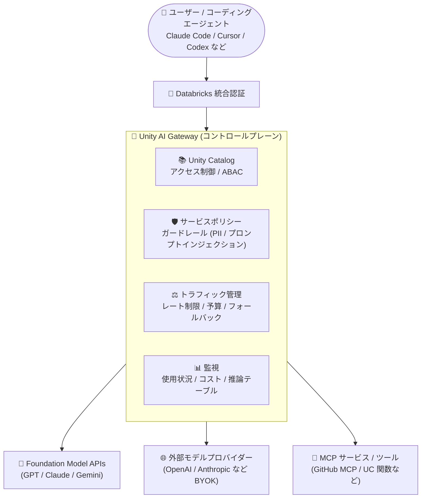

# Azure Databricks: Unity AI Gateway の一般提供開始 (GA)

**リリース日**: 2026-08-05

**サービス**: Azure Databricks

**機能**: Unity AI Gateway

**ステータス**: Launched (GA)

[このアップデートのインフォグラフィックを見る](https://takech9203.github.io/azure-news-summary/20260805-databricks-unity-ai-gateway.html)

## 概要

Azure Databricks 上で Unity AI Gateway が一般提供 (GA) となりました。Unity AI Gateway は、AI モデル・エージェント・ツール・MCP サービスに対する集中ガバナンスを提供するソリューションで、組織は使用状況の監視、コスト管理、ガードレールの適用、アクセス制御の徹底を単一のコントロールプレーンから行えます。

Unity AI Gateway は Unity Catalog を基盤として構築されており、データや AI 資産に対する既存のガバナンスを、モデル・エージェント・MCP サーバー・ツール間のランタイムのやり取りにまで拡張します。Azure Databricks は Foundation Model APIs を通じて GPT、Claude、Gemini などの LLM をネイティブに (インフラ運用不要のトークン従量課金で) 提供しており、さらに OpenAI や Anthropic などの外部モデルプロバイダーを BYOK (Bring Your Own Key) で接続し、同一のアクセス制御とトラフィック管理を適用できます。

ガバナンスの対象は Azure Databricks ホストのリソースに限りません。Claude Code、Cursor、Codex、Gemini CLI などの外部コーディングエージェント、Unity Catalog に登録した外部 MCP サーバー、任意プロバイダーの外部モデルを同じ方法で統制できます。

**アップデート前の課題**

- データ資産は Unity Catalog で統制できても、AI モデル・エージェント・MCP サーバー・ツールへのランタイムアクセスは別の仕組みで管理する必要があり、AI 用に個別のアクセスモデルを維持しなければならなかった
- 複数のモデルプロバイダーやコーディングエージェントにまたがる使用状況・コスト・リスクを一元的に監視・制御する手段がなかった

**アップデート後の改善**

- Unity AI Gateway が GA となり、すべてのモデル / MCP リクエストのルーティング、レート制限・コスト制御の適用、ガードレール (サービスポリシー) の適用、使用状況の記録を単一のコントロールプレーンで本番利用できるようになった
- AI 資産 (モデル、MCP サーバー、関数、接続) を Unity Catalog のセキュリティ保護可能オブジェクトとして登録し、テーブルやボリュームと同じ権限・ABAC ポリシーで管理できるようになった

## アーキテクチャ図

エージェントやユーザーからのリクエストは認証後に Unity AI Gateway を通過し、Unity Catalog による認可、サービスポリシーによる内容検査、レート制限・予算制御を経て、モデル API・外部プロバイダー・MCP サービスへルーティングされます。

## サービスアップデートの詳細

### 主要機能

1. **AI 資産のアクセス制御 (Asset Governance)**
   - モデル、MCP サーバー、関数 (カスタムツール)、HTTP 接続を Unity Catalog のセキュリティ保護可能オブジェクトとして登録し、テーブルやボリュームと同じ権限・ABAC グラントポリシーで付与・剥奪を管理
   - `system.ai` で提供される Databricks ホストの基盤モデルへのアクセスを、アカウント全体またはグループ単位で制限可能
   - エージェントは Unity Catalog モデルとして登録され、エージェントが呼び出すツールは MCP サービス・関数・接続として統制される

2. **AI トラフィックの制御 (Traffic Governance)**
   - モデルサービスと MCP サービスへのリクエストに対するレート制限 (消費上限) の適用
   - 複数のモデル宛先へのトラフィック分割とフェイルオーバー (フォールバック) による可用性向上
   - 予算管理: 支出の監視、ユーザー単位のしきい値およびハードキャップの設定

3. **サービスポリシーによるガードレール (Behavior Governance)** ※Beta
   - リクエスト / レスポンスの内容と呼び出し元に基づき、個々のやり取りを「許可 / 拒否 / 承認必須」に制御する AI サービス向け ABAC ポリシー
   - PII、プロンプトインジェクション、不適切コンテンツなど一般的なリスクに対する組み込みポリシーに加え、カスタムポリシーの作成が可能

4. **使用状況・コスト・リスクの監視**
   - システムテーブルによるリクエスト数・トークン使用量・レイテンシの追跡 (誰が・何を・いつ呼び出したか)
   - サービス、ターゲットモデル、プリンシパル、タグ単位でのコスト帰属分析 (ユーザー / チーム / プロジェクト別の LLM 支出の追跡)
   - リクエスト / レスポンスの全ペイロードを Unity Catalog Delta テーブル (推論テーブル) に記録し、監査・デバッグに活用

5. **外部 AI の統制**
   - 外部コーディングエージェント (Claude Code、Cursor、Codex、Gemini CLI など) を Databricks モデルサービス経由でルーティングし、トラフィックの統制とコスト計上を実現
   - OpenAI、Anthropic、Google などの外部モデルプロバイダーを BYOK で接続し、単一の制御ポイントで統制

## 技術仕様

| 項目 | 詳細 |
|------|------|
| ガバナンスの 3 次元 | 資産 (Unity Catalog セキュラブル) / トラフィック (ルーティング・レート制限・予算) / 動作 (サービスポリシー) |
| 対象 AI 資産 | モデル API (`system.ai`)、外部モデルプロバイダー、登録済みモデル、MCP サービス、Unity Catalog 関数 (カスタムツール)、HTTP 接続 |
| ネイティブ提供モデル | Foundation Model APIs 経由で GPT、Claude、Gemini などをトークン従量課金で提供 |
| 外部プロバイダー接続 | OpenAI、Anthropic など BYOK で接続可能 |
| リクエストフロー | 認証 (Databricks 統合認証) → Unity Catalog による認可 → Unity AI Gateway 経由でルーティング |
| 監視データストア | システムテーブル (使用状況)、推論テーブル (Unity Catalog Delta テーブル) |
| GA 範囲 | Unity AI Gateway 本体と Unity Catalog による資産ガバナンスは GA。サービスポリシー (ガードレール) は Beta |

## 設定方法

### 前提条件

1. Unity Catalog が有効化されたワークスペース
2. サービスポリシー (Beta) を使用する場合: アカウント管理者がアカウントコンソールの **Previews** ページから **Unity AI Gateway** の Beta 機能を有効化すること

### セットアップ手順 (概要)

1. **サービスポリシーの有効化 (任意 / Beta)**: アカウントコンソールの Previews ページで Unity AI Gateway の Beta 機能を有効化
2. **AI 資産のアクセス統制**: MCP サービスとモデルを Unity Catalog セキュラブルとして登録し、必要最小限の権限をプリンシパルに付与
3. **トラフィックのルーティングと制御**: LLM 用のモデルサービスを作成し、コーディングエージェントを Databricks モデルサービスに向け、レート制限と支出上限を設定
4. **サービスポリシーの適用**: モデルサービス / MCP サービスに組み込みまたはカスタムのサービスポリシーをアタッチ
5. **使用状況とコストの監視**: 使用状況テーブル、コスト分析、推論テーブルでガバナンスの動作を確認

## メリット

### ビジネス面

- LLM 支出をユーザー・チーム・プロジェクト単位で帰属させ、コストドライバーを特定できる (予算しきい値・ハードキャップによるコスト超過防止)
- PII やプロンプトインジェクションなどのリスクに対する組み込みガードレールにより、AI 利用のコンプライアンスを担保できる
- どの AI サービスを各チームが利用できるかを一元管理でき、シャドー AI 利用のリスクを低減できる

### 技術面

- データと AI で別々のアクセスモデルを維持する必要がなく、テーブルやボリュームと同じ Unity Catalog の権限・ABAC ポリシーで AI 資産を統制できる
- トラフィック分割とフォールバックにより、複数モデル宛先にまたがる可用性とキャパシティ管理を実現できる
- リクエスト / レスポンスの全ペイロードを Delta テーブルに記録でき、監査・デバッグ・品質モニタリングに活用できる
- 外部コーディングエージェントや外部モデルプロバイダーも同一のガバナンスレイヤーで統制できる

## デメリット・制約事項

- サービスポリシー (ガードレール) は GA ではなく Beta のため、利用にはアカウント管理者による Beta 機能の有効化が必要
- Unity Catalog が有効化されたワークスペースが前提となる
- エージェントのツール利用に対する最も豊富なガバナンス (ツールフィルタリング、サービスポリシー) は MCP サービス経由での登録が必要

## ユースケース

### ユースケース 1: コーディングエージェントの GitHub MCP アクセス統制

**シナリオ**: 開発チームが Claude Code や Cursor などのコーディングエージェントから GitHub MCP ツールを利用する際、Unity Catalog の権限と組み込みサービスポリシーでアクセス可能なツールを制限する。

**効果**: エージェントがユーザーに代わって到達できる範囲を最小権限に統制し、意図しないツール呼び出しを防止できる。

### ユースケース 2: 基盤モデル支出のチーム別トラッキング

**シナリオ**: サービスタグとリクエストタグを使用して、LLM のコストをユーザー・チーム・プロジェクトに帰属させ、支出ドライバーを特定する。

**効果**: 部門別のチャージバックや予算管理が可能になり、ユーザー単位のしきい値・ハードキャップでコスト超過を防止できる。

### ユースケース 3: モデルサービスへのガードレール適用

**シナリオ**: 組み込みおよびカスタムのサービスポリシーをモデルサービスにアタッチし、PII を含むリクエストのブロックやポリシー外のツール呼び出しの拒否を実施する。

**効果**: リクエスト / レスポンスの内容に基づく自動的なコンプライアンス統制を、アプリケーション側の実装なしで実現できる。

## 料金

公式の料金情報は以下を参照してください。

- [Azure Databricks 料金ページ](https://azure.microsoft.com/pricing/details/databricks/)

なお、Foundation Model APIs はトークン従量課金 (pay-per-token) でモデルを利用できます。

## 利用可能リージョン

公式アップデートページからリージョン情報を確認できませんでした。詳細は以下を参照してください。

- [Azure Databricks リージョン別提供状況](https://learn.microsoft.com/azure/databricks/resources/supported-regions)

## 関連サービス・機能

- **Unity Catalog**: Unity AI Gateway の基盤。AI 資産 (モデル、MCP サーバー、関数、接続) をセキュラブルとして管理し、データと同じ権限・ABAC ポリシーを適用
- **Foundation Model APIs**: GPT、Claude、Gemini などの LLM をトークン従量課金でネイティブ提供。Unity AI Gateway 経由でアクセス統制
- **Mosaic AI Model Serving**: モデルサービスのエンドポイントを提供し、Unity AI Gateway のトラフィック管理・監視の対象となる
- **MCP サービス (Unity Catalog)**: 外部 MCP サーバーをセキュラブルとして登録し、ツールフィルタリングとサービスポリシーで統制

## 参考リンク

- [インフォグラフィック](https://takech9203.github.io/azure-news-summary/20260805-databricks-unity-ai-gateway.html)
- [公式アップデート情報](https://azure.microsoft.com/updates?id=568910)
- [AI governance with Unity AI Gateway (Microsoft Learn)](https://learn.microsoft.com/azure/databricks/ai-gateway/)
- [AI governance guide (Microsoft Learn)](https://learn.microsoft.com/azure/databricks/ai-gateway/ai-governance)
- [料金ページ](https://azure.microsoft.com/pricing/details/databricks/)

## まとめ

Unity AI Gateway の GA により、Azure Databricks はデータガバナンス (Unity Catalog) を AI のランタイムガバナンスにまで拡張した統合コントロールプレーンを本番提供しました。モデル・エージェント・MCP サービス・外部プロバイダーへのアクセス制御、トラフィック管理、コスト統制、監視を単一の仕組みで実現できるため、組織的に AI 活用を進める企業にとって重要なアップデートです。サービスポリシー (ガードレール) は Beta のため、本番のコンテンツ統制要件がある場合は GA 時期を注視しつつ、まずは Unity Catalog での AI 資産統制とレート制限・予算管理から導入を始めることを推奨します。

---

**タグ**: Azure Databricks, Unity AI Gateway, Unity Catalog, AI ガバナンス, MCP, AI + Machine Learning, Analytics, GA
