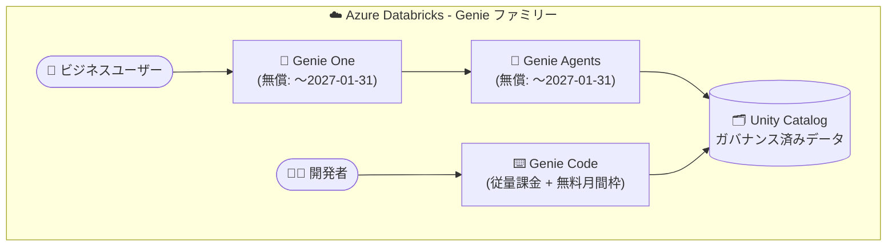

# Azure Databricks: Genie One / Genie Agents 無償利用期間を 2027 年 1 月 31 日まで延長

**リリース日**: 2026-08-06

**サービス**: Azure Databricks

**機能**: Genie One / Genie Agents 無償利用プロモーションの期間延長

**ステータス**: Announcement

[このアップデートのインフォグラフィックを見る](https://takech9203.github.io/azure-news-summary/20260806-databricks-genie-free-usage-extension.html)

## 概要

Azure Databricks の Genie One および Genie Agents の無償利用プロモーションが、従来の終了日である 2026 年 7 月 31 日から **2027 年 1 月 31 日まで延長** されることが発表された。プロモーション期間中、ユーザーによる Genie One / Genie Agents の利用は無償となる。

重要な点として、**プロモーション期間中、これらの製品には Budget controls (予算管理・コスト制御) が適用されない**。また、無償の対象はユーザーによる利用のみであり、サービスプリンシパルによる利用はプロモーションの対象外として課金される。

Genie は Azure Databricks の自然言語ベースの AI 体験ファミリーであり、すべての回答は組織のデータに基づき、Unity Catalog によってガバナンスされる。今回の延長対象は以下の 2 製品である。

- **Genie One**: ビジネスユーザーがデータ資産を発見し、自然言語で対話するための簡易インターフェイス
- **Genie Agents**: データチームが信頼できるデータ・メトリクス・ビジネスルールを構成し、Genie One の回答を支えるドメイン固有のデータ環境

なお、開発者向けの **Genie Code** は今回の延長対象ではなく、2026 年 7 月 8 日以降、ユーザーごとの無料月間枠付きの従量課金 (pay-as-you-go) モデルで課金されている。

**アップデート前の状況**

- Genie One / Genie Agents の無償利用期間は 2026 年 7 月 31 日で終了予定だった

**アップデート後の改善**

- 無償利用期間が 2027 年 1 月 31 日まで 6 か月延長された
- 組織はコストを気にせず Genie One / Genie Agents の評価・展開を約 6 か月間追加で継続できる

## アーキテクチャ図

ビジネスユーザーは Genie One から自然言語で質問し、データチームが構成した Genie Agents が信頼できる回答を提供する。すべてのデータアクセスは Unity Catalog でガバナンスされる。今回の延長対象は Genie One と Genie Agents であり、Genie Code は対象外。

## サービスアップデートの詳細

### 主要ポイント

1. **無償利用期間の延長**
   - Genie One と Genie Agents の無償利用が 2026 年 7 月 31 日から 2027 年 1 月 31 日まで延長された

2. **Budget controls はプロモーション期間中に適用されない**
   - プロモーション期間中、Genie One / Genie Agents には Budget controls (Unity AI Gateway 経由の予算管理・コスト制御) が適用されない

3. **対象はユーザーによる利用のみ**
   - 無償化の対象はユーザー (identified users) による利用
   - サービスプリンシパルはプロモーションの対象外であり、その利用は課金される

## 技術仕様

| 項目 | 詳細 |
|------|------|
| 対象製品 | Genie One、Genie Agents |
| 旧無償期間終了日 | 2026 年 7 月 31 日 |
| 新無償期間終了日 | 2027 年 1 月 31 日 |
| Budget controls | プロモーション期間中は対象外 (適用されない) |
| プロモーション対象 | ユーザーによる利用 (サービスプリンシパルは対象外・課金) |
| 対象外の製品 | Genie Code (2026 年 7 月 8 日以降、無料月間枠付きの従量課金) |
| ガバナンス | Unity Catalog によるデータガバナンス |

## メリット

### ビジネス面

- 追加コストなしで Genie One / Genie Agents を約 6 か月間長く評価・展開できる
- 全社的なセルフサービス分析 (自然言語でのデータ質問) の導入を、課金開始前に十分に検証できる

### 技術面

- データチームは Genie Agents のデータセット・メトリクス・ビジネスルールの整備 (回答品質のチューニング) に、コストを気にせず取り組める
- 課金開始後を見据え、システムテーブル (`system.billing.usage`) での利用状況の把握を先行して確立できる

## デメリット・制約事項

- **プロモーション期間中は Budget controls が適用されない**ため、予算機能による利用量の可視化・制御 (アラート、ブロック) をこれらの製品には利用できない点に注意
- サービスプリンシパルによる利用は無償化の対象外であり、課金される
- Genie Code は今回の延長対象外 (無料月間枠を超えた利用は DBU ベースで課金)
- クエリ実行に使用するコンピュート (SQL ウェアハウスなど) は別途課金される

## 料金

- Genie One / Genie Agents: ユーザーによる利用は 2027 年 1 月 31 日まで無償
- Genie Code: ユーザーごとの無料月間枠付き従量課金 (2026 年 7 月 8 日以降)
- 最新の料金と無料枠の詳細は [Databricks 料金ページ](https://www.databricks.com/product/pricing) を参照

## 関連サービス・機能

- **Unity Catalog**: Genie のすべての回答は Unity Catalog でガバナンスされた組織データに基づく
- **Unity AI Gateway**: Genie の利用状況を追跡する基盤。課金開始後は Budget controls (予算・コスト制御) の設定に使用する
- **AI/BI ダッシュボード / Databricks Apps**: Genie One から利用できるデータ体験

## 参考リンク

- [インフォグラフィック](https://takech9203.github.io/azure-news-summary/20260806-databricks-genie-free-usage-extension.html)
- [公式アップデート情報](https://azure.microsoft.com/updates?id=568964)
- [Genie - Azure Databricks (Microsoft Learn)](https://learn.microsoft.com/azure/databricks/genie/)
- [Manage budgets and cost controls for Genie (Microsoft Learn)](https://learn.microsoft.com/azure/databricks/genie/budgets)
- [Databricks 料金ページ](https://www.databricks.com/product/pricing)

## まとめ

Genie One / Genie Agents の無償利用期間が 2027 年 1 月 31 日まで 6 か月延長された。組織は追加コストなしで自然言語によるセルフサービス分析の展開を継続できる一方、プロモーション期間中は Budget controls が適用されない点、サービスプリンシパルの利用は課金される点に留意が必要である。無償期間の終了 (2027 年 1 月 31 日) に備え、Genie Agents の回答品質チューニングと、課金開始後の予算設計 (Unity AI Gateway の Budget 設定) を今のうちに検討しておくことを推奨する。

---

**タグ**: Azure Databricks, Genie One, Genie Agents, AI + Machine Learning, Analytics, 料金, プロモーション, Announcement
