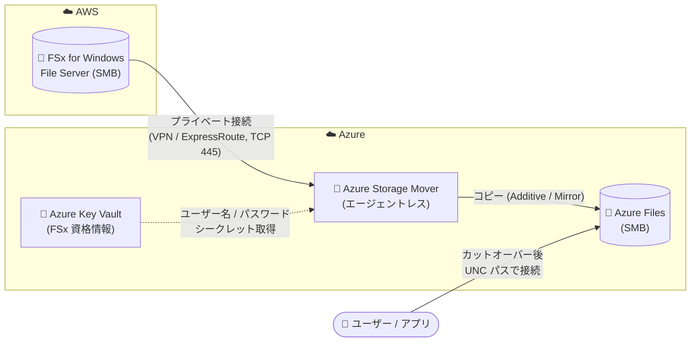

# Azure Storage Mover: AWS FSx for Windows File Server から Azure Files へのエージェントレス移行 (Public Preview)

**リリース日**: 2026-08-06

**サービス**: Azure Storage Mover

**機能**: AWS FSx for Windows File Server (SMB) から Azure Files (SMB) へのクラウド間移行

**ステータス**: In preview

[このアップデートのインフォグラフィックを見る](https://takech9203.github.io/azure-news-summary/20260806-storage-mover-aws-fsx-migration.html)

## 概要

Azure Storage Mover が、AWS FSx for Windows File Server (SMB) から Azure Files (SMB) へのエージェントレスなクラウド間 (cloud-to-cloud) 移行にパブリックプレビューで対応した。移行エージェントのデプロイや管理を行うことなく、Windows ファイル共有を FSx から Azure Files に移動できる。データ転送はサービス側が代行し、Azure と AWS ネットワーク間のプライベート接続を通じて、FSx から Azure ファイル共有へ直接コピーされる。

Azure Storage Mover はもともとオンプレミスのファイル共有を Azure に移行するためのフルマネージドなハイブリッド移行サービスであり、従来はソース側の近くに移行エージェント VM をデプロイ・登録する構成が基本だった。今回のアップデートにより、AWS 上の SMB ファイルサーバーからの移行がエージェントレスで実現できるようになり、マルチクラウド環境からの Azure への統合シナリオが簡素化される。

**アップデート前の課題**

- AWS FSx for Windows File Server から Azure Files への移行には、移行用の VM (エージェントやツール) を自前でデプロイ・管理する必要があった
- クラウド間のファイル移行はツール選定・構成・運用の負担が大きく、増分コピーやカットオーバーの管理も手作業が中心だった

**アップデート後の改善**

- 移行エージェントのデプロイ・管理が不要になり、Azure Storage Mover サービスが転送を代行する (エージェントレス)
- Azure Portal / Azure CLI から、ソース・ターゲットのエンドポイント定義、移行ジョブの作成・実行・監視までを一元管理できる
- プライベート接続経由で FSx から Azure Files へ直接コピーされるため、インターネットを経由しない安全な転送経路を構成できる
- 増分コピー (複数回のコピーパス) により、最終カットオーバー時のダウンタイムを最小化できる

## アーキテクチャ図



Azure Storage Mover サービスが、Key Vault に格納された FSx 資格情報を用いてプライベート接続経由で AWS FSx の SMB 共有からデータを読み取り、Azure Files へ直接コピーする。移行エージェント VM のデプロイは不要。

## サービスアップデートの詳細

### 主要機能

1. **エージェントレスなクラウド間移行**
   - 移行エージェント VM のデプロイ・登録・管理が不要。Azure Storage Mover サービスがデータ転送を代行する

2. **マルチクラウド移行タイプのエンドポイント定義**
   - ソースエンドポイントとして「AWS FSx - SMB」を選択し、FSx の DNS 名 (FQDN) またはプライベート IP、共有名、Key Vault のシークレット (ユーザー名・パスワード) を指定して作成する
   - ターゲットエンドポイントとして Azure Files (SMB ファイル共有) を指定する

3. **プライベート接続経由の直接転送**
   - FSx SMB 移行には Azure と AWS ネットワーク間のプライベート接続 (VPN / ExpressRoute など) が必須
   - ジョブ定義の「Private connections (Preview)」セクションでプライベート接続リソースを関連付ける

4. **コピーモードの選択と増分コピー**
   - Additive (追加) / Mirror (ミラー: ターゲットをソースと完全一致させる) のコピーモードを選択可能
   - 複数回のコピーパスで差分のみを転送し、カットオーバー時のダウンタイムを最小化できる

5. **ジョブの監視**
   - 転送済みファイル数、スループット、エラーなどのジョブ実行詳細を Azure Portal で監視できる

## 技術仕様

| 項目 | 詳細 |
|------|------|
| 移行元 | AWS FSx for Windows File Server (SMB 2.x / 3.x) |
| 移行先 | Azure Files (SMB) |
| 転送方式 | エージェントレス (サービスが転送を代行)、プライベート接続経由の直接コピー |
| 1 ジョブあたりの上限 | 最大 5 億オブジェクト (超える場合は複数ジョブに分割) |
| 同時実行ジョブ数 | サブスクリプションあたり最大 10 ジョブ |
| プレビュー中の推奨 | 同一ターゲットファイル共有に対しては同時に 1 ジョブのみ実行 |
| 非サポート | SMB 1.x ソース |
| データの扱い | コピー (移動ではない)。ソースデータは廃止するまで FSx に残る |
| ネットワーク要件 | Azure-AWS 間のプライベート接続、TCP 445 の到達性 (VPN / ExpressRoute / NSG / ファイアウォール) |
| 資格情報管理 | Azure Key Vault (ユーザー名・パスワードを個別のシークレットとして格納) |

## 設定方法

### 前提条件

1. 移行対象の FSx for Windows File Server にアクセスできる AWS アカウント
2. Azure サブスクリプション内の Storage Mover リソース
3. Azure Storage アカウントと移行先の Azure ファイル共有
4. クラウド間移行用のプライベート接続 (Azure-AWS 間)
5. FSx の資格情報 (ユーザー名・パスワード) を 2 つのシークレットとして格納した Azure Key Vault
6. Storage Mover リソースの作成と RBAC ロール割り当ての権限
   - ソースエンドポイントのマネージド ID に **Key Vault Secrets User** (Key Vault に対して)
   - ターゲットエンドポイントのマネージド ID に **Storage File Data Privileged Contributor** (ストレージアカウントに対して)

### Azure CLI

```bash
# ソースエンドポイント (AWS FSx SMB) の作成
az storage-mover endpoint create-for-smb \
  --resource-group <resource-group> \
  --storage-mover-name <storage-mover-name> \
  --name FSxSourceEndpoint \
  --host <fsx-dns-or-private-ip> \
  --share-name <fsx-share-name>

# ターゲットエンドポイント (Azure Files SMB) の作成
az storage-mover endpoint create-for-storage-smb-file-share \
  --resource-group <resource-group> \
  --storage-mover-name <storage-mover-name> \
  --name AzureFilesTargetEndpoint \
  --storage-account-id <storage-account-resource-id> \
  --file-share-name <target-file-share-name>

# プロジェクトの作成
az storage-mover project create \
  --resource-group <resource-group> \
  --storage-mover-name <storage-mover-name> \
  --name FSxMigrationProject

# ジョブ定義の作成
az storage-mover job-definition create \
  --resource-group <resource-group> \
  --storage-mover-name <storage-mover-name> \
  --project-name FSxMigrationProject \
  --name FSxToAzureFilesJob \
  --source-name FSxSourceEndpoint \
  --target-name AzureFilesTargetEndpoint \
  --copy-mode Additive

# ジョブの開始
az storage-mover job-definition start \
  --resource-group <resource-group> \
  --storage-mover-name <storage-mover-name> \
  --project-name FSxMigrationProject \
  --job-definition-name FSxToAzureFilesJob
```

### Azure Portal

1. Storage Mover リソースの **Resource Management** > **Storage endpoints** > **Source endpoints** > **Create endpoint** を選択
2. **Migration type** で **Multicloud migration**、**Source type** で **AWS FSx - SMB** を選択し、FSx のホスト名/IP、共有名、Key Vault とシークレット情報を入力して作成
3. **Target endpoints** > **Add endpoint** で移行先のストレージアカウントとファイル共有を指定してターゲットエンドポイントを作成
4. **Projects** でプロジェクトを作成し、ジョブ定義を作成 (Migration type: **Multicloud migration**、Source type: **AWS FSx - SMB (Preview)**)
5. **Private connections (Preview)** セクションでプライベート接続リソースを関連付け、コピーモードを設定
6. **Migration jobs** からジョブを開始し、転送状況を監視

## メリット

### ビジネス面

- 移行用インフラ (エージェント VM) の構築・運用コストが不要になり、AWS から Azure へのファイルサーバー統合の障壁が下がる
- 増分コピーによるカットオーバーで業務影響 (ダウンタイム) を最小化できる
- Storage Mover サービス自体の現行機能は無償で提供されており、移行ツールのライセンスコストが発生しない

### 技術面

- エンドポイント、プロジェクト、ジョブという Storage Mover の一貫したリソース階層でマルチクラウド移行を管理できる
- Key Vault とマネージド ID による資格情報管理で、認証情報をコードや設定ファイルに埋め込む必要がない
- プライベート接続経由の転送により、インターネットに公開しない安全な移行経路を構成できる

## デメリット・制約事項

- パブリックプレビューであり、本番利用前に制限事項の確認が必要
- Azure-AWS 間のプライベート接続 (VPN / ExpressRoute など) の事前構築が必須で、その構成・コストは別途発生する
- 1 ジョブあたり最大 5 億オブジェクト。超える場合は移行スコープを複数ジョブに分割する必要がある
- プレビュー期間中は、同一ターゲットファイル共有への同時ジョブ実行は 1 つに制限することが推奨される
- SMB 1.x ソースは非サポート (SMB 2.x / 3.x が必要)
- データはコピーであり移動ではないため、移行完了後の FSx 側の廃止 (デコミッション) は利用者側の作業となる

## ユースケース

### ユースケース 1: AWS ファイルサーバーの Azure への統合移行

**シナリオ**: マルチクラウド環境で AWS FSx for Windows File Server 上に Windows ファイル共有を運用している企業が、ストレージ基盤を Azure Files に統合する。

**実装例**:

```bash
# 1. 初回コピー (Additive) を実行し、フォルダー構造・ファイル数・サンプルファイルを検証
# 2. 増分パスを複数回実行して差分のみを転送
# 3. 最終カットオーバー時に FSx への書き込みを停止し、最終増分パスを実行
# 4. ユーザー・アプリの接続先を Azure Files の UNC パスに切り替え
#    \\<storage-account-name>.file.core.windows.net\<share-name>
# 5. FSx を短期間読み取り専用で保持した後、検証完了後に廃止
```

**効果**: エージェント VM を管理することなく、ダウンタイムを最小化しながら AWS から Azure へファイル共有を移行できる。

## 料金

Azure Storage Mover サービスの現行機能はすべて無償で提供される (将来のリリースで課金対象となる機能が追加される可能性はある)。移行に伴い、以下のコストが別途発生し得る。

| 項目 | 料金 |
|------|------|
| Storage Mover サービス利用 | 無料 (現行機能) |
| 移行先ストレージ (Azure Files) | ストレージトランザクションと容量に対する課金 (課金モデルは従量課金型 / プロビジョニング型で異なる) |
| ネットワーク | Azure 向けトラフィックと同等の帯域コスト。Storage Mover 固有の追加料金なし (AWS 側のデータ転送料金は別途 AWS の課金体系に従う) |

- 従量課金型の Azure Files ターゲットでは、移行によるトランザクション数はファイル数 (名前空間アイテム数) に比例するため、小さいファイルが多いほどトランザクションコストが増える
- プロビジョニング型ターゲットでは通常トランザクション課金は発生しないが、ソース全体を格納できる十分な容量の事前プロビジョニングが必要 (不足するとコピージョブが失敗する)

詳細: [Azure Storage Mover の課金について](https://learn.microsoft.com/azure/storage-mover/billing) / [Azure Files 料金](https://azure.microsoft.com/pricing/details/storage/files/)

## 利用可能リージョン

公式アップデートおよびドキュメントではプレビューの対象リージョンは明記されていない。最新情報は以下を参照。

- [Azure Storage Mover リリースノート](https://learn.microsoft.com/azure/storage-mover/release-notes)
- [リージョン別の製品提供状況](https://azure.microsoft.com/explore/global-infrastructure/products-by-region/)

## 関連サービス・機能

- **Azure Files**: 移行先となるフルマネージドの SMB / NFS ファイル共有サービス
- **Azure Key Vault**: FSx の接続資格情報 (ユーザー名・パスワード) をシークレットとして安全に管理
- **Azure ExpressRoute / VPN Gateway**: Azure-AWS 間のプライベート接続を構成するために使用
- **Azure RBAC / マネージド ID**: ソース・ターゲットエンドポイントの ID に対する Key Vault・ストレージへのアクセス制御
- **Azure File Sync**: 移行後にオンプレミス Windows Server と Azure Files をキャッシュ同期する場合の補完サービス

## 参考リンク

- [インフォグラフィック](https://takech9203.github.io/azure-news-summary/20260806-storage-mover-aws-fsx-migration.html)
- [公式アップデート情報](https://azure.microsoft.com/updates?id=567979)
- [Microsoft Learn: AWS FSx for Windows File Server から Azure Files への移行](https://learn.microsoft.com/azure/storage-mover/amazon-files-azure-files-migration)
- [Microsoft Learn: Azure Storage Mover ドキュメント](https://learn.microsoft.com/azure/storage-mover/)
- [Microsoft Learn: Azure Storage Mover の課金について](https://learn.microsoft.com/azure/storage-mover/billing)
- [Azure Files 料金ページ](https://azure.microsoft.com/pricing/details/storage/files/)

## まとめ

Azure Storage Mover のエージェントレスなクラウド間移行対応により、AWS FSx for Windows File Server 上の SMB ファイル共有を、移行インフラを構築することなく Azure Files に移行できるようになった。マルチクラウド環境の整理や AWS からの脱却を検討している組織にとって、移行の技術的・運用的ハードルを大きく下げるアップデートである。現時点ではパブリックプレビューであり、Azure-AWS 間のプライベート接続が前提となるため、まずは非本番環境でネットワーク構成とジョブ実行を検証し、増分コピーによるカットオーバー計画を立てることを推奨する。

---

**タグ**: Azure Storage Mover, Azure Files, AWS FSx, Migration, Storage, Multicloud, In preview
