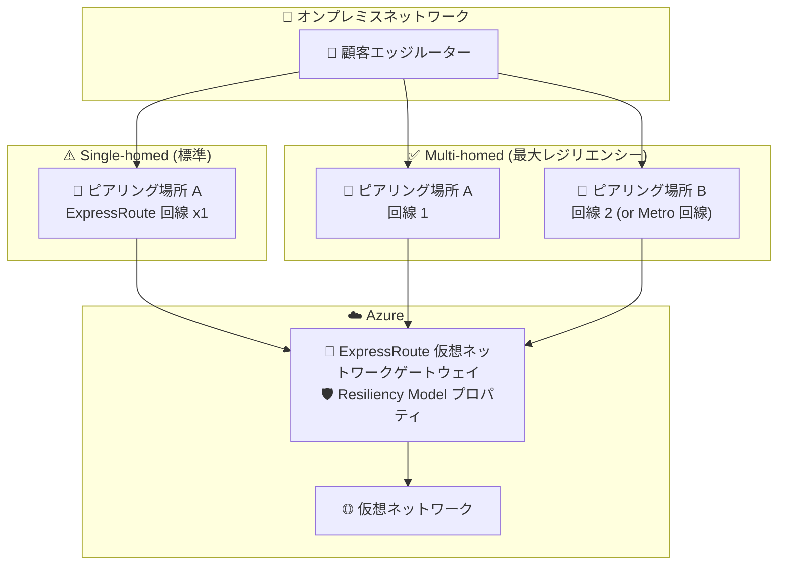

# Azure ExpressRoute: Resiliency Guard (Public Preview)

**リリース日**: 2026-08-07

**サービス**: Azure ExpressRoute

**機能**: ExpressRoute Resiliency Guard (レジリエンシーガード)

**ステータス**: In preview

[このアップデートのインフォグラフィックを見る](https://takech9203.github.io/azure-news-summary/20260807-expressroute-resiliency-guard.html)

## 概要

ExpressRoute 仮想ネットワークゲートウェイ向けの新機能「Resiliency Guard (レジリエンシーガード)」がパブリックプレビューとして提供開始されました。ゲートウェイの作成時・変更時に新しい **Resiliency Model (レジリエンシーモデル)** プロパティを指定できるようになり、そのゲートウェイを **single-homed (シングルホーム)** 構成として使うのか、**multi-homed (マルチホーム)** 構成として使うのかを明示的に宣言できます。

Multi-homed を選択したゲートウェイでは、異なるピアリング場所にある 2 つ以上の ExpressRoute 回線、または ExpressRoute Metro 回線への接続がガイドされます。Azure Portal 上のガイダンスと構成セーフガードにより、不完全なセットアップ (回線が 1 拠点にしか接続されていない等) の検出や、レジリエンシー低下につながる変更のリスク軽減を支援します。マルチサイトのレジリエンシーを必要としないワークロード向けには、single-homed 構成も引き続き利用できます。

**アップデート前の課題**

- ゲートウェイに「意図したレジリエンシーレベル」を宣言する仕組みがなく、マルチサイト冗長を意図した構成でも、実際には 1 つのピアリング場所にしか接続されていない不完全なセットアップに気付きにくかった
- 接続の削除やゲートウェイの削除など、レジリエンシーを低下させる変更に対する保護 (ガードレール) がなかった

**アップデート後の改善**

- Resiliency Model プロパティで single-homed / multi-homed の意図を宣言でき、ワークロードの可用性要件とデプロイを整合させられる
- Multi-homed ゲートウェイでは、必要な回線がすべて接続されるまで Portal にバナーが表示され、接続完了後に接続性ステータスが可視化される
- Multi-homed / Metro ゲートウェイの削除がブロックされ、誤削除を防止 (削除するには single-homed へのダウングレードが必要)
- 構成の不整合 (single-homed へ変更後に余分な接続が残っている等) は Portal にミスマッチバナーで警告される

## アーキテクチャ図

Single-homed は 1 つのピアリング場所のみに接続するためサイト障害に弱く、multi-homed は異なる物理拠点の複数回線 (または Metro 回線) に接続することで、1 拠点が停止しても正常な拠点へ自動フェールオーバーします。Resiliency Guard はこの意図をゲートウェイのプロパティとして宣言・保護します。

## サービスアップデートの詳細

### 主要機能

1. **Resiliency Model プロパティ**
   - ゲートウェイの作成時・変更時に **Multi-homed** または **Single-homed** を選択
   - ワークロードのレジリエンシー要件と実際のデプロイ構成を整合させる宣言的なプロパティ

2. **Multi-homed: 最大レジリエンシー**
   - 異なる物理拠点にある 2 つ以上の回線、または 1 つ以上の ExpressRoute Metro 回線への接続を構成
   - Resiliency Guard が接続性ステータスを表示。1 拠点が利用不能になると、正常な拠点へトラフィックが自動フェールオーバー
   - Azure Advisor は高可用性が必要なクリティカルワークロードに対してこのモデルを推奨

3. **Single-homed: 標準セットアップ**
   - 拠点レベルの冗長性が不要な場合に選択。1 拠点の 1 回線に接続すれば接続性が確立
   - 拠点全体の障害からは保護されないため、Azure Advisor は multi-homed へのアップグレードを推奨

4. **構成セーフガード**
   - Multi-homed / Metro ゲートウェイは誤削除防止のため削除がブロックされる (削除には single-homed へのダウングレードが必要)
   - Single-homed へのダウングレード時には影響を確認する確認ダイアログが表示される
   - 非 Metro ゲートウェイで余分な接続を削除しないままダウングレードすると、ミスマッチバナーが表示され、ゲートウェイは multi-homed として動作し続ける

## 技術仕様

| 項目 | 詳細 |
|------|------|
| 対象リソース | ExpressRoute 仮想ネットワークゲートウェイ |
| プロパティ | Resiliency Model (`Multi-homed` / `Single-homed`) |
| Multi-homed の要件 | 異なる物理拠点の 2 回線以上への接続、または ExpressRoute Metro 回線への接続 |
| Metro 構成の扱い | Metro は 1 接続のみのため、single-homed への変更後に追加接続の削除は不要 |
| モデルの変更 | Portal の Configuration タブでいつでも変更可能 (アップグレード / ダウングレード) |
| 削除保護 | Multi-homed / Metro ゲートウェイは削除ブロック。single-homed へのダウングレード後に削除可能 |
| 非対応 | Virtual WAN のゲートウェイは現時点で未サポート |
| プレビュー参加 | サブスクリプション単位で公開プレビュー申請フォームからの有効化が必要 |

## 設定方法

### 前提条件

1. ExpressRoute 仮想ネットワークゲートウェイを使用していること (Virtual WAN ゲートウェイは未サポート)
2. サブスクリプションで Resiliency Guard を有効化するため、[公開プレビュー申請フォーム](https://forms.office.com/r/L828eyz8Qj)を提出すること

### Azure Portal

**ゲートウェイの新規作成:**

1. 「仮想ネットワークゲートウェイの作成」に移動
2. 名前、リージョン、ゲートウェイの種類などの基本設定を入力
3. **Resiliency Model** セクションで **Multi-homed** または **Single-homed** を選択

**Multi-homed ゲートウェイの構成:**

1. ExpressRoute ゲートウェイの「接続 (Connections)」を開く
2. 異なる物理拠点にある 2 つ以上の回線、または Metro 回線への接続を追加
3. 必要な回線をすべて接続すると、Portal に接続性ステータスが表示される

**Multi-homed へのアップグレード:**

1. 別の拠点の回線または Metro 回線への 2 本目の接続を追加し、接続確立を待つ
2. Configuration タブでレジリエンシーモデルを **Multi-homed** に変更して保存

**Single-homed へのダウングレード:**

1. Configuration タブでレジリエンシーモデルを **Single-homed** に変更し、確認ダイアログで承認
2. 非 Metro ゲートウェイの場合は余分な接続を削除する (削除しない場合はミスマッチバナーが表示され、multi-homed として動作し続ける)

## メリット

### ビジネス面

- クリティカルワークロードの可用性要件 (拠点障害への耐性) を構成として担保でき、拠点全体の障害時にもオンプレミス-Azure 間接続を維持しやすくなる
- 誤操作 (ゲートウェイや接続の削除) によるレジリエンシー低下・接続断のリスクを低減
- Azure Advisor の推奨と連動し、レジリエンシー改善の判断材料が得られる

### 技術面

- ゲートウェイの「意図したレジリエンシーレベル」がプロパティとして明示され、構成ドリフトや不完全セットアップを Portal 上で検出できる
- Multi-homed 構成では拠点障害時に正常な拠点へ自動フェールオーバー
- 稼働中でもレジリエンシーモデルをアップグレード / ダウングレード可能

## デメリット・制約事項

- パブリックプレビューのため、利用にはサブスクリプション単位での申請フォーム提出が必要
- Virtual WAN のゲートウェイは現時点で未サポート (ExpressRoute 仮想ネットワークゲートウェイのみ)
- Multi-homed / Metro ゲートウェイは直接削除できず、single-homed へのダウングレード完了を待ってから削除する運用手順が必要
- Multi-homed 構成には異なるピアリング場所の複数回線 (または Metro 回線) が必要であり、回線コストは構成に応じて増加する

## ユースケース

### ユースケース 1: ミッションクリティカルワークロードの拠点障害対策

**シナリオ**: 基幹システムをオンプレミスと Azure のハイブリッド構成で運用しており、ExpressRoute のピアリング拠点全体の障害 (災害・設備障害など) でも接続を維持したい。

**実装例**: ゲートウェイを Resiliency Model = Multi-homed で作成し、異なるピアリング場所にある 2 つの ExpressRoute 回線への接続を追加。Portal の接続性ステータスで両拠点の接続が正常であることを確認する。

**効果**: 1 拠点が利用不能になっても正常な拠点へ自動フェールオーバーし、接続を維持。必要な回線が未接続の場合は Portal が警告するため、冗長化の「つもり」で実際は単一拠点、という構成ミスを防げる。

### ユースケース 2: 運用ミスによる接続断の防止

**シナリオ**: 複数チームが同じサブスクリプションを運用しており、誤って ExpressRoute ゲートウェイや冗長側の接続を削除してしまうリスクがある。

**実装例**: 本番ゲートウェイを Multi-homed として構成する。削除が必要な場合のみ、single-homed へダウングレード後に削除する手順を運用ルール化する。

**効果**: Multi-homed / Metro ゲートウェイの削除は Azure によりブロックされるため、誤削除による広域接続断を防止できる。

## 料金

このアップデート (Resiliency Guard 機能自体) に関する追加料金の情報は、公式ページでは確認できませんでした。なお、multi-homed 構成には複数の ExpressRoute 回線 (または Metro 回線) が必要となるため、回線・ゲートウェイの料金は下記の料金ページを参照してください。

- [ExpressRoute の料金](https://azure.microsoft.com/pricing/details/expressroute/)

## 利用可能リージョン

公式ページにリージョン情報の記載はありませんでした。パブリックプレビューへの参加には申請フォームの提出が必要です。詳細は [Microsoft Learn ドキュメント](https://learn.microsoft.com/azure/expressroute/resiliency-model)を参照してください。

## 関連サービス・機能

- **ExpressRoute Metro**: 同一都市圏内の 2 サイトに 1 回線を分散させる高レジリエンシー構成。Multi-homed モデルの接続先として利用可能
- **ExpressRoute サイトレジリエンシーアーキテクチャ (Maximum / High / Standard)**: Resiliency Guard の multi-homed は Maximum resiliency、single-homed は Standard resiliency に対応する考え方
- **Azure Advisor**: クリティカルワークロードに対して multi-homed モデルを推奨し、single-homed 構成にはアップグレードを推奨
- **ゾーン冗長 ExpressRoute ゲートウェイ**: 可用性ゾーンをまたぐゲートウェイ配置により、サイトレジリエンシーと合わせてゾーンレベルの障害にも対応

## 参考リンク

- [インフォグラフィック](https://takech9203.github.io/azure-news-summary/20260807-expressroute-resiliency-guard.html)
- [公式アップデート情報](https://azure.microsoft.com/updates?id=568666)
- [ExpressRoute Resiliency Guard (Preview) - Microsoft Learn](https://learn.microsoft.com/azure/expressroute/resiliency-model)
- [Design and architect Azure ExpressRoute for resiliency - Microsoft Learn](https://learn.microsoft.com/azure/expressroute/design-architecture-for-resiliency)
- [料金ページ](https://azure.microsoft.com/pricing/details/expressroute/)

## まとめ

ExpressRoute Resiliency Guard は、ゲートウェイの意図するレジリエンシーレベル (single-homed / multi-homed) をプロパティとして宣言し、不完全なセットアップの検出・誤削除の防止といったガードレールを提供するパブリックプレビュー機能です。ミッションクリティカルなハイブリッド接続を運用する Solutions Architect は、プレビュー申請のうえ本番前環境で multi-homed モデルの挙動 (接続性ステータス表示、削除ブロック、ダウングレード手順) を検証し、既存の単一拠点構成については multi-homed へのアップグレードを検討することを推奨します。

---

**タグ**: Azure ExpressRoute, Networking, Hybrid + multicloud, Resiliency, In preview
