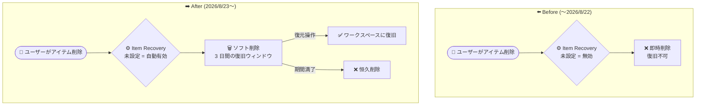

# Microsoft Fabric: Item Recovery が未設定テナントでデフォルト有効化へ

**リリース日**: 2026-08-10

**サービス**: Microsoft Fabric

**機能**: Item Recovery (アイテムのソフト削除と復旧) のデフォルト有効化

**ステータス**: Announcement

[このアップデートのインフォグラフィックを見る](https://takech9203.github.io/azure-news-summary/20260810-fabric-item-recovery-default.html)

## 概要

2026 年 8 月 23 日より、Microsoft Fabric は Item Recovery (アイテム復旧) のテナント設定を明示的に構成していないテナントに対して、この機能をデフォルトで有効化します。デフォルト有効化されたテナントでは、サポート対象のアイテムタイプに対して 3 日間の復旧ウィンドウが適用されます。

Item Recovery は、ワークスペース内の個々のアイテム (Lakehouse、Notebook、Warehouse など) を削除した際にソフト削除状態として保持し、保持期間中であれば復旧できる機能です。従来、この機能はデフォルトで無効であり、テナント管理者が明示的に有効化する必要がありました。今回の変更により、設定を放置していたテナントでも誤削除からの保護が自動的に適用されるようになります。

管理者は Fabric 管理ポータルの「テナント設定 > Item Recovery」でこの設定を確認・変更できます。既に明示的に設定 (有効/無効) を構成済みのテナントは、今回の変更の影響を受けません。

**アップデート前の課題**

- Item Recovery はデフォルトで無効 (テーブル上の「Default retention state: Disabled」) であり、テナント管理者が明示的に有効化しない限り、アイテム削除時に保持が行われなかった
- 設定が無効のままのテナントでは、ユーザーがアイテムを誤って削除すると復旧できず、恒久的なデータ損失につながるリスクがあった

**アップデート後の改善**

- 2026 年 8 月 23 日以降、設定を明示的に構成していないテナントで Item Recovery が自動的に有効化される
- サポート対象アイテムタイプに対して、デフォルトで 3 日間の復旧ウィンドウが提供され、誤削除からの保護がテナント全体に行き渡る
- 管理者は引き続き Fabric 管理ポータルで設定の確認・変更 (保持期間の調整や無効化) が可能

## アーキテクチャ図



Item Recovery を明示的に設定していないテナントにおける、削除時の動作の変化を示しています。変更後は削除アイテムがソフト削除状態となり、3 日間の復旧ウィンドウ内であればごみ箱 (Recycle bin) や REST API から復元できます。

## サービスアップデートの詳細

### 主要機能

1. **未設定テナントでのデフォルト有効化**
   - 2026 年 8 月 23 日以降、Item Recovery のテナント設定を明示的に構成していないテナントで、この機能が自動的に有効化される
   - デフォルトの復旧ウィンドウは 3 日間

2. **アイテムのソフト削除と復旧 (Item Recovery 機能自体)**
   - サポート対象アイテムを削除すると、即時削除ではなくソフト削除状態となり保持期間に入る
   - 保持期間中は、ワークスペースの Contributor / Member / Admin がアイテムを復旧できる
   - 復旧はワークスペースの「ごみ箱 (Recycle bin)」ビューまたは REST API から実行できる
   - 復旧されたアイテムは、元のプロパティ・構成・リレーションシップを保持した状態でワークスペースに戻る (共有アイテムのアクセス許可を除く)

3. **管理者による設定管理**
   - テナント管理者は Fabric 管理ポータルの「テナント設定 > Item Recovery」で設定を確認・変更できる
   - 手動で有効化する場合、保持期間は 7〜90 日の範囲で設定可能 (手動有効化時のデフォルトは 7 日)

### サポート対象アイテムタイプ

以下のアイテムタイプがソフト削除と復旧に対応しています (Microsoft Learn ドキュメントより。今後さらに追加予定):

- API for GraphQL、Copy job、Cosmos database、Data agent (プレビュー)、Data pipeline、Environment
- Graph index (プレビュー)、Graph queryset (プレビュー)、Healthcare data solutions、KQL queryset
- Lakehouse、Map (プレビュー)、Mirrored Azure Databricks catalog、Mirrored database、Mirrored Snowflake
- ML experiment、ML model、Notebook、Ontology (プレビュー)、Operational agent (プレビュー)
- Real-Time Dashboard、Spark job definition、SQL database (プレビュー)、User data function、Variable library
- Warehouse、Warehouse snapshot

サポート対象外のアイテムタイプは、削除すると復旧できず不可逆的に削除されます。

## 技術仕様

| 項目 | 詳細 |
|------|------|
| デフォルト有効化の開始日 | 2026 年 8 月 23 日 |
| 対象テナント | Item Recovery 設定を明示的に構成していないテナント |
| デフォルト有効化時の復旧ウィンドウ | 3 日間 |
| 手動設定時の保持期間 | 7〜90 日 (手動有効化時のデフォルトは 7 日) |
| 設定場所 | Fabric 管理ポータル > テナント設定 > Item Recovery |
| 設定変更に必要なロール | テナント管理者 (ワークスペース管理者はワークスペース単位で変更不可) |
| アイテム復旧に必要な権限 | Workspace Contributor 以上 (Viewer は不可) |
| 保持期間中の恒久削除に必要な権限 | Workspace Admin |
| 恒久削除後の OneLake データ保持 | 追加で 7 日間保持されるが、この期間中の復元は不可 |
| ワークスペース保持への影響 | なし (Item Recovery 設定はワークスペースの保持期間には影響しない) |

## 設定方法

### 前提条件

1. テナント設定の変更にはテナント管理者ロールが必要
2. 削除済みアイテムの復旧には Workspace Contributor 以上の権限が必要
3. 保持期間中のアイテムの恒久削除には Workspace Admin 権限が必要

### Fabric 管理ポータル (テナント設定)

1. 管理ポータルで「**テナント設定** > **Item Recovery**」に移動する
2. 設定をオンにし、保持期間の日数 (7〜90 日) を入力する
3. 「**適用**」を選択する

デフォルト有効化を望まない場合は、2026 年 8 月 23 日より前に同設定を明示的に「オフ」に構成することで、従来どおり無効のまま維持できます。

### ワークスペースのごみ箱からの復元

1. 削除されたアイテムが含まれていたワークスペースを開く
2. ワークスペースのナビゲーションから「**ごみ箱 (Recycle bin)**」を選択する
3. フィルターや検索で対象アイテムを見つける
4. アイテムを選択し、ツールバーから「**復元 (Restore)**」を選択する

### REST API

```bash
# 削除済みアイテムを復旧する
curl --request POST \
  --url https://api.fabric.microsoft.com/v1/workspaces/{workspaceId}/recoverableItems/{itemId}/recover \
  --header 'Authorization: Bearer {token}'

# 保持期間中のアイテムを恒久削除する (Workspace Admin 権限が必要)
curl --request DELETE \
  --url https://api.fabric.microsoft.com/v1/workspaces/{workspaceId}/recoverableItems/{itemId} \
  --header 'Authorization: Bearer {token}'
```

## メリット

### ビジネス面

- 設定を放置していたテナントでも誤削除からの保護が自動適用され、テナント全体でのデータ損失リスクが低減する
- 誤削除の際に管理者へのエスカレーションや再作成の工数を削減でき、業務継続性が向上する

### 技術面

- 復旧されたアイテムはプロパティ・構成・リネージ・エンドースメント・秘密度ラベルなどが復元され、再構築の手間が最小限で済む
- ごみ箱 UI と REST API の両方が提供され、セルフサービス復旧と運用自動化の双方に対応できる

## デメリット・制約事項

- **課金への影響**: ソフト削除されたアイテムは保持期間中も OneLake ストレージコストが発生する (アクティブなデータと同じレート)。また、バックグラウンドのメンテナンス処理により少量のキャパシティユニット (CU) を消費する場合がある
- サポート対象のアイテムタイプのみがソフト削除・復旧に対応する。非対応タイプは即時に不可逆削除される
- 共有アイテムのアクセス許可は復旧後に復元されないため、再共有が必要
- ソフト削除済みアイテムを含むワークスペースフォルダーは、フォルダー内の全アイテムを恒久削除するまで削除できない
- テナント設定の変更はテナント管理者のみ可能で、ワークスペース単位での変更はできない
- Warehouse を復旧した場合、メタデータとデータは復元されるが、削除時に消えたスナップショットは復旧できない
- 同名の新規アイテムが同じワークスペースに存在する場合、復旧は失敗する (既存アイテムのリネームが必要)
- Item Recovery 有効時、ソフト削除では `Microsoft.Fabric.ItemDeleteSucceeded` などのワークスペースアイテムイベントは生成されず、恒久削除時に生成される
- 既知の問題: Git 統合やデプロイパイプラインの同期により、ソフト削除済みアイテムが定義のみ (データなし) で再作成される場合がある

## 料金

Item Recovery 機能自体に追加料金はアナウンスされていませんが、保持期間中のソフト削除済みアイテムには以下のコストが発生します。

| 項目 | 課金内容 |
|------|------|
| OneLake ストレージ | ソフト削除済みアイテムのデータはアクティブデータと同じレートで課金 |
| キャパシティユニット (CU) | バックグラウンドのメンテナンス処理により少量消費する場合あり |

コストを止めるには、保持期間の満了を待たずにアイテムを恒久削除します。詳細は [Microsoft Fabric の料金ページ](https://azure.microsoft.com/pricing/details/microsoft-fabric/) を参照してください。

## 関連サービス・機能

- **OneLake**: ソフト削除済みアイテムのデータは OneLake に保持され、ストレージ課金の対象となる。恒久削除後も OneLake 上で追加 7 日間データが保持される (復元は不可)
- **ワークスペース保持 (Workspace retention)**: ワークスペース自体の削除に対する保持機能。コラボレーションワークスペースはデフォルト有効 (7 日、7〜90 日で変更可)、個人用ワークスペース (My workspace) は固定 30 日。Item Recovery 設定はワークスペース保持には影響しない
- **OneLake カタログ / リネージ**: ソフト削除中のアイテムはカタログやリネージビューに表示されず、復旧後に完全に復元される
- **ガバナンス機能 (エンドースメント、秘密度ラベル、DLP)**: 復旧時にエンドースメント状態、タグ、秘密度ラベル、DLP ポリシーが復元される
- **Fabric ワークスペースアイテムイベント (Real-Time Hub)**: Item Recovery 有効時、削除イベントは恒久削除のタイミングで生成される

## 参考リンク

- [インフォグラフィック](https://takech9203.github.io/azure-news-summary/20260810-fabric-item-recovery-default.html)
- [公式アップデート情報](https://azure.microsoft.com/updates?id=569140)
- [Retention and recovery in Fabric (Microsoft Learn)](https://learn.microsoft.com/en-us/fabric/admin/retention-recovery)
- [Recover or permanently delete items (Microsoft Learn)](https://learn.microsoft.com/en-us/fabric/admin/item-recovery)
- [Microsoft Fabric 料金ページ](https://azure.microsoft.com/pricing/details/microsoft-fabric/)

## まとめ

2026 年 8 月 23 日以降、Item Recovery を明示的に設定していない Microsoft Fabric テナントでは、この機能が自動的に有効化され、サポート対象アイテムに 3 日間の復旧ウィンドウが適用されます。誤削除に対する保護が強化される一方、ソフト削除済みアイテムには OneLake ストレージコストや CU 消費が発生する点に注意が必要です。テナント管理者は 8 月 23 日までに「テナント設定 > Item Recovery」で現在の設定状態を確認し、自組織のデータ保護要件とコストのバランスに応じて、保持期間の調整 (7〜90 日) または明示的な無効化を検討してください。

---

**タグ**: Microsoft Fabric, Analytics, Item Recovery, ソフト削除, データ保護, OneLake, テナント設定, ガバナンス
