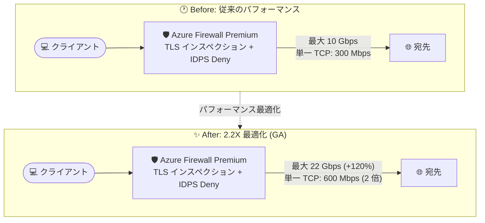

# Azure Firewall: IDPS パフォーマンスの 2.2 倍最適化 (GA)

**リリース日**: 2026-08-11

**サービス**: Azure Firewall (Premium)

**機能**: IDPS パフォーマンス最適化 (2.2X)

**ステータス**: Launched (GA)

[このアップデートのインフォグラフィックを見る](https://takech9203.github.io/azure-news-summary/20260811-azure-firewall-idps-performance.html)

## 概要

Azure Firewall Premium の IDPS (侵入検知防御システム) パフォーマンス最適化が一般提供 (GA) されました。TLS インスペクションと IDPS (Deny モード) を有効にした場合のスループットが従来の 10 Gbps から最大 22 Gbps へと 120% 向上しました。

また、IDPS を有効 (Alert モードまたは Deny モードのいずれか) にした場合の単一 TCP 接続あたりのスループットも、従来の 300 Mbps から最大 600 Mbps へと 2 倍に向上しました。

TLS インスペクションと IDPS は Azure Firewall Premium の中核となる高度な脅威保護機能ですが、トラフィックの復号やシグネチャマッチングによる処理負荷が高く、有効化するとスループットが大きく低下する点が課題でした。今回の最適化により、セキュリティ機能を最大限有効化したままでも大幅に高いスループットを実現できます。

**アップデート前の課題**

- TLS インスペクション + IDPS (Deny モード) を有効にすると、スループットが最大 10 Gbps に制限され、高トラフィック環境ではセキュリティと性能のトレードオフが発生していた
- IDPS 有効時の単一 TCP 接続あたりのスループットが最大 300 Mbps に制限され、大容量ファイル転送などの単一フローが遅くなる可能性があった

**アップデート後の改善**

- TLS インスペクション + IDPS (Deny モード) 有効時のスループットが最大 22 Gbps に向上 (120% 増)
- IDPS 有効時 (Alert / Deny モードのいずれか) の単一 TCP 接続あたりのスループットが最大 600 Mbps に向上 (2 倍)
- セキュリティ機能をフル活用したまま、より大規模なワークロードを保護可能に

## アーキテクチャ図

同一構成 (TLS インスペクション + IDPS 有効) のまま、ファイアウォールを通過するトラフィックのスループット上限が大幅に向上したことを示しています。

## サービスアップデートの詳細

### 主要機能

1. **TLS インスペクション + IDPS (Deny モード) 有効時のスループット向上**
   - 従来の 10 Gbps から最大 22 Gbps へ 120% 向上
   - 復号を伴うフルインスペクション構成でも高スループットを維持

2. **単一 TCP 接続あたりのスループット向上**
   - IDPS を Alert モードまたは Deny モードで有効化した場合、従来の 300 Mbps から最大 600 Mbps へ 2 倍に向上
   - 大容量データ転送など、単一フローに依存するワークロードの性能が改善

3. **IDPS の脅威検知能力はそのまま維持**
   - IDPS はシグネチャベースで L3〜L7 のトラフィックを監視し、50 以上のカテゴリ・67,000 以上のルールを継続的に更新
   - マルウェア C&C、フィッシング、エクスプロイトキットなどの検知・遮断が可能

## 技術仕様

Microsoft Learn の Azure Firewall パフォーマンスドキュメントに記載されている最新の性能値は以下のとおりです (最大オートスケール 20 インスタンス時)。

| 構成 | TCP/UDP 帯域幅 | HTTP/S 帯域幅 |
|------|----------------|---------------|
| Premium (TLS 無効 + IDPS 無効) | 100 Gbps | 100 Gbps |
| Premium (TLS 有効 + IDPS 無効) | - | 100 Gbps |
| Premium (TLS 有効 + IDPS Alert モード) | 100 Gbps | 100 Gbps |
| Premium (TLS 有効 + IDPS Deny モード) | **最大 22 Gbps** (従来 10 Gbps) | **最大 22 Gbps** (従来 10 Gbps) |

単一接続あたりのスループット:

| 構成 | スループット |
|------|--------------|
| Premium 単一 TCP 接続 (最大) | 最大 9 Gbps |
| Premium 単一 TCP 接続 (IDPS Alert and Deny モード) | **最大 600 Mbps** (従来 300 Mbps) |

補足:

- 上記の性能値は最大オートスケール 20 インスタンス時のもの。プリスケーリング有効時は最大 50 インスタンスまでスケール可能で、その場合の性能値は異なる
- Azure Firewall Premium では performance boost 機能 (基盤となるファイアウォール VM での Accelerated Networking 有効化を含む) がすべてのデプロイでデフォルトで有効

## メリット

### ビジネス面

- セキュリティと性能のトレードオフが緩和され、規制業界 (決済、医療など) でもフルインスペクション構成を採用しやすくなる
- ファイアウォールのスループット不足を理由とした構成の分割や回避策 (IDPS バイパスなど) の必要性が低減し、運用がシンプルになる
- 追加コストなしで既存の Premium デプロイの性能上限が向上

### 技術面

- TLS インスペクション + IDPS Deny モードの構成で最大 22 Gbps まで処理可能となり、高トラフィックなハブ & スポーク構成でも対応しやすい
- 単一 TCP 接続あたり 600 Mbps により、大容量ファイル転送やバックアップトラフィックなど単一フロー依存のワークロードが高速化
- IDPS の検知能力 (67,000 以上のシグネチャ) を維持したままの性能向上

## デメリット・制約事項

- 性能値は最大値であり、実際のスループットはトラフィックの特性 (パケットサイズ、接続数、プロトコルなど) に依存する。本番導入前にテスト環境での性能評価が推奨される
- TLS 有効 + IDPS Deny モード構成 (最大 22 Gbps) は、IDPS 無効時や Alert モード時 (最大 100 Gbps) と比較すると依然としてスループット上限が低い
- 記載の性能値は最大オートスケール 20 インスタンス時のもの。初期デプロイ (オートスケール前) の Premium の最大帯域幅は 18 Gbps で、スケールアウトには 5〜7 分を要する
- IDPS バイパスリストはスループット改善を目的とした機能ではない (ドキュメントに明記)

## ユースケース

### ユースケース 1: ハブ & スポーク構成でのフルインスペクション

**シナリオ**: ハブ VNet に Azure Firewall Premium を配置し、スポーク間 (East-West) およびアウトバウンド通信すべてに TLS インスペクションと IDPS (Deny モード) を適用する。従来はスループット上限 10 Gbps がボトルネックとなり得たが、22 Gbps まで対応可能となったことで、より多くのスポーク・ワークロードを単一のファイアウォールで保護できる。

**効果**: セキュリティ検査を省略することなく、大規模環境のトラフィックを集約的に保護。

### ユースケース 2: 大容量データ転送を伴うワークロードの保護

**シナリオ**: バックアップやデータ同期など、単一 TCP 接続で大容量データを転送するワークロードのトラフィックを IDPS で検査する。単一接続あたりのスループットが 300 Mbps から 600 Mbps に倍増したことで、転送時間が短縮される。

**効果**: IDPS による検査を維持しつつ、単一フローの転送性能が最大 2 倍に向上。

## 料金

今回のパフォーマンス最適化は Azure Firewall Premium の機能改善であり、料金体系の変更は確認されていません。

Azure Firewall の課金は、デプロイ時間あたりの固定料金とデータ処理量 (GB あたり) の変動料金の組み合わせです。Premium SKU ではオプションとして Capacity Unit (プリスケーリング用の容量予約) も利用できます。1 時間未満の利用は 1 時間分として課金されます。

具体的な金額はリージョンにより異なるため、[Azure Firewall 料金ページ](https://azure.microsoft.com/pricing/details/azure-firewall/) および [Azure 料金計算ツール](https://azure.microsoft.com/pricing/calculator/) を参照してください。

## 利用可能リージョン

Azure Firewall が利用可能なリージョンについては、[リージョン別の利用可能な製品](https://azure.microsoft.com/global-infrastructure/services/?products=azure-firewall) を参照してください。

## 関連サービス・機能

- **Azure Firewall Manager**: 複数の Azure Firewall インスタンスとファイアウォールポリシーを集中管理。Premium ポリシーの一元適用に利用
- **Azure Virtual WAN (Secured Virtual Hub)**: Virtual WAN ハブに Azure Firewall Premium をデプロイし、グローバルなトラフィックを保護
- **Azure Monitor / Log Analytics**: IDPS のアラートやネットワークルールログの収集・分析に利用
- **Azure Web Application Firewall (WAF)**: インバウンドの TLS インスペクションは Application Gateway 上の WAF が担当し、Azure Firewall Premium (アウトバウンド / East-West) と補完関係にある

## 参考リンク

- [インフォグラフィック](https://takech9203.github.io/azure-news-summary/20260811-azure-firewall-idps-performance.html)
- [公式アップデート情報](https://azure.microsoft.com/updates?id=569256)
- [Azure Firewall Premium features (Microsoft Learn)](https://learn.microsoft.com/azure/firewall/premium-features)
- [Azure Firewall performance (Microsoft Learn)](https://learn.microsoft.com/azure/firewall/firewall-performance)
- [料金ページ](https://azure.microsoft.com/pricing/details/azure-firewall/)

## まとめ

Azure Firewall Premium の IDPS パフォーマンス最適化が GA となり、TLS インスペクション + IDPS (Deny モード) 有効時のスループットが 10 Gbps から最大 22 Gbps へ 120% 向上、IDPS 有効時の単一 TCP 接続あたりのスループットが 300 Mbps から最大 600 Mbps へ倍増しました。追加の設定や料金なしで得られる性能向上であり、これまでスループット上限を理由に IDPS Deny モードや TLS インスペクションの適用範囲を限定していた環境では、フルインスペクション構成への移行を再検討する好機です。導入時は最大値がトラフィック特性に依存する点を踏まえ、本番相当のトラフィックでの性能テストを実施することを推奨します。

---

**タグ**: Azure Firewall, IDPS, TLS Inspection, Networking, Security, Performance, GA
