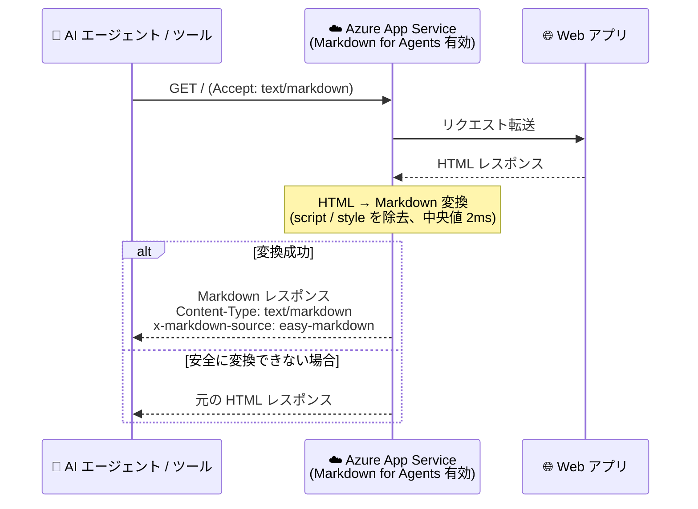

# Azure App Service: Markdown for Agents (パブリックプレビュー)

**リリース日**: 2026-08-12

**サービス**: Azure App Service

**機能**: Markdown for Agents

**ステータス**: In preview

[このアップデートのインフォグラフィックを見る](https://takech9203.github.io/azure-news-summary/20260812-app-service-markdown-for-agents.html)

## 概要

Azure App Service の新機能「Markdown for Agents」のパブリックプレビューが発表されました。この機能は、AI エージェントやその他のツールが App Service アプリのコンテンツをよりクリーンな形式で取得できるようにするものです。クライアントが `Accept: text/markdown` ヘッダーで Markdown を要求すると、App Service がアプリの HTML レスポンスを自動的に Markdown に変換します。**アプリケーションコードの変更は一切不要**です。

Microsoft の内部テストでは、637,000 ページ以上を対象とした検証で、変換後の Markdown レスポンスは元の HTML と比較して**中央値で 97% 小さく**なり、変換時間の中央値は **2 ミリ秒**でした (結果はページ内容により変動)。レスポンスサイズの削減は、AI モデルに送信する際のトークン使用量の削減につながります。

**アップデート前の課題**

- Web ページにはスクリプト、スタイル、HTML マークアップが含まれ、ブラウザーには有用だが AI モデルにコンテンツを送信する際にはノイズとなっていた
- AI エージェントが Web アプリのコンテンツを利用するには、余分なマークアップを含む HTML をそのまま処理する必要があり、トークン使用量が増大していた

**アップデート後の改善**

- App Service がプラットフォーム側で HTML を Markdown に自動変換し、余分なマークアップを除去したテキスト中心の小さなレスポンスを返せるようになった
- アプリケーションコードを変更することなく、リソースプロパティの設定のみで有効化できる
- 既存の認証・認可・ネットワークアクセス制御はそのまま適用され、追加の認証設定は不要

## アーキテクチャ図



AI エージェントが `Accept: text/markdown` ヘッダー付きでリクエストすると、App Service プラットフォームがアプリの HTML レスポンスを Markdown に変換して返します。変換できないページは元の HTML が返るため、クライアントはレスポンスヘッダーで変換結果を判定します。

## サービスアップデートの詳細

### 主要機能

1. **HTML から Markdown への自動変換**
   - クライアントが `Accept: text/markdown` ヘッダーを送信すると、App Service が HTML レスポンスを Markdown に変換
   - 見出し、段落、リンク、リスト、画像、強調、コードなどの一般的なコンテンツは保持され、script および style の内容は除去される

2. **アプリケーションコード変更不要**
   - サイトリソースのプロパティ (`aiIntegration.markdown.enabled`) を有効化するだけで利用可能
   - 追加の認証設定は不要で、アプリの既存の認証・認可・ネットワークアクセス制御がそのまま適用される

3. **変換結果の判定用レスポンスヘッダー**
   - 変換成功時は `Content-Type: text/markdown; charset=utf-8` と `x-markdown-source: easy-markdown` ヘッダーが付与される
   - 安全に変換できないページは元の HTML が返されるため、クライアントは処理前にこれらのヘッダーを確認する必要がある

## 技術仕様

| 項目 | 詳細 |
|------|------|
| 対応プラットフォーム | Windows App Service のみ (Linux 対応は 2026 年内に提供予定) |
| 必要なプラン | Basic レベル以上の App Service プラン |
| 有効化方法 | REST API、ARM/Bicep テンプレート、Azure CLI (`az rest`) |
| 設定プロパティ | `properties.aiIntegration.markdown.enabled` (API バージョン `2026-03-15`) |
| リクエスト方法 | `Accept: text/markdown` ヘッダー |
| 変換成功時のヘッダー | `Content-Type: text/markdown; charset=utf-8`、`x-markdown-source: easy-markdown` |
| 変換パフォーマンス | レスポンスサイズ中央値 97% 削減、変換時間中央値 2ms (63.7 万ページの内部テスト) |
| ポータル / 専用 CLI コマンド | 未対応 (将来のアップデートで提供予定) |

## 設定方法

### 前提条件

1. Windows の App Service アプリ (Linux は現時点で未対応)
2. Basic レベル以上の App Service プラン

### Azure CLI (az rest)

```bash
# Markdown for Agents を有効化
az rest --method patch \
  --url "https://management.azure.com/subscriptions/<SUBSCRIPTION_ID>/resourceGroups/<RESOURCE_GROUP>/providers/Microsoft.Web/sites/<APP_NAME>?api-version=2026-03-15" \
  --headers "Content-Type=application/json" \
  --body '{"properties":{"aiIntegration":{"markdown":{"enabled":true}}}}'

# 設定の確認
az rest --method get \
  --url "https://management.azure.com/subscriptions/<SUBSCRIPTION_ID>/resourceGroups/<RESOURCE_GROUP>/providers/Microsoft.Web/sites/<APP_NAME>?api-version=2026-03-15" \
  --query "properties.aiIntegration.markdown"

# 動作確認: Accept ヘッダー付きでリクエスト
curl -i -H "Accept: text/markdown" "https://<APP_NAME>.azurewebsites.net/"
```

無効化する場合は、同じ PATCH リクエストで `enabled` を `false` に設定します。

### Bicep

```bicep
resource webApp 'Microsoft.Web/sites@2026-03-15' = {
  name: appName
  location: location
  properties: {
    serverFarmId: appServicePlanResourceId
    aiIntegration: {
      markdown: {
        enabled: true
      }
    }
  }
}
```

## メリット

### ビジネス面

- AI モデルへ送信するコンテンツのサイズが大幅に削減され (中央値 97%)、トークン使用量とそれに伴うコストの削減が期待できる
- 既存の Web アプリをコード変更なしで AI エージェント対応にでき、エージェント連携の導入コストが低い

### 技術面

- HTML のパースやスクレイピング用の前処理をエージェント側で実装する必要がなくなる
- 変換時間の中央値は 2ms と高速で、レスポンス遅延への影響が小さい
- 既存の認証・認可・ネットワークアクセス制御がそのまま適用されるため、セキュリティ構成の追加変更が不要

## デメリット・制約事項

- 現時点では **Windows App Service のみ**対応 (Linux アプリへの対応は 2026 年内に提供予定)
- **Basic レベル以上**の App Service プランが必要 (Free/Shared レベルは対象外)
- プレビュー期間中は Azure Portal や専用の Azure CLI コマンドが未提供で、REST API / ARM / Bicep / `az rest` での有効化が必要
- 安全に変換できないページは元の HTML が返されるため、クライアント側で `Content-Type` と `x-markdown-source` ヘッダーの確認が必要
- パブリックプレビュー段階のため、本番ワークロードへの適用は慎重に判断する必要がある

## ユースケース

### ユースケース 1: AI エージェントによる社内 Web アプリのコンテンツ参照

**シナリオ**: App Service でホストしている社内ポータルやドキュメントサイトのコンテンツを、AI エージェントがコンテキストとして取得する。HTML のままではスクリプトやマークアップがノイズとなり、トークンを浪費していた。

**実装例**:

```bash
# エージェント側は Accept ヘッダーを付けてコンテンツを取得
curl -H "Accept: text/markdown" "https://contoso-portal.azurewebsites.net/docs/policy"

# レスポンスヘッダーで変換結果を確認してから Markdown として処理
# Content-Type: text/markdown; charset=utf-8
# x-markdown-source: easy-markdown
```

**効果**: アプリ側の改修なしで、エージェントがクリーンな Markdown を取得可能になり、トークン使用量を削減できる。

## 料金

この機能自体の追加料金に関する記載はありませんが、利用には **Basic レベル以上の App Service プラン**が必要です。プランごとの料金は料金ページを参照してください。

- [App Service 料金ページ](https://azure.microsoft.com/pricing/details/app-service/windows/)

## 利用可能リージョン

すべてのパブリックリージョンで利用可能 (Windows アプリのみ)。

## 関連サービス・機能

- **Azure App Service (Windows)**: 本機能の対象プラットフォーム。Basic レベル以上のプランで利用可能
- **AI エージェント / LLM ベースのツール**: 本機能の主な利用者。Markdown 化されたレスポンスによりトークン使用量を削減して App Service アプリのコンテンツを消費できる

## 参考リンク

- [インフォグラフィック](https://takech9203.github.io/azure-news-summary/20260812-app-service-markdown-for-agents.html)
- [公式アップデート情報](https://azure.microsoft.com/updates?id=568979)
- [公式発表記事 (Microsoft Tech Community)](https://techcommunity.microsoft.com/blog/appsonazureblog/announcing-public-preview-markdown-for-agents-in-azure-app-service/4537023)
- [Azure App Service ドキュメント](https://learn.microsoft.com/azure/app-service/)
- [料金ページ](https://azure.microsoft.com/pricing/details/app-service/windows/)

## まとめ

Markdown for Agents は、App Service 上の Web アプリを**コード変更なし**で AI エージェントフレンドリーにするプラットフォーム機能です。`Accept: text/markdown` ヘッダーだけで HTML が Markdown に変換され、内部テストではレスポンスサイズが中央値で 97% 削減されています。現時点では Windows アプリ (Basic プラン以上) 限定のパブリックプレビューで、有効化も `az rest` や ARM/Bicep 経由に限られますが、Linux 対応とポータル / 専用 CLI 対応が予定されています。AI エージェントから自社 Web アプリのコンテンツを参照させたい場合は、検証環境での評価を始める価値があります。

---

**タグ**: #Azure #AppService #AI #Markdown #Agents #PublicPreview #Compute #Web
