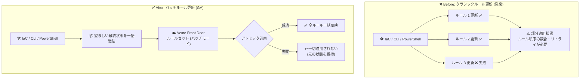

# Azure Front Door: バッチルール更新 (Batch rule updates) の一般提供開始

**リリース日**: 2026-08-12

**サービス**: Azure Front Door

**機能**: Batch rule updates for Azure Front Door (バッチルール更新)

**ステータス**: Launched (GA)

[このアップデートのインフォグラフィックを見る](https://takech9203.github.io/azure-news-summary/20260812-front-door-batch-rule-updates.html)

## 概要

Azure Front Door Standard および Premium で、ルールセットに対する**バッチルール更新 (Batch rule updates)** が一般提供 (GA) となりました。この機能により、ルールセット内の複数のルールの追加・更新・削除・並べ替えを 1 つの協調された操作として実行でき、すべての変更が「まとめて適用される」か「まったく適用されない」かのいずれか (アトミック適用) が保証されます。

大規模または複雑なルールセットを Terraform などの Infrastructure-as-Code (IaC) ワークフローで管理している場合、従来はルールを個別に更新する必要があり、部分的なルール状態、ルール順序の競合、デプロイのリトライ、ロールバックの複雑さといった問題が発生していました。バッチルール更新はこれらの問題を解消し、デプロイの安全性と予測可能性を向上させます。

バッチモードは新しいルールセットの作成時に明示的に有効化するオプトイン方式です。有効化した場合、望ましい最終状態のルール構成全体を送信すると、Azure Front Door がルールセットレベルで差分を計算し、変更をまとめて適用します。既存のルールセットは既定で従来のクラシックなルール管理を継続するため、完全な後方互換性が維持されます。

**アップデート前の課題**

- 各ルールは個別の作成・更新・削除操作で管理され、並べ替えや一括編集はアトミックではなかった
- 大規模なルールセットの更新中に、一時的または不整合なルール動作が発生する可能性があった
- IaC ワークフローでデプロイの失敗やリトライが発生し、複数の更新が並行して行われる場合の運用リスクがあった

**アップデート後の改善**

- ルールを個別ではなくセットとして更新でき、すべての変更が成功するか失敗するかのいずれかになる (アトミック適用)
- 更新中の一時的・部分的なルール状態が排除される
- Terraform、Azure CLI、PowerShell などによる安全で再現性のある自動化が可能になる

## アーキテクチャ図

従来はルールごとに個別更新され途中失敗で部分適用状態が発生し得ましたが、バッチモードではルールセット全体の望ましい状態を送信し、すべての変更が成功または失敗のいずれかとしてアトミックに適用されます。

## サービスアップデートの詳細

### 主要機能

1. **ルールセットレベルのアトミックな一括更新**
   - 複数ルールの追加・更新・削除・並べ替えを 1 つの協調された操作として実行
   - すべての変更が「まとめて成功」または「まとめて失敗」となり、部分的なルール状態を排除

2. **宣言的なルール管理 (望ましい状態の送信)**
   - ルールの配列としてルールセットの「望ましい最終状態」を送信
   - Azure Front Door が差分を計算し、変更をバッチで適用

3. **オプトイン方式と完全な後方互換性**
   - バッチモードは新しいルールセットの作成時に明示的に有効化
   - 既存のルールセットは変更なしで従来どおり動作 (既定はクラシックモード)

4. **IaC ワークフローとの親和性**
   - Terraform、ARM/REST、Azure CLI、PowerShell など決定論的なデプロイが求められるシナリオに最適

### ルール管理モードの比較

| 項目 | クラシックルール更新 (既定) | バッチルール更新 (オプトイン) |
|------|---------------------------|------------------------------|
| ルールの管理単位 | ルールごとに個別 | ルールセット全体 |
| 更新方法 | 個別の作成・更新・削除操作 | 望ましい最終状態を一括送信 |
| アトミック性 | 並べ替え・一括編集は非アトミック | すべての変更が成功または失敗 |
| 適するシナリオ | シンプルな構成、少量の増分変更 | 大規模ルールセット、頻繁な並べ替え、IaC デプロイ |

## 技術仕様

| 項目 | 詳細 |
|------|------|
| 対象ティア | Azure Front Door Standard / Premium |
| 有効化方法 | ルールセット作成時にバッチモードを明示的に有効化 (オプトイン) |
| モードの変更 | バッチモードは作成後に変更不可 (イミュータブル)。モードを変えるには新しいルールセットを作成しルートを再関連付け |
| ルール数上限 | ルールセットあたり最大 100 ルール |
| キャッシュ有効ルールのカウント | Route Override でキャッシュを有効にしたルールは 2 ルール分としてカウント |
| 既定の動作 | 既存・新規ともに既定はクラシックモード (後方互換性を維持) |
| 対応ツール | Terraform、ARM/REST、Azure CLI、PowerShell |

**キャッシュ有効時のクォータに関する注意**: キャッシュを有効にしたルールは 2 ルール分としてカウントされます。例えば 50 ルールすべてでキャッシュが有効な場合、実効ルール数は 100 となり上限に達します。この状態で 50 ルールすべてを 1 回のバッチ更新で置き換えようとすると、操作中に既存ルールの削除前に新ルールが追加され一時的にクォータを超過するため失敗します。この場合は 25 ルールずつ 2 回のバッチに分けて更新することが推奨されています。

## 設定方法

### 前提条件

1. Azure Front Door Standard または Premium のプロファイル
2. バッチモードはルールセットの新規作成時にのみ有効化可能 (既存ルールセットのモード変更は不可)

### 設定の流れ

1. バッチモードを有効にして新しいルールセットを作成する
2. ルールの配列として「望ましい最終状態」を定義し、順序どおりに送信する
3. Azure Front Door が変更を計算し、バッチとしてアトミックに適用する
4. 既存のクラシックモードのルールセットから移行する場合は、バッチモードの新しいルールセットを作成し、ルートを再関連付けする

具体的な構成手順は [Microsoft Learn のドキュメント](https://learn.microsoft.com/azure/frontdoor/rule-set-batch)を参照してください。

## メリット

### ビジネス面

- デプロイの安全性と予測可能性が向上し、ルール更新に起因するサービス影響のリスクを低減
- IaC による構成管理の信頼性が高まり、リトライやロールバック対応にかかる運用コストを削減

### 技術面

- 複数ルールの変更がアトミックに適用され、更新中の一時的・不整合な動作を排除
- ルール順序の競合や部分適用状態を防止
- Terraform などの宣言的ワークフローと自然に整合する「望ましい状態」ベースの管理
- 既存構成への影響ゼロ (オプトイン方式・完全な後方互換性)

## デメリット・制約事項

- バッチモードは**ルールセット作成後に変更不可** (クラシックモードへの切り替えは不可)
- モードを変更するには、新しいルールセットを作成してルートを再関連付けする必要がある
- 既存のルールセットをそのままバッチモードに移行することはできない
- プラットフォームの信頼性確保のため、バッチ操作にはサイズと操作数の制限が適用される
- キャッシュ有効ルールは 2 ルール分としてカウントされるため、大規模な一括置換時はクォータの一時超過に注意が必要 (バッチの分割が必要になる場合がある)

## ユースケース

### ユースケース 1: Terraform による大規模ルールセットの管理

**シナリオ**: 数十のリダイレクト・ヘッダー操作・URL 書き換えルールを含むルールセットを Terraform で管理しており、リリースのたびにルールの追加や並べ替えが発生する。

**効果**: ルールセット全体を望ましい状態として一括適用できるため、部分適用による一時的な誤動作やデプロイのリトライが不要になり、CI/CD パイプラインでのデプロイが決定論的になる。

### ユースケース 2: 頻繁なルール並べ替えを伴う運用

**シナリオ**: キャンペーンや A/B テストに合わせてルールの優先順位を頻繁に変更する必要があり、従来は並べ替え中に意図しないルール評価順序が発生するリスクがあった。

**効果**: 並べ替えを含むすべての変更がアトミックに適用されるため、更新中も一貫したルール評価順序が保証される。

## 料金

バッチルール更新自体に追加の課金項目はありません。Azure Front Door Standard / Premium の課金ディメンションは基本料金、送信データ転送、リクエスト数であり、ルールセットに対する個別の課金はありません。

| 項目 | Standard | Premium |
|------|----------|---------|
| 基本料金 (月額、時間単位で課金) | $35/月 | $330/月 |
| リクエスト (Zone 1 北米 / Zone 6 欧州、1 万リクエストあたり) | $0.009 | $0.015 |
| エッジ→クライアント送信 (北米・欧州、最初の 10 TB/月) | $0.083/GB | $0.083/GB |

※ Premium には WAF と Private Link が追加費用なしで含まれます。最新の詳細は[料金ページ](https://azure.microsoft.com/pricing/details/frontdoor/)を参照してください。

## 関連サービス・機能

- **ルールセット (Rules Engine)**: 本アップデートの対象機能。Front Door エッジでのリクエスト処理をカスタマイズするルールの集合で、1 ルールにつき最大 10 個の一致条件と 5 個のアクションを構成可能
- **Web Application Firewall (WAF)**: Front Door エッジでルールセットより先に処理されるセキュリティレイヤー。Premium ティアでは追加費用なしで利用可能
- **Terraform / ARM テンプレート / Azure CLI / PowerShell**: バッチルール更新が特に効果を発揮する IaC ツール群。決定論的なデプロイを実現
- **ルート (Routes)**: ルールセットの関連付け先。モード変更時は新しいルールセットへのルート再関連付けが必要

## 参考リンク

- [インフォグラフィック](https://takech9203.github.io/azure-news-summary/20260812-front-door-batch-rule-updates.html)
- [公式アップデート情報](https://azure.microsoft.com/updates?id=569246)
- [Batch rule updates for rule sets - Microsoft Learn](https://learn.microsoft.com/azure/frontdoor/rule-set-batch)
- [What is a rule set? - Microsoft Learn](https://learn.microsoft.com/azure/frontdoor/front-door-rules-engine)
- [Azure Front Door の制限・クォータ](https://learn.microsoft.com/azure/azure-resource-manager/management/azure-subscription-service-limits#azure-front-door-standard-and-premium-service-limits)
- [料金ページ](https://azure.microsoft.com/pricing/details/frontdoor/)

## まとめ

Azure Front Door Standard / Premium のバッチルール更新の GA により、ルールセット内の複数ルールの変更をアトミックに適用できるようになりました。Terraform などの IaC でルールセットを管理している場合、部分適用やデプロイリトライの問題を根本的に解消できるため、大規模または頻繁に変更されるルールセットではバッチモードの採用を推奨します。ただしバッチモードは作成後に変更できないため、新規ルールセット作成時にどちらのモードを使うかを事前に判断し、既存ルールセットの移行時はルートの再関連付け手順を計画しておくことが重要です。

---

**タグ**: Azure Front Door, Networking, Security, Rules Engine, Batch Rule Updates, IaC, Terraform, GA
