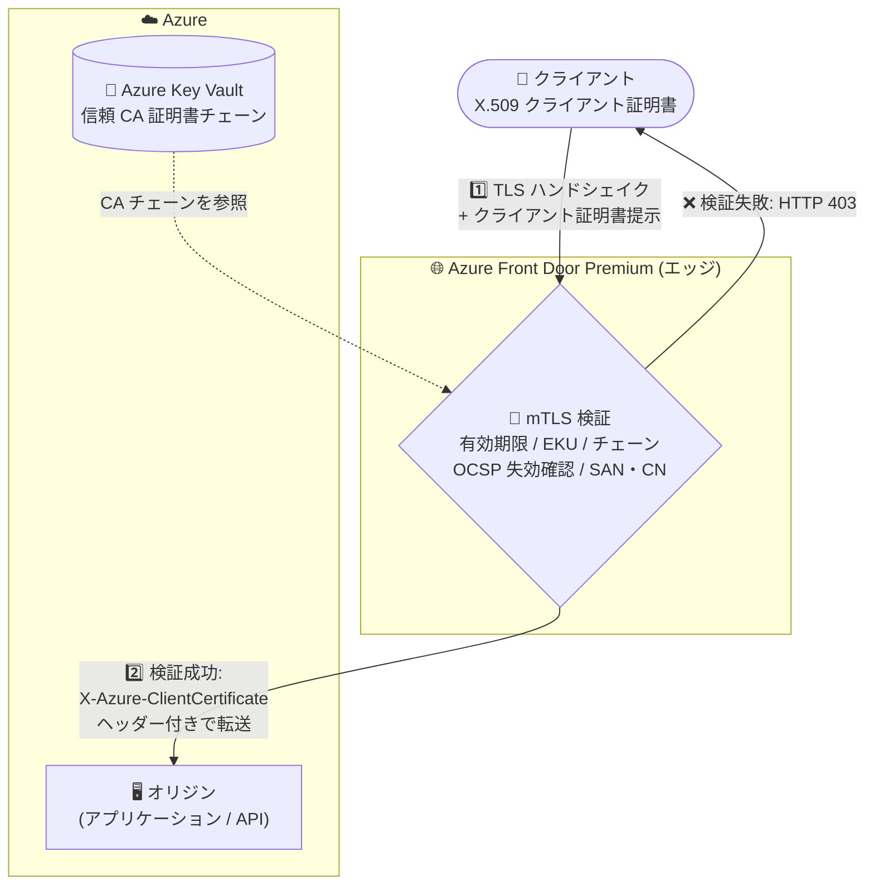

# Azure Front Door: mutual TLS (クライアント証明書認証) パブリックプレビュー

**リリース日**: 2026-08-12

**サービス**: Azure Front Door

**機能**: Mutual TLS (クライアント証明書認証)

**ステータス**: In preview

[このアップデートのインフォグラフィックを見る](https://takech9203.github.io/azure-news-summary/20260812-front-door-mutual-tls.html)

## 概要

Azure Front Door で mutual TLS (mTLS、クライアント証明書認証) がパブリックプレビューとして利用可能になりました。mTLS を有効にすると、リクエストがアプリケーションに到達する前に、Azure Front Door のエッジで X.509 証明書を使用してクライアントを認証できます。B2B アプリケーション、IoT、金融サービス、VPN、エンタープライズネットワークなど、機密性の高いアプリケーションや API の保護に有効です。

クライアント証明書の検証モードは 4 種類から選択できます。エッジで完全検証を行うモードから、検証をオリジン側に委ねるパススルーモードまで、アプリケーションの要件に応じた柔軟な構成が可能です。検証済みの証明書は `X-Azure-ClientCertificate` リクエストヘッダーでオリジンに転送されます。

クライアント証明書はパブリック CA・プライベート CA の両方の発行証明書をサポートします。信頼する CA 証明書チェーンを Azure Key Vault にアップロードし、Front Door のカスタムドメインに関連付けて使用します。本機能は **Azure Front Door Premium** で利用できます。

**アップデート前の課題**

- Azure Front Door はクライアント認証 (mTLS) に対応しておらず、エッジでの TLS 終端はサーバー証明書による一方向認証のみだった (公式ドキュメントにも「Azure Front Door は client/mutual authentication (mTLS) をサポートしない」と明記されていた)
- クライアント証明書認証が必要な場合、オリジン側 (アプリケーションや別のサービス) で mTLS を終端する必要があり、不正なクライアントからのリクエストもオリジンまで到達していた

**アップデート後の改善**

- Azure Front Door のエッジでクライアント証明書の検証 (有効期限、EKU、証明書チェーン、OCSP 失効確認、SAN/CN リスト照合) が可能になり、認証されないリクエストをアプリケーション到達前にブロックできる
- 4 つの検証モードにより、エッジでの完全検証からオリジンへのパススルーまで柔軟に構成できる
- 検証結果や証明書情報がヘッダーでオリジンに転送されるため、オリジン側での追加検証やアプリケーションロジックへの活用が可能

## アーキテクチャ図

クライアントが提示した証明書を Azure Front Door のエッジで検証し、Key Vault にアップロードした信頼 CA チェーンと照合します。検証に成功したリクエストのみが証明書情報のヘッダー付きでオリジンへ転送され、失敗時は HTTP 403 が返されます。

## サービスアップデートの詳細

### 主要機能

1. **4 つのクライアント証明書検証モード**
   - **Client certificate required and validated (必須 + 検証)**: 証明書は必須。Front Door がエッジで完全検証 (証明書の有無、有効性、失効、ルート CA チェーン、SAN/CN リスト) を行い、`X-Azure-ClientCertificate` ヘッダーでオリジンに転送する。mTLS 有効時の既定モード
   - **Client certificate required but not validated (必須 + 検証なし)**: 証明書は必須だが Front Door は検証せず、証明書を持たないリクエストのみ拒否する。検証はオリジン側で実施
   - **Client certificate validation if presented (提示時のみ検証)**: 証明書は任意。提示された場合のみ完全検証してオリジンに転送し、証明書なしのリクエストもオリジンへ通す
   - **mTLS passthrough to origin (パススルー)**: 証明書は任意。Front Door は検証を行わず、提示された証明書をオリジンに転送して検証を委ねる

2. **エッジでの証明書検証**
   - 有効期間 (`Not Before` / `Not After`) の確認
   - Extended Key Usage (EKU) にクライアント認証 OID が含まれることの確認
   - 証明書の完全性と、信頼された発行者からの切れ目のない証明書チェーンの確認
   - オプション: アップロードした許可 SAN リストとの SAN/CN 照合 (SAN を先に照合し、一致しない場合は CN を照合)
   - オプション: OCSP による失効確認 (既定で有効。失効している場合は HTTP 403 を返す)

3. **パブリック CA / プライベート CA のサポート**
   - 既知のパブリック CA と組織内で構築したプライベート CA の両方の発行証明書に対応
   - 信頼する CA 証明書チェーンは Azure Key Vault 経由でアップロードし、カスタムドメインに関連付ける
   - 業界動向によりパブリック CA はクライアント認証 EKU 付き証明書の発行を停止していくため、Microsoft はプライベート CA への移行を推奨

4. **監視用のメトリック・ログ**
   - mTLS リクエスト数、失敗した mTLS リクエスト数
   - エラータイプ・SNI ホスト名・TLS プロトコル別の mTLS エラーリクエスト
   - トラブルシューティング用に `X-Azure-DebugInfo:1` ヘッダーを付けると、403 応答時に `X-Azure-Externalerror` ヘッダーでエラー理由 (ClientCertExpired、ClientCertRevoked など) を確認可能

## 技術仕様

| 項目 | 詳細 |
|------|------|
| 対応 tier | Azure Front Door Premium のみ |
| 検証モード | 4 種類 (必須+検証 / 必須+検証なし / 提示時のみ検証 / パススルー) |
| 証明書転送ヘッダー | `X-Azure-ClientCertificate` (クライアントが同名ヘッダーを送信した場合は Front Door が削除) |
| CA 証明書チェーン | ルート 1 つ + 中間証明書最大 3 つ |
| CA 証明書形式 | PEM エンコード、25 KB 未満 |
| CA 証明書の自動ローテーション | 非対応 (2 つの CA 証明書を関連付けたデュアル CA 構成でシームレスな入れ替えが可能) |
| クライアント証明書チェーン | リーフ証明書を含め最大 5 証明書 (超過時は ClientCertTooLongChain エラー) |
| 失効確認 | OCSP のみ (既定で有効) |
| キャッシュ | mTLS 有効時はルートのキャッシュおよび Rules Engine のキャッシュオーバーライドを有効化できない |
| 許可ドメインリスト | ワイルドカードドメインは非対応 (クライアント証明書側の SAN/CN がワイルドカードの場合、許可リスト内の 1 レベルのサブドメインと一致すれば検証成功) |

## 設定方法

### 前提条件

1. Azure Front Door Premium プロファイル
2. 信頼する CA 証明書チェーン (PEM、25 KB 未満) を Azure Key Vault にアップロード済みであること
3. Front Door から Key Vault にアクセスできる権限設定

### Azure Portal

1. Front Door プロファイルの **Security** > **Mutual TLS CA certificates** で **+ Add** を選択し、Key Vault のシークレットから CA 証明書チェーンを追加する
2. **Settings** > **Front Door manager** で **+ Add an endpoint** を選択し、**Enforce mutual TLS** をチェックしてエンドポイントを作成する (mTLS 有効エンドポイントには既定ドメイン `*.z01.azurefd.net` をルートに追加できない)
3. **Settings** > **Domains** で **+ Add** を選択し、**Advanced settings** の **Enable mutual TLS** を有効化してカスタムドメインを作成する。検証モード、CA 証明書、失効確認、SAN/CN リストを設定する (カスタムドメインのホスト名を SAN/CN リストに明示的に含める必要がある)
4. 作成したエンドポイントにルートを追加してドメインとオリジングループを関連付ける
5. 動作確認後、DNS の CNAME レコードを Front Door エンドポイントに向ける
6. オリジンへの直接アクセスで mTLS がバイパスされないよう、オリジン側で Front Door からのトラフィックのみを許可するアクセス制御を構成する

## メリット

### ビジネス面

- B2B、IoT、金融サービス、VPN、エンタープライズネットワークなど、強固なクライアント認証が求められる規制業界・機密アプリケーションの要件をエッジで満たせる
- 認証されないトラフィックがアプリケーションに到達する前に遮断されるため、機密 API の攻撃対象領域を削減できる

### 技術面

- アプリケーション側で mTLS 終端を実装せずに、CDN・グローバルロードバランサーのエッジでクライアント証明書認証を実現できる
- 4 つの検証モードにより、エッジ完全検証・オリジン側検証・ハイブリッドなど段階的な移行や柔軟な設計が可能
- WAF、Private Link など Front Door Premium の既存セキュリティ機能や他の認証・認可方式と組み合わせて利用できる
- メトリック・デバッグヘッダーによるトラブルシューティング手段が提供される

## デメリット・制約事項

- **Premium tier のみ**: Standard tier では利用できない
- **プレビュー機能**: プレビューの追加利用条件が適用され、本番利用は推奨されない
- **キャッシュとの併用不可**: mTLS 有効時はルートのキャッシュを有効化できない (未認証クライアントへのキャッシュ済みコンテンツ返却を防ぐため)
- **既存ドメインへの適用にはダウンタイムが発生**: mTLS はエンドポイント単位で有効化した上でドメインを関連付ける設計のため、既存ドメインで有効化/無効化する際はルート・エンドポイントからの関連付け解除と再関連付けが必要。新規エンドポイント・新規ドメインでの有効化が推奨される
- **同一エンドポイントに mTLS 有効/無効のドメインを混在できない**
- **CA 証明書の自動ローテーション非対応**: 期限切れ・失効時はデュアル CA 構成で手動入れ替えが必要
- **失効確認は OCSP のみ**: 業界が OCSP から移行しつつある中、現時点で Front Door の失効確認は OCSP に限定される
- **パブリック CA の EKU 問題**: パブリック CA はクライアント認証 EKU 付き証明書の発行を今後停止するため、プライベート CA への移行が必要

## ユースケース

### ユースケース 1: B2B API のクライアント証明書認証

**シナリオ**: パートナー企業のみに公開する API で、パートナーに配布した証明書 (プライベート CA 発行) を持つクライアントのみアクセスを許可する。

**実装例**: 「Client certificate required and validated」モードを使用し、プライベート CA チェーンを Key Vault にアップロードして Front Door に関連付ける。SAN/CN 許可リストと OCSP 失効確認を有効化し、エッジで完全検証を行う。

**効果**: 不正なクライアントのリクエストがエッジで遮断され、オリジン API の攻撃対象領域が削減される。オリジンは `X-Azure-ClientCertificate` ヘッダーで証明書情報を受け取り、追加の認可判定にも利用できる。

### ユースケース 2: 段階的な mTLS 移行 (オリジン側検証との併用)

**シナリオ**: 現在オリジンで mTLS を終端しているアプリケーションを、ダウンタイムを最小化しながら Front Door 配下に移行する。

**実装例**: まず「mTLS passthrough to origin」または「Client certificate required but not validated」モードで Front Door を導入し、検証をオリジン側に残したままエッジ経由の配信を開始する。動作確認後に「Client certificate required and validated」モードへ切り替え、検証をエッジに移す。

**効果**: 既存のオリジン側検証ロジックを維持したまま段階的に移行でき、最終的にエッジ検証によってオリジンの負荷と攻撃対象領域を削減できる。

## 料金

Azure Front Door の料金ページには、mutual TLS 機能に関する追加料金の記載はありません (2026-08-12 時点)。mTLS は Premium tier の機能であるため、Premium の基本料金と従量課金が適用されます。

| 項目 | 料金 (参考) |
|------|------|
| Front Door Premium 基本料金 | $330/月 (WAF、Private Link を含む) |
| リクエスト (Premium、北米・欧州) | $0.015/1 万リクエスト (最初の 2.5 億リクエスト) |
| データ転送 (エッジ → クライアント、Zone 1) | $0.083/GB (最初の 10 TB) |

最新の料金は [Azure Front Door 料金ページ](https://azure.microsoft.com/pricing/details/frontdoor/) を参照してください。

## 関連サービス・機能

- **Azure Key Vault**: 信頼する CA 証明書チェーンのアップロード先。Front Door はここから CA 証明書を参照してクライアント証明書を検証する
- **Azure Front Door Private Link / オリジンセキュリティ**: mTLS のバイパスを防ぐため、オリジン側で Front Door からのトラフィックのみを許可するアクセス制御との併用が推奨される
- **Azure Web Application Firewall (WAF)**: Front Door Premium に含まれる WAF と mTLS を組み合わせ、多層防御を構成できる

## 参考リンク

- [インフォグラフィック](https://takech9203.github.io/azure-news-summary/20260812-front-door-mutual-tls.html)
- [公式アップデート情報](https://azure.microsoft.com/updates?id=569251)
- [Microsoft Learn: Mutual TLS authentication (Preview) - Azure Front Door](https://learn.microsoft.com/en-us/azure/frontdoor/mutual-tls)
- [Microsoft Learn: TLS encryption - Azure Front Door](https://learn.microsoft.com/en-us/azure/frontdoor/end-to-end-tls)
- [Microsoft Learn: Secure traffic to Azure Front Door origins](https://learn.microsoft.com/en-us/azure/frontdoor/origin-security)
- [料金ページ](https://azure.microsoft.com/pricing/details/frontdoor/)

## まとめ

Azure Front Door Premium で mTLS (クライアント証明書認証) がパブリックプレビューとなり、これまでオリジン側で終端するしかなかったクライアント証明書認証をエッジで実現できるようになりました。B2B API や金融・IoT など強固なクライアント認証が必要なワークロードを Front Door 配下に置けるようになる重要なアップデートです。一方で、Premium 限定、キャッシュとの併用不可、既存ドメインへの適用時のダウンタイム、OCSP のみの失効確認などの制約があるため、新規エンドポイント・新規ドメインでの検証から始め、プライベート CA の準備と合わせて GA に向けた設計を進めることを推奨します。

---

**タグ**: Azure Front Door, Networking, Security, mTLS, クライアント証明書認証, X.509, Azure Key Vault, Public Preview
