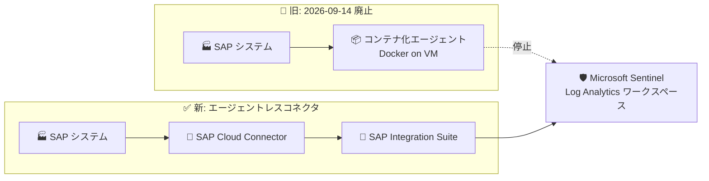

# Microsoft Sentinel: SAP アプリケーション向けソリューションのコンテナ化データコネクタエージェント廃止

**リリース日**: 2026-08-12

**サービス**: Microsoft Sentinel

**機能**: Microsoft Sentinel solution for SAP applications - コンテナ化データコネクタエージェントの廃止 (Retirement)

**ステータス**: Retirement (廃止予告)

[このアップデートのインフォグラフィックを見る](https://takech9203.github.io/azure-news-summary/20260812-sentinel-sap-containerized-agent-retirement.html)

## 概要

Microsoft は、Microsoft Sentinel solution for SAP applications で使用されてきた「コンテナ化データコネクタエージェント (containerized data connector agent)」を **2026 年 9 月 14 日に廃止 (Retire)** することを発表しました。この日以降、エージェントは恒久的に無効化され、SAP ログの Microsoft Sentinel への送信が停止します。

コンテナ化エージェントは、VM 上の Docker コンテナとして動作し、SAP NetWeaver ベースのシステムからセキュリティ監査ログなどを収集して Sentinel に転送する方式でした。後継として、SAP Cloud Connector と SAP Integration Suite を利用する **エージェントレスデータコネクタ (agentless data connector)** が GA 済みであり、Microsoft は廃止日までにこのコネクタへ移行することを推奨しています。

**廃止による影響**

- 2026 年 9 月 14 日以降、コンテナ化エージェントは恒久的に無効化され、SAP ログ (セキュリティ監査ログ、変更ドキュメントログなど) が Microsoft Sentinel に送信されなくなる
- 移行しない場合、SAP 環境に対する脅威検出 (分析ルール)、ワークブック、プレイブックが新規ログを受け取れず、SAP のセキュリティ監視が事実上停止する
- Microsoft Learn ドキュメント上でもコンテナ化エージェントは非推奨 (deprecated) と明記され、ドキュメントはエージェントレスコネクタ前提の構成に更新済み

**必要な移行アクション (期限: 2026-09-14)**

- 既存のコンテナ化エージェントのデプロイを棚卸しし (監視対象 SAP システム、収集ログ種別、カスタム構成)、エージェントレスデータコネクタを既存エージェントと並行稼働でデプロイする
- KQL クエリ (例: `ABAPAuditLog` テーブルの件数確認) で新コネクタ経由のログ取り込みを検証した後、コンテナ化エージェントを廃止 (デコミッション) する
- SAP システム側の Sentinel 用ユーザー/ロールの権限を見直す (エージェントレスコネクタはコンテナ化エージェントより少ない、ただし異なる権限を要求)

## アーキテクチャ図



旧方式では VM 上の Docker コンテナが SAP ログを収集していましたが、廃止後は SAP Cloud Connector と SAP Integration Suite を経由するエージェントレスデータコネクタが SAP ログを Microsoft Sentinel に取り込みます。

## サービスアップデートの詳細

### 廃止スケジュールと後継ソリューション

1. **廃止日: 2026 年 9 月 14 日**
   - コンテナ化データコネクタエージェントは恒久的に無効化され、SAP ログの Sentinel への送信が停止する

2. **後継: エージェントレスデータコネクタ (GA)**
   - SAP Cloud Connector と SAP Integration Suite を利用して SAP システムに接続し、ログを Log Analytics ワークスペースに取り込む
   - SAP NetWeaver ベースのシステムに対応: SAP S/4HANA Cloud Private Edition (RISE with SAP)、SAP S/4HANA オンプレミス、SAP ECC、SAP BW など
   - セキュリティ監査ログ、変更ドキュメントログ、ユーザーマスターデータ (ロール・権限を含む) などの重要なセキュリティログを取り込む

3. **既存セキュリティコンテンツとの互換性**
   - 分析ルール、ワークブック、プレイブック、ウォッチリストはエージェントレスコネクタでも引き続き機能する
   - ソリューションの KQL 関数は fuzzy union 演算子で両方式のデータを結合するよう拡張されており、並行稼働期間中も両ソースのデータを扱える

### 移行手順 (Microsoft Learn 移行ガイドより)

1. **Assess (評価)**: 既存のコンテナ化エージェントのデプロイを確認し、監視対象 SAP システム、収集ログ種別、カスタム構成を特定
2. **Review (確認)**: コンテナ化エージェントとエージェントレスコネクタの機能パリティ (構成オプション・機能) を確認
3. **Deploy (展開)**: デプロイガイドに従いエージェントレスデータコネクタをセットアップ
4. **Validate (検証)**: KQL クエリで SAP ログが正しく収集されていることを確認

   ```kql
   let startTime = ago(1h);
   let endTime = now();
   ABAPAuditLog
   | where TimeGenerated between (startTime .. endTime)
   | summarize Count = count() by SourceSystem, bin(TimeGenerated, 5m)
   | order by TimeGenerated desc
   ```

5. **Monitor (監視)**: 一定期間、コンテナ化エージェントとエージェントレスコネクタを並行稼働させ、ログ収集の安定性と完全性を確認
6. **Decommission (廃止)**: 検証完了後、コンテナ化エージェントを停止・撤去 (「Stop SAP data collection」ドキュメント参照)

## 技術仕様

| 項目 | 詳細 |
|------|------|
| 廃止対象 | Microsoft Sentinel solution for SAP applications のコンテナ化データコネクタエージェント |
| 廃止日 | 2026 年 9 月 14 日 (以降、恒久的に無効化) |
| 後継 | エージェントレスデータコネクタ (SAP Cloud Connector + SAP Integration Suite 経由、GA) |
| 対応 SAP システム | SAP NetWeaver ベース (S/4HANA Cloud Private Edition / RISE with SAP、S/4HANA オンプレミス、ECC、BW など) |
| 収集ログ | セキュリティ監査ログ、変更ドキュメントログ、ユーザーマスターデータ (ロール・権限) など |
| 既存コンテンツ | 分析ルール・ワークブック・プレイブック・ウォッチリストは変更なしで継続利用可能 |
| SAP 側権限 | エージェントレスコネクタはコンテナ化エージェントと異なる (より少ない) 権限を要求。要見直し |

## メリット

### ビジネス面

- SAP NetWeaver 側にフットプリントを残さないゼロフットプリント構成により、デプロイが簡素化される
- コンテナ管理や SAP 側の定期更新作業が不要になり、運用・保守コストが削減される
- 既存の SAP Cloud Connector のセットアップと確立済みの統合プロセスを再利用でき、ネットワーク設計を再度行う必要がない

### 技術面

- SAP Integration Suite と SAP Cloud Connector に基づく将来性のあるアーキテクチャ
- スケーラビリティの向上
- KQL 関数が両データソースを透過的に結合するため、並行稼働による段階的移行が可能

## デメリット・制約事項

- 期限 (2026-09-14) までに移行しない場合、SAP ログの取り込みが停止し、SAP 環境のセキュリティ監視が途絶する
- エージェントレスコネクタは SAP Cloud Connector および SAP Integration Suite を前提とするため、これらのコンポーネントの準備・構成が必要
- SAP 側の Sentinel 用ユーザー/ロールの権限体系が異なるため、権限の見直し・再構成が必要
- 特定 SAP SID に対する課金除外 (billing exclusions) は識別方法が変わるため再確認が必要 (事前にアカウント担当者への相談が推奨されている)
- SAP HANA データベースや OS レベルの検出は本コネクタの対象外 (Sentinel の別コネクタでカバー)
- クロスワークスペースデプロイ (SAP データと SOC データの分離) のオプションはポータル UI から削除済み (ARM API では引き続きサポート)

## 関連サービス・機能

- **Microsoft Sentinel / Log Analytics ワークスペース**: SAP ログの取り込み先。分析ルール・ワークブックによる脅威検出を実行
- **SAP Cloud Connector**: エージェントレスコネクタが SAP システムに接続するための既存統合基盤
- **SAP Integration Suite**: エージェントレスコネクタのログ取得を担う SAP 側の統合サービス
- **Microsoft Defender ポータル**: 統合ワークスペースにより、従来のクロスワークスペース構成が不要に

## 参考リンク

- [インフォグラフィック](https://takech9203.github.io/azure-news-summary/20260812-sentinel-sap-containerized-agent-retirement.html)
- [公式アップデート情報](https://azure.microsoft.com/updates?id=568457)
- [Microsoft Sentinel solution for SAP applications デプロイ概要 (Microsoft Learn)](https://learn.microsoft.com/azure/sentinel/sap/deployment-overview)
- [コンテナ化エージェントからエージェントレスコネクタへの移行ガイド (Microsoft Learn)](https://learn.microsoft.com/azure/sentinel/sap/sap-agent-migrate)
- [エージェントレスデータコネクタのデプロイ (Microsoft Learn)](https://learn.microsoft.com/azure/sentinel/sap/deploy-data-connector-agentless)
- [SAP データ収集の停止 (Microsoft Learn)](https://learn.microsoft.com/azure/sentinel/sap/stop-collection)
- [Microsoft Sentinel for SAP agentless connector GA (Tech Community Blog)](https://techcommunity.microsoft.com/blog/microsoftsentinelblog/microsoft-sentinel-for-sap-agentless-connector-ga/4464490)

## まとめ

Microsoft Sentinel solution for SAP applications のコンテナ化データコネクタエージェントは 2026 年 9 月 14 日に廃止され、以降 SAP ログの Sentinel への送信が停止します。SAP 環境のセキュリティ監視を継続するには、期限までに GA 済みのエージェントレスデータコネクタ (SAP Cloud Connector + SAP Integration Suite 経由) への移行が必須です。既存の分析ルール・ワークブック・プレイブックは変更なしで継続利用できるため、移行ガイドに沿って「並行稼働 → ログ取り込み検証 → 旧エージェント廃止」の手順を早期に計画・実施することを推奨します。SAP 側権限の見直しと課金除外設定の再確認も忘れずに行ってください。

---

**タグ**: Microsoft Sentinel, SAP, Retirement, Security, Hybrid + multicloud, Data Connector, Agentless
