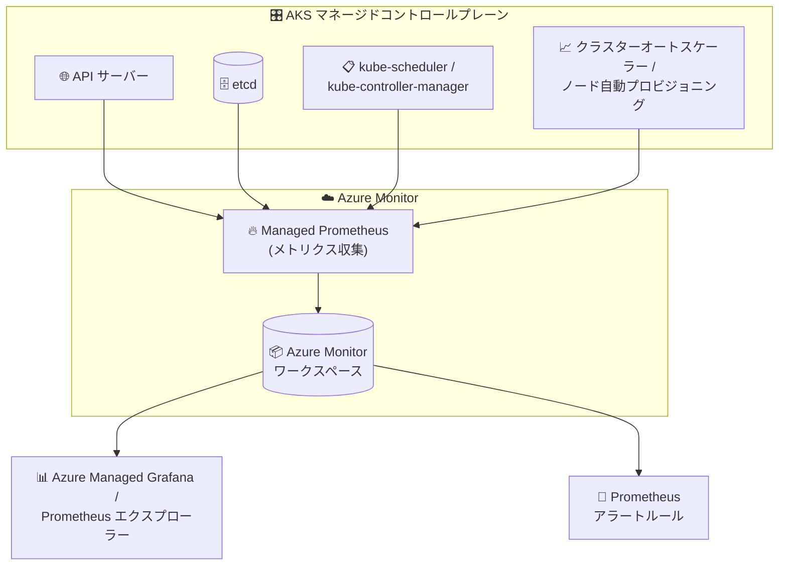

# Azure Kubernetes Service (AKS): Managed Prometheus によるコントロールプレーンメトリクス収集の一般提供開始 (GA)

**リリース日**: 2026-08-13

**サービス**: Azure Kubernetes Service (AKS) / Azure Monitor

**機能**: Control plane metrics collection for AKS with Managed Prometheus

**ステータス**: Launched (GA)

[このアップデートのインフォグラフィックを見る](https://takech9203.github.io/azure-news-summary/20260813-aks-control-plane-metrics-managed-prometheus.html)

## 概要

Azure Monitor Managed Service for Prometheus を利用した AKS コントロールプレーンメトリクスの収集機能が一般提供 (GA) となった。この機能により、AKS ユーザーは Microsoft がマネージドで運用するコントロールプレーンの主要コンポーネントに対して、ネイティブな可観測性を得られる。

収集対象となるのは、API サーバー、etcd、kube-scheduler、kube-controller-manager、クラスターオートスケーラー、ノード自動プロビジョニング (Node Auto Provisioning) の各コンポーネントである。これらのメトリクスを活用することで、プラットフォームチームはワークロード、コントローラー、自動化、スケーリング活動が AKS コントロールプレーンとどのように相互作用しているかを時系列で把握できるようになる。

収集されたメトリクスは Azure Monitor ワークスペースに格納され、PromQL によるクエリ、Azure Managed Grafana でのダッシュボード可視化、Prometheus アラートルールによる監視が可能となる。

**アップデート前の課題**

- AKS のコントロールプレーンは Microsoft がマネージドで運用しており、無料のプラットフォームメトリクスで確認できるのは API サーバーと etcd の一部メトリクスに限られていた
- Preview 期間中は `aks-preview` CLI 拡張機能のインストールと `AzureMonitorMetricsControlPlanePreview` フィーチャーフラグの登録が必要で、SLA 対象外のため本番環境での利用は推奨されなかった
- セルフホストの Prometheus ではコントロールプレーンをスクレイプできない (ロードバランサー経由で単一インスタンスしか参照できず、複数レプリカのメトリクスを確実に取得できない) ため、詳細なコントロールプレーン監視の手段がなかった

**アップデート後の改善**

- API サーバー、etcd に加え、kube-scheduler、kube-controller-manager、クラスターオートスケーラー、ノード自動プロビジョニングという 6 種類のコントロールプレーンコンポーネントの Prometheus メトリクスをネイティブに収集可能になった
- GA となったことで本番環境で利用できる正式リリースとなった
- Managed Prometheus・Azure Managed Grafana と完全に互換性があり、API サーバー / etcd 用の公式 Grafana ダッシュボードテンプレートも提供される

## アーキテクチャ図



AKS のマネージドコントロールプレーン各コンポーネントのメトリクスを Managed Prometheus が収集して Azure Monitor ワークスペースに格納し、Grafana での可視化と PromQL ベースのアラートに利用できる。

## サービスアップデートの詳細

### 主要機能

1. **6 種類のコントロールプレーンコンポーネントのメトリクス収集**
   - API サーバー (`apiserver`)、etcd (`etcd`)、`kube-scheduler`、`kube-controller-manager`、クラスターオートスケーラー (`cluster-autoscaler`)、ノード自動プロビジョニング (`node-auto-provisioning`) を対象にメトリクスを収集
   - デフォルトでは API サーバーと etcd が有効。その他のターゲットは ConfigMap で有効化する

2. **ConfigMap によるカスタマイズ**
   - `ama-metrics-settings-configmap.yaml` (kube-system 名前空間) の `controlplane-metrics` セクションで、収集対象ターゲットと保持するメトリクスのリスト (keep-list) を制御可能
   - `minimal-ingestion-profile` を `true` にすると、既定の記録ルール・アラート・ダッシュボードで使用される最小限のメトリクスのみを取り込み、インジェスト量 (= コスト) を抑制できる
   - ConfigMap スキーマ v2 では `cluster-metrics` と `controlplane-metrics` が分離され、クラスターレベルとコントロールプレーンのインジェスト量を個別に制御可能

3. **公式 Grafana ダッシュボードテンプレート**
   - [API サーバー用](https://grafana.com/grafana/dashboards/20331-kubernetes-api-server/) と [etcd 用](https://grafana.com/grafana/dashboards/20330-kubernetes-etcd/) のダッシュボードテンプレートを Azure Managed Grafana にインポートしてすぐに可視化できる

## 技術仕様

| 項目 | 詳細 |
|------|------|
| 収集対象コンポーネント | apiserver, etcd, kube-scheduler, kube-controller-manager, cluster-autoscaler, node-auto-provisioning |
| デフォルト有効ターゲット | apiserver, etcd (その他は ConfigMap で有効化) |
| メトリクスの格納先 | クラスターと同一リージョンの Azure Monitor ワークスペース |
| データ保持期間 | 18 か月 (追加コストなし) |
| クエリ言語 | PromQL (Prometheus エクスプローラー、Grafana、Workbooks、Query API) |
| カスタマイズ方法 | `ama-metrics-settings-configmap.yaml` (kube-system 名前空間) のみ |
| 認証要件 | クラスターがマネージド ID 認証を使用していること |

## 設定方法

### 前提条件

1. AKS クラスターがマネージド ID 認証を使用していること
2. Azure Monitor Managed Service for Prometheus (Azure Monitor metrics アドオン) が有効であること
3. メトリクス格納先の Azure Monitor ワークスペース (新規作成または既存) へのアクセス権があること

### Azure CLI

```bash
# Managed Prometheus (Azure Monitor metrics アドオン) を有効化
az aks update --enable-azure-monitor-metrics \
  --name $CLUSTER_NAME \
  --resource-group $RESOURCE_GROUP \
  --azure-monitor-workspace-resource-id $AMW_RESOURCE_ID
```

```yaml
# ama-metrics-settings-configmap.yaml (kube-system) で収集ターゲットをカスタマイズ
controlplane-metrics: |-
    default-targets-scrape-enabled: |-
      apiserver = true
      cluster-autoscaler = false
      node-auto-provisioning = false
      kube-scheduler = false
      kube-controller-manager = false
      etcd = true
```

```bash
# ConfigMap を適用 (反映まで数分かかる)
kubectl apply -f configmap-controlplane.yaml
```

### Azure Portal

1. Azure Portal で AKS クラスターリソースを開く
2. 左側メニューの「Monitor」→「Monitor Settings」で Managed Prometheus を有効化し、Azure Monitor ワークスペースをリンクする
3. リンクされた Azure Monitor ワークスペースの「Managed Prometheus」→ Prometheus エクスプローラーでメトリクスをクエリする

## メリット

### ビジネス面

- コントロールプレーン起因の障害 (API サーバーの過負荷、etcd の容量逼迫など) を早期に検知でき、大規模クラスター運用の信頼性が向上する
- GA となったことで本番ワークロードでの利用が可能となり、エンタープライズでの標準監視構成に組み込める
- セルフホスト Prometheus サーバーの構築・運用が不要で、運用コストを削減できる

### 技術面

- これまで可視化できなかったスケジューラー、コントローラーマネージャー、オートスケーラーの動作をメトリクスで追跡でき、スケーリング遅延やスケジューリング問題のトラブルシューティングが容易になる
- PromQL・Grafana ダッシュボード・Prometheus アラートルールなど、Kubernetes コミュニティ標準のツールチェーンをそのまま利用できる
- minimal ingestion profile と keep-list により、必要なメトリクスだけを取り込んでコストを最適化できる

## デメリット・制約事項

- コントロールプレーンメトリクスの収集は Azure Monitor Managed Service for Prometheus のみサポート (セルフホスト Prometheus によるスクレイプは不可)
- Azure Private Link はサポートされない
- カスタマイズは既定の `ama-metrics-settings-configmap.yaml` ConfigMap のみ可能で、それ以外のカスタマイズはサポートされない
- クラスターがマネージド ID 認証を使用している必要がある
- コントロールプレーンメトリクスにはユーザーエージェント情報が含まれない (ユーザーエージェントは診断設定によるコントロールプレーンログでのみ取得可能)
- 有効化・設定変更後、メトリクスがワークスペースに反映されるまで数分かかる

## ユースケース

### ユースケース 1: API サーバー・etcd の健全性監視とアラート

**シナリオ**: 大規模 AKS クラスターで、API サーバーのレイテンシ悪化や etcd のデータベースサイズ逼迫を早期に検知したい。

**実装例**:

```bash
# Managed Prometheus を有効化 (デフォルトで apiserver / etcd メトリクスを収集)
az aks update --enable-azure-monitor-metrics \
  --name myAKSCluster --resource-group myResourceGroup

# Grafana に公式ダッシュボード (API server: 20331, etcd: 20330) をインポートして可視化
```

**効果**: コントロールプレーンのボトルネックをダッシュボードとアラートで常時監視でき、障害の未然防止につながる。

### ユースケース 2: オートスケーリング動作の分析

**シナリオ**: クラスターオートスケーラーやノード自動プロビジョニングによるスケール動作が期待どおりか、スケジューラーの遅延が発生していないかを分析したい。

**実装例**:

```yaml
# ConfigMap でスケーリング関連ターゲットを有効化
controlplane-metrics: |-
    default-targets-scrape-enabled: |-
      apiserver = true
      cluster-autoscaler = true
      node-auto-provisioning = true
      kube-scheduler = true
      kube-controller-manager = false
      etcd = true
```

**効果**: ワークロード急増時のスケーリング挙動を時系列で追跡し、スケール遅延の原因 (スケジューラー、オートスケーラーのどちらに起因するか) を切り分けられる。

## 料金

Azure Monitor Managed Service for Prometheus 自体および Azure Monitor ワークスペースの作成に直接コストはかからず、収集データのインジェストとクエリに対する従量課金となる。コントロールプレーンメトリクスも Azure Monitor ワークスペースに取り込まれるサンプルとして課金対象になる。

| 項目 | 課金単位 |
|------|------|
| メトリクスのインジェスト | 1,000 万サンプルあたりの従量課金 (18 か月のデータ保持を含む) |
| メトリクスのクエリ | 処理された 1,000 万サンプルあたりの従量課金 (PromQL でクエリされたデータポイント数) |
| Prometheus アラートルール | ルール自体は無料 (クエリ分のみ課金) |

具体的な単価はリージョン・通貨により異なるため、[Azure Monitor 料金ページ](https://azure.microsoft.com/pricing/details/monitor/) の「Metrics」タブを参照。なお、AKS の無料プラットフォームメトリクス (API サーバー・etcd の一部) は引き続き無料で利用できる。

## 関連サービス・機能

- **Azure Monitor ワークスペース**: コントロールプレーンメトリクスを含む Prometheus メトリクスの格納先。データは 18 か月保持される
- **Azure Managed Grafana**: Azure Monitor ワークスペースをデータソースとしてメトリクスを可視化。API サーバー / etcd 用の公式ダッシュボードテンプレートが提供される
- **Container insights**: ノード・コンテナーなどデータプレーン側の監視を担い、コントロールプレーンメトリクスと組み合わせてクラスター全体の可観測性を実現する
- **AKS 診断設定 (リソースログ)**: コントロールプレーンのログ (kube-audit など) を Log Analytics ワークスペースに送信する機能。メトリクスと相補的に利用する
- **Azure Monitor プラットフォームメトリクス**: API サーバー・etcd の一部メトリクスを全 AKS クラスターで無料・自動収集する機能

## 参考リンク

- [インフォグラフィック](https://takech9203.github.io/azure-news-summary/20260813-aks-control-plane-metrics-managed-prometheus.html)
- [公式アップデート情報](https://azure.microsoft.com/updates?id=568830)
- [Monitor AKS Control Plane Metrics (Microsoft Learn)](https://learn.microsoft.com/azure/aks/control-plane-metrics-monitor)
- [AKS コントロールプレーンメトリクス詳細 (aka.ms)](https://aka.ms/aks/ccp-metrics)
- [Azure Monitor managed service for Prometheus 概要 (Microsoft Learn)](https://learn.microsoft.com/azure/azure-monitor/metrics/prometheus-metrics-overview)
- [Kubernetes クラスターの監視の有効化 (Microsoft Learn)](https://learn.microsoft.com/azure/azure-monitor/containers/kubernetes-monitoring-enable)
- [料金ページ (Azure Monitor)](https://azure.microsoft.com/pricing/details/monitor/)

## まとめ

これまでブラックボックスになりがちだった AKS マネージドコントロールプレーン (API サーバー、etcd、スケジューラー、コントローラーマネージャー、オートスケーラー、ノード自動プロビジョニング) の可観測性が、Managed Prometheus によりネイティブかつ GA 品質で提供されるようになった。大規模クラスターや本番ワークロードを運用するプラットフォームチームは、Managed Prometheus アドオンの有効化とデフォルトターゲット (API サーバー・etcd) の監視から始め、必要に応じてスケーリング関連ターゲットを ConfigMap で有効化し、minimal ingestion profile でコストを制御する構成を検討することを推奨する。

---

**タグ**: AKS, Azure Kubernetes Service, Azure Monitor, Managed Prometheus, コントロールプレーン, 可観測性, Grafana, GA
