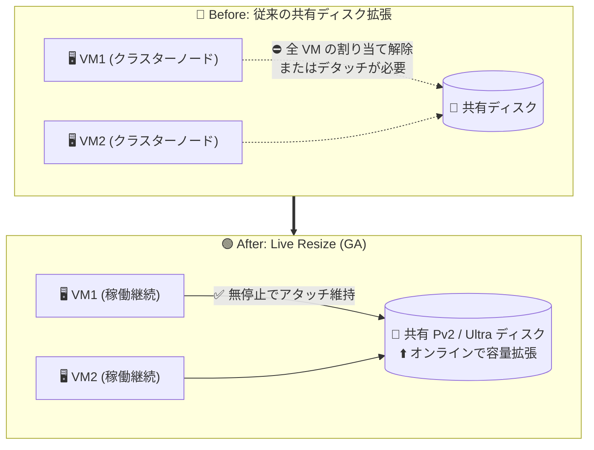

# Azure Disk Storage: 共有 Premium SSD v2 / Ultra データディスクの Live Resize が一般提供 (GA)

**リリース日**: 2026-08-13

**サービス**: Azure Disk Storage

**機能**: Live Resize for Shared Premium SSD v2 and Ultra Data Disks

**ステータス**: Launched (GA)

[このアップデートのインフォグラフィックを見る](https://takech9203.github.io/azure-news-summary/20260813-disk-storage-live-resize-shared-pv2-ultra.html)

## 概要

共有 (Shared) Premium SSD v2 (Pv2) および Ultra データディスクに対する Live Resize (ライブサイズ変更) 機能が一般提供 (GA) されました。この機能により、複数の VM に同時アタッチされた共有ディスクのストレージ容量を、アプリケーションを中断することなく動的に拡張できます。

Azure 共有ディスクは、SCSI Persistent Reservations (SCSI PR) を利用して 1 つのマネージドディスクを複数の VM に同時アタッチする機能で、Windows Server Failover Cluster (WSFC) や Pacemaker などを用いたクラスター構成 (SQL Server FCI、SAP ASCS/SCS、Scale-Out File Server など) の Azure 移行に利用されています。これまで共有ディスクのサイズ拡張には、ディスクがアタッチされているすべての VM の割り当て解除 (deallocate) またはディスクのデタッチが必要でしたが、今回の GA により共有 Pv2 / Ultra ディスクではこの制約なしにオンラインで容量を拡張できるようになりました。

小さい容量でディスクを作成し、需要の増加に応じて無停止で段階的に拡張する運用が可能になるため、クラスターワークロードの可用性維持とストレージコストの最適化を両立できます。

**アップデート前の課題**

- 共有ディスクのサイズを拡張するには、ディスクがアタッチされているすべての VM を割り当て解除するか、すべての VM からディスクをデタッチする必要があった (Microsoft Learn の共有ディスクの制限事項に記載)
- クラスター全体の停止を伴うため、SQL Server FCI や SAP ASCS/SCS などの高可用性ワークロードで計画メンテナンスウィンドウの確保が必要だった
- 停止を避けるために初期段階から大きめの容量をプロビジョニングし、余剰コストが発生しがちだった

**アップデート後の改善**

- 共有 Premium SSD v2 / Ultra データディスクの容量を、VM を稼働させたままダウンタイムなしで拡張可能に
- クラスターアプリケーション (WSFC、Pacemaker など) を中断せずにストレージ需要の増加へ対応可能
- 必要最小限の容量から開始して段階的に拡張する、コスト効率の高い運用が可能に

## アーキテクチャ図



従来はクラスター全 VM の停止 (またはデタッチ) を伴った共有ディスクの容量拡張が、共有 Pv2 / Ultra ディスクでは VM 稼働中のままオンラインで実行できるようになります。

## サービスアップデートの詳細

### 主要機能

1. **共有ディスクのオンライン容量拡張**
   - 複数 VM に同時アタッチされた Premium SSD v2 / Ultra データディスクの容量を、VM の割り当て解除やデタッチなしに拡張できる
   - アプリケーション (クラスターワークロード) への中断が発生しない

2. **段階的な容量プロビジョニングによるコスト最適化**
   - 小さい容量でディスクを開始し、需要に応じて動的に拡張する運用が可能
   - Pv2 / Ultra は容量・IOPS・スループットを個別にプロビジョニングするため、容量のみを必要なタイミングで追加できる

## 技術仕様

| 項目 | 詳細 |
|------|------|
| 対象ディスク種別 | 共有 Premium SSD v2 (Pv2)、共有 Ultra Disk (いずれもデータディスク) |
| 対象操作 | ディスク容量の拡張 (縮小は非サポート) |
| ダウンタイム | なし (VM の割り当て解除・デタッチ不要) |
| 共有ディスクの maxShares | Pv2 / Ultra とも最小 1、最大 15 (サイズによる制限なし) |
| 操作手段 | Azure Portal / Azure CLI / Azure PowerShell (最新版)、ARM テンプレート (API バージョン `2021-04-01` 以降) |
| サイズ反映 | 拡張後、OS 側で認識されるまで最大 10 分。Linux / Windows でディスクの再スキャンが必要 |

## 設定方法

### 前提条件

1. 最新の Azure CLI、Azure PowerShell モジュール、Azure Portal、または API バージョン `2021-04-01` 以降の ARM テンプレートを使用すること
2. 対象がデータディスクであること (ダウンタイムなしの拡張は OS ディスク非対応)
3. ディスク上でデータのバックグラウンドコピーが実行中でないこと (Pv2 / Ultra の制限)
4. 拡張前にファイルシステムが正常な状態であることを確認し、データをバックアップしておくこと

### Azure CLI

```bash
# 共有ディスクの容量を拡張 (例: 200 GiB に拡張)
az disk update \
    --resource-group myResourceGroup \
    --name mySharedDataDisk \
    --size-gb 200
```

```bash
# (Linux) 拡張後、各ノードでディスクを再スキャンして新しいサイズを認識させる
echo 1 | sudo tee /sys/class/block/sda/device/rescan

# パーティションとファイルシステムを拡張 (例: ext4)
sudo growpart /dev/sda 1
sudo resize2fs /dev/sda1
```

### Azure Portal

対象ディスクの「サイズとパフォーマンス」からサイズを変更する。共有 Pv2 / Ultra データディスクの場合、アタッチ先 VM を停止せずにサイズ変更を適用できる。

## メリット

### ビジネス面

- クラスターワークロード (SQL Server FCI、SAP ASCS/SCS など) の計画停止が不要になり、SLA・可用性目標を維持しやすい
- 需要に応じた段階的な容量拡張により、事前の過剰プロビジョニングによるコストを削減できる

### 技術面

- ストレージ容量の拡張がオンライン操作となり、メンテナンスウィンドウの調整やフェールオーバー手順が不要
- Portal / CLI / PowerShell の標準的なディスク更新操作で実行でき、自動化 (容量監視と連動した拡張など) に組み込みやすい

## デメリット・制約事項

- 対象はデータディスクのみ (OS ディスクはダウンタイムなしの拡張に非対応)
- ディスクの縮小はサポートされない (データ損失の恐れがあるため不可)
- ディスク上でデータのバックグラウンドコピー (スナップショットからの作成直後など) が実行中の場合は拡張できない
- 拡張後、OS 側で正しいサイズが反映されるまで最大 10 分かかる場合があり、Linux / Windows でディスクの再スキャン操作が必要
- 共有ディスク自体の一般的な制限は継続する (共有 Pv2 / Ultra はホストキャッシュ・Write Accelerator 非サポート、可用性ゾーンをまたぐ共有は不可、`maxShares` の変更は全ノードからのデタッチが必要、など)

## ユースケース

### ユースケース 1: SQL Server Failover Cluster Instance (FCI) のデータ領域拡張

**シナリオ**: Azure 共有ディスク上に構築した SQL Server FCI で、データベースの成長によりデータディスクの空き容量が逼迫。従来はクラスター全ノードの停止が必要だったが、Live Resize により無停止で対応する。

**実装例**:

```bash
# 稼働中のクラスターにアタッチされた共有 Pv2 ディスクを拡張
az disk update \
    --resource-group sqlfci-rg \
    --name sqlfci-shared-data-disk \
    --size-gb 2048
```

**効果**: フェールオーバーやメンテナンスウィンドウなしでストレージを拡張でき、データベースサービスの可用性を維持したまま容量逼迫を解消できる。

### ユースケース 2: 小容量スタートによるコスト最適化

**シナリオ**: 新規クラスターワークロードの初期構築時に、将来の成長を見込んだ大容量ディスクを最初からプロビジョニングせず、必要最小限の容量で開始する。

**効果**: Pv2 / Ultra は容量・IOPS・スループットが個別課金のため、容量を実需要に合わせて無停止で拡張することで、未使用容量への支払いを回避できる。

## 料金

Live Resize 機能自体への追加料金の記載はありません。共有 Premium SSD v2 / Ultra Disk は、プロビジョニングした容量 (GiB)・合計 IOPS (diskIOPSReadWrite + diskIOPSReadOnly)・合計スループット (diskMB/sReadWrite + diskMB/sReadOnly) に基づいて課金され、アタッチする VM 数ごとの追加課金はありません (共有 Premium SSD (v1) にはマウント VM 数ごとの追加課金あり)。

| 項目 | 内容 |
|------|------|
| Premium SSD v2 | 容量 (GiB)・IOPS・スループット (MB/s) の個別従量課金。例 (East US, LRS): 容量 $0.081/GiB/月、IOPS $0.0052/IOPS/月 (3,000 IOPS 超過分)、スループット $0.041/MBps/月 (125 MB/s 超過分) |
| Premium SSD v2 ベースライン | どのサイズでも 3,000 IOPS / 125 MB/s は追加料金なし |
| Ultra Disk | 容量・IOPS・スループットのプロビジョニング値に基づく従量課金 (課金上は最も近いディスクサイズ枠に切り上げ) |

料金はリージョンにより異なります。最新の単価は [Managed Disks 料金ページ](https://azure.microsoft.com/pricing/details/managed-disks/) および [料金計算ツール](https://azure.microsoft.com/pricing/calculator/?service=managed-disks) を参照してください。

## 利用可能リージョン

公式アップデートにリージョン個別の記載はありません。Premium SSD v2 / Ultra Disk のリージョン可用性は [Azure Disk Storage のドキュメント](https://learn.microsoft.com/azure/virtual-machines/disks-types) を参照してください。

## 関連サービス・機能

- **Azure 共有ディスク (Shared Disks)**: 本アップデートの対象機能。SCSI PR により 1 つのマネージドディスクを複数 VM に同時アタッチし、WSFC / Pacemaker ベースのクラスターを構成する
- **SQL Server on Azure VM (FCI)**: 共有ディスクを利用した Failover Cluster Instance 構成の代表的ワークロード
- **SAP on Azure**: SAP ASCS/SCS のクラスター構成で共有ディスクを利用
- **Azure Virtual Machine Scale Sets**: 共有ディスクは個別の VMSS インスタンスにアタッチ可能 (モデル定義による自動デプロイは不可)

## 参考リンク

- [インフォグラフィック](https://takech9203.github.io/azure-news-summary/20260813-disk-storage-live-resize-shared-pv2-ultra.html)
- [公式アップデート情報](https://azure.microsoft.com/updates?id=569281)
- [Microsoft Learn: Azure 共有ディスク](https://learn.microsoft.com/azure/virtual-machines/disks-shared)
- [Microsoft Learn: ディスクの拡張 (ダウンタイムなしの拡張)](https://learn.microsoft.com/azure/virtual-machines/linux/expand-disks)
- [料金ページ (Managed Disks)](https://azure.microsoft.com/pricing/details/managed-disks/)

## まとめ

共有 Premium SSD v2 / Ultra データディスクの Live Resize GA により、これまで全ノードの停止またはデタッチが必須だった共有ディスクの容量拡張が、クラスター稼働中のオンライン操作で実行できるようになりました。SQL Server FCI や SAP ASCS/SCS など共有ディスクベースの高可用性ワークロードを運用している場合は、容量拡張の運用手順 (メンテナンスウィンドウ前提の手順) を見直し、無停止拡張を前提とした容量計画 (小さく始めて段階的に拡張) への切り替えを検討することを推奨します。拡張後は各ノードでのディスク再スキャンとファイルシステム拡張が必要な点に留意してください。

---

**タグ**: Azure Disk Storage, Storage, Premium SSD v2, Ultra Disk, Shared Disks, Live Resize, GA, 高可用性, WSFC, Pacemaker
