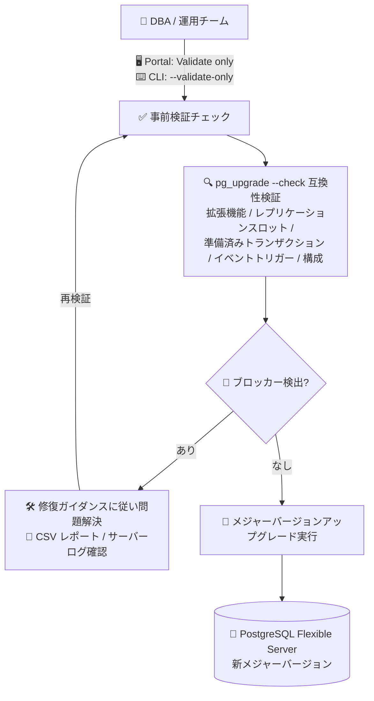

# Azure Database for PostgreSQL Flexible Server: メジャーバージョンアップグレード事前検証チェックの一般提供開始

**リリース日**: 2026-08-13

**サービス**: Azure Database for PostgreSQL Flexible Server

**機能**: Pre-upgrade validation checks (アップグレード事前検証チェック)

**ステータス**: Launched (GA)

[このアップデートのインフォグラフィックを見る](https://takech9203.github.io/azure-news-summary/20260813-postgresql-pre-upgrade-validation.html)

## 概要

Azure Database for PostgreSQL Flexible Server において、メジャーバージョンアップグレード (MVU: Major Version Upgrade) の実行前に、アップグレードの準備状況を事前検証できる「Pre-upgrade validation checks (アップグレード事前検証チェック)」が一般提供 (GA) となりました。Azure Portal および Azure CLI (新しい `--validate-only` オプション) から実行できます。

この機能は、実際のアップグレード操作から独立して互換性検証のみを実行し、アップグレードを失敗させる可能性のあるブロッカーを事前に特定します。Azure PostgreSQL のアップグレードポリシーと `pg_upgrade --check` の互換性要件に照らしてサーバーを検証し、未サポートの拡張機能、レプリケーションスロット、準備済みトランザクション (prepared transactions)、構成の不一致などの問題に対して実行可能な修復ガイダンスを提示します。検証はサーバーのバージョンを変更せず、ダウンタイムやサーバー再起動も発生しません。

**アップデート前の課題**

- メジャーバージョンアップグレードの互換性チェック (precheck) はアップグレードワークフローの中で実行されるため、非互換の問題 (未サポート拡張機能、イベントトリガーなど) はアップグレードを開始して初めて判明していた
- アップグレード失敗後にログからエラー原因を特定して修正し、再度アップグレードを試行するという反復的なトラブルシューティングが必要だった
- 本番ワークロードのアップグレード計画時に、事前に成功可能性を評価する手段がなかった

**アップデート後の改善**

- アップグレードを開始せずに検証のみを独立実行でき、ブロッカーを事前に特定・修復できる (問題解決後に検証を再実行し、準備が整ってからアップグレードを実施可能)
- Azure Portal では検証結果 (成功/失敗したチェック、エラー詳細、修復ガイダンス) を CSV ファイルとしてダウンロードでき、運用チームと共有できる
- 初回アップグレードの成功率向上、トラブルシューティング作業の削減、本番アップグレード計画の簡素化を実現

## アーキテクチャ図



事前検証チェックはアップグレード本体から独立して実行され、ブロッカーが検出された場合は修復ガイダンスに従って問題を解決し、再検証してからアップグレードに進むことができます。検証中にダウンタイムやサーバー再起動は発生しません。

## サービスアップデートの詳細

### 主要機能

1. **独立した検証専用実行 (Validate only)**
   - アップグレード操作を開始せずに、互換性・構成の検証のみを実行
   - 同じ検証チェックはメジャーバージョンアップグレードのワークフロー中にも自動実行される
   - サーバーバージョンの変更、ダウンタイム、サーバー再起動は発生しない

2. **包括的な互換性チェック**
   - 未サポートの拡張機能
   - 論理レプリケーションスロット
   - 準備済みトランザクション (prepared transactions)
   - イベントトリガー
   - 未サポートのオブジェクト依存関係
   - 再起動が必要な保留中の構成変更

3. **実行可能な修復ガイダンス付きの結果レポート**
   - 検証完了後、「ブロッキング問題なし」または「ブロッキング問題あり」のいずれかの結果を返却
   - 失敗したチェックには詳細な説明と修復ガイダンスを表示
   - Portal から検証結果 (チェック名、結果、エラー詳細、修復推奨事項) を CSV でダウンロード可能
   - サーバーログを有効化していれば、`pg_upgrade` の詳細な検証ログを「Server logs」からダウンロード可能

## 技術仕様

| 項目 | 詳細 |
|------|------|
| 対象サービス | Azure Database for PostgreSQL Flexible Server |
| 検証エンジン | Azure PostgreSQL アップグレードポリシー + `pg_upgrade --check` の互換性要件 |
| 実行インターフェイス | Azure Portal (Action: Validate only) / Azure CLI (`--validate-only`) |
| 必要な Azure CLI バージョン | 2.89.0 以降 |
| サーバーへの影響 | バージョン変更なし、ダウンタイムなし、再起動なし |
| 検証結果の出力 | Portal の結果ペイン、CSV ダウンロード、サーバーログ (`pg_upgrade` ログ) |
| サポートされる PostgreSQL バージョン (Flexible Server) | 18, 17, 16, 15, 14, 13, 12, 11 (アップグレード先は Azure がサポート中のバージョンのみ) |

## 設定方法

### 前提条件

1. サーバーのステータスが **Ready** であること
2. サポートされるアップグレードパスと制限事項 (メジャーバージョンアップグレードのドキュメント) を事前に確認すること
3. CLI で実行する場合は Azure CLI 2.89.0 以降を使用すること
4. 検証ログをダウンロードする場合はサーバーログ (`logfiles.download_enable` = ON) を有効化すること

### Azure CLI

```bash
# アップグレードせずに事前検証チェックのみを実行
az postgres flexible-server upgrade \
  --resource-group <resource_group> \
  --name <server> \
  --version <target_version> \
  --validate-only
```

コマンドはサーバーをアップグレードせずに事前検証結果を返します。ブロッキング問題が特定された場合は、解決してから再実行またはアップグレードを開始します。

### Azure Portal

1. リソースメニューから **Overview** を選択 (サーバーステータスが **Ready** の場合に **Upgrade** ボタンが有効)
2. **Upgrade** を選択
3. **PostgreSQL version to upgrade** を展開し、検証したいメジャーバージョンを選択
4. **Action** で **Validate only** を選択
5. **Start** を選択して検証を開始
6. 検証ステータスペインを開いたまま進行状況を監視
7. ブロッキング問題がなければ、成功レポートを CSV でダウンロード、または **Upgrade** ボタンからそのままアップグレードを続行
8. ブロッキング問題が検出された場合は、報告されたエラーを修正してから検証を再試行

## メリット

### ビジネス面

- 初回アップグレードの成功率が向上し、アップグレード失敗による計画外の作業やダウンタイム延長のリスクを低減
- 本番ワークロードのアップグレード計画が簡素化され、メンテナンスウィンドウを確実に活用できる
- CSV レポートにより、検証結果を運用チーム・変更管理プロセスと共有しやすい

### 技術面

- 検証はダウンタイム・再起動なしで実行でき、本番環境でも安全に準備状況を評価できる
- 未サポート拡張機能やイベントトリガーなどのブロッカーを事前に特定し、修復ガイダンスに沿って対処できる
- 問題解決後に検証を再実行する反復ワークフローで、アップグレード当日の失敗によるトラブルシューティング作業を削減

## デメリット・制約事項

- サーバーステータスが **Ready** でなければ実行できない
- 読み取りレプリカ (read replica) では検証チェックはサポートされない
- 他のサーバー操作が進行中の間は検証を実行できない
- 検証にはサーバー上のすべてのデータベースへの接続が必要で、応答しない・アクセスできないデータベースがあると検証が失敗する可能性がある
- 検証チェックはダウンタイムを発生させないが、データベースアクティビティが少ない時間帯での実行が推奨される
- アップグレードの互換性要件はソース/ターゲットのバージョンにより異なり、随時変更されるため、アップグレード計画時には必ず検証チェックを実行して最新のブロッカー一覧を取得する必要がある

## 料金

このアップデートに関する追加料金の情報は、公式アップデートおよびドキュメントには記載されていません。Azure Database for PostgreSQL Flexible Server の料金の詳細は料金ページを参照してください。

- [Azure Database for PostgreSQL Flexible Server 料金ページ](https://azure.microsoft.com/pricing/details/postgresql/flexible-server/)

## 関連サービス・機能

- **メジャーバージョンアップグレード (In-place MVU)**: 本検証チェックの対象となる機能。`pg_upgrade` ツールを使用したインプレースアップグレードで、サーバー名や接続文字列を変更せずにバージョンを更新できる。バージョンスキップ (直接より新しいバージョンへのアップグレード) にも対応
- **サーバーログ (PG_Upgrade_Logs)**: `logfiles.download_enable` を有効化すると、検証・アップグレードの詳細ログを Portal の「Server logs」からダウンロードして障害解析に利用できる
- **高可用性 (HA)**: アップグレード実行時には HA が一時的に無効化され、完了後に再有効化される。検証チェックを活用して事前にブロッカーを解消しておくことで、HA 構成サーバーのアップグレード計画が立てやすくなる
- **ポイントインタイムリストア (PITR)**: アップグレード成功後に旧バージョンへ自動で戻す手段はないため、アップグレード前の時点への PITR が事実上のロールバック手段となる

## 参考リンク

- [インフォグラフィック](https://takech9203.github.io/azure-news-summary/20260813-postgresql-pre-upgrade-validation.html)
- [公式アップデート情報](https://azure.microsoft.com/updates?id=568419)
- [Microsoft Learn: Major version upgrades in Azure Database for PostgreSQL](https://learn.microsoft.com/azure/postgresql/configure-maintain/concepts-major-version-upgrade)
- [Microsoft Learn: Run upgrade validation checks](https://learn.microsoft.com/azure/postgresql/configure-maintain/how-to-run-upgrade-validation-checks)
- [Azure CLI: az postgres flexible-server upgrade](https://learn.microsoft.com/cli/azure/postgres/flexible-server#az-postgres-flexible-server-upgrade)
- [料金ページ](https://azure.microsoft.com/pricing/details/postgresql/flexible-server/)

## まとめ

Azure Database for PostgreSQL Flexible Server のメジャーバージョンアップグレード事前検証チェックが GA となり、アップグレードを開始せずに `pg_upgrade --check` ベースの互換性検証を Portal / CLI から安全に実行できるようになりました。検証はダウンタイム・再起動なしで実行でき、未サポート拡張機能やイベントトリガーなどのブロッカーを修復ガイダンス付きで事前に把握できます。PostgreSQL のメジャーバージョンアップグレードを計画している場合は、本番のメンテナンスウィンドウを確保する前に、まず `az postgres flexible-server upgrade --validate-only` (Azure CLI 2.89.0 以降) または Portal の「Validate only」で検証を実行し、ブロッカーをすべて解消してからアップグレードに進むことを推奨します。

---

**タグ**: Azure Database for PostgreSQL, Flexible Server, Major Version Upgrade, Pre-upgrade Validation, pg_upgrade, Databases, GA
