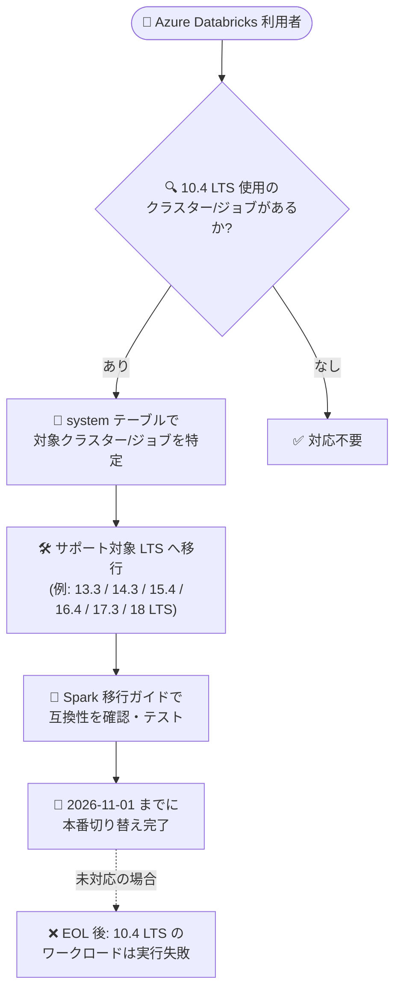

# Azure Databricks: Databricks Runtime 10.4 LTS が 2026 年 11 月 1 日に End of Life (EOL)

**リリース日**: 2026-08-14

**サービス**: Azure Databricks

**機能**: Databricks Runtime 10.4 LTS の End of Life (EOL)

**ステータス**: Announcement (Retirement / EOL)

[このアップデートのインフォグラフィックを見る](https://takech9203.github.io/azure-news-summary/20260814-databricks-runtime-10-4-lts-eol.html)

## 概要

Azure Databricks 上で提供されている Databricks マネージドランタイム「Databricks Runtime 10.4 LTS」が、**2026 年 11 月 1 日に End of Life (EOL)** を迎えることが発表されました。同ランタイムは既に 2025 年 3 月 18 日にサポート終了 (End of Support / EoS) に到達しており、EOL 日以降は「利用不可 (no longer be available or usable)」となります。

Databricks Runtime のライフサイクルでは、EoS と EOL は明確に区別されます。EoS はサポートと修正提供の終了 (ワークロード自体は動作し続ける可能性がある) を意味するのに対し、EOL では該当バージョンが Azure Databricks 環境から完全に削除され、新規ワークロードの起動が不可能になるだけでなく、**既存ワークロードの実行も失敗する** ようになります。

Microsoft は、中断を回避するため、2026 年 11 月 1 日までに影響を受けるクラスターおよびワークロードをサポート対象の Databricks Runtime バージョンへ移行することを推奨しています。

**アップデート前 (現状)**

- Databricks Runtime 10.4 LTS は 2025 年 3 月 18 日に EoS 済み (サポート・修正の提供なし、コンピュート作成 UI で選択不可)
- ただし、既存のクラスター・ジョブは 10.4 LTS 上で引き続き実行可能な状態

**アップデート後 (2026 年 11 月 1 日以降)**

- Databricks Runtime 10.4 LTS は Azure Databricks 環境から削除され、利用不可に
- 10.4 LTS を使用する新規ワークロードは起動できず、既存ワークロードの実行は失敗する

## アーキテクチャ図



EOL 日 (2026 年 11 月 1 日) までに、system テーブルで 10.4 LTS 以前を使用するクラスター・ジョブを特定し、サポート対象のランタイムへ移行するフローを示しています。未対応のまま EOL を迎えると、既存ワークロードは実行に失敗します。

## サービスアップデートの詳細

### 発表内容

1. **Databricks Runtime 10.4 LTS の EOL 日確定**
   - 2026 年 11 月 1 日に End of Life に到達し、以降は利用不可となる
   - 同バージョンは 2025 年 3 月 18 日に既に End of Support に到達済み

2. **EOL 後の動作**
   - バージョンが Azure Databricks 環境から削除される
   - 10.4 LTS を指定した新規ワークロードは起動不可
   - 10.4 LTS 上で稼働中の既存ワークロードは実行が失敗する

3. **推奨アクション**
   - 2026 年 11 月 1 日より前に、サポートされている Databricks Runtime バージョンへクラスターとワークロードを移行する

### Databricks Runtime のサポートライフサイクル

Microsoft Learn のドキュメントによると、Databricks Runtime のライフサイクルは以下のフェーズで構成されます。

| フェーズ | 内容 |
|------|------|
| Beta | GA 前の早期評価用。本番利用は非推奨、サポート SLA なし |
| GA (機能開発) | 約 6 か月間、同一バージョン番号で新機能と修正を提供 |
| LTS | 機能開発フェーズ終了後、3 年間、安定性・セキュリティ修正をバックポート |
| End of Support (EoS) | サポート・修正の提供終了。コンピュート作成/更新 UI で選択不可に。EoS 日は GA リリースの 3 年後 |
| End of Life (EoL) | バージョンが環境から削除され利用不可に。新規起動不可、既存ワークロードも実行失敗。EOL 日は EoS の 6 か月後を目安に設定される (ベストエフォート) が、Databricks は EoS 後いつでも予告なくバージョンを削除する権利を留保 |

**注**: 10.4 LTS の場合、EoS (2025 年 3 月 18 日) から EOL (2026 年 11 月 1 日) まで約 1 年 7 か月の猶予が設けられています。

## 技術仕様

| 項目 | 詳細 |
|------|------|
| 対象 | Databricks Runtime 10.4 LTS (Azure Databricks 上の Databricks マネージドランタイム) |
| End of Support 日 | 2025 年 3 月 18 日 (到達済み) |
| End of Life 日 | 2026 年 11 月 1 日 |
| EOL 後の影響 | バージョン削除・利用不可。新規ワークロード起動不可、既存ワークロードは実行失敗 |
| 必要なアクション | サポート対象の Databricks Runtime バージョンへの移行 |

### 移行先候補 (サポート対象の Databricks Runtime バージョン、2026 年 8 月時点)

| バージョン | Apache Spark | リリース日 | サポート終了日 |
|------|------|------|------|
| 19 | 4.2.0 | 2026-06-15 | LTS 移行時に決定 |
| 18 LTS | 4.1.0 | 2026-06-10 | 2029-06-10 |
| 17.3 LTS | 4.0.0 | 2025-10-22 | 2028-10-22 |
| 16.4 LTS | 3.5.2 | 2025-05-09 | 2028-05-09 |
| 15.4 LTS | 3.5.0 | 2024-08-19 | 2027-08-19 |
| 14.3 LTS | 3.5.0 | 2024-02-01 | 2027-02-01 |
| 13.3 LTS | 3.4.1 | 2023-08-22 | 2026-08-22 |

**注**: 13.3 LTS は 2026 年 8 月 22 日にサポート終了となるため、これから移行する場合はより新しい LTS (14.3 LTS 以降) を選択することが望ましいです。アナウンス本文では特定の移行先バージョンは指定されておらず、「サポートされているバージョン」への移行が案内されています。

## 移行アクション

### 1. 影響を受けるクラスター・ジョブの特定

Microsoft Learn のドキュメントでは、system テーブルを使用して 10.4 以前のランタイムを使用するクラスター・ジョブを検出する SQL クエリが提供されています。

```sql
-- 過去 90 日間に使用された 10.4 以前のランタイムのクラスターを集計する例 (抜粋)
SELECT
  account_id, workspace_id, cluster_id, cluster_name, owned_by, dbr_version
FROM system.compute.clusters
WHERE TRY_CAST(regexp_extract(dbr_version, '(\\d+)\\.(\\w+)?', 1) AS INT) < 10
   OR (TRY_CAST(regexp_extract(dbr_version, '(\\d+)\\.(\\w+)?', 1) AS INT) = 10
       AND TRY_CAST(regexp_extract(dbr_version, '(\\d+)\\.(\\w+)?(?:\\.(\\w+))?', 2) AS INT) < 4);
```

完全な検出クエリ (クラスター単位の DBU 使用量集計、ジョブの検出クエリ) は [Databricks support lifecycles](https://learn.microsoft.com/en-us/azure/databricks/release-notes/runtime/databricks-runtime-ver) に掲載されています。

### 2. 互換性の確認

移行先の Databricks Runtime に含まれる Apache Spark バージョンの移行ガイドを確認します。URL 形式は以下の通りです。

```
https://spark.apache.org/docs/<version>/migration-guide.html
```

例: 14.3 LTS (Spark 3.5.0) へ移行する場合は Spark 3.5.0 の migration guide を参照します。

### 3. クラスター・ジョブのランタイム更新

対象クラスターおよびジョブクラスターのランタイムバージョンをサポート対象バージョンに変更し、テスト後に本番へ適用します。

## 影響とリスク

- **既存ワークロードの実行失敗**: EOL 後は 10.4 LTS 上のワークロードが失敗するため、放置すると本番ジョブの停止に直結する
- **既にサポート対象外**: 10.4 LTS は 2025 年 3 月から EoS 状態であり、セキュリティ修正・サポートが提供されていない。EOL を待たず早期の移行が望ましい
- **Spark メジャーバージョン間の非互換**: 10.4 LTS からの移行では Spark バージョンが大きく上がるため、API の非互換や動作変更の検証工数を見込む必要がある
- **予告なき削除の可能性**: ライフサイクルポリシー上、Databricks は EoS 後いつでも予告なくバージョンを削除する権利を留保している

## 関連サービス・機能

- **Azure Databricks system テーブル (system.compute / system.billing / system.lakeflow)**: レガシーランタイムを使用するクラスター・ジョブの検出に利用可能
- **Databricks Runtime for Machine Learning**: ML 変種も同じライフサイクルに従う。移行先の MLflow バージョン互換性はリリースノートの互換性マトリックスを参照
- **サーバーレスコンピュート**: ランタイムバージョンを Databricks が管理するため、ランタイム EOL 対応の運用負荷を軽減する選択肢となる

## 参考リンク

- [インフォグラフィック](https://takech9203.github.io/azure-news-summary/20260814-databricks-runtime-10-4-lts-eol.html)
- [公式アップデート情報](https://azure.microsoft.com/updates?id=569353)
- [Databricks support lifecycles (Microsoft Learn)](https://learn.microsoft.com/en-us/azure/databricks/release-notes/runtime/databricks-runtime-ver)
- [Databricks Runtime release notes versions and compatibility (Microsoft Learn)](https://learn.microsoft.com/en-us/azure/databricks/release-notes/runtime/)
- [End-of-support Databricks Runtime release notes (Microsoft Learn)](https://learn.microsoft.com/en-us/azure/databricks/release-notes/runtime/eos)

## まとめ

Databricks Runtime 10.4 LTS は 2026 年 11 月 1 日に EOL を迎え、以降は既存ワークロードも含めて実行不能になります。同バージョンは既に 2025 年 3 月から EoS 状態でありセキュリティ修正も提供されていないため、system テーブルの検出クエリで 10.4 LTS 以前を使用するクラスター・ジョブを早急に洗い出し、14.3 LTS 以降のサポート対象 LTS バージョンへ計画的に移行することを推奨します。

---

**タグ**: Azure Databricks, Databricks Runtime, EOL, Retirement, Analytics, AI + Machine Learning
