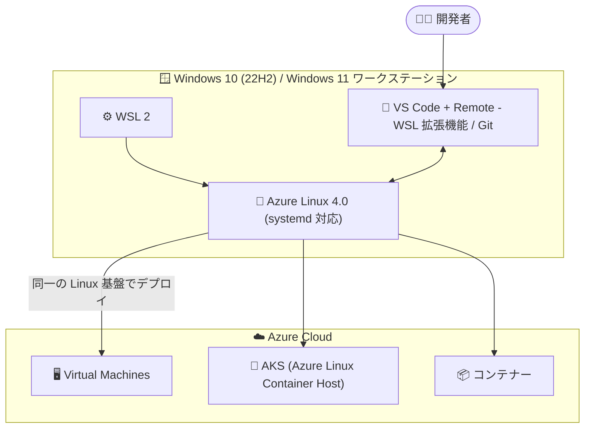

# Azure Linux: Azure Linux on WSL (Public Preview)

**リリース日**: 2026-08-17

**サービス**: Azure Linux

**機能**: Azure Linux on WSL (Windows Subsystem for Linux)

**ステータス**: In preview

[このアップデートのインフォグラフィックを見る](https://takech9203.github.io/azure-news-summary/20260817-azure-linux-wsl-preview.html)

## 概要

Microsoft がメンテナンスするオープンソース Linux ディストリビューション「Azure Linux」を、Windows Subsystem for Linux (WSL) 上で利用できる「Azure Linux on WSL」が Public Preview (Beta) として発表されました。Azure Linux は、Azure 上の仮想マシン (VM)、コンテナー、Kubernetes クラスター向けに構築された軽量かつセキュリティ強化された OS であり、今回のアップデートにより開発者のワークステーションにも同じ Linux 基盤を展開できるようになります。

Azure Linux on WSL は systemd をサポートする完全な Azure Linux ターミナル環境であり、Windows デスクトップアプリケーションと並行して Linux コマンドラインツールの実行、インフラ管理、Linux 開発を行えます。Azure 上で稼働する Azure Linux と同じコマンドラインツール・同じ挙動を利用できるため、日常の開発作業に加えて、問題のローカル再現にも活用できます。VM や Azure サブスクリプションは不要です。

開発・テスト・本番を通じて Microsoft がサポートする単一の Linux 基盤を利用でき、VS Code や Git などの使い慣れたツールでローカル開発を行った後、Azure の VM、AKS、コンテナーといったターゲットにデプロイするワークフローが実現します。

**アップデート前の課題**

- 開発ワークステーションと本番環境 (Azure Linux) で異なる Linux ディストリビューションを使うことになり、環境差異に起因するデバッグに時間を要していた
- 本番と同一構成での動作検証や問題の再現をローカルで行うことが難しかった

**アップデート後の改善**

- 本番に整合した構成 (production-aligned configurations) を使ってローカルで動作検証が可能になった
- 問題をより確実に再現できるようになり、環境間差異のデバッグに費やす時間を削減できる
- 開発・テスト・本番を通じて Microsoft がサポートする 1 つの Linux 基盤に統一できる

## アーキテクチャ図



開発者は Windows ワークステーションの WSL 2 上で Azure Linux 4.0 を実行し、VS Code や Git でローカル開発した成果物を、同じ Azure Linux 基盤で動作する Azure の VM・AKS・コンテナーへデプロイできます。

## サービスアップデートの詳細

### 主要機能

1. **完全な Azure Linux ターミナル環境 (systemd サポート)**
   - WSL 上で systemd をサポートする完全な Azure Linux 環境を提供。Linux コマンドラインツールの実行、インフラ管理、Linux 開発を Windows デスクトップアプリと並行して行える

2. **本番環境と同一のツールと挙動**
   - Azure 上で稼働する Azure Linux と同じコマンドラインツール・同じ挙動を利用可能。本番に整合した構成での検証や、問題のローカル再現に活用できる

3. **VS Code との統合開発環境**
   - VS Code の WSL 拡張機能 (Remote - WSL) により、Azure Linux 内でツールやターミナルを実行しながら、WSL をフルタイムの開発環境として利用可能

4. **マルチアーキテクチャ対応**
   - x86_64 と arm64 の両アーキテクチャをサポート。それぞれ直接ダウンロード用リンクが提供されている

## 技術仕様

| 項目 | 詳細 |
|------|------|
| 対応バージョン | Azure Linux 4.0 |
| 対応アーキテクチャ | x86_64、arm64 |
| systemd | サポート |
| 必要な OS | Windows 10 (22H2) または Windows 11 |
| 必要なコンポーネント | WSL 2 (インストール・有効化済みであること) |
| Azure サブスクリプション | 不要 |
| リリースサイクル | WSL ユーザーの生産性に影響する問題が報告された際に、必要に応じて更新をリリース |
| ステータス | Public Preview (Beta) |

## 設定方法

### 前提条件

1. Windows 10 (22H2) または Windows 11
2. WSL 2 がインストール・有効化されていること
3. インターネット接続
4. WSL ディストリビューションをインストールする権限

### インストール手順

1. Windows Terminal を開く (管理者権限は不要)
2. [GitHub README ガイド](https://github.com/microsoft/azurelinux/blob/4.0/README.md) に従って Azure Linux をインストールする (x86_64 は `https://aka.ms/wslazlinux-x86_64`、arm64 は `https://aka.ms/wslazlinux-aarch64` から直接ダウンロードも可能)
3. Azure Linux を起動する

```bash
# Azure Linux 4.0 を起動 (初回起動時にユーザー名とパスワードを設定)
wsl -d AzureLinux-4

# インストールの確認 (Azure Linux とバージョン番号が表示される)
cat /etc/os-release

# パッケージの更新 (推奨)
sudo dnf update -y
```

### VS Code との連携 (オプション)

1. Windows に [Visual Studio Code](https://code.visualstudio.com/) をインストール
2. [Remote - WSL](https://marketplace.visualstudio.com/items?itemName=ms-vscode-remote.remote-wsl) 拡張機能をインストール
3. Azure Linux のターミナルからフォルダーを VS Code で開く

```bash
code .
```

## メリット

### ビジネス面

- 環境間差異に起因するデバッグ時間を削減し、開発チームの生産性を向上できる
- 開発・テスト・本番を通じて Microsoft がサポートする単一の Linux 基盤に統一でき、運用の一貫性が高まる
- VM や Azure サブスクリプションなしでローカルに Azure Linux 環境を用意でき、検証コストを抑えられる

### 技術面

- 本番に整合した構成でローカル検証でき、問題をより確実に再現できる
- Azure 上の Azure Linux と同一のコマンドラインツール・挙動をローカルで利用できる
- systemd サポートを含む完全なターミナル環境を WSL 上で利用できる
- VS Code (Remote - WSL) や Git など使い慣れたツールチェーンをそのまま活用できる

## デメリット・制約事項

- Public Preview (Beta) 段階であり、本番運用向けの正式リリース (GA) ではない
- Windows 10 (22H2) 以降または Windows 11 と WSL 2 が必要
- 更新は定期的なスケジュールではなく、WSL ユーザーの生産性に影響する問題が報告された際に必要に応じてリリースされる

## ユースケース

### ユースケース 1: 本番環境 (AKS / VM) の問題をローカルで再現

**シナリオ**: Azure Linux を利用する AKS ノードや VM で発生した問題を、Azure 環境を追加で用意せずにローカルで再現・調査したい。

**実装例**:

```bash
# Azure Linux 4.0 を WSL で起動
wsl -d AzureLinux-4

# 本番と同じ Azure Linux のツール・挙動で問題を再現・調査
cat /etc/os-release
sudo dnf update -y
```

**効果**: 本番に整合した構成で問題を確実に再現でき、環境間差異のデバッグに費やす時間を削減できる。

### ユースケース 2: Azure ターゲットへのデプロイを前提としたローカル開発

**シナリオ**: Azure の VM、AKS、コンテナーへのデプロイを前提に、本番と同じ Linux 基盤上でアプリケーションを開発・テストしたい。

**実装例**:

```bash
# Azure Linux のターミナルから VS Code (Remote - WSL) で開発
code .
```

**効果**: VS Code や Git などの使い慣れたツールでローカル開発し、開発から本番まで同一の Microsoft サポートの Linux 基盤を利用できる。

## 関連サービス・機能

- **Azure Kubernetes Service (AKS)**: Azure Linux Container Host としてノード OS に Azure Linux を利用可能。WSL 上の Azure Linux から AKS へのデプロイ先として連携
- **Azure Virtual Machines / Virtual Machine Scale Sets**: Azure Linux をゲスト OS として利用可能なデプロイターゲット
- **Azure Linux コンテナーイメージ**: コンテナーベースのワークロードで同一の Azure Linux 基盤を利用可能
- **Windows Subsystem for Linux (WSL 2)**: Azure Linux on WSL の実行基盤
- **Visual Studio Code (Remote - WSL 拡張機能)**: WSL 上の Azure Linux をフルタイムの開発環境として利用するためのエディター統合

## 参考リンク

- [インフォグラフィック](https://takech9203.github.io/azure-news-summary/20260817-azure-linux-wsl-preview.html)
- [公式アップデート情報](https://azure.microsoft.com/updates?id=569376)
- [発表ブログ: Announcing Azure Linux on WSL - Beta](https://techcommunity.microsoft.com/blog/linuxandopensourceblog/announcing-azure-linux-on-wsl---beta/4542903)
- [Overview of Azure Linux on Windows Subsystem for Linux (WSL)](https://learn.microsoft.com/en-us/azure/azure-linux/windows-subsystem-for-linux-overview)
- [Get started with Azure Linux 4.0 on WSL](https://learn.microsoft.com/en-us/azure/azure-linux/get-started-windows-subsystem-for-linux)
- [Azure Linux ドキュメント](https://learn.microsoft.com/en-us/azure/azure-linux/)
- [azurelinux GitHub リポジトリ (4.0 README)](https://github.com/microsoft/azurelinux/blob/4.0/README.md)

## まとめ

Azure Linux on WSL の Public Preview により、Azure の VM・AKS・コンテナーで利用されている Microsoft メンテナンスの Linux ディストリビューションを、開発者のワークステーション上でそのまま利用できるようになりました。開発から本番まで単一の Linux 基盤に統一することで、環境間差異によるデバッグ時間の削減と、本番に整合した構成での確実な問題再現が期待できます。Azure Linux を AKS や VM で採用している、または採用を検討しているチームは、Windows 10 (22H2) / Windows 11 + WSL 2 環境で `wsl -d AzureLinux-4` によるインストールを試し、Preview 段階での評価を始めることを推奨します。

---

**タグ**: Azure Linux, WSL, Open Source, In preview, Feature, Developer Tools
