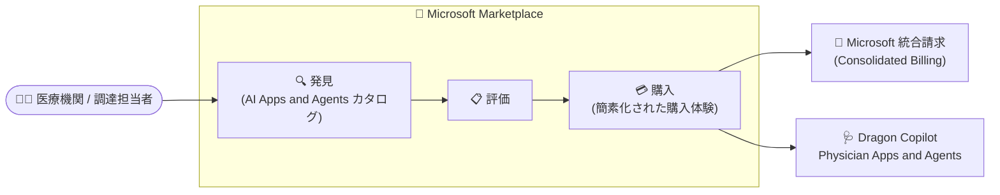

# Dragon Copilot: Physician Apps and Agents の Microsoft Marketplace 提供が一般提供 (GA)

**リリース日**: 2026-08-17

**サービス**: Microsoft Dragon Copilot / Microsoft Marketplace

**機能**: Dragon Copilot Physician Apps and Agents on Microsoft Marketplace

**ステータス**: Launched (GA)

[このアップデートのインフォグラフィックを見る](https://takech9203.github.io/azure-news-summary/20260817-dragon-copilot-marketplace.html)

## 概要

Dragon Copilot の Physician Apps and Agents について、Microsoft Marketplace が新しい発見 (Discovery) および調達 (Procurement) チャネルとして追加され、一般提供 (GA) が開始された。米国の Dragon Copilot 顧客は、Microsoft Marketplace を通じて Dragon Copilot Physician Apps and Agents を発見・評価・購入できるようになった。

Dragon Copilot は Microsoft for Healthcare の一部として提供される、医療従事者向けの AI アシスタントである。アンビエント AI と生成 AI を組み合わせ、診療会話の記録から臨床ドキュメントのドラフト作成、情報の要約・検索、タスクの自動化を支援する。Physician Apps and Agents は、ドキュメント作成ガイダンス、情報の提示、タスク自動化といった高度な AI により臨床ワークフローを強化し、医師の業務効率、臨床医のウェルビーイング、患者体験、ケア提供の改善に寄与する。

今回のアップデートにより、Marketplace 経由の購入では新規ベンダーのオンボーディングや個別の調達プロセスが不要になり、Microsoft を通じた統合請求 (Consolidated Billing) による簡素化された購入体験が提供される。

**アップデート前の課題**

- Dragon Copilot の Physician Apps and Agents を導入する際、個別の調達プロセスを経る必要があった
- 新規ベンダーとしてのオンボーディング手続きが必要になるケースがあり、調達のリードタイムが長くなりがちだった

**アップデート後の改善**

- Microsoft Marketplace 上で Physician Apps and Agents の発見・評価・購入までを一貫して行えるようになった
- Microsoft を通じた統合請求により、購入体験が簡素化され、ベンダー追加のオンボーディングや個別調達プロセスが不要になった

## アーキテクチャ図

Microsoft Marketplace 上で Dragon Copilot Physician Apps and Agents の発見から評価・購入までが完結し、請求は Microsoft 経由で統合される。

## サービスアップデートの詳細

### 主要機能

1. **Microsoft Marketplace での発見・評価・購入**
   - 米国の Dragon Copilot 顧客は、Microsoft Marketplace を通じて Physician Apps and Agents を発見・評価・購入できる
   - Marketplace の AI Apps and Agents カテゴリでは、用途・業界・Microsoft 製品によるフィルタリングで目的のソリューションを探索できる

2. **簡素化された調達プロセス**
   - 新規ベンダーのオンボーディングや個別の調達プロセスが不要
   - Microsoft を通じた統合請求により、購入・支払いが一元化される

3. **臨床ワークフローを強化する AI アプリ・エージェント**
   - ドキュメント作成ガイダンス、情報の提示 (Information Surfacing)、タスク自動化を提供
   - 臨床データの作成・要約・検索・自動化・分析を支援し、効率、臨床医のウェルビーイング、患者体験、ケア提供の改善に貢献
   - Dragon Copilot は Microsoft for Healthcare の一部であり、セキュリティを強化したモダンアーキテクチャ上に構築されている

## 技術仕様

| 項目 | 詳細 |
|------|------|
| 対象製品 | Dragon Copilot Physician Apps and Agents |
| 新しい調達チャネル | Microsoft Marketplace (https://marketplace.microsoft.com) |
| 対象顧客 | 米国の Dragon Copilot 顧客 |
| ステータス | Launched (GA)、GA 時期: 2026 年 8 月 |
| 請求 | Microsoft を通じた統合請求 (Consolidated Billing) |
| カテゴリ | Features |

## メリット

### ビジネス面

- 個別の調達プロセスや新規ベンダーのオンボーディングが不要になり、導入までのリードタイムを短縮できる
- Microsoft への統合請求により、支払い・請求管理を一元化できる
- Marketplace 上で発見から購入まで完結するため、評価・調達のプロセスが透明化される

### 技術面

- Dragon Copilot の AI アプリ・エージェントにより、臨床ドキュメント作成、情報検索、タスク自動化などの臨床ワークフローを強化できる
- Microsoft Marketplace の AI Apps and Agents カテゴリから、他の AI ソリューションとあわせて比較・検討できる

## デメリット・制約事項

- 現時点で Marketplace 経由の購入対象は米国の Dragon Copilot 顧客に限定される
- 購入には Dragon Copilot の顧客であることが前提となる (Dragon Copilot 本体の契約が別途必要)

## ユースケース

### ユースケース 1: 医療機関における Dragon Copilot 拡張機能の迅速な調達

**シナリオ**: 米国の医療機関がすでに Dragon Copilot を利用しており、医師向けのドキュメント作成支援やタスク自動化のアプリ・エージェントを追加導入したい。

**実装の流れ**:

1. Microsoft Marketplace (https://marketplace.microsoft.com) の AI Apps and Agents カテゴリで Dragon Copilot Physician Apps and Agents を検索
2. 提供内容を評価し、要件に合致するアプリ・エージェントを選定
3. Marketplace 上で購入 (請求は Microsoft 経由で統合)

**効果**: 新規ベンダー登録や個別調達の手続きを省略でき、臨床ワークフロー強化のためのアプリ・エージェントを迅速に導入できる。

## 利用可能リージョン

米国の Dragon Copilot 顧客が対象。

## 関連サービス・機能

- **Microsoft Dragon Copilot**: 本アップデートの対象製品。アンビエント AI と生成 AI により臨床ドキュメント作成を支援する医療従事者向け AI アシスタント。Web / デスクトップ / モバイルのスタンドアロンアプリのほか、Developer Kit によるパートナー EHR (電子カルテ) システムへの組み込みにも対応
- **Microsoft Marketplace**: クラウドソリューションと AI エージェントを発見・試用・購入できる単一のカタログ。無料試用、クレジットカード / 請求書 / MACC (Microsoft Azure Consumption Commitment) クレジットによる柔軟な支払い、プライベートオファーなどに対応
- **Microsoft for Healthcare (Microsoft Cloud for Healthcare)**: Dragon Copilot が属する医療業界向けソリューション群

## 参考リンク

- [インフォグラフィック](https://takech9203.github.io/azure-news-summary/20260817-dragon-copilot-marketplace.html)
- [公式アップデート情報](https://azure.microsoft.com/updates?id=557775)
- [Microsoft Learn: What is Microsoft Dragon Copilot (physicians)?](https://learn.microsoft.com/en-us/industry/healthcare/dragon-copilot/about/)
- [Microsoft Learn: Microsoft Marketplace overview](https://learn.microsoft.com/en-us/marketplace/marketplace-overview)
- [Microsoft Marketplace](https://marketplace.microsoft.com)

## まとめ

本アップデートにより、米国の Dragon Copilot 顧客は Microsoft Marketplace を通じて Physician Apps and Agents を発見・評価・購入できるようになった。技術的な新機能ではなく調達チャネルの追加だが、新規ベンダーのオンボーディングや個別調達プロセスが不要になり、Microsoft 経由の統合請求で購入体験が簡素化される点は、ヘルスケア業界の顧客を支援する Solutions Architect にとって押さえておくべき変更である。米国のヘルスケア顧客で Dragon Copilot の拡張を検討している場合は、Marketplace のカタログでの評価を調達フローに組み込むことを推奨する。

---

**タグ**: Dragon Copilot, Microsoft Marketplace, Healthcare, AI Apps and Agents, GA, 調達
