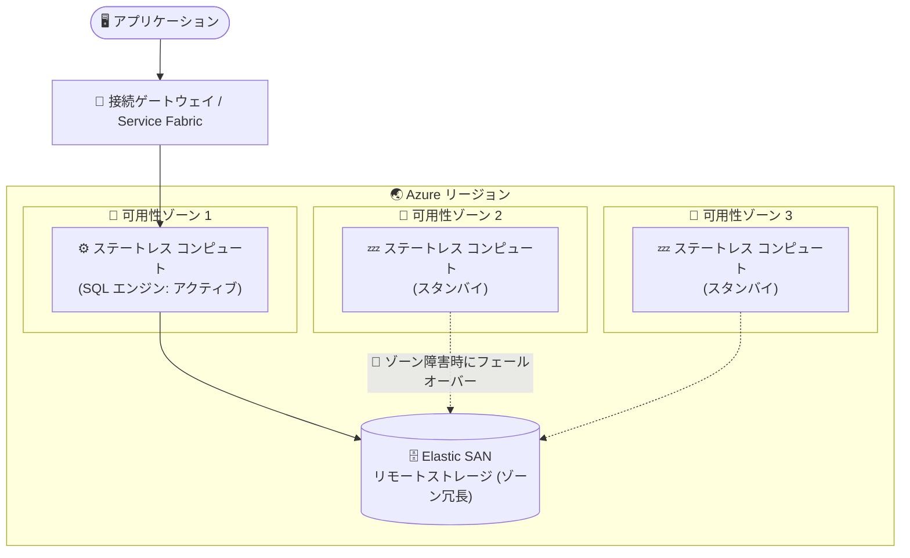

# Azure SQL Managed Instance: Next-gen General Purpose のゾーン冗長 (Public Preview)

**リリース日**: 2026-08-17

**サービス**: Azure SQL Managed Instance

**機能**: Next-gen General Purpose サービスレベルのゾーン冗長 (Zone Redundancy)

**ステータス**: In preview

[このアップデートのインフォグラフィックを見る](https://takech9203.github.io/azure-news-summary/20260817-sql-managed-instance-nextgen-gp-zone-redundancy.html)

## 概要

Azure SQL Managed Instance の Next-gen General Purpose サービスレベルで、ゾーン冗長 (Zone Redundancy) がパブリックプレビューとして提供開始されました。コンピューティングとデータを複数の可用性ゾーンに自動的に分散することで、データセンター全体の障害を含む局所的な障害によるダウンタイムのリスクを低減できます。

ゾーン冗長を有効化すると、アプリケーションのアーキテクチャやロジックを変更することなく、最大 99.995% の稼働時間 (uptime) を実現できます。General Purpose 層のコスト効率と柔軟性を維持しながら、組み込みの高可用性によってミッションクリティカルなワークロードや厳しい稼働時間要件に少ない運用負荷で対応できるようになります。

Next-gen General Purpose は、既存の General Purpose サービスレベルのアーキテクチャアップグレードであり、データ/ログファイルの保存にページ Blob ではなく Elastic SAN を使用します。今回のプレビューでは、Premium シリーズハードウェア上のゾーン冗長インスタンスにおける柔軟なメモリ構成 (flexible memory) もサポートされます。

**アップデート前の課題**

- Next-gen General Purpose ではゾーン冗長が利用できず、可用性ゾーン全体の障害に対しては、フェールオーバーグループや geo リストアなどのディザスターリカバリー手段でしか対応できなかった
- ゾーン冗長なしの場合、フェールオーバーは同一データセンター内でローカルに行われるため、ゾーン規模の障害では障害復旧までインスタンスが利用できなくなる可能性があった

**アップデート後の改善**

- コンピューティングとデータが複数の可用性ゾーンへ自動的に分散され、データセンター全体の障害にも耐えられるようになった
- アプリケーションの変更なしで最大 99.995% の稼働時間を実現できるようになった
- 既存インスタンスもオンライン操作でゾーン冗長構成へ変換可能 (有効化・無効化はバックグラウンドで実行される完全オンラインのスケーリング操作)
- Premium シリーズハードウェア上のゾーン冗長インスタンスで柔軟なメモリ構成 (flexible memory) がプレビューとして利用可能

## アーキテクチャ図



Next-gen General Purpose のゾーン冗長では、サービスコンポーネントが複数の可用性ゾーンに分散され、データ/ログファイルは Elastic SAN ベースのリモートストレージ層に保存されます。ゾーン障害時には別ゾーンのコンピュートノードで SQL エンジンプロセスがアクティブになり、ストレージ上のデータへアクセスを継続します。

## サービスアップデートの詳細

### 主要機能

1. **可用性ゾーンをまたいだ自動分散**
   - コンピューティングとデータを複数の可用性ゾーン (それぞれ独立した電源・冷却・ネットワークを持つ物理的に分離された場所) に自動的に分散し、ゾーン全体の障害を含む大規模障害への耐性を実現

2. **最大 99.995% の稼働時間**
   - アプリケーションアーキテクチャの変更なしで、より高い信頼性を実現

3. **既存インスタンスのオンライン変換**
   - ゾーン冗長の有効化・無効化は、バックグラウンドで実行される完全オンラインのスケーリング操作として実施可能。単一ゾーン構成へ戻すことも可能

4. **柔軟なメモリ構成 (flexible memory) のサポート**
   - Premium シリーズハードウェア上のゾーン冗長インスタンスで、vCore 数とは独立してメモリ量を調整可能 (プレビュー)

## 技術仕様

| 項目 | 詳細 |
|------|------|
| 対象サービスレベル | Next-gen General Purpose (General Purpose のアーキテクチャアップグレード) |
| 可用性モデル | リモートストレージモデル (コンピューティングとストレージの分離) |
| ストレージ層 | Elastic SAN (ページ Blob の代わりに使用) |
| 稼働時間 | 最大 99.995% |
| 分散先 | プライマリリージョン内の 3 つの可用性ゾーン |
| 有効化・無効化 | 完全オンライン操作 (双方向に変換可能) |
| インスタンスあたり最大データベース数 | 500 (Next-gen General Purpose の特性) |
| 最大ストレージサイズ | 32 TB (Next-gen General Purpose の特性) |
| フェールオーバー制御 | Azure Service Fabric |

## 設定方法

### 前提条件

1. Next-gen General Purpose サービスレベルのインスタンス (新規作成またはアップグレード)
2. バックアップストレージの冗長性が **Zone-redundant** または **Geo-zone-redundant** に設定されていること (ゾーン冗長の有効化前に構成が必要)
3. ゾーン冗長が利用可能なリージョンであること

### Azure CLI

```bash
# 新規インスタンスをゾーン冗長 + Next-gen General Purpose で作成
az sql mi create \
    --name my-nextgen-mi \
    --resource-group myResourceGroup \
    --location eastus \
    --admin-user adminuser \
    --admin-password "<your-password>" \
    --subnet "<subnet-resource-id>" \
    --capacity 4 \
    --tier GeneralPurpose \
    --family Gen5 \
    --storage 512 \
    --license-type LicenseIncluded \
    --gpv2 true \
    --zone-redundant true

# 既存インスタンスでゾーン冗長を有効化
az sql mi update \
    --name my-nextgen-mi \
    --resource-group myResourceGroup \
    --zone-redundant true

# ゾーン冗長の設定状況を確認
az sql mi show \
    --name my-nextgen-mi \
    --resource-group myResourceGroup
```

PowerShell では `New-AzSqlInstance` / `Set-AzSqlInstance` の `-ZoneRedundant` スイッチ、REST API では `zoneRedundant` パラメーターで設定できます。

### Azure Portal

1. 対象の SQL Managed Instance リソースの **Compute + storage** ペインを開く
2. **Backup** の **Backup storage redundancy** を `Zone-redundant` または `Geo-zone-redundant` に設定し、操作完了を待つ
3. **Compute Hardware** の **Zone redundancy** トグルを有効化して適用する

新規作成時は、**Create Azure SQL Managed Instance** ページの **Compute + storage** 構成でバックアップストレージの冗長性とゾーン冗長を同時に設定できます。

## メリット

### ビジネス面

- データセンター全体の壊滅的障害に対しても事業継続性を確保でき、最大 99.995% の稼働時間により厳しい SLA 要件に対応可能
- General Purpose 層のコスト効率を維持したまま高可用性を実現でき、Business Critical 層へ移行せずに稼働時間要件を満たせる選択肢が増える
- 組み込みの高可用性により、独自の DR 構成に比べて運用負荷を低減

### 技術面

- アプリケーションロジックの変更が不要
- 既存インスタンスのゾーン冗長構成への変換が完全オンラインで実行可能 (逆方向も可能)
- ゾーン障害時のフェールオーバーは Azure Service Fabric により自動で実行される
- Premium シリーズハードウェアでは flexible memory と組み合わせて、メモリを vCore と独立して調整可能

## デメリット・制約事項

- 本機能はパブリックプレビューであり、非本番環境・テスト用途での利用が想定される (GA 日は未定)
- ゾーン冗長インスタンスはレプリカが物理的に離れたデータセンターに配置されるため、ネットワーク遅延の増加によりトランザクションのコミット時間が延び、一部の OLTP ワークロードの性能に影響する可能性がある
- ゾーン冗長は一部のリージョンでのみ利用可能
- ゾーン冗長の有効化には、バックアップストレージの冗長性を Zone-redundant または Geo-zone-redundant に事前設定する必要がある

## 料金

Next-gen General Purpose は既存の General Purpose サービスレベルのアップグレードであるため、請求上は *General Purpose* サービスレベルとして表示されます。ベースライン料金は General Purpose と同一で、IOPS やメモリの追加分は個別に課金されます (予約ストレージ 1 GB あたり 3 IOPS が無料で含まれ、超過分は 1 IOPS = ストレージ単価 ÷ 3)。

ゾーン冗長構成そのものの料金詳細は公式料金ページを参照してください。

- [Azure SQL Managed Instance の料金](https://azure.microsoft.com/pricing/details/azure-sql-managed-instance/)

## 利用可能リージョン

ゾーン冗長は一部のリージョンで利用可能です。最新のリージョン別提供状況は以下を参照してください。

- [Azure SQL Managed Instance のリージョン別提供状況 (Zone redundancy)](https://learn.microsoft.com/azure/azure-sql/managed-instance/region-availability#zone-redundancy)

## 関連サービス・機能

- **Azure Availability Zones**: 本機能の基盤。リージョン内の独立した電源・冷却・ネットワークを持つ物理的に分離されたゾーンにレプリカを配置する
- **Azure Elastic SAN**: Next-gen General Purpose のリモートストレージ層。ページ Blob と比べてストレージのレイテンシ・IOPS・スループットを大幅に改善
- **Azure Service Fabric**: コンピュートノードの正常性監視とフェールオーバーの制御を担う
- **フェールオーバーグループ / geo リストア**: リージョン全体の障害に備えるディザスターリカバリー手段。ゾーン冗長 (リージョン内の高可用性) と組み合わせて多層的な事業継続構成を実現
- **Business Critical サービスレベル**: ローカルストレージモデルによる高可用性構成の選択肢。高トランザクションレート・高 IO 性能が必要なミッションクリティカル用途向け

## 参考リンク

- [インフォグラフィック](https://takech9203.github.io/azure-news-summary/20260817-sql-managed-instance-nextgen-gp-zone-redundancy.html)
- [公式アップデート情報](https://azure.microsoft.com/updates?id=568344)
- [ローカル冗長とゾーン冗長による可用性 - Azure SQL Managed Instance](https://learn.microsoft.com/azure/azure-sql/managed-instance/high-availability-sla-local-zone-redundancy)
- [ゾーン冗長の構成 - Azure SQL Managed Instance](https://learn.microsoft.com/azure/azure-sql/managed-instance/instance-zone-redundancy-configure)
- [Next-gen General Purpose サービスレベルの使用](https://learn.microsoft.com/azure/azure-sql/managed-instance/service-tiers-next-gen-general-purpose-use)
- [料金ページ](https://azure.microsoft.com/pricing/details/azure-sql-managed-instance/)

## まとめ

Next-gen General Purpose サービスレベルでゾーン冗長がパブリックプレビューとなり、General Purpose 層のコスト効率を維持しながら、データセンター全体の障害にも耐える最大 99.995% の稼働時間を実現できるようになりました。Elastic SAN による高いストレージ性能と高可用性を両立できるため、Business Critical 層までは不要だが高い稼働時間要件を持つワークロードに有力な選択肢となります。評価環境でバックアップストレージの冗長性設定 (Zone-redundant / Geo-zone-redundant) を確認のうえ、既存インスタンスのオンライン変換や新規デプロイでの検証を推奨します。

---

**タグ**: Azure SQL Managed Instance, Next-gen General Purpose, Zone Redundancy, 可用性ゾーン, 高可用性, Elastic SAN, Databases, Public Preview
