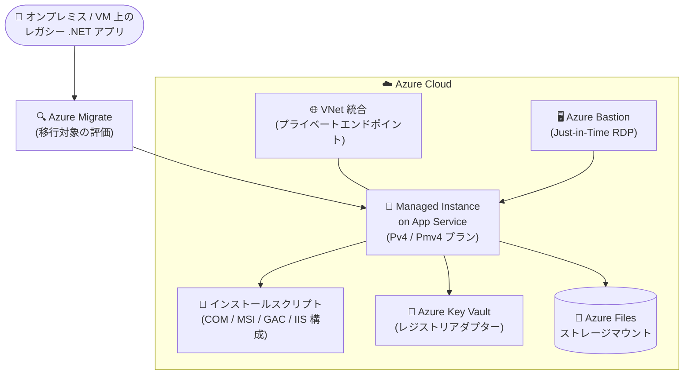

# Azure App Service: Managed Instance の一般提供開始 (GA)

**リリース日**: 2026-08-18

**サービス**: Azure App Service

**機能**: Managed Instance on Azure App Service

**ステータス**: Launched (GA)

[このアップデートのインフォグラフィックを見る](https://takech9203.github.io/azure-news-summary/20260818-app-service-managed-instance-ga.html)

## 概要

Managed Instance on Azure App Service が一般提供 (GA) となりました。Managed Instance は、最小限の構成変更かつコード変更なしで、Web アプリケーションを Azure App Service に移行できる新しいホスティングオプションです。オンプレミスや仮想マシン上で稼働しているアプリケーションを、Windows 固有の依存関係との互換性を維持したまま、フルマネージドな PaaS 環境へ移行できます。

多くのビジネスクリティカルな .NET アプリケーションは、Windows サービス、サードパーティライブラリ、カスタムランタイムなどのコンポーネントに依存しており、これがモダナイゼーションの障壁となってきました。Managed Instance はこれらの互換性を保持しながら、App Service 上での実行を可能にし、運用負荷を削減します。

GA に伴い、99.95% の SLA、Premium v4 のパフォーマンス、Azure Policy 統合、Microsoft Defender for Cloud サポート、Bicep / Terraform / ARM テンプレートによるデプロイといったエンタープライズ対応の機能が提供されます。

**アップデート前の課題**

- COM コンポーネント、レジストリ変更、MSI インストーラー、GAC 登録など Windows 固有の依存関係を持つレガシー .NET Framework アプリは、標準の App Service では OS カスタマイズができず移行が困難だった
- そのため IaaS (仮想マシン) での運用を継続せざるを得ず、OS パッチ適用やスケーリングなどの運用負荷を利用者側が負担していた

**アップデート後の改善**

- コード変更なしで、Windows 固有の依存関係を持つアプリケーション (クラシック .NET Framework アプリを含む) を App Service のフルマネージド環境で実行可能になった
- オートスケール、回復性、ゾーン冗長、Azure サービス統合といった App Service 組み込みの機能をそのまま利用できる
- Azure Bastion 経由の RDP アクセス、カスタムスクリプト、レジストリアダプター、ストレージマウント、ID 管理による管理者レベルの制御が可能になった
- 99.95% SLA、Azure Policy、Microsoft Defender for Cloud、IaC (Bicep / Terraform / ARM) 対応により本番ワークロードで利用可能になった

## アーキテクチャ図

オンプレミスや VM 上のレガシーアプリを Azure Migrate で評価し、コード変更なしで Managed Instance へ移行する構成です。インストールスクリプトによる OS カスタマイズ、Key Vault 連携のレジストリアダプター、Azure Files マウント、Bastion 経由の RDP 診断アクセスを組み合わせて利用できます。

## サービスアップデートの詳細

### 主要機能

1. **App Service 組み込み機能の活用**
   - オートスケール、回復性、ゾーン冗長、Azure サービス統合など、App Service が標準で備える機能をレガシーアプリでも利用可能

2. **管理者レベルの制御**
   - Azure Bastion 経由の Just-in-Time RDP アクセス (診断用途)、PowerShell カスタムスクリプト、レジストリアダプター、ストレージマウント、マネージド ID による ID 管理

3. **複雑なワークロードのサポート**
   - クラシック .NET Framework アプリケーションを含む、Windows 固有依存 (COM、レジストリ、MSI、GAC、Windows 機能) を持つワークロードをコード変更なしで実行

4. **エンタープライズ対応**
   - 99.95% SLA、Premium v4 パフォーマンス、Azure Policy 統合、Microsoft Defender for Cloud サポート、Bicep / Terraform / ARM テンプレートによるデプロイ

## 技術仕様

以下は Microsoft Learn ドキュメント (プレビュー時点の記載) に基づく仕様です。GA での最新仕様は公式ドキュメントを確認してください。

| 項目 | 詳細 |
|------|------|
| 対象プラットフォーム | Windows Web アプリのみ (Linux / コンテナーは非対応) |
| 対応 SKU | Premium v4 (Pv4) / Premium v4 メモリ最適化 (Pmv4) |
| プリインストールランタイム | .NET Framework 3.5 / 4.8、.NET 8 (カスタムランタイムはインストールスクリプトで追加可能) |
| OS カスタマイズ | PowerShell インストールスクリプト (COM、レジストリ、IIS 構成・ACL、MSI、Windows サービス、GAC、MSMQ などの Windows 機能) |
| レジストリアダプター | Azure Key Vault と連携したセキュアなレジストリキー定義 (プランレベル) |
| ストレージ | Azure Files マウント (Key Vault 統合)、UNC パス / ネットワーク共有、ドライブマッピング、ローカル一時ストレージ 2 GB (非永続) |
| ネットワーク | プランレベルの VNet 統合 (作成後の追加も可)、プライベートエンドポイント、NSG、NAT ゲートウェイ、ルートテーブル、プライベート DNS |
| RDP アクセス | Azure Bastion 経由の Just-in-Time RDP (VNet 統合が必要、診断用途。変更は再起動で失われる) |
| 認証 | Microsoft Entra ID / マネージド ID (ドメイン参加、NTLM、Kerberos は非対応) |
| ID 管理 | プランレベルのシステム割り当て / ユーザー割り当てマネージド ID |
| CI/CD | GitHub Actions、Azure DevOps、zip デプロイ、パッケージデプロイ、run-from-package |
| SLA | 99.95% (GA) |
| ログ | App Service プランレベルで生成。Logstream / Azure Monitor 統合が可能 |

## 設定方法

### 前提条件

1. Windows Web アプリであること (Linux / コンテナーは非対応)
2. Premium v4 (Pv4) または Premium v4 メモリ最適化 (Pmv4) プランを使用すること
3. RDP アクセスを利用する場合は VNet 統合と Azure Bastion が必要
4. インストールスクリプトは zip 化した PowerShell スクリプトを Azure Storage に配置し、マネージド ID 経由でアクセスさせる

デプロイは Azure Portal、Azure CLI、または IaC ツール (Bicep / Terraform / ARM テンプレート) から実行できます。移行対象ワークロードの評価には Azure Migrate の利用が推奨されています。

## メリット

### ビジネス面

- レガシー .NET Framework アプリの書き換え (リライト) を行わずに PaaS へ移行でき、モダナイゼーションのコストとリスクを大幅に削減
- 99.95% SLA と Premium v4 パフォーマンスにより、ビジネスクリティカルなワークロードの移行先として本番利用が可能
- OS パッチ適用・負荷分散・スケーリングがプラットフォームマネージドとなり、IaaS 運用と比較して運用負荷を削減

### 技術面

- COM、レジストリ、MSI、GAC、Windows サービスなどの Windows 固有依存をコード変更なしで維持可能
- インストールスクリプトによる宣言的かつ再現可能な OS カスタマイズ (RDP での手動変更は非永続のため、構成のドリフトを防止)
- Key Vault 連携のレジストリアダプターとマネージド ID により、シークレットレスでセキュアな構成管理を実現
- Azure Policy / Microsoft Defender for Cloud との統合によりガバナンス・セキュリティ運用を標準化

## デメリット・制約事項

以下はプレビュー時点のドキュメントに記載されている制限です。GA での最新情報は公式ドキュメントを確認してください。

- Windows のみ対応 (Linux / コンテナーは非対応)。App Service Environment (ASE) では利用不可
- SKU は Pv4 / Pmv4 に限定される
- 認証は Entra ID / マネージド ID のみ (ドメイン参加、NTLM、Kerberos は非対応)
- Web アプリのみ対応 (WebJobs、TCP / NetPipes は非対応)
- 永続的な構成変更はインストールスクリプト経由が必須 (RDP は診断用途のみで、変更は再起動やプラットフォームメンテナンスで失われる)
- ローカル一時ストレージは 2 GB で非永続

## ユースケース

### ユースケース 1: レガシー .NET Framework アプリの「リフト & 改善」移行

**シナリオ**: オンプレミスの IIS サーバー上で稼働する .NET Framework 4.8 アプリケーションが、COM コンポーネントとレジストリ設定、サードパーティ MSI に依存しており、標準の App Service へは移行できない。

**実装アプローチ**:

1. Azure Migrate で対象ワークロードの適格性を評価
2. Pv4 / Pmv4 プランで Managed Instance を作成 (Portal / CLI / Bicep / Terraform)
3. COM 登録・MSI インストール・レジストリ設定を PowerShell インストールスクリプトとして Azure Storage に配置
4. 機密性の高いレジストリ値は Key Vault 連携のレジストリアダプターで管理
5. ネットワーク共有依存は Azure Files マウントまたは UNC パスで置き換え

**効果**: コード変更なしで PaaS 移行が完了し、OS 管理・パッチ適用から解放される。オートスケールとゾーン冗長により可用性も向上する。

### ユースケース 2: コンプライアンス要件のあるアプリのプライベートネットワーク移行

**シナリオ**: 社内ネットワークからのみアクセス可能にする必要がある業務アプリを PaaS 化したい。

**実装アプローチ**: プランレベルの VNet 統合とプライベートエンドポイントを構成し、NSG・ルートテーブル・プライベート DNS で社内ネットワーク要件に合わせたネットワーク境界を構築する。診断が必要な場合は Azure Bastion 経由の Just-in-Time RDP を使用する。

**効果**: パブリック公開せずにフルマネージド PaaS の運用メリットを享受できる。

## 料金

Managed Instance は Premium v4 (Pv4) / Premium v4 メモリ最適化 (Pmv4) プランで提供されます。具体的な料金は、リージョンや従量課金 / Savings Plan / リザーブドの選択により異なるため、料金ページおよび料金計算ツールで確認してください。

Premium v4 プランのスペック (すべてストレージ 250 GB):

| プラン | vCPU | RAM |
|------|------|------|
| P0v4 | 1 | 4 GB |
| P1v4 | 2 | 8 GB |
| P1mv4 | 2 | 16 GB |
| P2v4 | 4 | 16 GB |
| P2mv4 | 4 | 32 GB |
| P3v4 | 8 | 32 GB |
| P3mv4 | 8 | 64 GB |
| P4mv4 | 16 | 128 GB |
| P5mv4 | 32 | 256 GB |

- [App Service (Windows) 料金ページ](https://azure.microsoft.com/pricing/details/app-service/windows/)

## 利用可能リージョン

GA 時点でのリージョン一覧は公式発表では確認できませんでした。最新の提供状況は以下を参照してください。

- [Managed Instance on App Service overview (Microsoft Learn)](https://learn.microsoft.com/azure/app-service/overview-managed-instance)

参考: プレビュー時点のドキュメントでは East Asia、West Central US、North Europe、East US、Australia East、Central India、South India が記載されていました。

## 関連サービス・機能

- **Azure Migrate**: 移行対象ワークロードの適格性評価に使用。GA アナウンスでも移行の最初のステップとして推奨されている
- **Azure Bastion**: Managed Instance への Just-in-Time RDP アクセスを提供 (VNet 統合が必要)
- **Azure Key Vault**: レジストリアダプターのシークレット値やストレージマウントの資格情報を安全に管理
- **Azure Files**: ストレージマウントとしてネットワーク共有依存を置き換え
- **Azure Monitor / Logstream**: プランレベルのプラットフォームログ・スクリプト実行ログの集中管理
- **Microsoft Defender for Cloud**: 脅威検出によるセキュリティ監視 (GA でサポート)
- **Azure Policy**: ガバナンス統制 (GA で統合)
- **App Service Environment (ASE)**: 100 以上のアプリを完全分離環境でホストする場合の代替オプション (Managed Instance は ASE では利用不可)

## 参考リンク

- [インフォグラフィック](https://takech9203.github.io/azure-news-summary/20260818-app-service-managed-instance-ga.html)
- [公式アップデート情報](https://azure.microsoft.com/updates?id=568952)
- [GA アナウンスブログ (Microsoft Tech Community)](https://techcommunity.microsoft.com/blog/AppsonAzureBlog/announcing-general-availability-of-managed-instance-on-azure-app-service/4541283)
- [Managed Instance on App Service overview (Microsoft Learn)](https://learn.microsoft.com/azure/app-service/overview-managed-instance)
- [App Service (Windows) 料金ページ](https://azure.microsoft.com/pricing/details/app-service/windows/)

## まとめ

Managed Instance on Azure App Service の GA により、COM・レジストリ・MSI・GAC などの Windows 固有依存を理由に IaaS に留まっていたレガシー .NET アプリケーションを、コード変更なしでフルマネージド PaaS へ移行する道が開かれました。99.95% SLA、Azure Policy、Defender for Cloud、IaC 対応が揃い、本番ワークロードでの採用が現実的になっています。

Windows Server ベースの Web アプリを VM で運用している組織は、まず Azure Migrate で対象ワークロードの適格性を評価し、Pv4 / Pmv4 プランでの PoC から始めることを推奨します。永続構成はインストールスクリプトで管理する運用モデルへの理解が導入のポイントです。

---

**タグ**: `App Service` `Managed Instance` `GA` `.NET Framework` `レガシー移行` `PaaS` `Windows` `Compute` `Web`
