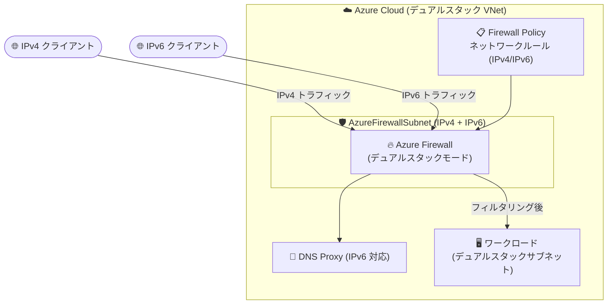

# Azure Firewall: IPv6 サポート (Public Preview)

**リリース日**: 2026-08-18

**サービス**: Azure Firewall

**機能**: IPv6 サポート (デュアルスタックモード)

**ステータス**: In preview

[このアップデートのインフォグラフィックを見る](https://takech9203.github.io/azure-news-summary/20260818-azure-firewall-ipv6-preview.html)

## 概要

Azure Firewall の IPv6 サポートがパブリックプレビューとして発表されました。Azure Firewall および Firewall Policy を IPv4/IPv6 両対応のデュアルスタックモードで構成できるようになり、IPv6 トラフィックに対するネイティブなネットワークルールフィルタリングと DNS Proxy がサポートされます。

これにより、クラウド・ハイブリッド・内部ネットワークにおける IPv6 トラフィックの保護が可能になり、デュアルスタックアーキテクチャへの移行を進める組織を支援します。IPv6 のサブネット、アドレス空間、パブリック IPv6 アドレス、ユーザー定義ルート (UDR)、ネットワークルールを構成して IPv6 トラフィックを管理できます。なお、ファイアウォールは IPv4 のみ、またはデュアルスタック (IPv4 + IPv6) でデプロイでき、IPv6 のみのファイアウォールはサポートされません。

**アップデート前の課題**

- Azure Firewall は IPv4 トラフィックのみに対応しており、IPv6 トラフィックのフィルタリングができなかった
- IPv6 化 (デュアルスタック化) を進める環境では、Azure Firewall によるネットワークセキュリティ境界を IPv6 通信に適用できなかった

**アップデート後の改善**

- Azure Firewall と Firewall Policy をデュアルスタックモードで構成し、IPv4/IPv6 両方のトラフィックを単一のファイアウォールで制御可能になった
- IPv6 トラフィックに対するネイティブなネットワークルール (許可/拒否) のフィルタリングに対応した
- IPv6 ネットワークにおける DNS Proxy として Azure Firewall を構成可能になった
- 既存の IPv4 のみのファイアウォールをデュアルスタックモードにアップグレードできるようになった

## アーキテクチャ図



デュアルスタック構成の Azure Firewall が単一のセキュリティ境界として IPv4/IPv6 両方のトラフィックを受け、Firewall Policy のネットワークルールでフィルタリングします。IPv6 ネットワークでは DNS Proxy としても機能します。

## サービスアップデートの詳細

### 主要機能

1. **デュアルスタックモードでのデプロイ**
   - Azure Firewall を IPv4 のみ、またはデュアルスタック (IPv4 + IPv6) でデプロイ可能。IPv6 のみのモードはサポートされない
   - IPv6 のサブネット、アドレス空間、パブリック IPv6 アドレス、UDR を構成可能

2. **IPv6 ネットワークルールフィルタリング**
   - ネットワークルールで IPv6 トラフィックを完全サポート。IPv6 トラフィックの許可/拒否ルールを作成可能

3. **DNS Proxy の IPv6 対応**
   - IPv6 ネットワークにおいて Azure Firewall を DNS Proxy として構成可能

4. **既存ファイアウォールのアップグレード**
   - 既存の IPv4 のみのファイアウォールに IPv6 アドレス空間・サブネットプレフィックス・パブリック IPv6 アドレスを追加してデュアルスタック化が可能

### SNAT の動作

- VNet からのすべてのアウトバウンド接続に対し、Azure Firewall はインスタンスの IP アドレスで SNAT を適用する
- 宛先アドレスが IANA 定義のユニークローカルアドレス (ULA) 範囲 (`fc00::/7`) の場合、SNAT は適用されない (仕様であり変更不可)

## 技術仕様

| 項目 | 詳細 |
|------|------|
| デプロイモード | IPv4 のみ / デュアルスタック (IPv4 + IPv6)。IPv6 のみは不可 |
| 構成手段 | PowerShell、Azure CLI (Azure Portal は近日対応予定) |
| 対応ルール | ネットワークルール (IPv6 完全サポート) |
| DNS Proxy | IPv6 ネットワークで対応 |
| SNAT | アウトバウンドで適用。ULA 範囲 (`fc00::/7`) 宛は非適用 |
| 非対応構成 | Classic Azure Firewall、Virtual Hub (vHub) Firewall |
| 非対応機能 (IPv6) | アプリケーションルール、DNAT ルール、Threat Intelligence、IDPS、Explicit Proxy、IP Groups |
| 元に戻す操作 | デュアルスタック化後、IPv4 のみへ戻すことは不可 (GA 時に解消予定の一時的制限) |

## 設定方法

### 前提条件

1. Azure サブスクリプション
2. PowerShell または Azure CLI (Azure Portal でのデプロイは現時点で未サポート)

### Azure CLI (既存ファイアウォールのデュアルスタック化)

```bash
# 1. VNet に IPv6 アドレス空間を追加
az network vnet update --resource-group test-rg --name test-vnet \
    --address-prefixes 10.0.0.0/16 fd00:c1d0:3f1f::/48

# 2. AzureFirewallSubnet に IPv6 サブネットプレフィックスを追加
az network vnet subnet update \
    --resource-group test-rg \
    --vnet-name test-vnet \
    --name AzureFirewallSubnet \
    --address-prefixes 10.0.0.0/24 fd00:c1d0:3f1f:1::/64

# 3. パブリック IPv6 アドレスを作成しファイアウォールにアタッチ
az network public-ip create \
    --resource-group test-rg \
    --name test-v6pip \
    --location southcentralus \
    --sku Standard \
    --version IPv6 \
    --allocation-method Static \
    --zone 1 2 3

az network firewall ip-config create \
    --firewall-name test-fw \
    --name fw-ip6-config \
    --resource-group test-rg \
    --public-ip-address test-v6pip
```

新規にデュアルスタックファイアウォールを作成する場合は、VNet/サブネットを IPv4 + IPv6 のプレフィックスで作成し、IPv4/IPv6 双方のパブリック IP を作成してファイアウォールにアタッチします (PowerShell でも同等の手順が可能)。

## メリット

### ビジネス面

- IPv6 義務化・アドレス枯渇対応など、組織の IPv6 移行 (デュアルスタック化) 計画を Azure ネイティブのファイアウォールで進められる
- IPv4/IPv6 を別々のセキュリティ製品で管理する必要がなく、単一のファイアウォールとポリシーで運用を統合できる

### 技術面

- クラウド、ハイブリッド、内部ネットワークの IPv6 トラフィックを Azure Firewall のセキュリティ境界で保護できる
- 既存の IPv4 ファイアウォールに IPv6 構成を追加するだけでアップグレードでき、再構築が不要
- IPv4 向けの既存機能はデュアルスタックファイアウォールでも引き続き IPv4 に対してサポートされる

## デメリット・制約事項

- パブリックプレビューであり、プレビューの補足利用条件が適用される。GA 日は未定
- IPv6 ではアプリケーションルールと DNAT ルールが未サポート (ネットワークルールと DNS Proxy のみ)
- IPv6 では Threat Intelligence、IDPS、Explicit Proxy、IP Groups ベースのシナリオが未サポート
- Azure Portal からのデプロイは未対応 (PowerShell / Azure CLI のみ、Portal 対応は近日予定)
- Classic Azure Firewall および Virtual Hub (vHub) Firewall (Secured Hub) は未対応
- 一度デュアルスタック化すると IPv4 のみのモードへ戻せない (GA 時に解消予定)
- Israel Central、Israel Northwest、Qatar Central、UAE Central、UAE North の各リージョンでは現時点でデュアルスタックモード未対応 (今後対応予定)

## 料金

Azure Firewall の課金は、SKU (Basic / Standard / Premium) ごとのデプロイ時間あたりの固定料金と、処理データ量 (GB あたり) の従量課金の組み合わせです。IPv6 サポートに固有の追加料金は料金ページに記載されていません。具体的な金額は料金ページおよび料金計算ツールを参照してください。

- [Azure Firewall 料金ページ](https://azure.microsoft.com/pricing/details/azure-firewall/)

## 利用可能リージョン

デュアルスタックモードは以下のリージョンを除き利用可能です (これらのリージョンも今後対応予定)。

- Israel Central / Israel Northwest / Qatar Central / UAE Central / UAE North

## 関連サービス・機能

- **Azure Firewall Policy**: デュアルスタックモードの構成とネットワークルール定義に使用。IPv4/IPv6 双方のルールを一元管理
- **Azure Virtual Network (デュアルスタック VNet)**: IPv6 アドレス空間と IPv6 サブネットプレフィックス (AzureFirewallSubnet) の追加が前提
- **Azure Public IP (Standard SKU, IPv6)**: ファイアウォールにアタッチするパブリック IPv6 アドレスとして必要
- **ユーザー定義ルート (UDR)**: IPv6 トラフィックをファイアウォール経由にルーティングするために構成可能

## 参考リンク

- [インフォグラフィック](https://takech9203.github.io/azure-news-summary/20260818-azure-firewall-ipv6-preview.html)
- [公式アップデート情報](https://azure.microsoft.com/updates?id=569520)
- [Microsoft Learn: Deploy Azure Firewall in dual stack mode (preview)](https://learn.microsoft.com/en-us/azure/firewall/deploy-dual-stack-firewall)
- [料金ページ](https://azure.microsoft.com/pricing/details/azure-firewall/)

## まとめ

Azure Firewall がついに IPv6 (デュアルスタック) に対応し、IPv6 移行を進める組織が Azure ネイティブのファイアウォールで IPv6 トラフィックを保護できるようになりました。現時点ではネットワークルールと DNS Proxy に限定され、アプリケーションルール・DNAT・IDPS などは未対応のため、IPv6 で必要なセキュリティ機能がネットワークルールで充足できるかを確認した上での検証が推奨されます。デュアルスタック化すると IPv4 のみへ戻せない点に注意し、まずは検証環境で PowerShell / Azure CLI を使って評価するのがよいでしょう。

---

**タグ**: Azure Firewall, IPv6, デュアルスタック, Networking, Security, Public Preview
