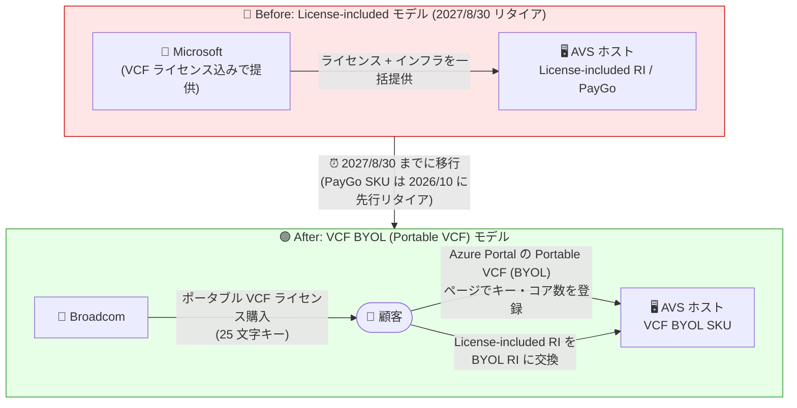

# Azure VMware Solution: License-included サービスのリタイア (2027 年 8 月 30 日)

**リリース日**: 2026-08-18

**サービス**: Azure VMware Solution

**機能**: License-included サービスのリタイア (VCF BYOL への移行)

**ステータス**: Retirement

[このアップデートのインフォグラフィックを見る](https://takech9203.github.io/azure-news-summary/20260818-vmware-solution-license-included-retirement.html)

## 概要

Microsoft は、Azure VMware Solution (AVS) の License-included サービス (VMware Cloud Foundation ライセンス込みの提供モデル) を **2027 年 8 月 30 日** にリタイアすることを発表した。背景には、2025 年 11 月に Broadcom がすべてのハイパースケーラープラットフォームに対して VMware ライセンスポリシーを変更し、VMware Cloud Foundation (VCF) についてポータブルライセンスの持ち込み ("Bring Your Own License"、BYOL) を顧客に義務付けたことがある。

これまで AVS では、VCF ライセンスがホスト料金に含まれた License-included の予約インスタンス (RI) や従量課金 (PayGo) SKU が提供されてきた。今回の Broadcom の最新の VCF ライセンス変更により、License-included の提供モデル自体が終了する。現在 License-included の RI SKU を使用している顧客は、2027 年 8 月 30 日までに Broadcom からポータブル VCF ライセンスを購入して AVS VCF BYOL SKU に移行するか、AVS から退出する必要がある。移行しない場合、2027 年 8 月 31 日にサービス中断が発生する。

Microsoft は、Broadcom からの VCF ライセンス購入と BYOL への移行には十分な時間を確保するよう推奨しており、モダナイゼーション (AVS からの退出) を検討する顧客に対しても、現在の AVS 環境の評価と移行ロードマップの策定を直ちに開始するよう促している。アカウントチームへの相談も推奨されている。

**リタイア前の状態 (License-included モデル)**

- VCF ライセンスが AVS のホスト料金に含まれており、顧客が Broadcom と直接ライセンス契約を結ぶ必要がなかった
- License-included の RI および PayGo SKU で AVS プライベートクラウドを運用できた

**リタイア後の状態 (VCF BYOL モデル)**

- 顧客が Broadcom から直接ポータブル VCF ライセンス (サブスクリプション) を購入し、Azure Portal の「Portable VCF (BYOL)」ページでプライベートクラウドごとに登録する
- License-included RI は同等の VCF BYOL RI に交換する (2027 年 8 月 30 日より後に期限が切れる予約の交換を Microsoft が許可)
- 2025 年 11 月 1 日以降の新規 AVS デプロイはすでにポータブル VCF が必須となっている

## アーキテクチャ図

VCF ライセンスを Microsoft が含めて提供する License-included モデルから、顧客が Broadcom から購入したポータブルライセンスを登録する BYOL モデルへの移行を示している。既存プライベートクラウドの BYOL への切り替えはダウンタイムなしで実施できる。

## サービスアップデートの詳細

### 主要な変更点と重要な日付

1. **License-included サービス全体のリタイア (2027 年 8 月 30 日)**
   - すべての AVS License-included サービスの最終日
   - 移行が完了していない場合、2027 年 8 月 31 日にサービス中断が発生する

2. **License-included RI の交換**
   - 有効期限が 2027 年 8 月 30 日より後の予約について、Microsoft は VCF BYOL 予約への交換 (Exchange) を許可している
   - 予約が 2027 年 8 月 30 日より前に期限切れになる場合、License-included の特典は予約の期限切れ時点で終了する

3. **License-included PayGo SKU の先行リタイア**
   - アップデート告知では、License-included の PayGo SKU は 2026 年 10 月 15 日にリタイアと記載されている
   - Microsoft Learn のライセンスリファレンスでは、License-included の従量課金デプロイは 2026 年 10 月 31 日までにポータブル VCF へ移行してコンプライアンスを維持する必要があると記載されている

4. **AV36 SKU のリタイア日の更新**
   - AV36 SKU のリタイア日は 2027 年 8 月 30 日に変更された (今回の告知で更新)

5. **すでに適用されているルール (経緯)**
   - 2025 年 10 月 15 日: VCF-included の vDefend Firewall 対象コア数が確定。それを超える利用には Broadcom の vDefend Firewall アドオンライセンスが必要
   - 2025 年 11 月 1 日: 新規 AVS デプロイはポータブル VCF が必須に。Microsoft は新規ノード購入に VCF ライセンスを含めない

## 技術仕様 (ポータブル VCF ライセンスの仕組み)

| 項目 | 詳細 |
|------|------|
| ライセンス調達 | Broadcom から VCF ライセンス (サブスクリプション) を直接購入 |
| 登録単位 | Azure サブスクリプション単位ではなく、プライベートクラウドごとに登録 |
| キーの分割 | 同一の VCF キーをライセンスコアを分割して複数のプライベートクラウドで使用可能 (登録コア合計が購入コア数を超えないこと) |
| 混在ライセンス | 同一プライベートクラウド内で License-included ホストと BYOL ホストの混在が可能 (移行期間中) |
| 必要コア数 | AV36 / AV36P: 36 コア、AV48: 48 コア、AV52: 52 コア、AV64: 64 コア (ホストあたり) |
| 登録に必要な情報 | 25 文字の VCF ライセンスキー、Broadcom サイト ID、シリアル番号、ライセンス有効期限、デプロイ済み BYOL コア数 |
| キーの管理 | Microsoft 管理のキーコンテナーに保管。削除後 90 日間保持されその後削除。BYOL 登録情報は月次で Broadcom に報告される |
| 利用可能リージョン | AVS がサポートされるすべての Azure パブリックリージョンおよび Azure Government リージョン |

## 推奨される対応 (移行手順)

### 前提条件

1. AVS プライベートクラウドと承認済みホストクォータがあること
2. Broadcom から購入した 25 文字の VCF ライセンスキー、サイト ID、シリアル番号、有効期限を把握していること
3. デプロイ済み (または計画中) の BYOL コア数を算出していること (例: AV64 ホスト 3 台 = 192 コア)
4. vDefend Firewall 機能を使用する場合は、Broadcom の vDefend Firewall アドオンキーを用意すること

### 既存プライベートクラウドでの BYOL 有効化 (Azure Portal)

稼働中のプライベートクラウドは、ダウンタイムやワークロード中断なしでポータブル VCF に変換できる。

1. Azure Portal で AVS プライベートクラウドを開く
2. 「Manage」配下の「Portable VCF (BYOL)」を選択する
3. 「VCF license details」で「Configure」を選択する
4. Broadcom のキー、サイト ID、シリアル番号、有効期限、デプロイ済み BYOL コア数を入力する
5. 保存すると、既存ホストがポータブル VCF の価格体系に切り替わる

### License-included 予約の交換

1. Azure Portal の「Reservations」で License-included の AVS 予約インスタンスを選択する
2. 「Exchange」を選択し、同等の AVS VCF BYOL 予約インスタンスに交換する
3. 交換完了後 60 分以内に、プライベートクラウドの「Portable VCF (BYOL)」ページで VCF ライセンス詳細を登録する

## デメリット・制約事項

- 顧客が Broadcom とのライセンス契約 (購入、更新、コア数管理) を直接管理する責任を負う。VCF サブスクリプションが期限切れになると BYOL ホストは非準拠となる (AVS 予約自体には影響しない)
- 登録コア数はデプロイ済み BYOL コア数と正確に一致させる必要があり、全プライベートクラウドの登録コア合計が Broadcom のエンタイトルメントを超えると非準拠となり、プライベートクラウドが一時停止されるリスクがある
- 必要な Broadcom サブスクリプションを登録せずに vDefend Firewall 機能を有効化した場合も非準拠となる
- BYOL から Microsoft 管理の VCF (License-included) に戻せるのは、有効な License-included RI でカバーされているプライベートクラウドのみ。2025 年 11 月 1 日以降の新規デプロイは BYOL 必須
- ポータブル VCF の登録は現時点で Azure Portal からのみ可能
- 2025 年 11 月より前にメール (`registeravsvcfbyol@microsoft.com`) 経由で BYOL 登録した顧客は、2026 年 3 月 31 日までに Azure Portal での再登録が必要とされていた。未完了の場合は各プライベートクラウドで登録のうえ Microsoft サポートに確認する

## 料金

License-included SKU と VCF BYOL SKU では価格体系が異なる (BYOL ではライセンス費用が Broadcom への支払いに分離される)。具体的な料金は料金ページを参照。

- [Azure VMware Solution 料金ページ](https://azure.microsoft.com/pricing/details/azure-vmware/)

## 関連サービス・機能

- **VMware Cloud Foundation (VCF)**: Broadcom が提供する VMware のプライベートクラウドプラットフォーム。AVS の基盤ソフトウェアであり、今後はポータブルライセンスの持ち込みが必須となる
- **Azure Reservations (予約インスタンス)**: License-included RI から VCF BYOL RI への交換 (Exchange) 手続きに使用する
- **VMware vDefend Firewall**: NSX Distributed Firewall / Gateway Firewall 向けのアドオン。BYOL では Broadcom のアドオンライセンスを別途登録する必要がある
- **Azure Migrate / モダナイゼーション**: AVS からの退出を検討する場合、現行環境の評価と移行ロードマップ策定を直ちに開始することが推奨されている

## 参考リンク

- [インフォグラフィック](https://takech9203.github.io/azure-news-summary/20260818-vmware-solution-license-included-retirement.html)
- [公式アップデート情報](https://azure.microsoft.com/updates?id=569535)
- [Broadcom VMware Licensing Changes: What Azure VMware Solution Customers Need to Know - Tech Community](https://techcommunity.microsoft.com/blog/azuremigrationblog/broadcom-vmware-licensing-changes-what-azure-vmware-solution-customers-need-to-k/4448784)
- [Portable VCF licensing reference for Azure VMware Solution - Microsoft Learn](https://learn.microsoft.com/en-us/azure/azure-vmware/portable-vcf-licensing-reference)
- [Configure portable VCF for Azure VMware Solution - Microsoft Learn](https://learn.microsoft.com/en-us/azure/azure-vmware/vmware-cloud-foundations-license-portability)
- [Azure VMware Solution 料金ページ](https://azure.microsoft.com/pricing/details/azure-vmware/)

## まとめ

Broadcom の VMware ライセンスポリシー変更により、Azure VMware Solution の License-included サービスが 2027 年 8 月 30 日にリタイアする。License-included RI を使用中の顧客は、期限までに Broadcom からポータブル VCF ライセンスを購入して VCF BYOL SKU へ移行するか、AVS からの退出を完了しないと、2027 年 8 月 31 日にサービス中断が発生する。License-included の PayGo SKU はさらに早く 2026 年 10 月にリタイアするため、PayGo 利用者はより緊急度が高い。

BYOL への切り替え自体は Azure Portal からダウンタイムなしで実施できるが、Broadcom からのライセンス調達 (契約交渉・購入) にはリードタイムが必要である。Solutions Architect としては、(1) 現在の RI の有効期限と SKU の棚卸し、(2) 必要 VCF コア数の算出、(3) Broadcom からのライセンス購入計画、(4) RI の BYOL RI への交換と登録、あるいは AVS 退出 (モダナイゼーション) のロードマップ策定を早期に進めることが推奨される。

---

**タグ**: #Azure #AzureVMwareSolution #VMware #VCF #BYOL #Broadcom #Retirement #Compute #Licensing #Migration
