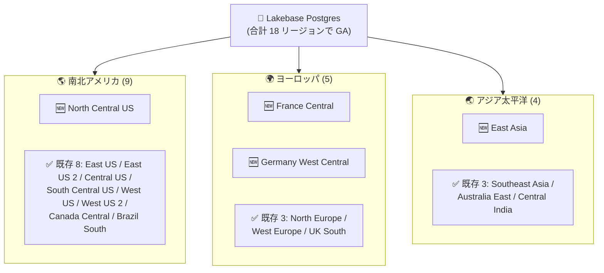

# Azure Databricks: Lakebase が 4 つの追加リージョンで一般提供開始 (GA)

**リリース日**: 2026-08-19

**サービス**: Azure Databricks

**機能**: Lakebase Postgres のリージョン拡大 (North Central US / France Central / Germany West Central / East Asia)

**ステータス**: Launched (GA)

[このアップデートのインフォグラフィックを見る](https://takech9203.github.io/azure-news-summary/20260819-databricks-lakebase-four-regions.html)

## 概要

Azure Databricks Lakebase が、新たに 4 つの Azure リージョン (North Central US、France Central、Germany West Central、East Asia) で一般提供 (GA) された。今回の拡大により、Lakebase の利用可能リージョンは合計 18 リージョンとなり、顧客はより多くのデプロイオプションと広範なリージョン可用性を得られる。

Lakebase は、Databricks Data Intelligence Platform に統合されたフルマネージドの PostgreSQL データベースサービスであり、Lakehouse にオンライントランザクション処理 (OLTP) 機能を提供する。ストレージとコンピュートを分離した次世代アーキテクチャにより、オートスケーリング、Scale-to-Zero、ブランチ (インスタントクローン)、インスタントリストア、Read Replica、Unity Catalog ネイティブ統合といった機能を備える。2026 年 3 月の GA 発表 (レポート: `2026-03-02-azure-databricks-lakebase.md`) 時点では 14 リージョンでの提供であったが、今回の拡大で欧州大陸 (フランス・ドイツ) と東アジアが新たにカバーされた。

なお、Lakebase プロジェクトは Databricks ワークスペースのリージョンに作成されるため、これらの新規リージョンにワークスペースを持つ顧客が Lakebase を利用できるようになった点が実務上のポイントである。

**アップデート前の課題**

- Lakebase は 14 リージョンでの提供にとどまり、France Central、Germany West Central、East Asia など一部の主要リージョンにワークスペースを持つ顧客は Lakebase を利用できなかった
- フランス・ドイツ国内へのデータ所在 (データレジデンシー) 要件を持つ顧客は、Lakebase の採用に際して国外リージョン (North Europe / West Europe など) を選択する必要があった
- 東アジア (香港) 近傍の低レイテンシー要件を持つ OLTP アプリケーションは Southeast Asia リージョンを利用するしかなかった

**アップデート後の改善**

- 利用可能リージョンが 18 に拡大し、米国 (North Central US 追加で 7 リージョン)、欧州 (France Central / Germany West Central 追加で 5 リージョン)、アジア太平洋 (East Asia 追加で 4 リージョン) のカバレッジが強化された
- フランス・ドイツのデータレジデンシー要件に対応したまま Lakebase を採用可能になった
- 東アジア近傍のユーザー・アプリケーションに対して低レイテンシーな OLTP を提供可能になった

## アーキテクチャ図



今回の拡大で 4 リージョン (🆕) が追加され、Lakebase の提供リージョンは 3 つの地理エリアで合計 18 となった。特に欧州大陸と東アジアのカバレッジ強化により、データレジデンシーとレイテンシーの選択肢が広がった。

## サービスアップデートの詳細

### 追加された 4 リージョン

| リージョン | 場所 | 意義 |
|-----------|------|------|
| `northcentralus` | North Central US (米国イリノイ州) | 米国内のデプロイオプションが 7 リージョンに拡大 |
| `francecentral` | France Central (フランス・パリ) | フランス国内のデータレジデンシー要件に対応 |
| `germanywestcentral` | Germany West Central (ドイツ・フランクフルト) | ドイツ国内のデータレジデンシー要件に対応 |
| `eastasia` | East Asia (香港) | 東アジア近傍の低レイテンシーアクセスを実現 |

### Lakebase の主要機能 (再掲)

1. **オートスケーリング**
   - ワークロードの需要に応じてコンピュートリソースを自動調整
   - 最大 64 CU までオートスケーリングに対応 (0.5 CU、以降 1 CU 刻み)

2. **Scale-to-Zero**
   - 非アクティブなコンピュートを自動サスペンドしコストを最小化
   - サスペンドまでの時間は最小 60 秒から最大 7 日まで設定可能 (新規プロジェクトの production ブランチはデフォルト 24 時間)

3. **ブランチ (インスタントクローン)**
   - 開発・テスト用の分離されたブランチを Copy-on-Write で瞬時に作成
   - プロジェクトあたり最大 500 ブランチ

4. **インスタントリストア (ポイントインタイムリストア)**
   - ヒストリーウィンドウ (2〜30 日、デフォルト 7 日) 内の任意の時点から新しいブランチを作成可能

5. **Read Replica / 高可用性**
   - ブランチあたり最大 6 つの Read Replica で読み取りをスケールアウト
   - 自動フェイルオーバーによる高可用性構成をサポート

6. **Unity Catalog 統合**
   - Lakebase データベースを Unity Catalog に登録し統合ガバナンスを実現
   - Synced Tables (Lakehouse データの低レイテンシー配信)、Lakebase Change Data Feed (Postgres 変更の Delta テーブル化、Public Preview) に対応

## 技術仕様

| 項目 | 詳細 |
|------|------|
| 利用可能リージョン数 | 18 (今回 4 リージョン追加) |
| PostgreSQL 互換バージョン | PostgreSQL 16 / 17 (デフォルト) / 18 |
| Compute Unit (CU) | 1 CU = 2 GB RAM |
| コンピュートサイズ | 0.5 CU 〜 112 CU (オートスケーリングは最大 64 CU、固定サイズは 112 CU まで) |
| Scale-to-Zero | 最小 60 秒 〜 最大 7 日 |
| データベースストレージクォータ | 16 TB / ブランチ |
| ブランチ数上限 | 500 / プロジェクト |
| 同時アクティブコンピュート数 | 20 / プロジェクト (デフォルトブランチは対象外) |
| ヒストリー保持期間 | 最大 30 日 |
| プロジェクト数上限 | 1,000 / ワークスペース |
| デプロイ先 | Databricks ワークスペースのリージョンに作成 (リージョン指定は不可) |

## 設定方法

### 前提条件

1. 対象リージョン (今回追加の 4 リージョンを含む 18 リージョンのいずれか) に Azure Databricks ワークスペースが存在すること
2. Lakebase プロジェクトはワークスペースのリージョンに作成され、リージョンの個別指定はできない

### Databricks CLI

```bash
# Lakebase プロジェクトを作成 (ワークスペースのリージョンに作成される)
databricks postgres create-project my-app \
  --json '{
    "spec": {
      "display_name": "My Application",
      "pg_version": 17
    }
  }'
```

### UI

1. ワークスペース右上のアプリスイッチャーから Lakebase App を開く
2. **New project** をクリック
3. 表示名、Postgres バージョンなどを設定して作成 (リージョンはワークスペースのリージョンに固定)

## メリット

### ビジネス面

- **データレジデンシー対応**: フランス (France Central)・ドイツ (Germany West Central) 国内にデータを保持したまま Lakebase を採用可能となり、GDPR や国内規制への対応が容易になる
- **デプロイオプションの拡大**: 既存の Databricks ワークスペースのリージョンを変更することなく、Lakebase を追加導入できる顧客が増加
- **エンドユーザー体験の向上**: 東アジア (香港) 近傍のアプリケーションに対する低レイテンシーな OLTP アクセスを実現

### 技術面

- **既存ワークスペースとの同一リージョン配置**: Lakebase はワークスペースのリージョンに作成されるため、Lakehouse (Delta Lake) と OLTP 間のデータ連携 (Synced Tables、Change Data Feed) を同一リージョン内で完結できる
- **機能は既存リージョンと同等**: PostgreSQL 16/17/18 対応、オートスケーリング (最大 64 CU)、ブランチ、インスタントリストアなどの機能が新規リージョンでも利用可能

## デメリット・制約事項

- **リージョンの個別指定は不可**: Lakebase プロジェクトはワークスペースのリージョンに作成されるため、ワークスペースと異なるリージョンへの配置はできない
- **周辺機能のリージョン差異に注意**: Microsoft Learn のリージョン別機能サポート表では、サーバーレス系機能 (Databricks Apps、Model Training など) のリージョン対応状況に差異があるため、Lakebase と組み合わせる機能ごとに対象リージョンでの提供状況を確認する必要がある
- **日本リージョンは未対応**: Japan East / Japan West は現時点で利用可能リージョンに含まれていない。日本国内のデータレジデンシー要件がある場合は引き続き利用できず、近傍では East Asia または Southeast Asia が選択肢となる

## ユースケース

### ユースケース 1: 欧州大陸のデータレジデンシー要件を持つ OLTP アプリケーション

**シナリオ**: ドイツの金融・製造業の顧客が、データをドイツ国内に保持する要件のもとで、Lakehouse 分析基盤と統合された低レイテンシーな業務アプリケーションを構築する。

**実装例**:

```
構成:
- Germany West Central の Databricks ワークスペースに Lakebase プロジェクトを作成
- production ブランチ: オートスケーリング (8 - 16 CU)、高可用性 (自動フェイルオーバー) 有効
- Unity Catalog に登録し、Synced Tables で Delta テーブルを Postgres に同期
```

**効果**: データをドイツ国内に保持したまま、Lakehouse データを低レイテンシーでアプリケーションに提供できる。従来必要だった国外リージョン (West Europe など) への配置が不要になる。

### ユースケース 2: 東アジア向けアプリケーションのレイテンシー改善

**シナリオ**: 香港・華南地域のユーザー向けアプリケーションのバックエンドを、従来の Southeast Asia (シンガポール) 配置から East Asia (香港) に移す。

**実装例**:

```
移行手順:
1. East Asia のワークスペースに新しい Lakebase プロジェクトを作成
2. pg_dump / pg_restore で既存データベースから移行
3. アプリケーションの接続文字列を切り替え
```

**効果**: ユーザー近傍への配置によりネットワークレイテンシーを削減し、リアルタイムアプリケーションの応答性を改善できる。

## 利用可能リージョン

今回の拡大後の Lakebase Postgres 利用可能リージョン (18 リージョン、🆕 は今回追加):

| 地域 | リージョン |
|------|-----------|
| 米国 | `eastus`, `eastus2`, `centralus`, `northcentralus` 🆕, `southcentralus`, `westus`, `westus2` |
| カナダ / 南米 | `canadacentral`, `brazilsouth` |
| ヨーロッパ | `northeurope`, `westeurope`, `uksouth`, `francecentral` 🆕, `germanywestcentral` 🆕 |
| アジア太平洋 | `southeastasia`, `eastasia` 🆕, `australiaeast`, `centralindia` |

## 関連サービス・機能

- **Unity Catalog**: Lakebase データベースの登録、データガバナンス、アクセス制御の統合管理
- **Synced Tables**: Unity Catalog テーブルを Lakebase Postgres に同期し、アプリケーションから低レイテンシーで読み取り
- **Lakebase Change Data Feed (Public Preview)**: Postgres テーブルの行レベル変更を Unity Catalog の Delta テーブルとして保存し、下流パイプラインや監査に活用
- **Databricks Apps**: Lakebase をマネージド Postgres バックエンドとしたインタラクティブアプリケーションの構築
- **Feature Store / Model Serving**: Lakebase を ML モデル向けの低レイテンシーなオンライン Feature Store として利用
- **Agent State 管理**: LangGraph や OpenAI Agents SDK で構築したエージェントの短期・長期メモリを Lakebase に永続化
- **Azure Database for PostgreSQL**: Azure ネイティブのマネージド PostgreSQL。Lakebase は Databricks プラットフォーム統合と Copy-on-Write ブランチ機能で差別化

## 参考リンク

- [インフォグラフィック](https://takech9203.github.io/azure-news-summary/20260819-databricks-lakebase-four-regions.html)
- [公式アップデート情報](https://azure.microsoft.com/updates?id=569684)
- [Microsoft Learn - Lakebase Postgres](https://learn.microsoft.com/en-us/azure/databricks/oltp/)
- [Microsoft Learn - Manage projects (Region availability)](https://learn.microsoft.com/en-us/azure/databricks/oltp/projects/manage-projects#region-availability)
- [Microsoft Learn - Features with limited regional availability](https://learn.microsoft.com/en-us/azure/databricks/resources/feature-region-support)
- [過去レポート - Lakebase Postgres GA (2026-03-02)](./2026-03-02-azure-databricks-lakebase.md)

## まとめ

Azure Databricks Lakebase の 4 リージョン追加 (North Central US、France Central、Germany West Central、East Asia) は、2026 年 3 月の GA 以降で初の大きなリージョン拡大であり、提供リージョンは合計 18 となった。特にフランス・ドイツのデータレジデンシー要件への対応と、東アジア近傍の低レイテンシー OLTP の実現は、欧州・アジアの顧客にとって Lakebase 採用の障壁を大きく下げるものである。

Solutions Architect としての推奨アクションは以下の通りである。

1. **リージョン制約で見送っていた案件の再評価**: France Central / Germany West Central / East Asia / North Central US のワークスペースを利用中で Lakebase の採用を見送っていた場合、再評価を開始する
2. **データレジデンシー要件の確認**: フランス・ドイツ国内へのデータ保持要件がある案件では、国外リージョンへの回避策が不要になったことを設計に反映する
3. **周辺機能のリージョン対応確認**: Databricks Apps や Model Serving など組み合わせる機能ごとに、対象リージョンでの提供状況を Microsoft Learn のリージョン別機能サポート表で確認する
4. **日本リージョンの動向注視**: Japan East / Japan West は未対応のため、日本国内要件がある場合は今後のリージョン拡大を注視する

---

**タグ**: #AzureDatabricks #Lakebase #PostgreSQL #OLTP #リージョン拡大 #GA #DataResidency #AI #Analytics
