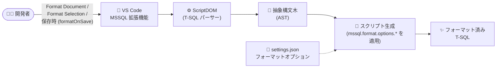

# Azure SQL Database: MSSQL 拡張機能の SQL Formatter (Public Preview)

**リリース日**: 2026-08-19

**サービス**: Azure SQL Database (MSSQL extension for Visual Studio Code)

**機能**: SQL Formatter (Public Preview)

**ステータス**: In preview

[このアップデートのインフォグラフィックを見る](https://takech9203.github.io/azure-news-summary/20260819-mssql-extension-sql-formatter.html)

## 概要

Visual Studio Code の MSSQL 拡張機能に組み込みの SQL Formatter がパブリックプレビューとして提供された。エディタ内で T-SQL スクリプトを直接フォーマットでき、よりクリーンで一貫性のある読みやすいコードを維持できる。今回のパブリックプレビューでは、コーディングスタイルに合わせられるカスタマイズ可能なフォーマットオプションが大幅に拡充され、開発の効率化を支援する。

このフォーマッタは、T-SQL を解析して抽象構文木 (AST) ベースでスクリプトを生成するオープンソースの .NET ライブラリ [ScriptDOM](https://github.com/microsoft/sqlscriptdom) 上に構築されている。オンデマンドのフォーマット (ドキュメント全体または選択範囲) に加え、VS Code 標準の `editor.formatOnSave` 設定による保存時の自動フォーマットにも対応する。

MSSQL 拡張機能は Azure SQL (Azure SQL Database、Azure SQL Managed Instance、Azure VM 上の SQL Server)、Microsoft Fabric の SQL database、SQL Server を対象とした開発をサポートしており、SQL Formatter はこれらすべての接続先で利用できる。

**アップデート前の課題**

- MSSQL 拡張機能の従来のフォーマッタ設定は 5 項目 (キーワードの大文字/小文字、データ型の大文字/小文字、カンマ位置、列定義の整列、SELECT 参照の改行) に限られていた
- チームのコーディング規約 (インデント、改行位置、複数行化など) に合わせた細かいスタイル調整ができなかった

**アップデート後の改善**

- ScriptDOM ベースの新しいプレビューフォーマッタが既定で有効になり、`mssql.format.options.*` 名前空間で整列 (Alignment)、インデント、複数行化 (Multiline)、改行 (New line)、スペーシングなど 30 以上の詳細設定が追加された
- ドキュメント全体・選択範囲のオンデマンドフォーマット、保存時の自動フォーマット (`editor.formatOnSave`) に対応
- T-SQL の解析に使用する SQL バージョン (`sqlVersion`、既定 `sql170`) やエンジンタイプ (`sqlEngineType`: `all` / `standalone` / `sqlAzure`) を指定可能
- 従来の 5 つのフォーマッタ設定は、プレビューフォーマッタ有効時もそのまま利用可能

## アーキテクチャ図



SQL Formatter は ScriptDOM で T-SQL を抽象構文木に解析し、ユーザー設定のフォーマットオプションを適用して整形済みスクリプトを生成する。

## サービスアップデートの詳細

### 主要機能

1. **オンデマンドフォーマット**
   - コンテキストメニュー、コマンドパレット、キーボードショートカット (Format Document: Shift+Alt+F / Shift+Option+F、Format Selection: Ctrl+K Ctrl+F / Cmd+K Cmd+F) から実行
   - ドキュメント全体または選択範囲のみのフォーマットに対応

2. **保存時の自動フォーマット**
   - VS Code 標準の `"[sql]": { "editor.formatOnSave": true }` 設定でファイル保存時に自動フォーマット

3. **カスタマイズ可能なフォーマットオプション (プレビューフォーマッタ)**
   - `mssql.format.options.*` 名前空間で General / Alignment / Paths / Formatting / Indentation / Multiline / New line / Spacing のカテゴリごとに詳細設定が可能
   - 例: キーワードの大文字・小文字・パスカルケース、`FROM` / `WHERE` / `JOIN` などの句の前の改行、`SELECT` 列や `WHERE` 述語の複数行化、コメントの保持、文の後の空行数 (0〜5) など

4. **パースエラー通知**
   - `mssql.format.showParseErrorNotification` (既定 `true`) により、T-SQL を完全に解析できない場合に通知を表示

### 代表的な設定オプション

| 設定 | 型 | 既定値 | 説明 |
|------|-----|--------|------|
| `mssql.format.enablePreviewFormatter` | bool | `true` | プレビューフォーマッタの使用 |
| `mssql.format.options.sqlVersion` | enum | `sql170` | 解析・生成に使用する T-SQL バージョン |
| `mssql.format.options.sqlEngineType` | enum | `all` | エンジンタイプ (`all` / `standalone` / `sqlAzure`) |
| `mssql.format.options.keywordCasing` | enum | `uppercase` | キーワードの大文字/小文字/パスカルケース |
| `mssql.format.options.preserveComments` | bool | `true` | フォーマット時にコメントを保持 |
| `mssql.format.options.numNewlinesAfterStatement` | int | `1` | 文の後の改行数 (0〜5) |
| `mssql.format.options.alignClauseBodies` | bool | `true` | `FROM` / `WHERE` / `GROUP BY` などの句本体の整列 |
| `mssql.format.options.multilineSelectElementsList` | bool | `true` | `SELECT` 列の複数行化 |
| `mssql.format.options.newLineBeforeWhereClause` | bool | `true` | `WHERE` 句の前で改行 |

## 技術仕様

| 項目 | 詳細 |
|------|------|
| 提供形態 | MSSQL extension for Visual Studio Code の組み込み機能 |
| フォーマットエンジン | ScriptDOM (オープンソースの .NET T-SQL パーサーライブラリ) |
| 対応データベース | Azure SQL Database、Azure SQL Managed Instance、Azure VM 上の SQL Server、SQL database in Microsoft Fabric、SQL Server |
| 対応 OS | Windows 10/11 (x64, Arm64)、macOS (Intel / Apple Silicon)、Linux (x64, Arm64) |
| 既定の状態 | プレビューフォーマッタは既定で有効 (`mssql.format.enablePreviewFormatter: true`) |
| ステータス | Public Preview (2026 年 8 月) |

## 設定方法

### 前提条件

1. Visual Studio Code に MSSQL 拡張機能 (SQL Server (mssql)) をインストールする

### VS Code settings.json での設定例

```json
{
  "mssql.format.options.keywordCasing": "lowercase",
  "mssql.format.options.alignClauseBodies": false,
  "mssql.format.options.numNewlinesAfterStatement": 2,
  "[sql]": {
    "editor.formatOnSave": true,
    "editor.defaultFormatter": "ms-mssql.mssql"
  }
}
```

Settings UI では **Mssql > Format** で検索するとオプションの一覧を確認できる。既定のフォーマッタに設定するには **Configure Default Formatter...** から **SQL Server (mssql)** を選択する。

## メリット

### ビジネス面

- チーム全体で一貫した T-SQL コーディングスタイルを維持でき、コードレビューの効率が向上する
- フォーマット作業の自動化により開発者の生産性が向上する

### 技術面

- ScriptDOM による AST ベースの解析で、正規表現ベースのフォーマッタより構文的に正確な整形が可能
- 30 以上の詳細オプションでチームのコーディング規約に合わせた柔軟なカスタマイズが可能
- SQL バージョンやエンジンタイプ (SQL Azure / スタンドアロン) を指定した解析に対応
- 保存時自動フォーマットにより、フォーマット漏れを防止できる

## デメリット・制約事項

- 本機能はプレビュー段階であり、今後仕様が変更される可能性がある
- T-SQL を完全に解析できないスクリプトはフォーマットできない場合がある (その際は通知が表示される)

## ユースケース

### ユースケース 1: チームでの T-SQL コーディング規約の統一

**シナリオ**: 複数の開発者が同じリポジトリで Azure SQL Database 向けのストアドプロシージャやマイグレーションスクリプトを開発しており、スタイルの不統一によりコードレビューに時間がかかっている。

**実装例**: ワークスペースの `.vscode/settings.json` にフォーマットオプションを定義してリポジトリにコミットする。

```json
{
  "mssql.format.options.keywordCasing": "uppercase",
  "mssql.format.options.multilineSelectElementsList": true,
  "[sql]": {
    "editor.formatOnSave": true,
    "editor.defaultFormatter": "ms-mssql.mssql"
  }
}
```

**効果**: チーム全員が保存時に同一ルールで自動フォーマットされ、スタイル差分のないクリーンなプルリクエストを実現できる。

## 関連サービス・機能

- **Azure SQL Database / Azure SQL Managed Instance**: MSSQL 拡張機能の主要な接続先。SQL Formatter はこれらに対する開発スクリプトの整形に利用できる
- **SQL database in Microsoft Fabric**: MSSQL 拡張機能がサポートする接続先の 1 つ
- **GitHub Copilot integration (MSSQL 拡張機能)**: 自然言語チャットやエージェントモードによる AI 支援 SQL 開発。生成されたコードの整形にフォーマッタを併用できる
- **ScriptDOM**: フォーマッタの基盤となるオープンソースの T-SQL パーサーライブラリ

## 参考リンク

- [インフォグラフィック](https://takech9203.github.io/azure-news-summary/20260819-mssql-extension-sql-formatter.html)
- [公式アップデート情報](https://azure.microsoft.com/updates?id=569155)
- [Format T-SQL in the MSSQL Extension for Visual Studio Code (Microsoft Learn)](https://learn.microsoft.com/sql/tools/visual-studio-code-extensions/mssql/mssql-sql-formatter)
- [MSSQL extension for Visual Studio Code の概要 (Microsoft Learn)](https://learn.microsoft.com/sql/tools/visual-studio-code-extensions/mssql/mssql-extension-visual-studio-code)
- [ScriptDOM (GitHub)](https://github.com/microsoft/sqlscriptdom)

## まとめ

MSSQL extension for Visual Studio Code に ScriptDOM ベースの SQL Formatter がパブリックプレビューとして追加された。従来 5 項目に限られていたフォーマット設定が 30 以上の詳細オプションに拡充され、オンデマンド・保存時の自動フォーマットにも対応する。Azure SQL Database をはじめとする SQL 系データベースの開発チームは、ワークスペース設定でフォーマットルールを共有することでコーディングスタイルの統一とレビュー効率の向上が期待できる。プレビュー機能は既定で有効のため、まずは既定設定で試し、チームの規約に合わせてオプションを調整することを推奨する。

---

**タグ**: Azure SQL Database, MSSQL extension, Visual Studio Code, SQL Formatter, T-SQL, ScriptDOM, Public Preview, Databases, Developer Tools
