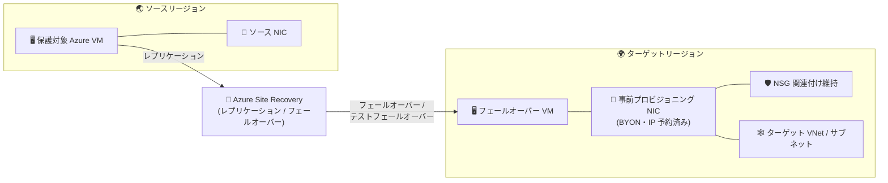

# Azure Site Recovery: BYON (Bring Your Own NIC) の一般提供開始

**リリース日**: 2026-08-19

**サービス**: Azure Site Recovery

**機能**: BYON (Bring Your Own NIC) - 事前プロビジョニング済み NIC のフェールオーバーでの利用

**ステータス**: Launched (GA)

[このアップデートのインフォグラフィックを見る](https://takech9203.github.io/azure-news-summary/20260819-site-recovery-byon.html)

## 概要

Azure Site Recovery (ASR) の Azure-to-Azure シナリオにおいて、ターゲットリージョンに事前作成 (プロビジョニング) しておいた既存のネットワークインターフェイスカード (NIC) を、テストフェールオーバーおよびフェールオーバー時にターゲット VM へアタッチできる BYON (Bring Your Own NIC) 機能が一般提供 (GA) となりました。

従来、ASR はディザスターリカバリー (DR) 操作の際に常に新しい NIC を作成していました。BYON により、ターゲット環境で事前に準備した NIC を選択できるようになり、準備済みのネットワーク構成の保持、ネットワークセキュリティグループ (NSG) の関連付けの維持、ターゲットリージョンでの IP アドレスの予約が可能になります。フェールオーバー用とテストフェールオーバー用の NIC は、それぞれ独立して選択できます。

**アップデート前の課題**

- フェールオーバー / テストフェールオーバーのたびに ASR が新しい NIC を作成するため、事前に準備したネットワーク構成 (NSG の関連付け、IP アドレスの予約など) をそのまま引き継ぐことができなかった
- ターゲットリージョンで特定の IP アドレスや NIC 設定を確実に使用したい場合でも、DR 操作時の NIC 新規作成の動作を回避できなかった

**アップデート後の改善**

- ターゲットリージョンに事前作成した既存 NIC を、フェールオーバー / テストフェールオーバー時にそのままターゲット VM へアタッチできるようになった
- 準備済みのネットワーク構成・NSG 関連付けを維持し、IP アドレスをターゲットリージョンで予約したまま DR を実行できるようになった
- フェールオーバー用とテストフェールオーバー用で、それぞれ別の既存 NIC を独立して指定できる
- NIC を選択しない場合は、従来どおり ASR がリカバリー時に新しい NIC を作成する (後方互換性を維持)

## アーキテクチャ図

ソースリージョンの保護対象 VM を ASR でレプリケーションし、フェールオーバー時にはターゲットリージョンに事前作成しておいた NIC (BYON) をターゲット VM にアタッチします。これにより NSG の関連付けや予約済み IP アドレスなどの準備済みネットワーク構成が維持されます。

## サービスアップデートの詳細

### 主要機能

1. **事前プロビジョニング済み NIC の利用**
   - ターゲットリージョンに事前作成した既存 NIC を、テストフェールオーバーおよびフェールオーバーでターゲット VM にアタッチ可能
   - 準備済みのネットワーク構成の保持、NSG 関連付けの維持、ターゲットリージョンでの IP アドレス予約に有効

2. **フェールオーバーとテストフェールオーバーで独立した NIC 選択**
   - フェールオーバー用とテストフェールオーバー用の既存 NIC をそれぞれ独立して選択可能
   - テスト環境と本番 DR 環境で異なるネットワーク構成を事前準備できる

3. **後方互換性のあるオプトイン動作**
   - 既存 NIC を選択しない場合は、従来どおり ASR がリカバリー時に新しい NIC を作成
   - 既存の保護構成に影響を与えずに段階的に導入可能

### フェールオーバー VM で構成可能なネットワークリソース

Microsoft Learn の「Customize networking configurations for a failover VM」ドキュメントによると、フェールオーバー VM に対して以下のリソースを事前指定できます。

| リソース | 説明 |
|------|------|
| ネットワークインターフェイス (NIC) | 事前作成した NIC をターゲット VM にアタッチ (本アップデートで GA) |
| 内部ロードバランサー | 事前作成したバックエンドプール / フロントエンド構成を持つ ILB に接続 |
| パブリック IP | 事前作成したパブリック IP を割り当て |
| セカンダリ IP | セカンダリ IP 構成を保持 |
| ネットワークセキュリティグループ | サブネット用・NIC 用の両方の NSG を指定可能 |

## 設定方法

### 前提条件

1. 対象シナリオは Azure-to-Azure (Azure リージョン間) のディザスターリカバリーであること
2. 利用したい NIC がターゲット環境 (ターゲットリージョン) に事前に存在していること
3. リカバリー側の構成を事前に計画し、ネットワークリソースを事前作成しておくこと

### Azure Portal

1. Recovery Services コンテナーで **Replicated Items (レプリケートされたアイテム)** に移動する
2. 対象の Azure VM を選択する
3. **Network (ネットワーク)** を選択し、**Edit (編集)** を選択する
4. テストフェールオーバー用の仮想ネットワークを選択する
5. 構成したい NIC のタブを選択し、テストフェールオーバーおよびフェールオーバーの場所に対応する事前作成済みリソース (NIC、サブネットなど) を選択する
6. **OK** を選択する

以降、Site Recovery はこの設定に従い、フェールオーバー時に VM が選択したリソースへ対応する NIC 経由で接続されるようにします。

**トラブルシューティングの補足** (公式ドキュメントより):

- ネットワークリソースのターゲットフィールドは、ソース VM に対応する入力がある場合にのみ有効になる
- ドロップダウンリストには、フェールオーバーの信頼性を維持できるリソースのみが表示されるようフィルターが適用される

## メリット

### ビジネス面

- DR 発動時のネットワーク構成を事前に確定・検証でき、フェールオーバー後の接続性に関する不確実性を低減できる
- テストフェールオーバーと本番フェールオーバーで独立した構成を持てるため、DR 訓練を本番構成に影響なく実施しやすい

### 技術面

- ターゲットリージョンで IP アドレスを予約したまま DR を実行できるため、IP 依存の構成 (ファイアウォールルール、許可リストなど) を維持しやすい
- NSG の関連付けなど、事前に準備したネットワークセキュリティ構成をフェールオーバー後も保持できる
- NIC を選択しなければ従来の動作 (新規 NIC 作成) が維持されるため、既存の運用に影響しない

## デメリット・制約事項

- 対象は Azure-to-Azure シナリオのみ (本アップデートで確認できた範囲)
- 利用する NIC はターゲット環境に事前作成しておく必要があり、事前準備と管理の手間が発生する
- 保護対象 VM ごとにネットワーク設定を更新し、対象のサブネットと NIC を明示的に選択する必要がある

## ユースケース

### ユースケース 1: IP アドレス固定が必要な基幹システムの DR

**シナリオ**: ファイアウォールや外部システムの許可リストで IP アドレスを固定している基幹システムを、リージョン障害に備えて別リージョンに保護したい。フェールオーバー後も事前に予約した IP アドレスと NSG 構成をそのまま利用したい。

**実装方法**: ターゲットリージョンに静的 IP を設定した NIC を事前作成し、NSG を関連付けておく。保護対象 VM のネットワーク設定でこの NIC をフェールオーバー用に選択する。

**効果**: フェールオーバー後の VM が事前予約済みの IP アドレス・NSG 構成で起動するため、依存システム側の設定変更なしに業務を再開できる。

### ユースケース 2: 本番影響のない DR 訓練環境の分離

**シナリオ**: 定期的な DR 訓練 (テストフェールオーバー) を、本番フェールオーバー用とは別のネットワーク構成で実施したい。

**実装方法**: テストフェールオーバー用とフェールオーバー用にそれぞれ別の NIC を事前作成し、保護対象 VM のネットワーク設定で独立して選択する。

**効果**: 訓練用ネットワークと本番 DR 用ネットワークを分離しつつ、いずれも事前検証済みの構成で実行できる。

## 料金

Azure Site Recovery は保護対象インスタンス数 (VM / 物理サーバー) に基づいて課金されます。

| 項目 | 料金 |
|------|------|
| 保護インスタンス (最初の 31 日間) | 無料 |
| 保護インスタンス (32 日目以降) | 保護インスタンスあたりの月額課金 (料金はリージョンにより異なるため[料金ページ](https://azure.microsoft.com/pricing/details/site-recovery/)を参照) |

- Azure リージョン間 (Azure-to-Azure) の保護は「Azure への復旧」と同じレートで課金されます
- 課金は月間の 1 日平均保護インスタンス数で計算されます
- 無料期間中でも、Azure Storage、ストレージトランザクション、送信データ転送 (egress)、フェールオーバー時のコンピューティング料金は別途発生します
- BYON で事前作成する NIC 自体に加え、予約するパブリック IP アドレスなどのネットワークリソースには通常の料金が適用される点に留意してください

無料枠: 保護対象として新規追加された各インスタンスは最初の 31 日間無料

## 関連サービス・機能

- **Azure Virtual Network / NIC**: 事前プロビジョニングする NIC・サブネット・IP アドレスの構成基盤。ネットワークマッピングによりソース / ターゲットの VNet を対応付ける
- **ネットワークセキュリティグループ (NSG)**: 事前作成した NIC に関連付けておくことで、フェールオーバー後もセキュリティ構成を維持できる
- **Azure Load Balancer / パブリック IP**: NIC と同様に、フェールオーバー VM 用に事前作成したリソースを指定可能
- **Recovery Services コンテナー**: ASR のレプリケーション・フェールオーバー設定を管理するコンテナー

## 参考リンク

- [インフォグラフィック](https://takech9203.github.io/azure-news-summary/20260819-site-recovery-byon.html)
- [公式アップデート情報](https://azure.microsoft.com/updates?id=569515)
- [New feature updates in Azure Site Recovery (BYON の発表)](https://learn.microsoft.com/en-us/azure/site-recovery/feature-updates-whats-new)
- [Customize networking configurations for a failover VM](https://learn.microsoft.com/en-us/azure/site-recovery/azure-to-azure-customize-networking)
- [Map virtual networks between two regions in Azure Site Recovery](https://learn.microsoft.com/en-us/azure/site-recovery/azure-to-azure-network-mapping)
- [About networking in Azure VM disaster recovery](https://learn.microsoft.com/en-us/azure/site-recovery/azure-to-azure-about-networking)
- [料金ページ](https://azure.microsoft.com/pricing/details/site-recovery/)

## まとめ

BYON (Bring Your Own NIC) の GA により、Azure-to-Azure の DR シナリオで、ターゲットリージョンに事前作成した NIC をフェールオーバー / テストフェールオーバー時にそのまま利用できるようになりました。従来は DR 操作のたびに NIC が新規作成されていたため、IP アドレスの固定や NSG 構成の維持が求められるワークロードでは運用上の考慮が必要でしたが、本機能により事前検証済みのネットワーク構成で確実にフェールオーバーできるようになります。

IP 依存の構成を持つ基幹システムを ASR で保護している、または保護を検討している場合は、ターゲットリージョンに NIC を事前作成し、保護対象 VM のネットワーク設定 (Network > Edit) で BYON を構成することを推奨します。NIC を選択しない場合は従来の動作が維持されるため、既存環境への影響なく段階的に導入できます。

---

**タグ**: Azure Site Recovery, BYON, NIC, ディザスターリカバリー, フェールオーバー, Azure-to-Azure, ネットワーク, GA
