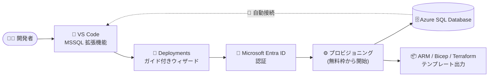

# Azure SQL Database: MSSQL 拡張機能からのデータベースプロビジョニングが一般提供 (GA)

**リリース日**: 2026-08-19

**サービス**: Azure SQL Database

**機能**: Visual Studio Code 用 MSSQL 拡張機能における Azure SQL Database プロビジョニング

**ステータス**: Launched (GA)

[このアップデートのインフォグラフィックを見る](https://takech9203.github.io/azure-news-summary/20260819-sql-database-provisioning-mssql-extension.html)

## 概要

Visual Studio Code 用 MSSQL 拡張機能の「Azure SQL Database プロビジョニング」機能が一般提供 (GA) となりました。開発者はエディタを離れることなく、フルマネージドなクラウドデータベース (Azure SQL Database) を無料で作成し、そのまま接続できます。MSSQL 拡張機能 v1.45 のリリースの一部として発表されました。

プロビジョニングは MSSQL 拡張機能の「Deployments」ページのガイド付きウィザードから実行します。Microsoft Entra ID で Azure アカウントに認証し、サブスクリプション・リソースグループ・論理サーバー・データベースを 1 画面で構成すると、数分でデータベースが作成され、接続プロファイルへの追加と自動接続まで完了します。プロビジョニングされるのは Azure SQL Database 無料オファー (毎月 100,000 vCore 秒 + 32 GB データストレージ + 32 GB バックアップストレージ) のデータベースです。

GA に伴い、ARM (Azure Resource Manager)・Bicep・Terraform のすぐに使える Infrastructure-as-Code (IaC) テンプレートのエクスポートに対応しました。エディタで作成した構成をチームや他環境で再現可能なデプロイとして展開できます。また、デプロイ完了画面から接続文字列やマイグレーションコマンドをすぐにコピーできるなど、開始を高速化するオプションも追加されています。

**アップデート前の課題**

- Azure SQL Database の作成には Azure portal など、エディタの外のツールに切り替える必要があり、開発フローが中断されていた
- 作成したデータベースへの接続情報を手動で設定する必要があった

**アップデート後の改善**

- VS Code の MSSQL 拡張機能内のガイド付きウィザードだけで、無料枠の Azure SQL Database の作成から自動接続 (保存済みプロファイルへの追加) までが完結
- ARM / Bicep / Terraform テンプレートのエクスポートにより、同じ構成を再現可能な IaC デプロイとして横展開できる
- デプロイ完了画面から接続文字列・マイグレーションコマンドを即座にコピー可能

## アーキテクチャ図

開発者は VS Code の Deployments ウィザードから Microsoft Entra ID で認証し、Azure SQL Database を作成します。プロビジョニング完了と同時にエディタへ自動接続され、同じ構成を IaC テンプレートとして出力できます。

## サービスアップデートの詳細

### 主要機能

1. **エディタ内でのデータベースプロビジョニング**
   - MSSQL 拡張機能の「Deployments」ビューから「Create an Azure SQL Database」を選択し、VS Code 内で Azure SQL Database を作成
   - サブスクリプション、リソースグループ、論理サーバー、データベース名を 1 ページのウィザードで構成 (プロファイル名、接続グループ、タグなどのオプション設定も可能)

2. **無料枠 (Free Tier) からの開始**
   - プロビジョニング体験は Azure SQL Database 無料オファーを利用し、コストゼロでクラウドデータベースを作成・接続可能
   - 月間無料枠に到達した際の動作を「翌月まで自動一時停止」または「標準のサーバーレス料金で継続」から選択可能

3. **Microsoft Entra ID 認証と自動接続**
   - Azure アカウントによる永続的なサインイン (persistent sign-in) に対応
   - プロビジョニング完了と同時に新しいデータベースへ自動接続し、接続を保存済みプロファイルに追加

4. **ARM / Bicep / Terraform テンプレート (GA での追加)**
   - すぐに使える IaC テンプレートを ARM、Bicep、Terraform 形式でエクスポートし、チームや環境間で再現可能なデプロイを実現

5. **デプロイ後のワークフロー連携**
   - 完了画面から接続文字列やマイグレーションコマンドをコピー可能
   - Schema Designer (GitHub Copilot 連携による自然言語でのスキーマ設計)、Data API builder (REST / GraphQL / MCP エンドポイント生成)、SQL Notebooks へシームレスに継続

## 技術仕様

| 項目 | 詳細 |
|------|------|
| 対象拡張機能 | MSSQL extension for Visual Studio Code (v1.45 で GA) |
| 対象サービス | Azure SQL Database のみ (SQL Managed Instance、SQL Server on Azure VM は非対応) |
| 認証方式 | Microsoft Entra ID (プロビジョニングに必須) |
| プロビジョニング対象ティア | 無料枠 (Free Tier) のみ。コンピュート・ストレージ・価格オプションのカスタマイズは不可 |
| 無料枠の内容 | 月間 100,000 vCore 秒 (サーバーレス) + データ 32 GB + バックアップ 32 GB / データベース |
| 無料枠の上限 | 1 サブスクリプションあたり最大 10 個の General Purpose データベース |
| IaC テンプレート | ARM / Bicep / Terraform 形式でエクスポート可能 |
| 拡張機能の対応 OS | Windows 10/11 (x64, Arm64)、macOS (Intel, Apple Silicon)、Linux (x64, Arm64) |

## 設定方法

### 前提条件

1. Visual Studio Code に MSSQL 拡張機能 (SQL Server (mssql)) をインストールしていること
2. 有効な Azure アカウントを持っていること
3. 対象のサブスクリプション・リソースグループでリソースを作成する権限を持っていること

### Visual Studio Code での手順

1. MSSQL 拡張機能のアクティビティバーで「**Deployments**」ビューを選択
2. 「**Create an Azure SQL Database**」を選択
3. プロンプトに従い Azure アカウントでサインイン (Microsoft Entra ID)
4. 1 ページのウィザードで以下を構成:
   - **Subscription**: データベースを所有するサブスクリプション
   - **Resource group**: 既存のリソースグループを選択、または新規作成
   - **Server**: 既存の論理サーバーを選択、または新規作成 (新規の場合は管理者サインイン情報を入力)
   - **Database name**: データベース名
   - **Optional Settings**: プロファイル名、接続グループ、タグなど
5. 無料枠の月間上限に達した際の動作を選択:
   - **Auto-pause**: 翌月まで自動一時停止
   - **Continue at standard serverless rates**: 標準のサーバーレス料金で継続
6. 「**Create Database**」を選択。作成完了後、接続が保存済みプロファイルに追加され自動接続される

## メリット

### ビジネス面

- プロトタイピング・PoC・開発/テスト用のクラウドデータベースを完全無料で開始でき、検証コストを削減できる
- エディタからデプロイ完了・接続までが数分で完結するため、開発の立ち上がりが高速化する
- ARM / Bicep / Terraform テンプレートにより、個人の試行から組織的な IaC ベースの展開へスムーズに移行できる

### 技術面

- コンテキストスイッチ (VS Code から Azure portal / CLI への切り替え) が不要になり、開発フローが途切れない
- プロビジョニング直後に Schema Designer、Data API builder、SQL Notebooks と組み合わせて、データベースからバックエンド構築までを VS Code 内で完結できる
- 無料枠超過時の動作 (自動一時停止 / 課金継続) を作成時に明示的に選択でき、予期しない課金を防止できる

## デメリット・制約事項

- 現時点で対応するのは Azure SQL Database のみ。Azure SQL Managed Instance と SQL Server on Azure Virtual Machines は非対応
- この機能でプロビジョニングできるのは無料枠のみで、コンピュート・ストレージ・価格オプションのカスタマイズは不可。有料ティアや高度な設定が必要な場合は Azure portal からデプロイする必要がある
- プロビジョニングには Microsoft Entra ID 認証が必須
- 無料オファー自体の制約が適用される (自動一時停止オプション有効時は最大 4 vCore / 最大 32 GB、長期バックアップ保持は利用不可、PITR は 7 日間、エラスティックプール / フェールオーバーグループへの参加不可など)
- 「課金継続」オプションを選択した後は「自動一時停止」オプションに戻せない

## ユースケース

### ユースケース 1: 新規アプリ開発の迅速なプロトタイピング

**シナリオ**: 開発者が新しい Web アプリのバックエンドとして Azure SQL Database を試したいが、ポータルでのセットアップに時間をかけたくない。

**実装例**: VS Code の Deployments ビューからウィザードで無料枠データベースを作成し、自動接続後に Schema Designer + GitHub Copilot で自然言語からスキーマを生成。Data API builder で REST / GraphQL / MCP エンドポイントを生成してバックエンドを構築。

**効果**: エディタを離れずに、コストゼロでデータベースから API までのエンドツーエンドの開発環境を数分で構築できる。

### ユースケース 2: 検証済み構成の IaC 化とチーム展開

**シナリオ**: 個人で検証したデータベース構成を、チームの開発・ステージング環境へ再現性のある形で展開したい。

**実装例**: プロビジョニング後に ARM / Bicep / Terraform テンプレートをエクスポートし、リポジトリに格納して CI/CD パイプラインからデプロイする。

**効果**: 手動構築による環境差異を排除し、エディタでの試行から本格的な IaC 運用への移行が容易になる。

## 料金

MSSQL 拡張機能からのプロビジョニングは Azure SQL Database 無料オファーを利用するため、無料枠の範囲内であれば **費用はかかりません**。

| 項目 | 内容 |
|------|------|
| コンピュート | 月間 100,000 vCore 秒 (サーバーレス) / データベース — 無料 |
| データストレージ | 最大 32 GB / データベース — 無料 |
| バックアップストレージ | 32 GB / データベース — 無料 (ローカル冗長) |
| 対象データベース数 | 1 サブスクリプションあたり最大 10 個の General Purpose データベース |
| 無料枠超過時 | 「翌月まで自動一時停止」または「標準の General Purpose サーバーレス料金で継続」を選択 |

無料枠: 上記の無料オファーはサブスクリプションの種類を問わず利用でき、無料枠はサブスクリプションが有効な限り毎月 (暦月の開始時に) 更新されます。超過分の料金は [Azure SQL Database 料金ページ](https://azure.microsoft.com/pricing/details/azure-sql-database/) を参照してください。

## 関連サービス・機能

- **Azure SQL Database (サーバーレス)**: 無料オファーのデータベースは General Purpose サーバーレスとして稼働し、無料枠超過時はサーバーレス料金体系が適用される
- **Microsoft Entra ID**: プロビジョニング時の Azure 認証に使用 (必須)
- **Schema Designer / GitHub Copilot 連携**: プロビジョニング後、自然言語でのスキーマ設計と ORM スクリプト生成に利用可能
- **Data API builder**: 同じ Azure SQL 接続から REST / GraphQL / MCP エンドポイントを生成
- **ARM / Bicep / Terraform**: エクスポートされる IaC テンプレートの形式。再現可能なデプロイに利用
- **SQL database in Microsoft Fabric**: MSSQL 拡張機能は Fabric ワークスペースの参照と SQL データベースのプロビジョニングにも対応 (別機能)

## 参考リンク

- [インフォグラフィック](https://takech9203.github.io/azure-news-summary/20260819-sql-database-provisioning-mssql-extension.html)
- [公式アップデート情報](https://azure.microsoft.com/updates?id=569160)
- [Azure SQL Dev Corner Blog: MSSQL Extension for VS Code v1.45](https://devblogs.microsoft.com/azure-sql/vscode-mssql-august2026/)
- [Microsoft Learn: Create an Azure SQL Database (Free Tier) in Visual Studio Code](https://learn.microsoft.com/sql/tools/visual-studio-code-extensions/mssql/mssql-azure-integration)
- [Microsoft Learn: MSSQL extension for Visual Studio Code](https://learn.microsoft.com/sql/tools/visual-studio-code-extensions/mssql/mssql-extension-visual-studio-code)
- [Microsoft Learn: Azure SQL Database 無料オファー](https://learn.microsoft.com/azure/azure-sql/database/free-offer)
- [料金ページ](https://azure.microsoft.com/pricing/details/azure-sql-database/)

## まとめ

VS Code の MSSQL 拡張機能から Azure SQL Database を無料で作成・自動接続できるプロビジョニング機能が GA となり、ARM / Bicep / Terraform テンプレートのエクスポートにも対応しました。開発者はエディタを離れずにクラウドデータベースの作成からスキーマ設計、API 生成までを完結でき、検証した構成を IaC としてチームに展開できます。プロトタイピングや開発/テスト環境の標準的な入口として、開発チームへの周知を推奨します。本番用途や有料ティアが必要な場合は Azure portal からのデプロイを検討してください。

---

**タグ**: Azure SQL Database, MSSQL Extension, Visual Studio Code, GA, Databases, IaC, Bicep, Terraform, 無料オファー
