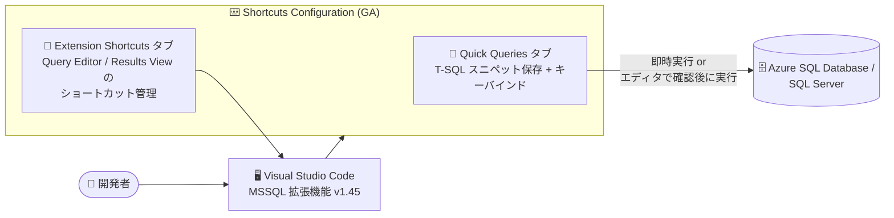

# Azure SQL: 2026 年 8 月中旬アップデート (VS Code MSSQL 拡張機能のショートカット設定が GA)

**リリース日**: 2026-08-19

**サービス**: Azure SQL Database

**機能**: Azure SQL updates for mid-August 2026 (Shortcuts Configuration の一般提供開始)

**ステータス**: Launched (GA)

[このアップデートのインフォグラフィックを見る](https://takech9203.github.io/azure-news-summary/20260819-sql-mid-august-updates.html)

## 概要

2026 年 8 月中旬の Azure SQL アップデートとして、Visual Studio Code 用 MSSQL 拡張機能 (v1.45) における **Shortcuts Configuration (ショートカット設定)** 機能の一般提供開始 (GA) が発表された。Quick Queries、Results Grid (結果グリッド)、Query Editor (クエリエディタ) のキーボードショートカットを、エディタを離れることなく VS Code 内で直接カスタマイズできるようになる。

Shortcuts Configuration は、MSSQL 拡張機能全体のショートカットを一元的に発見・設定・管理するための画面で、MSSQL 拡張機能のツールバーから「Open Shortcuts Configuration」を選択して起動する。「Quick Queries」と「Extension Shortcuts」の 2 つのタブで構成され、頻繁に使う T-SQL スニペットの保存・実行や、エディタ・結果ビュー操作のキーバインドのカスタマイズが可能になる。

なお、同じ MSSQL 拡張機能 v1.45 のリリースでは「SQL Formatter (パブリックプレビュー)」と「Azure SQL Database Provisioning (GA)」も発表されているが、これらは別アイテムとして個別レポートで扱うため、本レポートでは Shortcuts Configuration にフォーカスする。

**アップデート前の課題**

- 頻繁に実行する T-SQL スニペットを都度手入力またはファイルから貼り付けて実行する必要があった
- MSSQL 拡張機能のエディタ・結果ビュー関連コマンドとキーバインドを一覧的に発見・管理する専用画面がなかった

**アップデート後の改善**

- よく使う T-SQL スニペットを Quick Queries として保存し、カスタムキーバインドで即座に実行できるようになった
- クエリ実行・接続などのエディタコマンドと結果ビュー操作のショートカットを 1 つの設定画面から発見・カスタマイズできるようになった
- キーバインドの割り当ては VS Code 標準のキーボードショートカットエディタと統合されており、エディタを離れずに設定が完結する

## アーキテクチャ図

開発者は VS Code の MSSQL 拡張機能内で Shortcuts Configuration を開き、Quick Queries の保存・実行と拡張機能ショートカットのカスタマイズを一元的に行える。

## サービスアップデートの詳細

### 主要機能

1. **Quick Queries (クイッククエリ)**
   - よく使う T-SQL スニペットを複数のクエリスロットに保存し、カスタムキーバインドで実行できる
   - エディタで選択中のテキストを `{arg}` プレースホルダーの位置に挿入できる。プレースホルダーを使用しない場合は、選択テキストがクエリ末尾に自動追加される
   - Auto-execute 制御により、ショートカット押下時にクエリを即時実行するか、エディタで開いて確認・編集してから実行するか (Run or review) を選択できる

2. **Extension Shortcuts (拡張機能ショートカット)**
   - **Query Editor ショートカット**: クエリ実行、接続、その他エディタ操作向けコマンドの発見とカスタマイズ
   - **Results View (結果ビュー) ショートカット**: クエリ結果のナビゲーションや操作に使えるキーバインドの一覧表示とカスタマイズ

3. **VS Code キーボードショートカットエディタとの統合**
   - キーバインドの割り当て・管理は VS Code 標準の Keyboard Shortcuts editor 経由で行い、拡張機能独自の仕組みを覚える必要がない

## 技術仕様

| 項目 | 詳細 |
|------|------|
| 提供形態 | MSSQL extension for Visual Studio Code (v1.45) の機能 |
| ステータス | GA (一般提供) |
| 起動方法 | MSSQL 拡張機能ツールバーの「Open Shortcuts Configuration」 |
| 構成 | Quick Queries タブ / Extension Shortcuts タブの 2 タブ構成 |
| 対象データベース | Azure SQL Database、Azure SQL Managed Instance、SQL Server on Azure VM、SQL database in Microsoft Fabric、SQL Server |
| 対応 OS | Windows 10/11 (x64, Arm64)、macOS (Intel, Apple Silicon)、Linux (x64, Arm64) |
| キーバインド管理 | VS Code 標準の Keyboard Shortcuts editor と統合 |

## 設定方法

### 前提条件

1. Visual Studio Code がインストールされていること
2. MSSQL 拡張機能 (SQL Server (mssql)) の最新版 (v1.45 以降) がインストールされていること

### 利用手順

1. VS Code の拡張機能ビューで `mssql` を検索し、**SQL Server (mssql)** をインストール (未導入の場合)
2. MSSQL 拡張機能のツールバーから **Open Shortcuts Configuration** を選択
3. **Quick Queries** タブで T-SQL スニペットを保存し、Auto-execute の有無を設定
4. **Extension Shortcuts** タブでエディタ・結果ビューのコマンドを確認
5. VS Code の Keyboard Shortcuts editor でキーバインドをカスタマイズ

## メリット

### ビジネス面

- 定型クエリの実行が高速化され、開発者・DBA の日常的なデータタスクの生産性が向上する
- Azure Data Studio の廃止後の移行先として、VS Code での SQL 開発体験が着実に強化されている

### 技術面

- 頻用 T-SQL スニペットをキーバインド 1 つで実行でき、コンテキストスイッチが減る
- `{arg}` プレースホルダーにより、選択テキストをパラメータとして差し込む柔軟なクエリ実行が可能
- 即時実行と確認後実行を選択でき、誤実行のリスクをコントロールできる
- VS Code 標準のキーボードショートカット管理と統合されており、学習コストが低い

## デメリット・制約事項

- VS Code + MSSQL 拡張機能の利用が前提であり、SSMS など他のツールには適用されない
- Shortcuts Configuration 固有のデフォルトキーバインドの一覧は、発表時点のブログ記事には記載されていない (詳細はドキュメントの「Customize keyboard shortcuts」を参照)

## ユースケース

### ユースケース 1: 定型診断クエリのワンキー実行

**シナリオ**: DBA が日常的に実行するセッション確認・ブロッキング調査などの診断クエリを、都度入力せずにキーボードショートカットで即座に実行したい。

**実装例**: Quick Queries タブに診断用 T-SQL (例: `sys.dm_exec_sessions` を参照するクエリ) を保存し、キーバインドを割り当てる。Auto-execute を有効にすれば押下と同時に実行される。

**効果**: 定型作業の所要時間を短縮し、障害調査時の初動を高速化できる。

### ユースケース 2: 選択テキストをパラメータにした調査クエリ

**シナリオ**: エディタ上のテーブル名やオブジェクト名を選択した状態で、そのオブジェクトに関する調査クエリを実行したい。

**実装例**: `{arg}` プレースホルダーを含むクエリ (例: 選択したテーブル名を条件に使う定義確認クエリ) を Quick Queries に保存し、テキスト選択後にショートカットを押下する。

**効果**: オブジェクト名のコピー & ペーストが不要になり、調査のテンポが向上する。

## 関連サービス・機能

- **Azure SQL Database / Azure SQL Managed Instance / SQL Server on Azure VM**: MSSQL 拡張機能の接続先となる Azure SQL ファミリー
- **SQL database in Microsoft Fabric**: MSSQL 拡張機能がサポートする Fabric 上の SQL データベース
- **SQL Formatter (同時発表・プレビュー)**: 同じ v1.45 リリースに含まれる T-SQL 整形機能 (別レポートで詳説)
- **Azure SQL Database Provisioning (同時発表・GA)**: VS Code から無料枠の Azure SQL Database を作成できる機能 (別レポートで詳説)
- **GitHub Copilot 統合**: MSSQL 拡張機能に含まれる AI 支援 SQL 開発機能

## 参考リンク

- [インフォグラフィック](https://takech9203.github.io/azure-news-summary/20260819-sql-mid-august-updates.html)
- [公式アップデート情報](https://azure.microsoft.com/updates?id=569145)
- [Azure SQL Dev Corner ブログ: MSSQL extension for VS Code August 2026 リリース](https://devblogs.microsoft.com/azure-sql/vscode-mssql-august2026/)
- [Microsoft Learn: MSSQL extension for Visual Studio Code の概要](https://learn.microsoft.com/sql/tools/visual-studio-code-extensions/mssql/mssql-extension-visual-studio-code)

## まとめ

2026 年 8 月中旬の Azure SQL アップデートでは、VS Code 用 MSSQL 拡張機能の Shortcuts Configuration が GA となり、Quick Queries・Query Editor・Results Grid のキーボードショートカットをエディタ内で一元管理できるようになった。定型 T-SQL のワンキー実行や `{arg}` プレースホルダーによるパラメータ差し込みなど、日常のデータタスクを高速化する実用的な改善である。VS Code で Azure SQL / SQL Server を扱う開発者・DBA は、拡張機能を v1.45 以降に更新し、頻用クエリの Quick Queries 登録から試すことを推奨する。

---

**タグ**: Azure SQL Database, MSSQL Extension, Visual Studio Code, Shortcuts Configuration, Quick Queries, GA, Databases, Developer Tools
